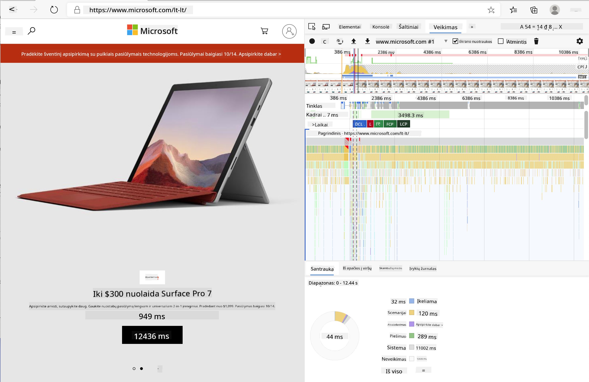
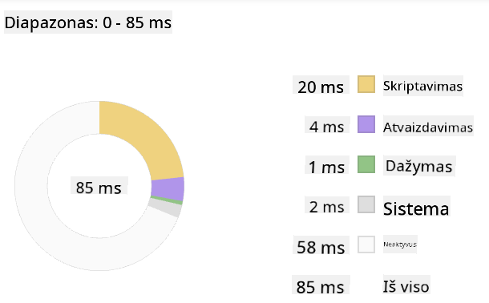

<!--
CO_OP_TRANSLATOR_METADATA:
{
  "original_hash": "49b58721a71cfda824e2f3e1f46908c6",
  "translation_date": "2025-08-29T16:48:36+00:00",
  "source_file": "5-browser-extension/3-background-tasks-and-performance/README.md",
  "language_code": "lt"
}
-->
# Naršyklės plėtinio projektas 3 dalis: Sužinokite apie fonines užduotis ir našumą

## Klausimynas prieš paskaitą

[Klausimynas prieš paskaitą](https://ff-quizzes.netlify.app/web/quiz/27)

### Įvadas

Paskutinėse dviejose šio modulio pamokose išmokote sukurti formą ir duomenų rodymo sritį, kuri naudoja API užklausas. Tai labai standartinis būdas kurti internetinį projektą. Jūs netgi išmokote, kaip tvarkyti asinchronines duomenų užklausas. Jūsų naršyklės plėtinys beveik baigtas.

Liko valdyti kelias fonines užduotis, įskaitant plėtinio piktogramos spalvos atnaujinimą, todėl tai puikus metas aptarti, kaip naršyklė tvarko tokio tipo užduotis. Pažvelkime į šias naršyklės užduotis jūsų interneto turinio našumo kontekste, kai jį kuriate.

## Interneto našumo pagrindai

> „Interneto svetainės našumas susijęs su dviem dalykais: kaip greitai puslapis įkeliamas ir kaip greitai jame veikia kodas.“ -- [Zack Grossbart](https://www.smashingmagazine.com/2012/06/javascript-profiling-chrome-developer-tools/)

Kaip padaryti, kad jūsų svetainės būtų itin greitos visų tipų įrenginiuose, visų tipų vartotojams ir visose situacijose, yra labai plati tema. Štai keli punktai, kuriuos verta prisiminti kuriant standartinį interneto projektą ar naršyklės plėtinį.

Pirmas dalykas, kurį reikia padaryti, kad užtikrintumėte efektyvų svetainės veikimą, yra surinkti duomenis apie jos našumą. Pirmoji vieta tai padaryti yra jūsų naršyklės kūrėjų įrankiai. Edge naršyklėje galite pasirinkti mygtuką „Nustatymai ir daugiau“ (trijų taškų piktograma viršutiniame dešiniajame naršyklės kampe), tada eiti į Daugiau įrankių > Kūrėjų įrankiai ir atidaryti našumo skirtuką. Taip pat galite naudoti klaviatūros sparčiuosius klavišus `Ctrl` + `Shift` + `I` Windows sistemoje arba `Option` + `Command` + `I` Mac sistemoje, kad atidarytumėte kūrėjų įrankius.

Našumo skirtuke yra profiliavimo įrankis. Atidarykite svetainę (pavyzdžiui, [https://www.microsoft.com](https://www.microsoft.com/?WT.mc_id=academic-77807-sagibbon)) ir spustelėkite mygtuką „Įrašyti“, tada atnaujinkite svetainę. Bet kuriuo metu sustabdę įrašymą galėsite pamatyti rutinas, kurios generuojamos „script“, „render“ ir „paint“ svetainės:



✅ Apsilankykite [Microsoft dokumentacijoje](https://docs.microsoft.com/microsoft-edge/devtools-guide/performance/?WT.mc_id=academic-77807-sagibbon) apie Edge našumo panelę.

> Patarimas: norėdami gauti tikslius svetainės paleidimo laiko duomenis, išvalykite naršyklės talpyklą.

Pasirinkite profilio laiko juostos elementus, kad priartintumėte įvykius, vykstančius puslapio įkėlimo metu.

Gaukite savo puslapio našumo momentinę nuotrauką pasirinkdami profilio laiko juostos dalį ir peržiūrėdami santraukos skydelį:



Patikrinkite įvykių žurnalo skydelį, kad pamatytumėte, ar kuris nors įvykis užtruko ilgiau nei 15 ms:


✅ Susipažinkite su savo profiliavimo įrankiu! Atidarykite kūrėjų įrankius šioje svetainėje ir pažiūrėkite, ar yra kokių nors kliūčių. Kas yra lėčiausiai įkeliama turinio dalis? Greičiausiai?

## Profiliavimo patikrinimai

Apskritai, yra keletas „probleminių sričių“, kurias kiekvienas interneto kūrėjas turėtų stebėti kurdamas svetainę, kad išvengtų nemalonių staigmenų, kai ateis laikas ją paleisti į gamybą.

**Turinio dydžiai**: Internetas per pastaruosius metus tapo „sunkesnis“, todėl lėtesnis. Dalis šio svorio susijusi su vaizdų naudojimu.

✅ Peržiūrėkite [Interneto archyvą](https://httparchive.org/reports/page-weight), kad pamatytumėte istorinius puslapio svorio duomenis ir daugiau.

Gera praktika yra užtikrinti, kad jūsų vaizdai būtų optimizuoti ir pateikti tinkamo dydžio bei raiškos jūsų vartotojams.

**DOM perėjimai**: Naršyklė turi sukurti savo dokumento objektų modelį (DOM) pagal jūsų parašytą kodą, todėl geram puslapio našumui svarbu, kad jūsų žymos būtų minimalios, naudojant ir stiliuojant tik tai, ko puslapiui reikia. Pavyzdžiui, perteklinis CSS, susijęs su puslapiu, galėtų būti optimizuotas; stiliai, kurie reikalingi tik viename puslapyje, neturėtų būti įtraukti į pagrindinį stilių lapą.

**JavaScript**: Kiekvienas JavaScript kūrėjas turėtų stebėti „render-blocking“ scenarijus, kurie turi būti įkelti prieš naršyklės DOM perėjimą ir piešimą. Apsvarstykite galimybę naudoti `defer` su savo inline scenarijais (kaip tai daroma Terrarium modulyje).

✅ Išbandykite kelias svetaines [Svetainės greičio testavimo svetainėje](https://www.webpagetest.org/), kad sužinotumėte daugiau apie įprastus patikrinimus, kurie atliekami siekiant nustatyti svetainės našumą.

Dabar, kai turite idėją, kaip naršyklė pateikia jūsų siunčiamą turinį, pažvelkime į paskutinius kelis dalykus, kuriuos reikia padaryti, kad užbaigtumėte savo plėtinį:

### Sukurkite funkciją spalvai apskaičiuoti

Dirbdami su `/src/index.js`, pridėkite funkciją `calculateColor()` po serijos `const` kintamųjų, kuriuos nustatėte, kad gautumėte prieigą prie DOM:

```JavaScript
function calculateColor(value) {
	let co2Scale = [0, 150, 600, 750, 800];
	let colors = ['#2AA364', '#F5EB4D', '#9E4229', '#381D02', '#381D02'];

	let closestNum = co2Scale.sort((a, b) => {
		return Math.abs(a - value) - Math.abs(b - value);
	})[0];
	console.log(value + ' is closest to ' + closestNum);
	let num = (element) => element > closestNum;
	let scaleIndex = co2Scale.findIndex(num);

	let closestColor = colors[scaleIndex];
	console.log(scaleIndex, closestColor);

	chrome.runtime.sendMessage({ action: 'updateIcon', value: { color: closestColor } });
}
```

Kas čia vyksta? Jūs perduodate vertę (anglies intensyvumą) iš API užklausos, kurią atlikote paskutinėje pamokoje, ir tada apskaičiuojate, kaip arti jos vertė yra spalvų masyvo indekso. Tada siunčiate artimiausią spalvos vertę į chrome runtime.

Chrome.runtime turi [API](https://developer.chrome.com/extensions/runtime), kuris tvarko įvairias fonines užduotis, ir jūsų plėtinys tuo naudojasi:

> „Naudokite chrome.runtime API, kad gautumėte foninį puslapį, grąžintumėte informaciją apie manifestą ir klausytumėte bei reaguotumėte į įvykius programos ar plėtinio gyvavimo cikle. Taip pat galite naudoti šį API, kad konvertuotumėte santykinius URL kelių į pilnai kvalifikuotus URL.“

✅ Jei kuriate šį naršyklės plėtinį Edge naršyklei, gali nustebinti, kad naudojate chrome API. Naujesnės Edge naršyklės versijos veikia Chromium naršyklės variklyje, todėl galite naudotis šiais įrankiais.

> Pastaba: jei norite profiliuoti naršyklės plėtinį, paleiskite kūrėjų įrankius pačiame plėtinyje, nes tai yra atskira naršyklės instancija.

### Nustatykite numatytąją piktogramos spalvą

Dabar, funkcijoje `init()`, nustatykite piktogramą kaip bendrą žalią spalvą, pradėdami vėl naudoti chrome `updateIcon` veiksmą:

```JavaScript
chrome.runtime.sendMessage({
	action: 'updateIcon',
		value: {
			color: 'green',
		},
});
```

### Iškvieskite funkciją, vykdykite užklausą

Tada iškvieskite ką tik sukurtą funkciją, pridėdami ją prie pažado, kurį grąžina C02Signal API:

```JavaScript
//let CO2...
calculateColor(CO2);
```

Ir galiausiai, faile `/dist/background.js`, pridėkite klausytoją šiems foninių veiksmų užklausoms:

```JavaScript
chrome.runtime.onMessage.addListener(function (msg, sender, sendResponse) {
	if (msg.action === 'updateIcon') {
		chrome.browserAction.setIcon({ imageData: drawIcon(msg.value) });
	}
});
//borrowed from energy lollipop extension, nice feature!
function drawIcon(value) {
	let canvas = document.createElement('canvas');
	let context = canvas.getContext('2d');

	context.beginPath();
	context.fillStyle = value.color;
	context.arc(100, 100, 50, 0, 2 * Math.PI);
	context.fill();

	return context.getImageData(50, 50, 100, 100);
}
```

Šiame kode jūs pridedate klausytoją bet kokioms žinutėms, kurios siunčiamos į foninių užduočių tvarkyklę. Jei ji vadinama „updateIcon“, tada vykdomas kitas kodas, kuris piešia tinkamos spalvos piktogramą naudojant Canvas API.

✅ Daugiau apie Canvas API sužinosite [Kosminio žaidimo pamokose](../../6-space-game/2-drawing-to-canvas/README.md).

Dabar, perkurkite savo plėtinį (`npm run build`), atnaujinkite ir paleiskite plėtinį, ir stebėkite spalvos pokyčius. Ar tai geras metas atlikti kokį nors darbą ar išplauti indus? Dabar žinote!

Sveikiname, jūs sukūrėte naudingą naršyklės plėtinį ir sužinojote daugiau apie tai, kaip veikia naršyklė ir kaip profiliuoti jos našumą.

---

## 🚀 Iššūkis

Ištirkite keletą atvirojo kodo svetainių, kurios egzistuoja jau ilgą laiką, ir, remdamiesi jų GitHub istorija, pabandykite nustatyti, kaip jos buvo optimizuotos našumui per metus, jei išvis. Koks yra dažniausias skausmo taškas?

## Klausimynas po paskaitos

[Klausimynas po paskaitos](https://ff-quizzes.netlify.app/web/quiz/28)

## Apžvalga ir savarankiškas mokymasis

Apsvarstykite galimybę užsiprenumeruoti [našumo naujienlaiškį](https://perf.email/).

Ištirkite kai kuriuos būdus, kuriais naršyklės vertina interneto našumą, peržiūrėdami našumo skirtukus jų interneto įrankiuose. Ar pastebėjote kokių nors esminių skirtumų?

## Užduotis

[Analizuokite svetainės našumą](assignment.md)

---

**Atsakomybės apribojimas**:  
Šis dokumentas buvo išverstas naudojant AI vertimo paslaugą [Co-op Translator](https://github.com/Azure/co-op-translator). Nors siekiame tikslumo, prašome atkreipti dėmesį, kad automatiniai vertimai gali turėti klaidų ar netikslumų. Originalus dokumentas jo gimtąja kalba turėtų būti laikomas autoritetingu šaltiniu. Kritinei informacijai rekomenduojama naudoti profesionalų žmogaus vertimą. Mes neprisiimame atsakomybės už nesusipratimus ar klaidingus interpretavimus, atsiradusius dėl šio vertimo naudojimo.