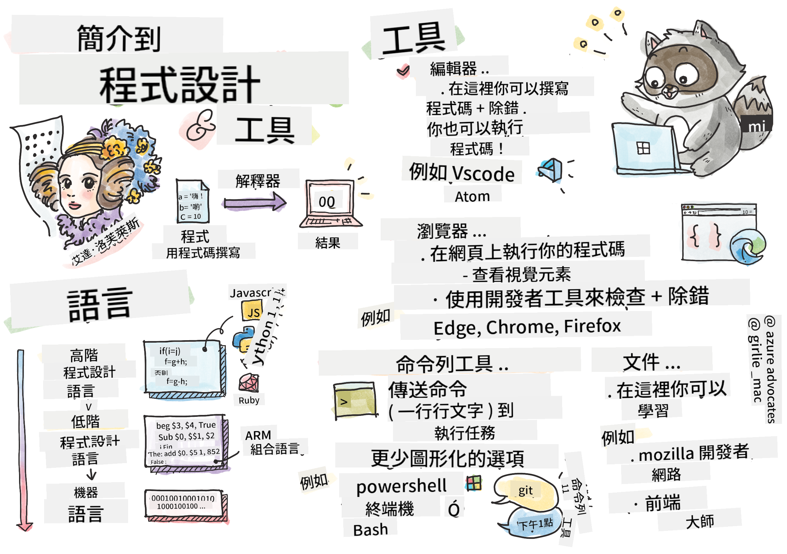

<!--
CO_OP_TRANSLATOR_METADATA:
{
  "original_hash": "2dcbb9259dee4f20a4f08d9a1aa2bd4c",
  "translation_date": "2025-08-28T23:43:49+00:00",
  "source_file": "1-getting-started-lessons/1-intro-to-programming-languages/README.md",
  "language_code": "mo"
}
-->
# 程式語言與工具介紹

本課程涵蓋程式語言的基礎知識。這裡討論的主題適用於當今大多數現代程式語言。在「工具介紹」部分，您將學習一些對開發者有幫助的實用軟體。

  
> Sketchnote by [Tomomi Imura](https://twitter.com/girlie_mac)

## 課前測驗  
[課前測驗](https://forms.office.com/r/dru4TE0U9n?origin=lprLink)

## 簡介

在本課程中，我們將討論：

- 什麼是程式設計？
- 程式語言的種類
- 程式的基本元素
- 專業開發者常用的實用軟體與工具

> 您可以在 [Microsoft Learn](https://docs.microsoft.com/learn/modules/web-development-101/introduction-programming/?WT.mc_id=academic-77807-sagibbon) 上學習本課程！

## 什麼是程式設計？

程式設計（也稱為編碼）是為電腦或行動裝置等設備撰寫指令的過程。我們使用程式語言來撰寫這些指令，然後由設備解讀這些指令。這些指令集可能有不同的名稱，例如 *程式*、*電腦程式*、*應用程式 (app)* 或 *執行檔* 等。

*程式* 可以是任何用程式碼撰寫的東西，例如網站、遊戲和手機應用程式。雖然可以在不撰寫程式碼的情況下創建程式，但其底層邏輯仍需由設備解讀，而這些邏輯很可能是用程式碼撰寫的。一個正在 *執行* 或 *運行* 程式碼的程式正在執行指令。您正在閱讀本課程的設備正運行一個程式，將內容顯示在您的螢幕上。

✅ 做一些研究：誰被認為是世界上第一位電腦程式設計師？

## 程式語言

程式語言使開發者能夠為設備撰寫指令。設備只能理解二進位（1 和 0），而對於 *大多數* 開發者來說，這並不是一種高效的溝通方式。程式語言是人類與電腦之間的溝通工具。

程式語言有不同的格式，可能用於不同的目的。例如，JavaScript 主要用於網頁應用程式，而 Bash 主要用於作業系統。

*低階語言* 通常比 *高階語言* 需要更少的步驟來讓設備解讀指令。然而，高階語言因其可讀性和支援性而受到歡迎。JavaScript 被認為是一種高階語言。

以下程式碼展示了使用高階語言（JavaScript）與低階語言（ARM 組合語言）的差異。

```javascript
let number = 10
let n1 = 0, n2 = 1, nextTerm;

for (let i = 1; i <= number; i++) {
    console.log(n1);
    nextTerm = n1 + n2;
    n1 = n2;
    n2 = nextTerm;
}
```

```c
 area ascen,code,readonly
 entry
 code32
 adr r0,thumb+1
 bx r0
 code16
thumb
 mov r0,#00
 sub r0,r0,#01
 mov r1,#01
 mov r4,#10
 ldr r2,=0x40000000
back add r0,r1
 str r0,[r2]
 add r2,#04
 mov r3,r0
 mov r0,r1
 mov r1,r3
 sub r4,#01
 cmp r4,#00
 bne back
 end
```

相信或不相信，*它們都在做同一件事*：列印前 10 個 Fibonacci 數列。

✅ Fibonacci 數列是 [定義](https://en.wikipedia.org/wiki/Fibonacci_number) 為一組數字，其中每個數字是前兩個數字的總和，從 0 和 1 開始。前 10 個 Fibonacci 數列為 0, 1, 1, 2, 3, 5, 8, 13, 21 和 34。

## 程式的基本元素

程式中的單一指令稱為 *語句*，通常會有一個字符或行間距來標記指令的結束，稱為 *終止符*。程式如何終止因語言而異。

程式中的語句可能依賴用戶或其他地方提供的數據來執行指令。數據可以改變程式的行為，因此程式語言提供了一種臨時存儲數據的方法，以便稍後使用，這些稱為 *變數*。變數是指令，指示設備將數據存儲在其記憶體中。程式中的變數類似於代數中的變數，它們有一個唯一的名稱，其值可能會隨時間改變。

有些語句可能不會被設備執行。這通常是開發者設計的結果，或者是意外錯誤導致的。這種對應用程式的控制使其更加穩健和可維護。通常，這些控制的變化發生在某些條件滿足時。現代程式設計中常用的一種語句是 `if..else` 語句。

✅ 您將在後續課程中學習更多關於這種類型語句的內容。

## 工具介紹

[](https://youtube.com/watch?v=69WJeXGBdxg "工具介紹")

> 🎥 點擊上方圖片觀看有關工具的影片

在本節中，您將學習一些在開始專業開發旅程時可能非常有用的軟體。

**開發環境** 是開發者在撰寫軟體時經常使用的一組獨特工具和功能。其中一些工具已根據開發者的特定需求進行了自訂，並可能隨著開發者的工作重點、個人項目或使用不同程式語言而改變。開發環境如同開發者本身一樣獨特。

### 編輯器

編輯器是軟體開發中最重要的工具之一。編輯器是您撰寫程式碼的地方，有時也是您運行程式碼的地方。

開發者依賴編輯器的幾個額外原因：

- *除錯* 幫助逐行檢查程式碼，找出錯誤和問題。有些編輯器具有除錯功能；它們可以針對特定程式語言進行自訂和擴展。
- *語法高亮* 為程式碼添加顏色和文字格式，使其更易於閱讀。大多數編輯器允許自訂語法高亮。
- *擴展與整合* 是由開發者為開發者設計的專用工具。這些工具並未內建於基礎編輯器中。例如，許多開發者會為程式碼添加文件說明，解釋其工作原理。他們可能會安裝拼寫檢查擴展來幫助發現文件中的拼寫錯誤。大多數擴展是針對特定編輯器設計的，而大多數編輯器都提供搜尋可用擴展的功能。
- *自訂* 使開發者能夠創建符合其需求的獨特開發環境。大多數編輯器都非常可自訂，並可能允許開發者創建自訂擴展。

#### 常見編輯器與網頁開發擴展

- [Visual Studio Code](https://code.visualstudio.com/?WT.mc_id=academic-77807-sagibbon)  
  - [Code Spell Checker](https://marketplace.visualstudio.com/items?itemName=streetsidesoftware.code-spell-checker)  
  - [Live Share](https://marketplace.visualstudio.com/items?itemName=MS-vsliveshare.vsliveshare)  
  - [Prettier - Code formatter](https://marketplace.visualstudio.com/items?itemName=esbenp.prettier-vscode)  
- [Atom](https://atom.io/)  
  - [spell-check](https://atom.io/packages/spell-check)  
  - [teletype](https://atom.io/packages/teletype)  
  - [atom-beautify](https://atom.io/packages/atom-beautify)  
- [Sublimetext](https://www.sublimetext.com/)  
  - [emmet](https://emmet.io/)  
  - [SublimeLinter](http://www.sublimelinter.com/en/stable/)  

### 瀏覽器

另一個重要的工具是瀏覽器。網頁開發者依賴瀏覽器來查看其程式碼在網頁上的運行效果。瀏覽器還用於顯示在編輯器中撰寫的網頁元素，例如 HTML。

許多瀏覽器內建 *開發者工具*（DevTools），其中包含一組有用的功能和資訊，幫助開發者收集和捕捉有關其應用程式的重要資訊。例如：如果網頁出現錯誤，了解錯誤發生的時間有時會很有幫助。瀏覽器中的開發者工具可以配置以捕捉這些資訊。

#### 常見瀏覽器與開發者工具

- [Edge](https://docs.microsoft.com/microsoft-edge/devtools-guide-chromium/?WT.mc_id=academic-77807-sagibbon)  
- [Chrome](https://developers.google.com/web/tools/chrome-devtools/)  
- [Firefox](https://developer.mozilla.org/docs/Tools)  

### 命令列工具

有些開發者偏好使用較少圖形化的界面來完成日常任務，並依賴命令列來實現這一點。撰寫程式碼需要大量的打字工作，有些開發者偏好不打斷鍵盤上的工作流程。他們會使用鍵盤快捷鍵在桌面窗口之間切換、處理不同文件並使用工具。大多數任務可以用滑鼠完成，但使用命令列的一個好處是可以在不切換滑鼠和鍵盤的情況下完成許多操作。命令列的另一個好處是它們可以配置，您可以保存自訂配置，稍後更改，並將其匯入到其他開發機器中。由於開發環境對每個開發者來說都是獨特的，有些人會完全避免使用命令列，有些人會完全依賴它，而有些人則偏好兩者結合。

### 常見命令列選項

命令列選項會根據您使用的作業系統而有所不同。

*💻 = 作業系統預裝。*

#### Windows

- [Powershell](https://docs.microsoft.com/powershell/scripting/overview?view=powershell-7/?WT.mc_id=academic-77807-sagibbon) 💻  
- [Command Line](https://docs.microsoft.com/windows-server/administration/windows-commands/windows-commands/?WT.mc_id=academic-77807-sagibbon)（也稱為 CMD）💻  
- [Windows Terminal](https://docs.microsoft.com/windows/terminal/?WT.mc_id=academic-77807-sagibbon)  
- [mintty](https://mintty.github.io/)  

#### MacOS

- [Terminal](https://support.apple.com/guide/terminal/open-or-quit-terminal-apd5265185d-f365-44cb-8b09-71a064a42125/mac) 💻  
- [iTerm](https://iterm2.com/)  
- [Powershell](https://docs.microsoft.com/powershell/scripting/install/installing-powershell-core-on-macos?view=powershell-7/?WT.mc_id=academic-77807-sagibbon)  

#### Linux

- [Bash](https://www.gnu.org/software/bash/manual/html_node/index.html) 💻  
- [KDE Konsole](https://docs.kde.org/trunk5/en/konsole/konsole/index.html)  
- [Powershell](https://docs.microsoft.com/powershell/scripting/install/installing-powershell-core-on-linux?view=powershell-7/?WT.mc_id=academic-77807-sagibbon)  

#### 常見命令列工具

- [Git](https://git-scm.com/) (💻 大多數作業系統預裝)  
- [NPM](https://www.npmjs.com/)  
- [Yarn](https://classic.yarnpkg.com/en/docs/cli/)  

### 文件

當開發者想學習新事物時，他們很可能會查閱文件以了解如何使用它。開發者經常依賴文件來指導他們正確使用工具和語言，並深入了解其工作原理。

#### 常見網頁開發文件

- [Mozilla Developer Network (MDN)](https://developer.mozilla.org/docs/Web)，由 [Firefox](https://www.mozilla.org/firefox/) 瀏覽器的發行商 Mozilla 提供  
- [Frontend Masters](https://frontendmasters.com/learn/)  
- [Web.dev](https://web.dev)，由 [Chrome](https://www.google.com/chrome/) 的發行商 Google 提供  
- [Microsoft 的開發者文件](https://docs.microsoft.com/microsoft-edge/#microsoft-edge-for-developers)，適用於 [Microsoft Edge](https://www.microsoft.com/edge)  
- [W3 Schools](https://www.w3schools.com/where_to_start.asp)  

✅ 做一些研究：現在您已了解網頁開發者的環境，試著將其與網頁設計師的環境進行比較和對比。

---

## 🚀 挑戰

比較一些程式語言。JavaScript 與 Java 有哪些獨特特性？COBOL 與 Go 又如何？

## 課後測驗  
[課後測驗](https://ff-quizzes.netlify.app/web/)

## 複習與自學

學習程式設計師可用的不同語言。嘗試用一種語言寫一行程式碼，然後用另外兩種語言重寫它。您學到了什麼？

## 作業

[閱讀文件](assignment.md)

---

**免責聲明**：  
本文件已使用 AI 翻譯服務 [Co-op Translator](https://github.com/Azure/co-op-translator) 進行翻譯。儘管我們努力確保翻譯的準確性，但請注意，自動翻譯可能包含錯誤或不準確之處。原始文件的母語版本應被視為權威來源。對於關鍵信息，建議使用專業人工翻譯。我們對因使用此翻譯而引起的任何誤解或誤釋不承擔責任。