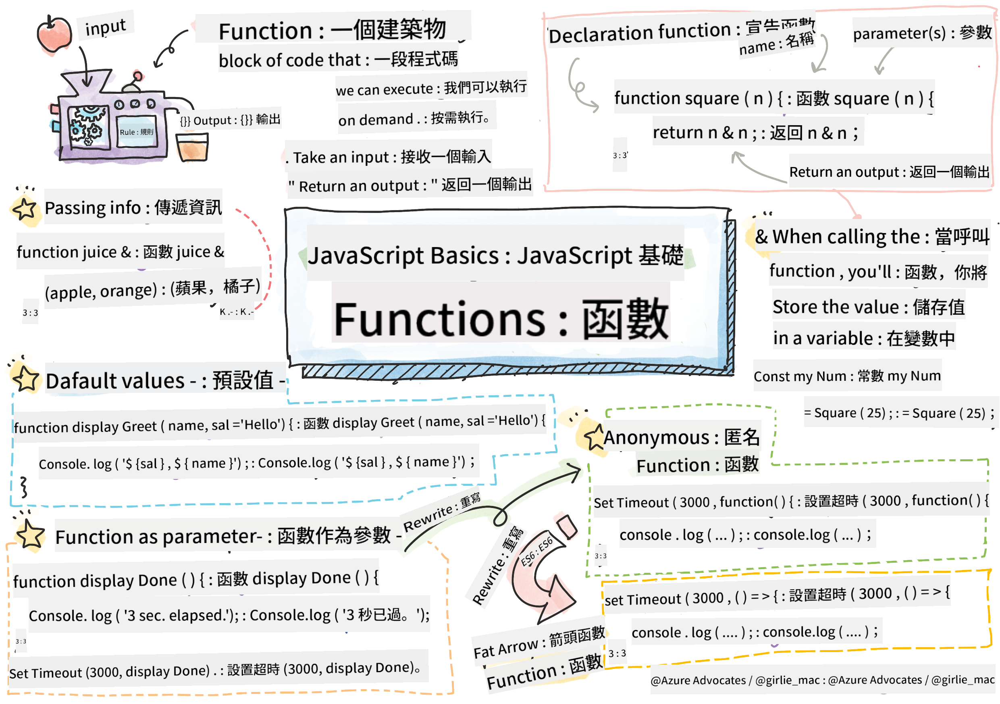

<!--
CO_OP_TRANSLATOR_METADATA:
{
  "original_hash": "92e136090efc4341b1d51c37924c1802",
  "translation_date": "2025-08-28T23:37:45+00:00",
  "source_file": "2-js-basics/2-functions-methods/README.md",
  "language_code": "mo"
}
-->
# JavaScript 基礎：方法與函式


> [Tomomi Imura](https://twitter.com/girlie_mac) 的手繪筆記

## 課前測驗
[課前測驗](https://ff-quizzes.netlify.app)

在撰寫程式碼時，我們總是希望確保程式碼具有可讀性。雖然這聽起來有些違背直覺，但事實上，程式碼被閱讀的次數遠多於被撰寫的次數。開發者工具箱中的一個核心工具就是 **函式**，它能幫助我們確保程式碼的可維護性。

[](https://youtube.com/watch?v=XgKsD6Zwvlc "方法與函式")

> 🎥 點擊上方圖片觀看有關方法與函式的影片。

> 你可以在 [Microsoft Learn](https://docs.microsoft.com/learn/modules/web-development-101-functions/?WT.mc_id=academic-77807-sagibbon) 上學習這一課程！

## 函式

函式的核心是一段可以按需執行的程式碼。這非常適合需要多次執行相同任務的情境；與其在多個地方重複相同的邏輯（這樣會在需要更新時變得困難），不如將邏輯集中在一個地方，並在需要執行操作時呼叫它——甚至可以從其他函式中呼叫函式！

函式的命名能力同樣重要。雖然這看似微不足道，但函式名稱提供了一種快速記錄程式碼片段的方式。你可以將其視為按鈕上的標籤。如果我點擊一個標有「取消計時器」的按鈕，我就知道它會停止計時。

## 建立與呼叫函式

函式的語法如下所示：

```javascript
function nameOfFunction() { // function definition
 // function definition/body
}
```

如果我想建立一個函式來顯示問候語，它可能看起來像這樣：

```javascript
function displayGreeting() {
  console.log('Hello, world!');
}
```

每當我們想要呼叫（或執行）函式時，只需使用函式名稱並加上 `()`。值得注意的是，我們的函式可以在定義之前或之後被呼叫；JavaScript 編譯器會幫你找到它。

```javascript
// calling our function
displayGreeting();
```

> **NOTE:** 有一種特殊類型的函式稱為 **方法**，你可能已經在使用了！事實上，我們在上面的範例中使用 `console.log` 時就看到了。方法與函式的區別在於，方法附加於一個物件（例如我們的範例中的 `console`），而函式則是獨立的。許多開發者會交替使用這兩個術語。

### 函式的最佳實踐

在建立函式時，有幾個最佳實踐需要記住：

- 一如既往，使用描述性的名稱，這樣你能知道函式的用途
- 使用 **camelCasing**（駝峰式命名法）來組合單詞
- 將函式專注於執行特定任務

## 傳遞資訊給函式

為了讓函式更具重用性，你通常會希望將資訊傳遞給它。如果我們考慮上面的 `displayGreeting` 範例，它只會顯示 **Hello, world!**。這並不是一個非常實用的函式。如果我們想讓它更靈活，比如允許指定要問候的人的名字，我們可以新增一個 **參數**。參數（有時也稱為 **引數**）是傳遞給函式的額外資訊。

參數在定義部分列於括號內，並以逗號分隔，如下所示：

```javascript
function name(param, param2, param3) {

}
```

我們可以更新 `displayGreeting`，使其接受一個名字並顯示出來。

```javascript
function displayGreeting(name) {
  const message = `Hello, ${name}!`;
  console.log(message);
}
```

當我們想要呼叫函式並傳遞參數時，只需在括號內指定它。

```javascript
displayGreeting('Christopher');
// displays "Hello, Christopher!" when run
```

## 預設值

我們可以透過新增更多參數來讓函式更靈活。但如果我們不希望每個值都必須指定呢？以我們的問候語範例為例，我們可以將名字設為必填（我們需要知道要問候誰），但希望允許問候語本身可以根據需要自訂。如果有人不想自訂，我們可以提供一個預設值。要為參數提供預設值，我們可以像為變數設定值一樣進行設定——`parameterName = 'defaultValue'`。以下是一個完整範例：

```javascript
function displayGreeting(name, salutation='Hello') {
  console.log(`${salutation}, ${name}`);
}
```

當我們呼叫函式時，可以決定是否要為 `salutation` 設定值。

```javascript
displayGreeting('Christopher');
// displays "Hello, Christopher"

displayGreeting('Christopher', 'Hi');
// displays "Hi, Christopher"
```

## 回傳值

到目前為止，我們建立的函式會將輸出顯示在 [console](https://developer.mozilla.org/docs/Web/API/console) 中。有時這正是我們想要的，特別是當我們建立的函式會呼叫其他服務時。但如果我想建立一個輔助函式來執行計算並將值回傳，以便在其他地方使用呢？

我們可以透過使用 **回傳值** 來實現。回傳值由函式回傳，並可以像儲存字串或數字這樣的靜態值一樣儲存在變數中。

如果函式需要回傳某些內容，則使用關鍵字 `return`。`return` 關鍵字需要一個值或參考作為回傳內容，如下所示：

```javascript
return myVariable;
```  

我們可以建立一個函式來生成問候語訊息並將值回傳給呼叫者。

```javascript
function createGreetingMessage(name) {
  const message = `Hello, ${name}`;
  return message;
}
```

當呼叫這個函式時，我們會將值儲存在變數中。這與我們將變數設定為靜態值（例如 `const name = 'Christopher'`）的方式非常相似。

```javascript
const greetingMessage = createGreetingMessage('Christopher');
```

## 將函式作為函式的參數

隨著你在程式設計生涯中的進步，你會遇到接受函式作為參數的函式。這個巧妙的技巧通常用於我們無法確定某件事何時發生或完成，但知道需要對此作出回應的情況。

例如，[setTimeout](https://developer.mozilla.org/docs/Web/API/WindowOrWorkerGlobalScope/setTimeout) 會啟動一個計時器，並在計時完成後執行程式碼。我們需要告訴它我們想執行什麼程式碼。這聽起來像是函式的完美工作！

如果你執行以下程式碼，3 秒後你會看到訊息 **3 seconds has elapsed**。

```javascript
function displayDone() {
  console.log('3 seconds has elapsed');
}
// timer value is in milliseconds
setTimeout(displayDone, 3000);
```

### 匿名函式

讓我們再看看我們建立的內容。我們建立了一個有名稱的函式，但它只會被使用一次。隨著應用程式變得更複雜，我們可能會建立許多只會被呼叫一次的函式。這並不理想。事實證明，我們並不總是需要提供名稱！

當我們將函式作為參數傳遞時，可以跳過事先建立函式，直接在參數中建立它。我們使用相同的 `function` 關鍵字，但將其作為參數的一部分來建立。

讓我們重寫上述程式碼，使用匿名函式：

```javascript
setTimeout(function() {
  console.log('3 seconds has elapsed');
}, 3000);
```

如果你執行我們的新程式碼，你會注意到結果相同。我們建立了一個函式，但不需要給它命名！

### 箭頭函式

許多程式語言（包括 JavaScript）中常見的一個快捷方式是使用所謂的 **箭頭函式** 或 **胖箭頭函式**。它使用一個特殊的符號 `=>`，看起來像一個箭頭——因此得名！透過使用 `=>`，我們可以省略 `function` 關鍵字。

讓我們再一次重寫程式碼，使用箭頭函式：

```javascript
setTimeout(() => {
  console.log('3 seconds has elapsed');
}, 3000);
```

### 何時使用哪種策略

現在你已經看到我們有三種方式將函式作為參數傳遞，可能會想知道何時使用哪一種。如果你知道函式會被多次使用，那就按正常方式建立它。如果只會在一個地方使用，通常最好使用匿名函式。至於使用箭頭函式還是傳統的 `function` 語法，則取決於你，但你會發現大多數現代開發者更偏好使用 `=>`。

---

## 🚀 挑戰

你能用一句話說明函式與方法的區別嗎？試試看吧！

## 課後測驗
[課後測驗](https://ff-quizzes.netlify.app)

## 複習與自學

值得[多了解一些箭頭函式](https://developer.mozilla.org/docs/Web/JavaScript/Reference/Functions/Arrow_functions)，因為它們在程式碼中越來越常見。練習撰寫一個函式，然後用這種語法重寫它。

## 作業

[函式的樂趣](assignment.md)

---

**免責聲明**：  
本文件已使用 AI 翻譯服務 [Co-op Translator](https://github.com/Azure/co-op-translator) 進行翻譯。儘管我們努力確保翻譯的準確性，但請注意，自動翻譯可能包含錯誤或不準確之處。原始文件的母語版本應被視為權威來源。對於關鍵信息，建議使用專業人工翻譯。我們對因使用此翻譯而引起的任何誤解或錯誤解釋不承擔責任。