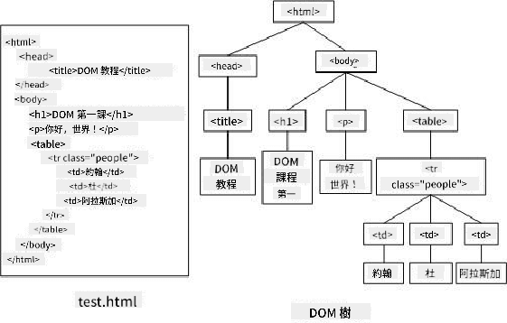

<!--
CO_OP_TRANSLATOR_METADATA:
{
  "original_hash": "61c14b27044861e5e69db35dd52c4403",
  "translation_date": "2025-08-28T23:41:09+00:00",
  "source_file": "3-terrarium/3-intro-to-DOM-and-closures/README.md",
  "language_code": "mo"
}
-->
# Terrarium 專案第 3 部分：DOM 操作與閉包


> 插圖由 [Tomomi Imura](https://twitter.com/girlie_mac) 提供

## 課前測驗

[課前測驗](https://ff-quizzes.netlify.app/web/quiz/19)

### 簡介

操作 DOM（文件物件模型）是網頁開發中的一個關鍵部分。根據 [MDN](https://developer.mozilla.org/docs/Web/API/Document_Object_Model/Introduction) 的說法：「文件物件模型 (DOM) 是構成網頁文件結構和內容的物件的數據表示形式。」網頁上的 DOM 操作挑戰通常是使用 JavaScript 框架而非原生 JavaScript 來管理 DOM 的原因，但我們將嘗試自己完成！

此外，本課程將介紹 [JavaScript 閉包](https://developer.mozilla.org/docs/Web/JavaScript/Closures) 的概念。你可以將閉包視為一個被另一個函數包裹的函數，這樣內部函數就可以訪問外部函數的作用域。

> JavaScript 閉包是一個廣泛且複雜的主題。本課程僅涉及最基本的概念。在這個 terrarium 的程式碼中，你會發現一個閉包：一個內部函數和一個外部函數的結構，允許內部函數訪問外部函數的作用域。想了解更多細節，請參考 [詳細文檔](https://developer.mozilla.org/docs/Web/JavaScript/Closures)。

我們將使用閉包來操作 DOM。

可以將 DOM 想像成一棵樹，代表了網頁文件可以被操作的所有方式。各種 API（應用程式介面）被設計出來，讓程式員可以使用他們選擇的程式語言來訪問 DOM，並進行編輯、更改、重新排列或其他管理操作。



> DOM 和其對應的 HTML 標記的表示圖。來源：[Olfa Nasraoui](https://www.researchgate.net/publication/221417012_Profile-Based_Focused_Crawler_for_Social_Media-Sharing_Websites)

在本課程中，我們將完成互動式 terrarium 專案，通過創建 JavaScript 來讓使用者能夠操作頁面上的植物。

### 前置條件

你應該已經完成了 terrarium 的 HTML 和 CSS。到本課程結束時，你將能夠通過拖動將植物移入或移出 terrarium。

### 任務

在你的 terrarium 資料夾中，創建一個名為 `script.js` 的新檔案。在 `<head>` 區域中匯入該檔案：

```html
	<script src="./script.js" defer></script>
```

> 注意：在將外部 JavaScript 檔案匯入 HTML 時，使用 `defer` 屬性，這樣可以確保 JavaScript 在 HTML 完全加載後才執行。你也可以使用 `async` 屬性，這允許腳本在 HTML 解析時執行，但在我們的情況下，重要的是在執行拖動腳本之前，HTML 元素必須完全可用。

---

## DOM 元素

首先，你需要在 DOM 中創建對你想操作的元素的引用。在我們的例子中，它們是目前位於側邊欄的 14 個植物。

### 任務

```html
dragElement(document.getElementById('plant1'));
dragElement(document.getElementById('plant2'));
dragElement(document.getElementById('plant3'));
dragElement(document.getElementById('plant4'));
dragElement(document.getElementById('plant5'));
dragElement(document.getElementById('plant6'));
dragElement(document.getElementById('plant7'));
dragElement(document.getElementById('plant8'));
dragElement(document.getElementById('plant9'));
dragElement(document.getElementById('plant10'));
dragElement(document.getElementById('plant11'));
dragElement(document.getElementById('plant12'));
dragElement(document.getElementById('plant13'));
dragElement(document.getElementById('plant14'));
```

這裡發生了什麼？你正在引用文件並在其 DOM 中查找具有特定 Id 的元素。還記得我們在 HTML 課程中給每個植物圖片分配了唯一的 Id (`id="plant1"`) 嗎？現在你將利用這一點。在識別每個元素後，你將該項目傳遞給一個名為 `dragElement` 的函數，稍後你將構建該函數。這樣，HTML 中的元素現在就具備了拖動功能，或者很快就會具備。

✅ 為什麼我們通過 Id 引用元素？為什麼不通過它們的 CSS 類名？你可以回顧之前的 CSS 課程來回答這個問題。

---

## 閉包

現在你準備創建 `dragElement` 閉包了，這是一個外部函數，包裹了一個或多個內部函數（在我們的例子中，我們將有三個）。

當一個或多個函數需要訪問外部函數的作用域時，閉包非常有用。以下是一個例子：

```javascript
function displayCandy(){
	let candy = ['jellybeans'];
	function addCandy(candyType) {
		candy.push(candyType)
	}
	addCandy('gumdrops');
}
displayCandy();
console.log(candy)
```

在這個例子中，`displayCandy` 函數包裹了一個函數，該函數將新的糖果類型推入已存在於函數中的陣列。如果你運行這段程式碼，`candy` 陣列將是未定義的，因為它是一個局部變數（局限於閉包內部）。

✅ 如何讓 `candy` 陣列可訪問？試著將它移到閉包外部。這樣，該陣列就變成了全域變數，而不僅僅是閉包的局部作用域。

### 任務

在 `script.js` 中的元素聲明下，創建一個函數：

```javascript
function dragElement(terrariumElement) {
	//set 4 positions for positioning on the screen
	let pos1 = 0,
		pos2 = 0,
		pos3 = 0,
		pos4 = 0;
	terrariumElement.onpointerdown = pointerDrag;
}
```

`dragElement` 從腳本頂部的聲明中獲取其 `terrariumElement` 物件。然後，你為傳遞給函數的物件設置了一些初始位置為 `0` 的局部變數。這些是每個元素的局部變數，當你為每個元素添加拖放功能時，這些變數將被操作。這些被拖動的元素將填充 terrarium，因此應用程式需要跟蹤它們的位置。

此外，傳遞給此函數的 `terrariumElement` 被分配了一個 `pointerdown` 事件，這是 [web API](https://developer.mozilla.org/docs/Web/API) 的一部分，旨在幫助管理 DOM。`onpointerdown` 事件在按下按鈕時觸發，或者在我們的例子中，當觸摸可拖動的元素時觸發。此事件處理器適用於 [網頁和行動瀏覽器](https://caniuse.com/?search=onpointerdown)，但有少數例外。

✅ [事件處理器 `onclick`](https://developer.mozilla.org/docs/Web/API/GlobalEventHandlers/onclick) 在跨瀏覽器中有更廣泛的支援；為什麼不在這裡使用它？想一想你試圖創建的精確螢幕互動類型。

---

## Pointerdrag 函數

`terrariumElement` 現在可以被拖動了；當觸發 `onpointerdown` 事件時，函數 `pointerDrag` 被調用。在這行代碼下方添加該函數：`terrariumElement.onpointerdown = pointerDrag;`：

### 任務

```javascript
function pointerDrag(e) {
	e.preventDefault();
	console.log(e);
	pos3 = e.clientX;
	pos4 = e.clientY;
}
```

這裡發生了幾件事。首先，你使用 `e.preventDefault();` 防止在 pointerdown 上通常發生的默認事件。這樣你可以更好地控制介面的行為。

> 當你完全構建了腳本檔案後，回到這行代碼並嘗試不使用 `e.preventDefault()`——會發生什麼？

其次，在瀏覽器窗口中打開 `index.html`，並檢查介面。當你點擊一個植物時，你可以看到如何捕獲 'e' 事件。深入研究該事件，看看一次 pointerdown 事件可以收集多少信息！

接下來，注意如何將局部變數 `pos3` 和 `pos4` 設置為 e.clientX。你可以在檢查面板中找到 `e` 的值。這些值捕獲了你點擊或觸摸植物時的 x 和 y 座標。你需要對植物的行為進行精細控制，因此你需要跟蹤它們的座標。

✅ 現在是否更清楚為什麼整個應用程式是用一個大的閉包構建的？如果不是閉包，你將如何為 14 個可拖動的植物維持作用域？

完成初始函數，通過在 `pos4 = e.clientY` 下添加另外兩個指針事件操作：

```html
document.onpointermove = elementDrag;
document.onpointerup = stopElementDrag;
```

現在你正在指示希望植物隨著指針的移動而被拖動，並在取消選擇植物時停止拖動手勢。`onpointermove` 和 `onpointerup` 都是與 `onpointerdown` 相同 API 的一部分。介面現在會拋出錯誤，因為你尚未定義 `elementDrag` 和 `stopElementDrag` 函數，因此接下來構建它們。

## elementDrag 和 stopElementDrag 函數

你將通過添加另外兩個內部函數來完成閉包，這些函數將處理拖動植物和停止拖動時發生的事情。你希望的行為是，隨時可以拖動任何植物，並將其放置在螢幕上的任何位置。這個介面非常靈活（例如，沒有放置區域），允許你通過添加、移除和重新定位植物來自由設計你的 terrarium。

### 任務

在 `pointerDrag` 的結束大括號後添加 `elementDrag` 函數：

```javascript
function elementDrag(e) {
	pos1 = pos3 - e.clientX;
	pos2 = pos4 - e.clientY;
	pos3 = e.clientX;
	pos4 = e.clientY;
	console.log(pos1, pos2, pos3, pos4);
	terrariumElement.style.top = terrariumElement.offsetTop - pos2 + 'px';
	terrariumElement.style.left = terrariumElement.offsetLeft - pos1 + 'px';
}
```

在這個函數中，你對先前在外部函數中設置的初始位置 1-4 進行了大量編輯。這裡發生了什麼？

當你拖動時，你通過將 `pos3`（之前設置為 `e.clientX`）減去當前的 `e.clientX` 值來重新分配 `pos1`。對 `pos2` 進行了類似的操作。然後，你將 `pos3` 和 `pos4` 重置為元素的新 X 和 Y 座標。你可以在拖動時在控制台中觀察這些變化。接著，你操作植物的 CSS 樣式，根據這些新位置計算植物的頂部和左側 X 和 Y 座標，並設置其新位置。

> `offsetTop` 和 `offsetLeft` 是 CSS 屬性，用於根據其父元素設置元素的位置；其父元素可以是任何非靜態定位的元素。

所有這些位置的重新計算允許你微調 terrarium 和其植物的行為。

### 任務

完成介面的最後一步是在 `elementDrag` 的結束大括號後添加 `stopElementDrag` 函數：

```javascript
function stopElementDrag() {
	document.onpointerup = null;
	document.onpointermove = null;
}
```

這個小函數重置了 `onpointerup` 和 `onpointermove` 事件，這樣你可以重新開始拖動植物，或者開始拖動新的植物。

✅ 如果不將這些事件設置為 null，會發生什麼？

現在你已經完成了你的專案！

🥇恭喜！你完成了美麗的 terrarium！

---

## 🚀挑戰

為你的閉包添加新的事件處理器，讓植物有更多的互動功能；例如，雙擊植物將其移到最前面。發揮創意吧！

## 課後測驗

[課後測驗](https://ff-quizzes.netlify.app/web/quiz/20)

## 複習與自學

雖然在螢幕上拖動元素看起來很簡單，但根據你想要的效果，有很多種方法可以實現，並且有許多潛在的陷阱。事實上，有一整個 [拖放 API](https://developer.mozilla.org/docs/Web/API/HTML_Drag_and_Drop_API) 可以嘗試。我們在本模組中沒有使用它，因為我們想要的效果有些不同，但你可以在自己的專案中嘗試這個 API，看看能實現什麼。

在 [W3C 文檔](https://www.w3.org/TR/pointerevents1/) 和 [MDN 網頁文檔](https://developer.mozilla.org/docs/Web/API/Pointer_events) 上找到更多關於指針事件的信息。

始終使用 [CanIUse.com](https://caniuse.com/) 檢查瀏覽器的功能。

## 作業

[進一步操作 DOM](assignment.md)

---

**免責聲明**：  
本文件已使用 AI 翻譯服務 [Co-op Translator](https://github.com/Azure/co-op-translator) 進行翻譯。儘管我們努力確保翻譯的準確性，但請注意，自動翻譯可能包含錯誤或不準確之處。原始文件的母語版本應被視為權威來源。對於關鍵信息，建議使用專業人工翻譯。我們對因使用此翻譯而引起的任何誤解或錯誤解釋不承擔責任。