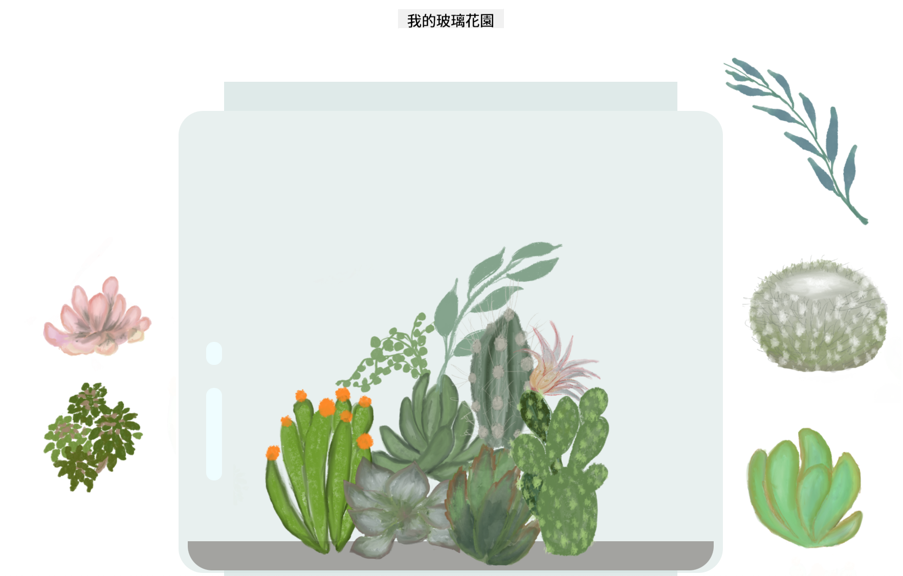

<!--
CO_OP_TRANSLATOR_METADATA:
{
  "original_hash": "6329fbe8bd936068debd78cca6f09c0a",
  "translation_date": "2025-08-25T21:30:37+00:00",
  "source_file": "3-terrarium/solution/README.md",
  "language_code": "mo"
}
-->
# 我的微型植物園：一個學習 HTML、CSS 和使用 JavaScript 操控 DOM 的專案 🌵🌱

一個小型的拖放式程式冥想。只需一些 HTML、JS 和 CSS，你就可以建立一個網頁介面，設計它，並添加互動功能。

## 致謝

由 [Jen Looper](https://www.twitter.com/jenlooper) 用 ♥️ 編寫。

透過 CSS 創建的植物園靈感來自 Jakub Mandra 的玻璃罐 [codepen](https://codepen.io/Rotarepmi/pen/rjpNZY)。

藝術作品由 [Jen Looper](http://jenlooper.com) 使用 Procreate 手繪完成。

## 部署你的微型植物園

你可以使用 Azure 靜態網頁應用程式將你的微型植物園部署或發布到網路上。

1. Fork 此倉庫

2. 按下這個按鈕

3. 按照向導步驟創建你的應用程式。請確保將應用程式根目錄設置為 `/solution` 或你的程式碼庫的根目錄。此應用程式中沒有 API，因此不需要添加相關內容。一個 .github 資料夾將會在你 Fork 的倉庫中創建，幫助 Azure 靜態網頁應用程式的建置服務建置並發布你的應用程式到一個新的 URL。

**免責聲明**：  
本文件已使用 AI 翻譯服務 [Co-op Translator](https://github.com/Azure/co-op-translator) 進行翻譯。儘管我們努力確保翻譯的準確性，但請注意，自動翻譯可能包含錯誤或不準確之處。原始文件的母語版本應被視為權威來源。對於關鍵信息，建議使用專業人工翻譯。我們對因使用此翻譯而引起的任何誤解或錯誤解釋不承擔責任。