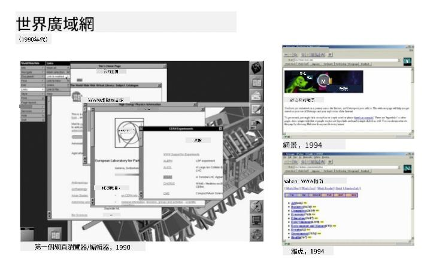

<!--
CO_OP_TRANSLATOR_METADATA:
{
  "original_hash": "2326d04e194a10aa760b51f5e5a1f61d",
  "translation_date": "2025-08-28T23:33:06+00:00",
  "source_file": "5-browser-extension/1-about-browsers/README.md",
  "language_code": "mo"
}
-->
# 瀏覽器擴充功能專案第一部分：關於瀏覽器的一切


> 手繪筆記由 [Wassim Chegham](https://dev.to/wassimchegham/ever-wondered-what-happens-when-you-type-in-a-url-in-an-address-bar-in-a-browser-3dob) 提供

## 課前測驗

[課前測驗](https://ff-quizzes.netlify.app/web/quiz/23)

### 簡介

瀏覽器擴充功能為瀏覽器增加額外的功能。但在開始建立之前，您需要先了解瀏覽器如何運作。

### 關於瀏覽器

在這系列課程中，您將學習如何建立一個瀏覽器擴充功能，並使其能在 Chrome、Firefox 和 Edge 瀏覽器上運作。在這部分，您將了解瀏覽器的運作方式，並搭建瀏覽器擴充功能的基本架構。

那麼，瀏覽器到底是什麼呢？它是一種軟體應用程式，允許終端使用者從伺服器存取內容並在網頁上顯示。

✅ 一點歷史：第一個瀏覽器名為「WorldWideWeb」，由 Tim Berners-Lee 爵士於 1990 年創建。


> 一些早期的瀏覽器，圖片來源 [Karen McGrane](https://www.slideshare.net/KMcGrane/week-4-ixd-history-personal-computing)

當使用者透過 URL（統一資源定位器）地址連接到互聯網時，通常使用 Hypertext Transfer Protocol（HTTP 或 HTTPS 地址），瀏覽器會與網頁伺服器通信並抓取網頁。

此時，瀏覽器的渲染引擎會將網頁顯示在使用者的設備上，可能是手機、桌面或筆記型電腦。

瀏覽器還具有快取內容的能力，這樣就不需要每次都從伺服器重新抓取。它們可以記錄使用者的瀏覽歷史、存儲「Cookie」（包含用於保存使用者活動的小型數據），以及更多功能。

需要特別記住的是，瀏覽器並不完全相同！每個瀏覽器都有其優勢和劣勢，專業的網頁開發人員需要了解如何使網頁在不同瀏覽器上良好運行。這包括處理小型視窗（例如手機的）以及離線使用者的需求。

一個非常有用的網站，您可能應該在您喜歡使用的瀏覽器中加入書籤：[caniuse.com](https://www.caniuse.com)。當您建立網頁時，使用 caniuse 提供的技術支持列表可以幫助您更好地支持使用者。

✅ 如何判斷您的網站使用者最常使用哪些瀏覽器？檢查您的分析數據——您可以在網頁開發過程中安裝各種分析工具包，它們會告訴您使用者最常使用的瀏覽器。

## 瀏覽器擴充功能

為什麼要建立瀏覽器擴充功能？當您需要快速執行一些重複的任務時，擴充功能是一個非常方便的工具。例如，如果您需要檢查與您互動的網頁上的顏色，您可以安裝一個顏色選擇器擴充功能。如果您難以記住密碼，您可以使用密碼管理擴充功能。

瀏覽器擴充功能的開發也非常有趣。它們通常專注於執行有限的任務，並且能夠很好地完成這些任務。

✅ 您最喜歡的瀏覽器擴充功能是什麼？它們執行哪些任務？

### 安裝擴充功能

在開始建立之前，先了解建立和部署瀏覽器擴充功能的過程。雖然每個瀏覽器在管理這項任務上略有不同，但 Chrome 和 Firefox 的過程與 Edge 的示例相似：


> 注意：請確保開啟開發者模式並允許來自其他商店的擴充功能。

基本流程如下：

- 使用 `npm run build` 建立您的擴充功能
- 在瀏覽器中透過右上角的「設定及更多」按鈕（`...` 圖示）進入擴充功能頁面
- 如果是新安裝，選擇「載入未打包」以從其建立資料夾（在我們的案例中是 `/dist`）上傳新的擴充功能
- 或者，如果是重新載入已安裝的擴充功能，點擊「重新載入」

✅ 這些指示適用於您自己建立的擴充功能；若要安裝已發布到瀏覽器擴充功能商店的擴充功能，您應該前往這些 [商店](https://microsoftedge.microsoft.com/addons/Microsoft-Edge-Extensions-Home) 並安裝您選擇的擴充功能。

### 開始

您將建立一個瀏覽器擴充功能，顯示您所在地區的碳足跡，包括能源使用情況及能源來源。該擴充功能將包含一個表單，用於收集 API 金鑰，以便訪問 CO2 Signal 的 API。

**您需要：**

- [一個 API 金鑰](https://www.co2signal.com/)；在此頁面輸入您的電子郵件，金鑰將發送給您
- [您的地區代碼](http://api.electricitymap.org/v3/zones)，對應於 [Electricity Map](https://www.electricitymap.org/map)（例如，在波士頓，我使用「US-NEISO」）
- [起始代碼](../../../../5-browser-extension/start)。下載 `start` 資料夾；您將在此資料夾中完成代碼
- [NPM](https://www.npmjs.com) - NPM 是一個套件管理工具；在本地安裝它，並安裝 `package.json` 文件中列出的套件以供網頁資產使用

✅ 在這個 [優秀的學習模組](https://docs.microsoft.com/learn/modules/create-nodejs-project-dependencies/?WT.mc_id=academic-77807-sagibbon) 中了解更多關於套件管理的內容

花點時間瀏覽代碼庫：

dist
    -|manifest.json（預設值在此設置）
    -|index.html（前端 HTML 標記在此）
    -|background.js（背景 JS 在此）
    -|main.js（已編譯的 JS）
src
    -|index.js（您的 JS 代碼在此）

✅ 一旦您準備好 API 金鑰和地區代碼，請將它們存放在某個筆記中以供未來使用。

### 建立擴充功能的 HTML

此擴充功能有兩個視圖。一個用於收集 API 金鑰和地區代碼：


另一個用於顯示地區的碳使用情況：


首先，建立表單的 HTML 並使用 CSS 進行樣式設置。

在 `/dist` 資料夾中，建立一個表單和結果區域。在 `index.html` 文件中填充表單區域：

```HTML
<form class="form-data" autocomplete="on">
	<div>
		<h2>New? Add your Information</h2>
	</div>
	<div>
		<label for="region">Region Name</label>
		<input type="text" id="region" required class="region-name" />
	</div>
	<div>
		<label for="api">Your API Key from tmrow</label>
		<input type="text" id="api" required class="api-key" />
	</div>
	<button class="search-btn">Submit</button>
</form>	
```
這是保存信息的表單，輸入的信息將保存到本地存儲。

接下來，建立結果區域；在最後的表單標籤下方添加一些 div：

```HTML
<div class="result">
	<div class="loading">loading...</div>
	<div class="errors"></div>
	<div class="data"></div>
	<div class="result-container">
		<p><strong>Region: </strong><span class="my-region"></span></p>
		<p><strong>Carbon Usage: </strong><span class="carbon-usage"></span></p>
		<p><strong>Fossil Fuel Percentage: </strong><span class="fossil-fuel"></span></p>
	</div>
	<button class="clear-btn">Change region</button>
</div>
```
此時，您可以嘗試進行編譯。確保安裝此擴充功能的套件依賴項：

```
npm install
```

此命令將使用 npm（Node 套件管理器）安裝 webpack，用於擴充功能的編譯過程。您可以通過查看 `/dist/main.js` 的輸出來看到代碼已被打包。

目前，擴充功能應該可以編譯，並且如果您將其部署到 Edge 作為擴充功能，您將看到一個整齊顯示的表單。

恭喜您，您已經邁出了建立瀏覽器擴充功能的第一步。在後續課程中，您將使其更具功能性和實用性。

---

## 🚀 挑戰

瀏覽瀏覽器擴充功能商店並安裝一個擴充功能到您的瀏覽器。您可以用有趣的方式檢查其文件。您發現了什麼？

## 課後測驗

[課後測驗](https://ff-quizzes.netlify.app/web/quiz/24)

## 回顧與自學

在本課中，您學習了一些關於網頁瀏覽器歷史的內容；利用這個機會，通過閱讀更多相關歷史來了解 World Wide Web 的發明者如何設想其用途。一些有用的網站包括：

[網頁瀏覽器的歷史](https://www.mozilla.org/firefox/browsers/browser-history/)

[網頁的歷史](https://webfoundation.org/about/vision/history-of-the-web/)

[Tim Berners-Lee 的訪談](https://www.theguardian.com/technology/2019/mar/12/tim-berners-lee-on-30-years-of-the-web-if-we-dream-a-little-we-can-get-the-web-we-want)

## 作業 

[重新設計您的擴充功能](assignment.md)

---

**免責聲明**：  
本文件已使用 AI 翻譯服務 [Co-op Translator](https://github.com/Azure/co-op-translator) 進行翻譯。雖然我們致力於提供準確的翻譯，但請注意，自動翻譯可能包含錯誤或不準確之處。原始文件的母語版本應被視為權威來源。對於關鍵資訊，建議使用專業人工翻譯。我們對因使用此翻譯而引起的任何誤解或誤釋不承擔責任。