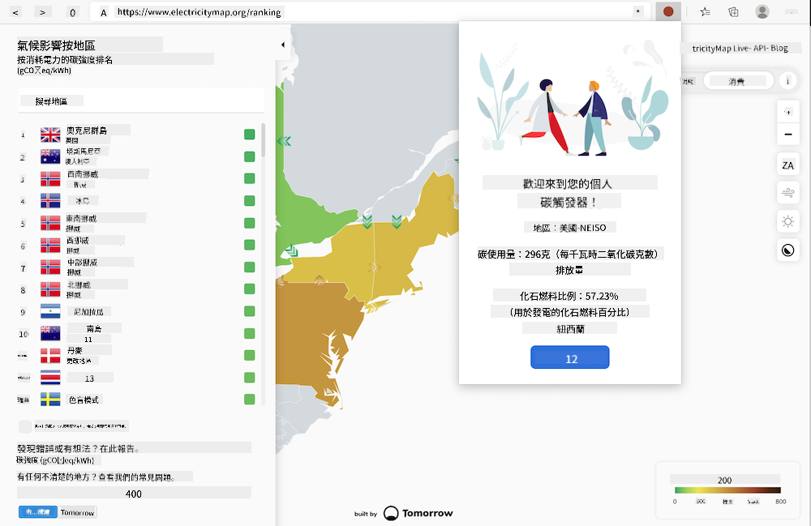
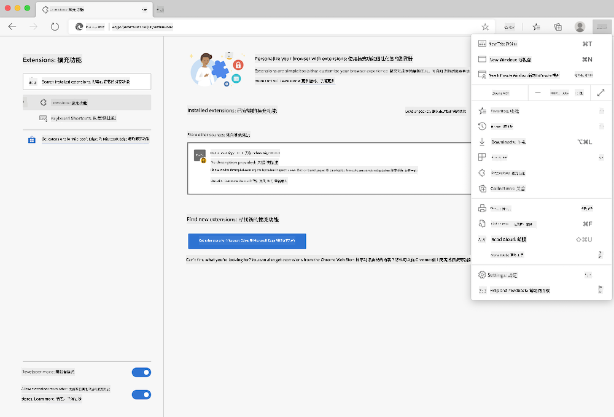

<!--
CO_OP_TRANSLATOR_METADATA:
{
  "original_hash": "dd58ae1b7707034f055718c1b68bc8de",
  "translation_date": "2025-08-25T23:53:59+00:00",
  "source_file": "5-browser-extension/solution/translation/README.hi.md",
  "language_code": "mo"
}
-->
# 碳觸發瀏覽器擴展：完整代碼

使用 tmrow 的 C02 Signal API 來追蹤電力使用情況，構建一個瀏覽器擴展，提醒您所在區域的電力使用是否繁重。使用此擴展可以幫助您根據這些信息來決定自己的活動。



## 開始

您需要安裝 [npm](https://npmjs.com)。將此代碼下載到您電腦上的一個文件夾中。

安裝所有必要的套件：

```
npm install
```

使用 Webpack 構建擴展：

```
npm run build
```

要在 Edge 上安裝，請使用瀏覽器右上角的“三點”菜單找到擴展面板。從那裡選擇“加載未打包的擴展”，然後在提示中打開“dist”文件夾，擴展就會加載。要使用它，您需要 CO2 Signal 的 API 密鑰（[通過電子郵件在此處獲取](https://www.co2signal.com/)——在該頁面的框中輸入您的電子郵件）以及 [您所在區域的代碼](http://api.electricitymap.org/v3/zones) [電力地圖](https://www.electricitymap.org/map)（例如，在波士頓，我使用“US-NEISO”）。



一旦 API 密鑰和區域代碼輸入到擴展界面中，瀏覽器擴展欄中的彩色點應該會根據您所在區域的能源使用情況進行變化，並為您提供一個指標，告訴您哪些能源密集型活動適合您的操作。這個“點”系統的概念是我從加州排放的 [Energy Lollipop 擴展](https://energylollipop.com/) 中獲得的靈感。

**免責聲明**：  
本文件已使用 AI 翻譯服務 [Co-op Translator](https://github.com/Azure/co-op-translator) 進行翻譯。雖然我們致力於提供準確的翻譯，但請注意，自動翻譯可能包含錯誤或不準確之處。原始文件的母語版本應被視為權威來源。對於關鍵信息，建議使用專業人工翻譯。我們對因使用此翻譯而引起的任何誤解或誤釋不承擔責任。