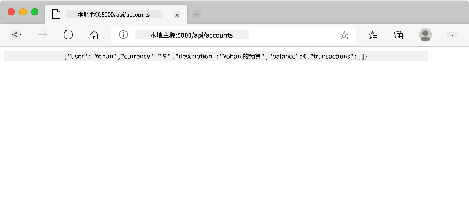

<!--
CO_OP_TRANSLATOR_METADATA:
{
  "original_hash": "8baca047d77a5f43fa4099c0578afa42",
  "translation_date": "2025-08-28T23:31:00+00:00",
  "source_file": "7-bank-project/2-forms/README.md",
  "language_code": "mo"
}
-->
# 建立銀行應用程式第二部分：建立登入和註冊表單

## 課前測驗

[課前測驗](https://ff-quizzes.netlify.app/web/quiz/43)

### 簡介

幾乎所有現代網頁應用程式都允許使用者建立帳戶，擁有自己的私人空間。由於多位使用者可以同時存取網頁應用程式，因此需要一種機制來分別儲存每位使用者的個人資料，並選擇要顯示的資訊。我們不會深入探討如何[安全地管理使用者身份](https://en.wikipedia.org/wiki/Authentication)，因為這是一個非常廣泛的主題，但我們會確保每位使用者能夠在我們的應用程式中建立一個（或多個）銀行帳戶。

在這部分，我們將使用 HTML 表單為我們的網頁應用程式新增登入和註冊功能。我們將學習如何以程式方式將資料傳送到伺服器 API，並最終定義使用者輸入的基本驗證規則。

### 先決條件

您需要完成網頁應用程式的[HTML 模板和路由](../1-template-route/README.md)部分。此外，您需要安裝 [Node.js](https://nodejs.org) 並[在本地執行伺服器 API](../api/README.md)，以便能夠傳送資料來建立帳戶。

**注意事項**
您需要同時開啟兩個終端機，如下所列：
1. 用於我們在[HTML 模板和路由](../1-template-route/README.md)課程中建立的主要銀行應用程式。
2. 用於我們剛剛設定的[銀行應用程式伺服器 API](../api/README.md)。

您需要啟動並運行這兩個伺服器才能完成接下來的課程。它們分別監聽不同的埠（埠 `3000` 和埠 `5000`），因此應該不會有問題。

您可以在終端機中執行以下指令來測試伺服器是否正常運行：

```sh
curl http://localhost:5000/api
# -> should return "Bank API v1.0.0" as a result
```

---

## 表單與控制項

`<form>` 元素封裝了 HTML 文件中的一個區域，使用者可以透過互動式控制項輸入並提交資料。表單中可以使用各種使用者介面（UI）控制項，其中最常見的是 `<input>` 和 `<button>` 元素。

`<input>` 有許多不同的[類型](https://developer.mozilla.org/docs/Web/HTML/Element/input)。例如，要建立一個使用者輸入其使用者名稱的欄位，可以使用以下程式碼：

```html
<input id="username" name="username" type="text">
```

`name` 屬性將在表單資料傳送時用作屬性名稱，而 `id` 屬性則用於將 `<label>` 與表單控制項關聯。

> 查看 [`<input>` 類型](https://developer.mozilla.org/docs/Web/HTML/Element/input)的完整列表以及[其他表單控制項](https://developer.mozilla.org/docs/Learn/Forms/Other_form_controls)，以了解您在建立 UI 時可以使用的所有原生 UI 元素。

✅ 請注意，`<input>` 是一個[空元素](https://developer.mozilla.org/docs/Glossary/Empty_element)，不應添加匹配的結束標籤。不過，您可以使用自閉合的 `<input/>` 語法，但這不是必須的。

表單中的 `<button>` 元素有些特殊。如果未指定其 `type` 屬性，按下時會自動提交表單資料到伺服器。以下是可能的 `type` 值：

- `submit`：表單中的預設值，按鈕觸發表單提交動作。
- `reset`：按鈕將所有表單控制項重置為初始值。
- `button`：按鈕按下時不分配預設行為。您可以使用 JavaScript 為其分配自定義動作。

### 任務

讓我們從在 `login` 模板中新增一個表單開始。我們需要一個*使用者名稱*欄位和一個*登入*按鈕。

```html
<template id="login">
  <h1>Bank App</h1>
  <section>
    <h2>Login</h2>
    <form id="loginForm">
      <label for="username">Username</label>
      <input id="username" name="user" type="text">
      <button>Login</button>
    </form>
  </section>
</template>
```

仔細查看，您會注意到我們還新增了一個 `<label>` 元素。`<label>` 元素用於為 UI 控制項添加名稱，例如我們的使用者名稱欄位。標籤對於表單的可讀性非常重要，並且還具有以下額外好處：

- 將標籤與表單控制項關聯，有助於使用輔助技術（例如螢幕閱讀器）的使用者理解需要提供什麼資料。
- 您可以點擊標籤直接將焦點放在相關的輸入欄位上，這使得在觸控螢幕設備上更容易操作。

> [網頁的可及性](https://developer.mozilla.org/docs/Learn/Accessibility/What_is_accessibility)是一個非常重要但常被忽略的主題。得益於[語義化 HTML 元素](https://developer.mozilla.org/docs/Learn/Accessibility/HTML)，如果正確使用它們，創建可及內容並不困難。您可以[閱讀更多關於可及性的內容](https://developer.mozilla.org/docs/Web/Accessibility)，以避免常見錯誤並成為負責任的開發者。

現在，我們將在前一個表單下方新增第二個註冊表單：

```html
<hr/>
<h2>Register</h2>
<form id="registerForm">
  <label for="user">Username</label>
  <input id="user" name="user" type="text">
  <label for="currency">Currency</label>
  <input id="currency" name="currency" type="text" value="$">
  <label for="description">Description</label>
  <input id="description" name="description" type="text">
  <label for="balance">Current balance</label>
  <input id="balance" name="balance" type="number" value="0">
  <button>Register</button>
</form>
```

使用 `value` 屬性，我們可以為指定的輸入欄位定義預設值。
此外，請注意 `balance` 的輸入類型是 `number`。它看起來是否與其他輸入欄位不同？試著與它互動看看。

✅ 您能否僅使用鍵盤導航並與表單互動？您會如何操作？

## 將資料提交到伺服器

現在我們有了一個功能性的 UI，下一步是將資料傳送到伺服器。讓我們使用目前的程式碼進行快速測試：如果您點擊*登入*或*註冊*按鈕，會發生什麼？

您是否注意到瀏覽器的 URL 區域發生了變化？


`<form>` 的預設行為是使用 [GET 方法](https://www.w3.org/Protocols/rfc2616/rfc2616-sec9.html#sec9.3)將表單提交到當前伺服器 URL，並將表單資料直接附加到 URL。這種方法有一些缺點：

- 傳送的資料大小有限（約 2000 字元）
- 資料直接顯示在 URL 中（對於密碼來說不太理想）
- 不支援檔案上傳

因此，您可以將其更改為使用 [POST 方法](https://www.w3.org/Protocols/rfc2616/rfc2616-sec9.html#sec9.5)，該方法將表單資料傳送到 HTTP 請求的主體中，避免了上述限制。

> 雖然 POST 是最常用的資料傳送方法，但[在某些特定情況下](https://www.w3.org/2001/tag/doc/whenToUseGet.html)，例如實現搜尋欄位時，使用 GET 方法可能更合適。

### 任務

為註冊表單新增 `action` 和 `method` 屬性：

```html
<form id="registerForm" action="//localhost:5000/api/accounts" method="POST">
```

現在嘗試使用您的名字註冊新帳戶。點擊*註冊*按鈕後，您應該會看到類似以下的內容：



如果一切正常，伺服器應該會以 [JSON](https://www.json.org/json-en.html) 回應您的請求，並包含已建立的帳戶資料。

✅ 再次使用相同的名字註冊。會發生什麼？

## 不重新載入頁面提交資料

您可能注意到，我們剛剛使用的方法有一個小問題：提交表單時，我們離開了應用程式，瀏覽器重定向到伺服器 URL。我們正在嘗試避免所有頁面重新載入，因為我們正在建立一個[單頁應用程式 (SPA)](https://en.wikipedia.org/wiki/Single-page_application)。

要在不強制重新載入頁面的情況下將表單資料傳送到伺服器，我們需要使用 JavaScript 程式碼。與其在 `<form>` 元素的 `action` 屬性中放置 URL，您可以使用任何以 `javascript:` 字串開頭的 JavaScript 程式碼來執行自定義動作。使用此方法意味著您需要實現一些之前由瀏覽器自動完成的任務：

- 獲取表單資料
- 將表單資料轉換並編碼為適合的格式
- 建立 HTTP 請求並將其傳送到伺服器

### 任務

將註冊表單的 `action` 替換為：

```html
<form id="registerForm" action="javascript:register()">
```

打開 `app.js`，新增一個名為 `register` 的函數：

```js
function register() {
  const registerForm = document.getElementById('registerForm');
  const formData = new FormData(registerForm);
  const data = Object.fromEntries(formData);
  const jsonData = JSON.stringify(data);
}
```

在這裡，我們使用 `getElementById()` 獲取表單元素，並使用 [`FormData`](https://developer.mozilla.org/docs/Web/API/FormData) 幫助器將表單控制項中的值提取為一組鍵值對。然後，我們使用 [`Object.fromEntries()`](https://developer.mozilla.org/docs/Web/JavaScript/Reference/Global_Objects/Object/fromEntries) 將資料轉換為常規物件，最後序列化為 [JSON](https://www.json.org/json-en.html)，這是一種常用於網頁資料交換的格式。

資料現在已準備好傳送到伺服器。建立一個名為 `createAccount` 的新函數：

```js
async function createAccount(account) {
  try {
    const response = await fetch('//localhost:5000/api/accounts', {
      method: 'POST',
      headers: { 'Content-Type': 'application/json' },
      body: account
    });
    return await response.json();
  } catch (error) {
    return { error: error.message || 'Unknown error' };
  }
}
```

這個函數在做什麼？首先，注意這裡的 `async` 關鍵字。這表示函數包含將以[**非同步**](https://developer.mozilla.org/docs/Web/JavaScript/Reference/Statements/async_function)方式執行的程式碼。當與 `await` 關鍵字一起使用時，它允許等待非同步程式碼執行（例如等待伺服器回應）後再繼續。

這裡有一段關於 `async/await` 使用的快速影片：

[](https://youtube.com/watch?v=YwmlRkrxvkk "管理 Promise 的 Async 和 Await")

> 🎥 點擊上方圖片觀看關於 async/await 的影片。

我們使用 `fetch()` API 將 JSON 資料傳送到伺服器。此方法需要兩個參數：

- 伺服器的 URL，因此我們在這裡放回 `//localhost:5000/api/accounts`。
- 請求的設定。在這裡，我們將方法設置為 `POST`，並提供請求的 `body`。由於我們正在向伺服器傳送 JSON 資料，因此還需要將 `Content-Type` 標頭設置為 `application/json`，以便伺服器知道如何解釋內容。

由於伺服器會以 JSON 回應請求，我們可以使用 `await response.json()` 解析 JSON 內容並返回結果物件。請注意，此方法是非同步的，因此我們在返回之前使用 `await` 關鍵字，以確保在解析期間的任何錯誤也能被捕獲。

現在在 `register` 函數中新增一些程式碼以呼叫 `createAccount()`：

```js
const result = await createAccount(jsonData);
```

由於我們在這裡使用了 `await` 關鍵字，因此需要在 register 函數前添加 `async` 關鍵字：

```js
async function register() {
```

最後，新增一些日誌以檢查結果。最終的函數應如下所示：

```js
async function register() {
  const registerForm = document.getElementById('registerForm');
  const formData = new FormData(registerForm);
  const jsonData = JSON.stringify(Object.fromEntries(formData));
  const result = await createAccount(jsonData);

  if (result.error) {
    return console.log('An error occurred:', result.error);
  }

  console.log('Account created!', result);
}
```

雖然過程有點長，但我們完成了！如果您打開[瀏覽器開發者工具](https://developer.mozilla.org/docs/Learn/Common_questions/What_are_browser_developer_tools)，並嘗試註冊新帳戶，您應該不會看到網頁有任何變化，但控制台中會出現一條訊息，確認一切正常。


✅ 您認為資料是否安全地傳送到伺服器？如果有人能夠攔截請求會怎麼樣？您可以閱讀[HTTPS](https://en.wikipedia.org/wiki/HTTPS)以了解更多關於安全資料通信的內容。

## 資料驗證

如果您嘗試在未設置使用者名稱的情況下註冊新帳戶，您會看到伺服器返回了一個狀態碼為 [400 (Bad Request)](https://developer.mozilla.org/docs/Web/HTTP/Status/400#:~:text=The%20HyperText%20Transfer%20Protocol%20(HTTP,%2C%20or%20deceptive%20request%20routing).) 的錯誤。

在將資料傳送到伺服器之前，最好先[驗證表單資料](https://developer.mozilla.org/docs/Learn/Forms/Form_validation)，以確保您傳送的是有效請求。HTML5 表單控制項提供了內建的驗證功能，使用各種屬性：

- `required`：欄位需要填寫，否則表單無法提交。
- `minlength` 和 `maxlength`：定義文字欄位的最小和最大字元數。
- `min` 和 `max`：定義數值欄位的最小和最大值。
- `type`：定義預期的資料類型，例如 `number`、`email`、`file` 或[其他內建類型](https://developer.mozilla.org/docs/Web/HTML/Element/input)。此屬性也可能改變表單控制項的視覺呈現。
- `pattern`：允許定義一個[正則表達式](https://developer.mozilla.org/docs/Web/JavaScript/Guide/Regular_Expressions)模式，以測試輸入的資料是否有效。
提示：您可以使用 `:valid` 和 `:invalid` CSS 偽類來根據表單控件是否有效自訂其外觀。
### 任務

建立新帳戶時，必須填寫兩個必要欄位：使用者名稱和貨幣，其他欄位則為選填。更新表單的 HTML，使用 `required` 屬性以及欄位標籤中的文字來達到以下效果：

```html
<label for="user">Username (required)</label>
<input id="user" name="user" type="text" required>
...
<label for="currency">Currency (required)</label>
<input id="currency" name="currency" type="text" value="$" required>
```

雖然這個伺服器的實作並未強制限制欄位的最大長度，但為使用者輸入的文字定義合理的限制始終是良好的做法。

在文字欄位中加入 `maxlength` 屬性：

```html
<input id="user" name="user" type="text" maxlength="20" required>
...
<input id="currency" name="currency" type="text" value="$" maxlength="5" required>
...
<input id="description" name="description" type="text" maxlength="100">
```

現在，如果按下 *註冊* 按鈕，而某個欄位未遵守我們定義的驗證規則，您應該會看到類似以下的畫面：


在將任何資料發送到伺服器之前進行的驗證稱為 **客戶端驗證**。但請注意，並非所有檢查都能在不發送資料的情況下完成。例如，我們無法在此檢查是否已存在相同使用者名稱的帳戶，除非向伺服器發送請求。在伺服器上進行的額外驗證稱為 **伺服器端驗證**。

通常需要同時實施這兩種驗證。客戶端驗證能改善使用者體驗，提供即時回饋；而伺服器端驗證則至關重要，確保您處理的使用者資料是可靠且安全的。

---

## 🚀 挑戰

在 HTML 中顯示錯誤訊息，提示使用者帳戶已存在。

以下是經過一些樣式設計後的最終登入頁面範例：


## 課後測驗

[課後測驗](https://ff-quizzes.netlify.app/web/quiz/44)

## 回顧與自學

開發者在表單構建方面非常有創意，尤其是在驗證策略上。透過瀏覽 [CodePen](https://codepen.com) 來了解不同的表單流程；您能找到一些有趣且具啟發性的表單嗎？

## 作業

[為您的銀行應用程式設計樣式](assignment.md)

---

**免責聲明**：  
本文件已使用 AI 翻譯服務 [Co-op Translator](https://github.com/Azure/co-op-translator) 進行翻譯。雖然我們致力於提供準確的翻譯，但請注意，自動翻譯可能包含錯誤或不準確之處。原始文件的母語版本應被視為權威來源。對於關鍵資訊，建議尋求專業人工翻譯。我們對因使用此翻譯而引起的任何誤解或錯誤解釋不承擔責任。