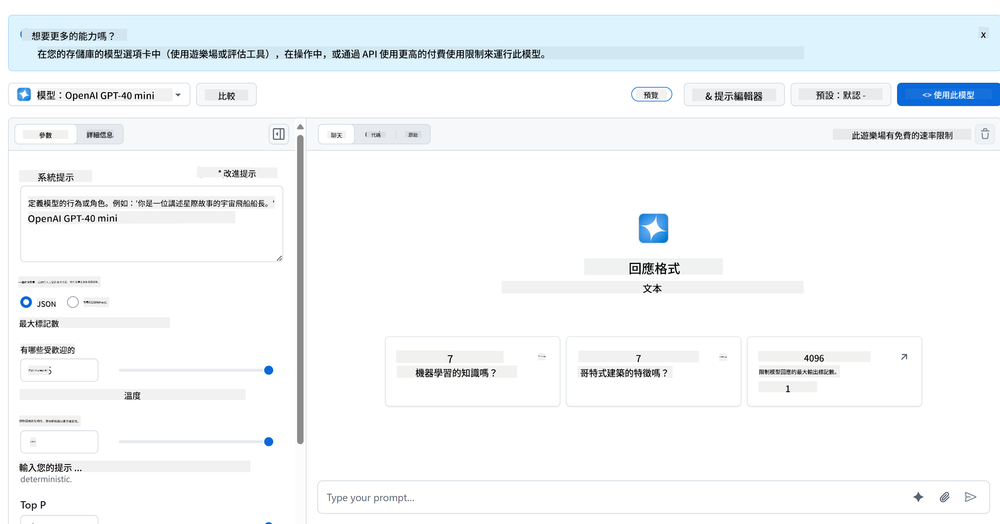
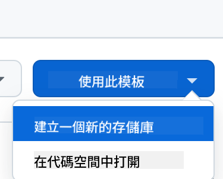
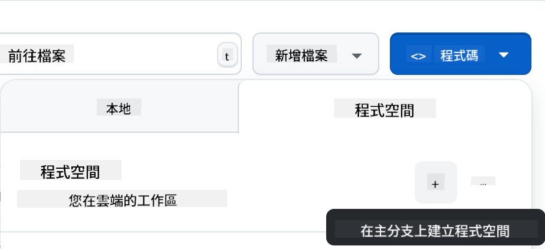

<!--
CO_OP_TRANSLATOR_METADATA:
{
  "original_hash": "11cf36165c243947b6cd85b88cf6faa6",
  "translation_date": "2025-09-01T16:49:39+00:00",
  "source_file": "9-chat-project/README.md",
  "language_code": "mo"
}
-->
# 聊天專案

這個聊天專案展示了如何使用 GitHub Models 建立一個聊天助手。

以下是完成的專案樣貌：


一些背景資訊，使用生成式 AI 建立聊天助手是一個學習 AI 的好方法。在這堂課中，你將學習如何將生成式 AI整合到網頁應用程式中，讓我們開始吧。

## 連接生成式 AI

在後端部分，我們使用 GitHub Models。這是一個很棒的服務，讓你可以免費使用 AI。前往它的 Playground，並取得與你選擇的後端語言相對應的程式碼。以下是 [GitHub Models Playground](https://github.com/marketplace/models/azure-openai/gpt-4o-mini/playground) 的樣子：



如我們所說，選擇 "Code" 標籤和你選擇的執行環境。


### 使用 Python

在這個例子中，我們選擇 Python，這意味著我們會選擇以下程式碼：

```python
"""Run this model in Python

> pip install openai
"""
import os
from openai import OpenAI

# To authenticate with the model you will need to generate a personal access token (PAT) in your GitHub settings. 
# Create your PAT token by following instructions here: https://docs.github.com/en/authentication/keeping-your-account-and-data-secure/managing-your-personal-access-tokens
client = OpenAI(
    base_url="https://models.github.ai/inference",
    api_key=os.environ["GITHUB_TOKEN"],
)

response = client.chat.completions.create(
    messages=[
        {
            "role": "system",
            "content": "",
        },
        {
            "role": "user",
            "content": "What is the capital of France?",
        }
    ],
    model="openai/gpt-4o-mini",
    temperature=1,
    max_tokens=4096,
    top_p=1
)

print(response.choices[0].message.content)
```

讓我們稍微清理一下這段程式碼，使其可重複使用：

```python
def call_llm(prompt: str, system_message: str):
    response = client.chat.completions.create(
        messages=[
            {
                "role": "system",
                "content": system_message,
            },
            {
                "role": "user",
                "content": prompt,
            }
        ],
        model="openai/gpt-4o-mini",
        temperature=1,
        max_tokens=4096,
        top_p=1
    )

    return response.choices[0].message.content
```

有了這個函數 `call_llm`，我們現在可以傳入一個提示和系統提示，函數最終會返回結果。

### 自訂 AI 助手

如果你想自訂 AI 助手的行為，可以像下面這樣填入系統提示：

```python
call_llm("Tell me about you", "You're Albert Einstein, you only know of things in the time you were alive")
```

## 通過 Web API 暴露功能

很好，我們已完成 AI 部分，接下來看看如何將其整合到 Web API 中。對於 Web API，我們選擇使用 Flask，但任何網頁框架都可以。以下是程式碼：

### 使用 Python

```python
# api.py
from flask import Flask, request, jsonify
from llm import call_llm
from flask_cors import CORS

app = Flask(__name__)
CORS(app)   # *   example.com

@app.route("/", methods=["GET"])
def index():
    return "Welcome to this API. Call POST /hello with 'message': 'my message' as JSON payload"


@app.route("/hello", methods=["POST"])
def hello():
    # get message from request body  { "message": "do this taks for me" }
    data = request.get_json()
    message = data.get("message", "")

    response = call_llm(message, "You are a helpful assistant.")
    return jsonify({
        "response": response
    })

if __name__ == "__main__":
    app.run(host="0.0.0.0", port=5000)
```

在這裡，我們建立了一個 Flask API，並定義了預設路徑 "/" 和 "/chat"。後者是供前端用來傳遞問題的。

要整合 *llm.py*，我們需要做以下幾件事：

- 匯入 `call_llm` 函數：

   ```python
   from llm import call_llm
   from flask import Flask, request
   ```

- 從 "/chat" 路徑呼叫它：

   ```python
   @app.route("/hello", methods=["POST"])
   def hello():
      # get message from request body  { "message": "do this taks for me" }
      data = request.get_json()
      message = data.get("message", "")

      response = call_llm(message, "You are a helpful assistant.")
      return jsonify({
         "response": response
      })
   ```

   在這裡，我們解析傳入的請求，從 JSON 主體中檢索 `message` 屬性。接著，我們使用以下呼叫來調用 LLM：

   ```python
   response = call_llm(message, "You are a helpful assistant")

   # return the response as JSON
   return jsonify({
      "response": response 
   })
   ```

很好，現在我們已完成所需的部分。

## 配置 Cors

我們需要提到的是，我們設置了類似 CORS（跨來源資源共享）的功能。這意味著，由於後端和前端將在不同的端口上運行，我們需要允許前端呼叫後端。

### 使用 Python

在 *api.py* 中有一段程式碼設置了這個功能：

```python
from flask_cors import CORS

app = Flask(__name__)
CORS(app)   # *   example.com
```

目前它被設置為允許 "*"，即所有來源，這有點不安全，應該在進入生產環境時進行限制。

## 運行你的專案

要運行你的專案，首先需要啟動後端，然後啟動前端。

### 使用 Python

好的，我們有 *llm.py* 和 *api.py*，如何讓它們在後端運作？我們需要做以下兩件事：

- 安裝依賴項：

   ```sh
   cd backend
   python -m venv venv
   source ./venv/bin/activate

   pip install openai flask flask-cors openai
   ```

- 啟動 API：

   ```sh
   python api.py
   ```

   如果你在 Codespaces 中，需前往編輯器底部的 Ports，右鍵點擊並選擇 "Port Visibility"，然後選擇 "Public"。

### 開發前端

現在我們的 API 已經啟動並運行，讓我們為此建立一個前端。以下是一個最低限度的前端，我們將逐步改進。在 *frontend* 資料夾中，建立以下內容：

```text
backend/
frontend/
index.html
app.js
styles.css
```

首先是 **index.html**：

```html
<html>
    <head>
        <link rel="stylesheet" href="styles.css">
    </head>
    <body>
      <form>
        <textarea id="messages"></textarea>
        <input id="input" type="text" />
        <button type="submit" id="sendBtn">Send</button>  
      </form>  
      <script src="app.js" />
    </body>
</html>    
```

以上是支持聊天窗口所需的最低限度，包含一個用於顯示訊息的文字區域、一個輸入框用於輸入訊息，以及一個按鈕用於將訊息發送到後端。接下來看看 *app.js* 中的 JavaScript。

**app.js**

```js
// app.js

(function(){
  // 1. set up elements  
  const messages = document.getElementById("messages");
  const form = document.getElementById("form");
  const input = document.getElementById("input");

  const BASE_URL = "change this";
  const API_ENDPOINT = `${BASE_URL}/hello`;

  // 2. create a function that talks to our backend
  async function callApi(text) {
    const response = await fetch(API_ENDPOINT, {
      method: "POST",
      headers: { "Content-Type": "application/json" },
      body: JSON.stringify({ message: text })
    });
    let json = await response.json();
    return json.response;
  }

  // 3. add response to our textarea
  function appendMessage(text, role) {
    const el = document.createElement("div");
    el.className = `message ${role}`;
    el.innerHTML = text;
    messages.appendChild(el);
  }

  // 4. listen to submit events
  form.addEventListener("submit", async(e) => {
    e.preventDefault();
   // someone clicked the button in the form
   
   // get input
   const text = input.value.trim();

   appendMessage(text, "user")

   // reset it
   input.value = '';

   const reply = await callApi(text);

   // add to messages
   appendMessage(reply, "assistant");

  })
})();
```

讓我們逐段解析程式碼：

- 1) 在這裡，我們獲取所有稍後會在程式碼中引用的元素。
- 2) 在這部分，我們建立了一個函數，使用內建的 `fetch` 方法呼叫後端。
- 3) `appendMessage` 幫助添加回應以及用戶輸入的訊息。
- 4) 在這裡，我們監聽提交事件，讀取輸入框的內容，將用戶的訊息放入文字區域，呼叫 API，並在文字區域中渲染回應。

接下來看看樣式部分，你可以自由設計外觀，但以下是一些建議：

**styles.css**

```
.message {
    background: #222;
    box-shadow: 0 0 0 10px orange;
    padding: 10px:
    margin: 5px;
}

.message.user {
    background: blue;
}

.message.assistant {
    background: grey;
} 
```

有了這三個類別，你可以根據訊息的來源（助手或用戶）來區分樣式。如果需要靈感，可以查看 `solution/frontend/styles.css` 資料夾。

### 更改 Base Url

有一件事我們尚未設置，那就是 `BASE_URL`，這在後端啟動之前是未知的。設置方法如下：

- 如果你在本地運行 API，應設置為類似 `http://localhost:5000`。
- 如果在 Codespaces 中運行，應設置為類似 "[name]app.github.dev"。

## 作業

建立自己的資料夾 *project*，內容如下：

```text
project/
  frontend/
    index.html
    app.js
    styles.css
  backend/
    ...
```

複製上述指示的內容，但可以根據自己的喜好進行自訂。

## 解決方案

[解決方案](./solution/README.md)

## 額外挑戰

嘗試更改 AI 助手的個性。

### 對於 Python

在 *api.py* 中呼叫 `call_llm` 時，可以更改第二個參數，例如：

```python
call_llm(message, "You are Captain Picard")
```

### 前端

同時更改 CSS 和文字，對 *index.html* 和 *styles.css* 進行修改。

## 總結

太棒了，你已經從零開始學習如何使用 AI 建立個人助手。我們使用了 GitHub Models、Python 後端以及 HTML、CSS 和 JavaScript 前端完成了這項工作。

## 使用 Codespaces 設置

- 前往：[Web Dev For Beginners repo](https://github.com/microsoft/Web-Dev-For-Beginners)
- 從模板建立（確保你已登入 GitHub），在右上角：

    

- 進入你的 repo 後，建立一個 Codespace：

    

    這將啟動一個你可以使用的環境。

---

**免責聲明**：  
本文件已使用 AI 翻譯服務 [Co-op Translator](https://github.com/Azure/co-op-translator) 進行翻譯。儘管我們努力確保翻譯的準確性，但請注意，自動翻譯可能包含錯誤或不準確之處。原始文件的母語版本應被視為權威來源。對於關鍵信息，建議尋求專業人工翻譯。我們對因使用此翻譯而引起的任何誤解或錯誤解釋不承擔責任。