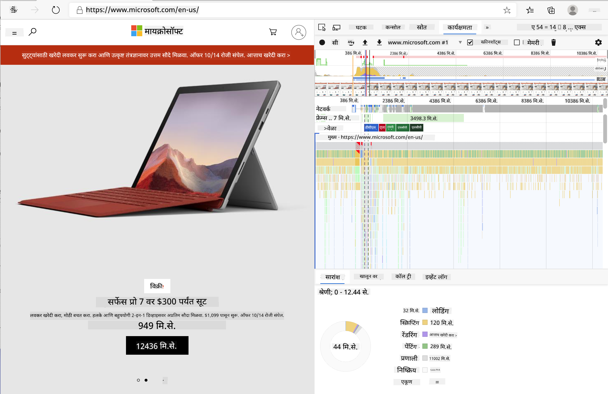
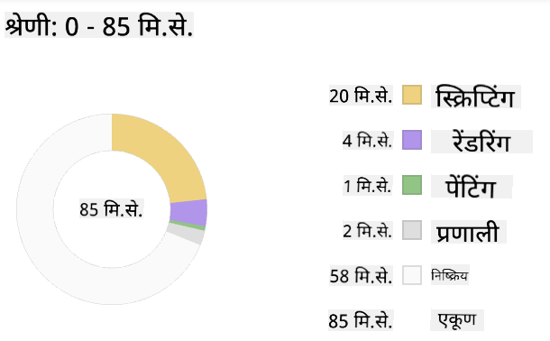

<!--
CO_OP_TRANSLATOR_METADATA:
{
  "original_hash": "49b58721a71cfda824e2f3e1f46908c6",
  "translation_date": "2025-08-28T16:13:24+00:00",
  "source_file": "5-browser-extension/3-background-tasks-and-performance/README.md",
  "language_code": "mr"
}
-->
# ब्राउझर एक्स्टेंशन प्रोजेक्ट भाग ३: बॅकग्राउंड टास्क आणि कार्यक्षमता याबद्दल जाणून घ्या

## प्री-लेक्चर क्विझ

[प्री-लेक्चर क्विझ](https://ff-quizzes.netlify.app/web/quiz/27)

### परिचय

या मॉड्यूलच्या मागील दोन धड्यांमध्ये, तुम्ही API मधून डेटा मिळवण्यासाठी फॉर्म आणि डिस्प्ले एरिया कसा तयार करायचा हे शिकले. वेबवर वेब उपस्थिती तयार करण्याचा हा एक अतिशय सामान्य मार्ग आहे. तुम्ही डेटा असिंक्रोनस पद्धतीने मिळवण्याचे व्यवस्थापन कसे करायचे हे देखील शिकले. तुमचे ब्राउझर एक्स्टेंशन जवळजवळ पूर्ण झाले आहे.

आता काही बॅकग्राउंड टास्क व्यवस्थापित करणे बाकी आहे, ज्यामध्ये एक्स्टेंशनच्या आयकॉनचा रंग रीफ्रेश करणे समाविष्ट आहे, त्यामुळे ब्राउझर अशा प्रकारच्या कार्याचे व्यवस्थापन कसे करते याबद्दल बोलण्याची ही एक उत्तम वेळ आहे. तुमचे वेब प्रोजेक्ट तयार करताना तुमच्या वेब अॅसेट्सच्या कार्यक्षमतेच्या संदर्भात या ब्राउझर टास्कचा विचार करूया.

## वेब कार्यक्षमता मूलभूत गोष्टी

> "वेबसाइट कार्यक्षमता दोन गोष्टींवर आधारित आहे: पृष्ठ किती वेगाने लोड होते आणि त्यावरील कोड किती वेगाने चालतो." -- [Zack Grossbart](https://www.smashingmagazine.com/2012/06/javascript-profiling-chrome-developer-tools/)

तुमच्या वेबसाइट्स सर्व प्रकारच्या डिव्हाइसवर, सर्व प्रकारच्या वापरकर्त्यांसाठी, सर्व प्रकारच्या परिस्थितीत वेगवान कशा बनवायच्या याचे विषय अपेक्षेप्रमाणे विस्तृत आहेत. तुम्ही एक सामान्य वेब प्रोजेक्ट किंवा ब्राउझर एक्स्टेंशन तयार करत असाल तर लक्षात ठेवण्यासारखे काही मुद्दे येथे आहेत.

तुमची साइट कार्यक्षमतेने चालत आहे याची खात्री करण्यासाठी तुम्हाला सर्वप्रथम तिच्या कार्यक्षमतेबद्दल डेटा गोळा करणे आवश्यक आहे. हे करण्याचे पहिले ठिकाण म्हणजे तुमच्या वेब ब्राउझरचे डेव्हलपर टूल्स. Edge मध्ये, तुम्ही "सेटिंग्ज आणि अधिक" बटण (ब्राउझरच्या वरच्या उजव्या कोपऱ्यातील तीन डॉट्स आयकॉन) निवडू शकता, नंतर More Tools > Developer Tools वर जा आणि Performance टॅब उघडा. तुम्ही Windows वर `Ctrl` + `Shift` + `I` किंवा Mac वर `Option` + `Command` + `I` कीबोर्ड शॉर्टकट वापरून डेव्हलपर टूल्स उघडू शकता.

Performance टॅबमध्ये एक प्रोफाइलिंग टूल आहे. वेबसाइट उघडा (उदाहरणार्थ, [https://www.microsoft.com](https://www.microsoft.com/?WT.mc_id=academic-77807-sagibbon)) आणि 'Record' बटणावर क्लिक करा, नंतर साइट रीफ्रेश करा. रेकॉर्डिंग कधीही थांबवा, आणि तुम्हाला 'स्क्रिप्ट', 'रेंडर', आणि 'पेंट' साइट तयार करण्यासाठी तयार केलेल्या रूटीन दिसतील:



✅ [Microsoft Documentation](https://docs.microsoft.com/microsoft-edge/devtools-guide/performance/?WT.mc_id=academic-77807-sagibbon) वर Edge मधील Performance पॅनेलबद्दल अधिक जाणून घ्या

> टिप: तुमच्या वेबसाइटच्या स्टार्टअप वेळेचे अचूक वाचन मिळवण्यासाठी, तुमच्या ब्राउझरचा कॅशे क्लिअर करा

प्रोफाइल टाइमलाइनचे घटक निवडा आणि तुमचे पृष्ठ लोड होत असताना घडणाऱ्या घटनांवर झूम करा.

प्रोफाइल टाइमलाइनचा एक भाग निवडून आणि सारांश पॅन पाहून तुमच्या पृष्ठाच्या कार्यक्षमतेचा स्नॅपशॉट मिळवा:



Event Log पॅन तपासा आणि पाहा की कोणतीही घटना १५ ms पेक्षा जास्त वेळ घेत आहे का:


✅ तुमचा प्रोफाइलर ओळखा! या साइटवर डेव्हलपर टूल्स उघडा आणि पाहा की काही अडथळे आहेत का. सर्वात हळू-लोड होणारा अॅसेट कोणता आहे? सर्वात वेगवान कोणता आहे?

## प्रोफाइलिंग तपासणी

सामान्यतः, काही "समस्या क्षेत्रे" आहेत ज्यावर प्रत्येक वेब डेव्हलपरने साइट तयार करताना लक्ष ठेवले पाहिजे जेणेकरून उत्पादनात साइट तैनात करताना अप्रिय आश्चर्य टाळता येईल.

**अॅसेट साइजेस**: वेब गेल्या काही वर्षांत 'जड' आणि त्यामुळे हळू झाला आहे. या वजनाचा काही भाग प्रतिमांच्या वापराशी संबंधित आहे.

✅ [Internet Archive](https://httparchive.org/reports/page-weight) मधून पृष्ठ वजनाचा ऐतिहासिक दृष्टिकोन आणि अधिक तपासा.

चांगली पद्धत म्हणजे तुमच्या प्रतिमा ऑप्टिमाइझ करणे आणि तुमच्या वापरकर्त्यांसाठी योग्य आकार आणि रिझोल्यूशनवर वितरित करणे सुनिश्चित करणे.

**DOM ट्रॅव्हर्सल्स**: ब्राउझरला तुमच्या कोडवर आधारित त्याचा Document Object Model तयार करावा लागतो, त्यामुळे चांगल्या पृष्ठ कार्यक्षमतेसाठी तुमचे टॅग्स कमीत कमी ठेवणे, पृष्ठाला आवश्यक असलेलेच वापरणे आणि स्टाइल करणे हे हिताचे आहे. यासाठी, पृष्ठाशी संबंधित अतिरिक्त CSS ऑप्टिमाइझ केले जाऊ शकते; ज्या शैली एका पृष्ठावरच वापरल्या जाणे आवश्यक आहे त्या मुख्य शैली पत्रकात समाविष्ट करण्याची आवश्यकता नाही, उदाहरणार्थ.

**JavaScript**: प्रत्येक JavaScript डेव्हलपरने 'रेंडर-ब्लॉकिंग' स्क्रिप्ट्ससाठी लक्ष ठेवले पाहिजे ज्यांना DOM ट्रॅव्हर्स आणि ब्राउझरवर पेंट करण्यापूर्वी लोड करणे आवश्यक आहे. तुमच्या इनलाइन स्क्रिप्ट्ससह `defer` वापरण्याचा विचार करा (जसे की Terrarium मॉड्यूलमध्ये केले जाते).

✅ साइट कार्यक्षमतेचा निर्धारण करण्यासाठी सामान्य तपासणीबद्दल अधिक जाणून घेण्यासाठी [Site Speed Test website](https://www.webpagetest.org/) वर काही साइट्स वापरून पहा.

आता तुम्हाला ब्राउझर तुमच्याकडून पाठवलेल्या अॅसेट्स कसे रेंडर करते याची कल्पना आली आहे, चला तुमचे एक्स्टेंशन पूर्ण करण्यासाठी तुम्हाला करायच्या शेवटच्या काही गोष्टी पाहूया:

### रंग गणना करण्यासाठी फंक्शन तयार करा

`/src/index.js` मध्ये काम करताना, DOM ऍक्सेस करण्यासाठी सेट केलेल्या `const` व्हेरिएबल्सच्या मालिकेनंतर `calculateColor()` नावाचे फंक्शन जोडा:

```JavaScript
function calculateColor(value) {
	let co2Scale = [0, 150, 600, 750, 800];
	let colors = ['#2AA364', '#F5EB4D', '#9E4229', '#381D02', '#381D02'];

	let closestNum = co2Scale.sort((a, b) => {
		return Math.abs(a - value) - Math.abs(b - value);
	})[0];
	console.log(value + ' is closest to ' + closestNum);
	let num = (element) => element > closestNum;
	let scaleIndex = co2Scale.findIndex(num);

	let closestColor = colors[scaleIndex];
	console.log(scaleIndex, closestColor);

	chrome.runtime.sendMessage({ action: 'updateIcon', value: { color: closestColor } });
}
```

इथे काय चालले आहे? तुम्ही API कॉलमधून मिळालेली कार्बन इंटेन्सिटीची एक मूल्य पास करता, आणि नंतर तुम्ही त्याचे मूल्य रंगांच्या array मध्ये सादर केलेल्या निर्देशांकाच्या किती जवळ आहे हे गणना करता. नंतर तुम्ही तो सर्वात जवळचा रंग chrome runtime कडे पाठवता.

chrome.runtime मध्ये [API](https://developer.chrome.com/extensions/runtime) आहे जे सर्व प्रकारच्या बॅकग्राउंड टास्क हाताळते, आणि तुमचे एक्स्टेंशन त्याचा उपयोग करत आहे:

> "chrome.runtime API चा वापर बॅकग्राउंड पृष्ठ मिळवण्यासाठी, मॅनिफेस्टबद्दल तपशील परत करण्यासाठी, आणि अॅप किंवा एक्स्टेंशन लाइफसायकलमधील इव्हेंट्ससाठी ऐकण्यासाठी आणि प्रतिसाद देण्यासाठी करा. तुम्ही URL च्या रिलेटिव्ह पथांना पूर्णपणे पात्र URL मध्ये रूपांतरित करण्यासाठी देखील या API चा वापर करू शकता."

✅ जर तुम्ही Edge साठी हे ब्राउझर एक्स्टेंशन विकसित करत असाल, तर तुम्हाला आश्चर्य वाटेल की तुम्ही chrome API वापरत आहात. Edge ब्राउझरच्या नवीन आवृत्त्या Chromium ब्राउझर इंजिनवर चालतात, त्यामुळे तुम्ही या टूल्सचा उपयोग करू शकता.

> लक्षात ठेवा, जर तुम्हाला ब्राउझर एक्स्टेंशन प्रोफाइल करायचे असेल, तर एक्स्टेंशनमधूनच डेव्हलपर टूल्स लॉन्च करा, कारण ते स्वतःचे स्वतंत्र ब्राउझर इंस्टन्स आहे.

### डिफॉल्ट आयकॉन रंग सेट करा

आता, `init()` फंक्शनमध्ये, आयकॉनला सुरुवातीला सामान्य हिरवा रंग सेट करा, पुन्हा chrome च्या `updateIcon` action कॉल करून:

```JavaScript
chrome.runtime.sendMessage({
	action: 'updateIcon',
		value: {
			color: 'green',
		},
});
```

### फंक्शन कॉल करा, कॉल execute करा

त्यानंतर, तुम्ही तयार केलेल्या फंक्शनला C02Signal API द्वारे परत दिलेल्या promise मध्ये जोडा:

```JavaScript
//let CO2...
calculateColor(CO2);
```

आणि शेवटी, `/dist/background.js` मध्ये, या बॅकग्राउंड action कॉलसाठी listener जोडा:

```JavaScript
chrome.runtime.onMessage.addListener(function (msg, sender, sendResponse) {
	if (msg.action === 'updateIcon') {
		chrome.browserAction.setIcon({ imageData: drawIcon(msg.value) });
	}
});
//borrowed from energy lollipop extension, nice feature!
function drawIcon(value) {
	let canvas = document.createElement('canvas');
	let context = canvas.getContext('2d');

	context.beginPath();
	context.fillStyle = value.color;
	context.arc(100, 100, 50, 0, 2 * Math.PI);
	context.fill();

	return context.getImageData(50, 50, 100, 100);
}
```

या कोडमध्ये, तुम्ही बॅकएंड टास्क मॅनेजरकडे येणाऱ्या कोणत्याही संदेशांसाठी listener जोडत आहात. जर त्याला 'updateIcon' असे म्हटले गेले असेल, तर योग्य रंगाचा आयकॉन काढण्यासाठी पुढील कोड Canvas API वापरून चालवला जातो.

✅ तुम्ही Canvas API बद्दल अधिक [Space Game lessons](../../6-space-game/2-drawing-to-canvas/README.md) मध्ये शिकाल.

आता, तुमचे एक्स्टेंशन पुन्हा तयार करा (`npm run build`), रीफ्रेश करा आणि तुमचे एक्स्टेंशन लॉन्च करा, आणि रंग बदलताना पहा. एखाद्या कामासाठी बाहेर जाण्याची किंवा भांडी धुण्याची ही चांगली वेळ आहे का? आता तुम्हाला कळले!

अभिनंदन, तुम्ही एक उपयुक्त ब्राउझर एक्स्टेंशन तयार केले आहे आणि ब्राउझर कसे कार्य करते आणि त्याच्या कार्यक्षमतेचे प्रोफाइल कसे करायचे याबद्दल अधिक शिकले.

---

## 🚀 आव्हान

काही ओपन सोर्स वेबसाइट्स तपासा ज्या खूप पूर्वीपासून अस्तित्वात आहेत, आणि त्यांच्या GitHub इतिहासाच्या आधारे, त्या कार्यक्षमतेसाठी कशा ऑप्टिमाइझ केल्या गेल्या हे ठरवण्याचा प्रयत्न करा, जर त्या केल्या असतील. सर्वात सामान्य समस्या कोणती आहे?

## पोस्ट-लेक्चर क्विझ

[पोस्ट-लेक्चर क्विझ](https://ff-quizzes.netlify.app/web/quiz/28)

## पुनरावलोकन आणि स्व-अभ्यास

[परफॉर्मन्स न्यूजलेटर](https://perf.email/) साठी साइन अप करण्याचा विचार करा.

ब्राउझर वेब कार्यक्षमता कशी मोजतात याचे काही मार्ग तपासा, त्यांच्या वेब टूल्समधील कार्यक्षमता टॅब पाहून. तुम्हाला काही मोठे फरक आढळतात का?

## असाइनमेंट

[साइट कार्यक्षमतेसाठी विश्लेषण करा](assignment.md)

---

**अस्वीकरण**:  
हा दस्तऐवज AI भाषांतर सेवा [Co-op Translator](https://github.com/Azure/co-op-translator) चा वापर करून भाषांतरित करण्यात आला आहे. आम्ही अचूकतेसाठी प्रयत्नशील असलो तरी कृपया लक्षात ठेवा की स्वयंचलित भाषांतरे त्रुटी किंवा अचूकतेच्या अभावाने युक्त असू शकतात. मूळ भाषेतील दस्तऐवज हा अधिकृत स्रोत मानला जावा. महत्त्वाच्या माहितीसाठी व्यावसायिक मानवी भाषांतराची शिफारस केली जाते. या भाषांतराचा वापर करून निर्माण होणाऱ्या कोणत्याही गैरसमज किंवा चुकीच्या अर्थासाठी आम्ही जबाबदार राहणार नाही.