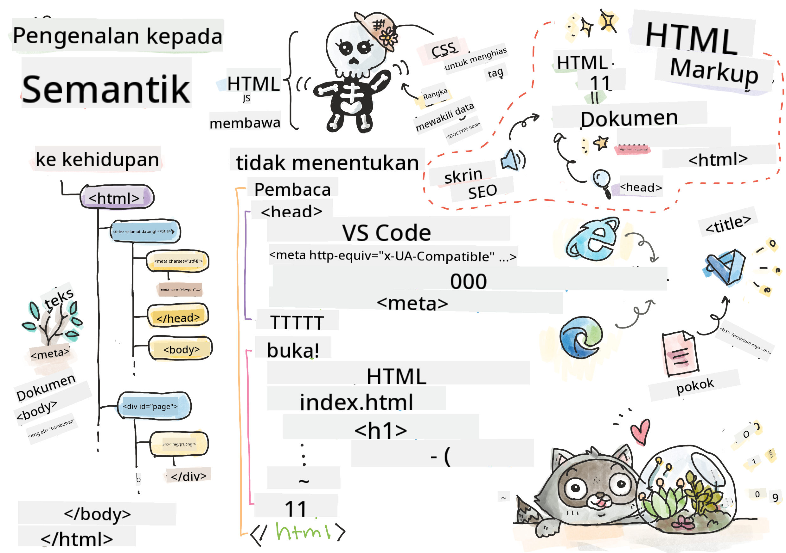
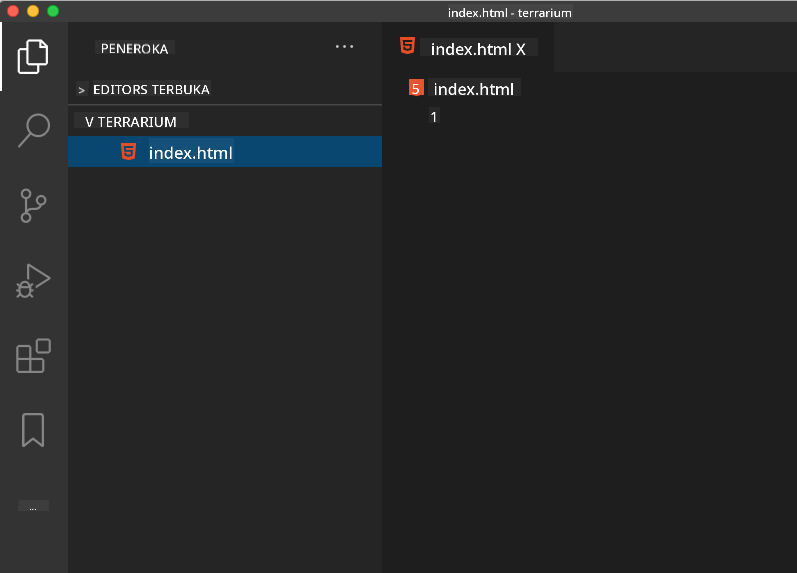

<!--
CO_OP_TRANSLATOR_METADATA:
{
  "original_hash": "89f7f9f800ce7c9f149e98baaae8491a",
  "translation_date": "2025-08-29T09:32:20+00:00",
  "source_file": "3-terrarium/1-intro-to-html/README.md",
  "language_code": "ms"
}
-->
# Projek Terrarium Bahagian 1: Pengenalan kepada HTML


> Sketchnote oleh [Tomomi Imura](https://twitter.com/girlie_mac)

## Kuiz Pra-Kuliah

[Kuiz pra-kuliah](https://ff-quizzes.netlify.app/web/quiz/15)

> Tonton video

> 
> [](https://www.youtube.com/watch?v=1TvxJKBzhyQ)

### Pengenalan

HTML, atau HyperText Markup Language, adalah 'rangka' web. Jika CSS 'menghias' HTML anda dan JavaScript menghidupkannya, HTML adalah tubuh aplikasi web anda. Sintaks HTML mencerminkan idea ini, kerana ia termasuk tag "head", "body", dan "footer".

Dalam pelajaran ini, kita akan menggunakan HTML untuk menyusun 'rangka' antara muka terrarium maya kita. Ia akan mempunyai tajuk dan tiga lajur: lajur kanan dan kiri di mana tumbuhan yang boleh diseret berada, dan kawasan tengah yang akan menjadi terrarium yang kelihatan seperti kaca. Pada akhir pelajaran ini, anda akan dapat melihat tumbuhan dalam lajur, tetapi antara muka akan kelihatan agak pelik; jangan risau, dalam bahagian seterusnya anda akan menambah gaya CSS pada antara muka untuk menjadikannya kelihatan lebih baik.

### Tugasan

Pada komputer anda, buat folder bernama 'terrarium' dan di dalamnya, fail bernama 'index.html'. Anda boleh melakukannya dalam Visual Studio Code selepas anda membuat folder terrarium dengan membuka tetingkap VS Code baru, klik 'open folder', dan navigasi ke folder baru anda. Klik butang 'file' kecil dalam panel Explorer dan buat fail baru:



Atau

Gunakan arahan ini pada git bash:
* `mkdir terrarium`
* `cd terrarium`
* `touch index.html`
* `code index.html` atau `nano index.html`

> Fail index.html menunjukkan kepada pelayar bahawa ia adalah fail lalai dalam folder; URL seperti `https://anysite.com/test` mungkin dibina menggunakan struktur folder termasuk folder bernama `test` dengan `index.html` di dalamnya; `index.html` tidak perlu ditunjukkan dalam URL.

---

## DocType dan tag html

Baris pertama fail HTML adalah doctype-nya. Agak mengejutkan bahawa anda perlu mempunyai baris ini di bahagian atas fail, tetapi ia memberitahu pelayar lama bahawa pelayar perlu memaparkan halaman dalam mod standard, mengikut spesifikasi html semasa.

> Tip: dalam VS Code, anda boleh melayang di atas tag dan mendapatkan maklumat tentang penggunaannya daripada panduan Rujukan MDN.

Baris kedua sepatutnya menjadi tag pembuka `<html>`, diikuti dengan tag penutupnya `</html>`. Tag ini adalah elemen akar antara muka anda.

### Tugasan

Tambahkan baris ini di bahagian atas fail `index.html` anda:

```HTML
<!DOCTYPE html>
<html></html>
```

✅ Terdapat beberapa mod berbeza yang boleh ditentukan dengan menetapkan DocType dengan rentetan pertanyaan: [Quirks Mode dan Standards Mode](https://developer.mozilla.org/docs/Web/HTML/Quirks_Mode_and_Standards_Mode). Mod ini digunakan untuk menyokong pelayar lama yang tidak biasa digunakan sekarang (Netscape Navigator 4 dan Internet Explorer 5). Anda boleh berpegang kepada deklarasi doctype standard.

---

## 'Head' dokumen

Kawasan 'head' dokumen HTML termasuk maklumat penting tentang halaman web anda, juga dikenali sebagai [metadata](https://developer.mozilla.org/docs/Web/HTML/Element/meta). Dalam kes kita, kita memberitahu pelayan web yang akan menerima halaman ini untuk dipaparkan, empat perkara ini:

-   tajuk halaman
-   metadata halaman termasuk:
    -   'character set', memberitahu tentang pengekodan watak yang digunakan dalam halaman
    -   maklumat pelayar, termasuk `x-ua-compatible` yang menunjukkan bahawa pelayar IE=edge disokong
    -   maklumat tentang bagaimana viewport harus berkelakuan apabila ia dimuatkan. Menetapkan viewport untuk mempunyai skala awal 1 mengawal tahap zum apabila halaman pertama kali dimuatkan.

### Tugasan

Tambahkan blok 'head' pada dokumen anda di antara tag pembuka dan penutup `<html>`.

```html
<head>
	<title>Welcome to my Virtual Terrarium</title>
	<meta charset="utf-8" />
	<meta http-equiv="X-UA-Compatible" content="IE=edge" />
	<meta name="viewport" content="width=device-width, initial-scale=1" />
</head>
```

✅ Apa yang akan berlaku jika anda menetapkan tag meta viewport seperti ini: `<meta name="viewport" content="width=600">`? Baca lebih lanjut tentang [viewport](https://developer.mozilla.org/docs/Web/HTML/Viewport_meta_tag).

---

## `Body` dokumen

### Tag HTML

Dalam HTML, anda menambah tag pada fail .html anda untuk mencipta elemen halaman web. Setiap tag biasanya mempunyai tag pembuka dan penutup, seperti ini: `<p>hello</p>` untuk menunjukkan perenggan. Cipta badan antara muka anda dengan menambah satu set tag `<body>` di dalam pasangan tag `<html>`; markup anda kini kelihatan seperti ini:

### Tugasan

```html
<!DOCTYPE html>
<html>
	<head>
		<title>Welcome to my Virtual Terrarium</title>
		<meta charset="utf-8" />
		<meta http-equiv="X-UA-Compatible" content="IE=edge" />
		<meta name="viewport" content="width=device-width, initial-scale=1" />
	</head>
	<body></body>
</html>
```

Sekarang, anda boleh mula membina halaman anda. Biasanya, anda menggunakan tag `<div>` untuk mencipta elemen berasingan dalam halaman. Kita akan mencipta satu siri elemen `<div>` yang akan mengandungi imej.

### Imej

Satu tag html yang tidak memerlukan tag penutup ialah tag ``, kerana ia mempunyai elemen `src` yang mengandungi semua maklumat yang diperlukan halaman untuk memaparkan item.

Buat folder dalam aplikasi anda bernama `images` dan di dalamnya, tambahkan semua imej dalam [folder kod sumber](../../../../3-terrarium/solution/images); (terdapat 14 imej tumbuhan).

### Tugasan

Tambahkan imej tumbuhan tersebut ke dalam dua lajur di antara tag `<body></body>`:

```html
<div id="page">
	<div id="left-container" class="container">
		<div class="plant-holder">
			
		</div>
		<div class="plant-holder">
			
		</div>
		<div class="plant-holder">
			
		</div>
		<div class="plant-holder">
			
		</div>
		<div class="plant-holder">
			
		</div>
		<div class="plant-holder">
			
		</div>
		<div class="plant-holder">
			
		</div>
	</div>
	<div id="right-container" class="container">
		<div class="plant-holder">
			
		</div>
		<div class="plant-holder">
			
		</div>
		<div class="plant-holder">
			
		</div>
		<div class="plant-holder">
			
		</div>
		<div class="plant-holder">
			
		</div>
		<div class="plant-holder">
			
		</div>
		<div class="plant-holder">
			
		</div>
	</div>
</div>
```

> Nota: Spans vs. Divs. Divs dianggap sebagai elemen 'block', dan Spans adalah 'inline'. Apa yang akan berlaku jika anda menukar divs ini kepada spans?

Dengan markup ini, tumbuhan kini muncul di skrin. Ia kelihatan agak buruk, kerana ia belum lagi digayakan menggunakan CSS, dan kita akan melakukannya dalam pelajaran seterusnya.

Setiap imej mempunyai teks alt yang akan muncul walaupun anda tidak dapat melihat atau memaparkan imej. Ini adalah atribut penting untuk disertakan bagi kebolehaksesan. Ketahui lebih lanjut tentang kebolehaksesan dalam pelajaran masa depan; buat masa ini, ingat bahawa atribut alt menyediakan maklumat alternatif untuk imej jika pengguna atas sebab tertentu tidak dapat melihatnya (kerana sambungan perlahan, ralat dalam atribut src, atau jika pengguna menggunakan pembaca skrin).

✅ Adakah anda perasan bahawa setiap imej mempunyai tag alt yang sama? Adakah ini amalan yang baik? Mengapa atau mengapa tidak? Bolehkah anda memperbaiki kod ini?

---

## Markup semantik

Secara umum, adalah lebih baik menggunakan 'semantik' yang bermakna semasa menulis HTML. Apa maksudnya? Ia bermaksud anda menggunakan tag HTML untuk mewakili jenis data atau interaksi yang direka untuknya. Sebagai contoh, teks tajuk utama pada halaman sepatutnya menggunakan tag `<h1>`.

Tambahkan baris berikut betul-betul di bawah tag pembuka `<body>` anda:

```html
<h1>My Terrarium</h1>
```

Menggunakan markup semantik seperti mempunyai tajuk `<h1>` dan senarai tidak berurutan yang dipaparkan sebagai `<ul>` membantu pembaca skrin menavigasi melalui halaman. Secara umum, butang sepatutnya ditulis sebagai `<button>` dan senarai sepatutnya `<li>`. Walaupun _mungkin_ menggunakan elemen `<span>` yang digayakan khas dengan pengendali klik untuk meniru butang, adalah lebih baik untuk pengguna kurang upaya menggunakan teknologi untuk menentukan di mana pada halaman butang berada, dan berinteraksi dengannya, jika elemen itu muncul sebagai butang. Atas sebab ini, cuba gunakan markup semantik sebanyak mungkin.

✅ Lihat pembaca skrin dan [bagaimana ia berinteraksi dengan halaman web](https://www.youtube.com/watch?v=OUDV1gqs9GA). Bolehkah anda melihat mengapa mempunyai markup tidak semantik mungkin mengecewakan pengguna?

## Terrarium

Bahagian terakhir antara muka ini melibatkan mencipta markup yang akan digayakan untuk mencipta terrarium.

### Tugasan:

Tambahkan markup ini di atas tag `</div>` terakhir:

```html
<div id="terrarium">
	<div class="jar-top"></div>
	<div class="jar-walls">
		<div class="jar-glossy-long"></div>
		<div class="jar-glossy-short"></div>
	</div>
	<div class="dirt"></div>
	<div class="jar-bottom"></div>
</div>
```

✅ Walaupun anda menambahkan markup ini ke skrin, anda tidak melihat apa-apa yang dipaparkan. Mengapa?

---

## 🚀Cabaran

Terdapat beberapa tag 'lama' dalam HTML yang masih seronok untuk dimainkan, walaupun anda tidak sepatutnya menggunakan tag yang tidak lagi digunakan seperti [tag ini](https://developer.mozilla.org/docs/Web/HTML/Element#Obsolete_and_deprecated_elements) dalam markup anda. Namun, bolehkah anda menggunakan tag lama `<marquee>` untuk membuat tajuk h1 bergerak secara mendatar? (jika anda melakukannya, jangan lupa untuk menghapusnya selepas itu)

## Kuiz Pasca-Kuliah

[Kuiz pasca-kuliah](https://ff-quizzes.netlify.app/web/quiz/16)

## Ulasan & Kajian Kendiri

HTML adalah sistem blok binaan 'teruji dan benar' yang telah membantu membina web menjadi seperti sekarang. Ketahui sedikit tentang sejarahnya dengan mengkaji beberapa tag lama dan baru. Bolehkah anda mengetahui mengapa beberapa tag tidak lagi digunakan dan beberapa ditambah? Apakah tag yang mungkin diperkenalkan pada masa depan?

Ketahui lebih lanjut tentang membina laman web untuk web dan peranti mudah alih di [Microsoft Learn](https://docs.microsoft.com/learn/modules/build-simple-website/?WT.mc_id=academic-77807-sagibbon).

## Tugasan

[Latih HTML anda: Bina mockup blog](assignment.md)

---

**Penafian**:  
Dokumen ini telah diterjemahkan menggunakan perkhidmatan terjemahan AI [Co-op Translator](https://github.com/Azure/co-op-translator). Walaupun kami berusaha untuk memastikan ketepatan, sila ambil perhatian bahawa terjemahan automatik mungkin mengandungi kesilapan atau ketidaktepatan. Dokumen asal dalam bahasa asalnya harus dianggap sebagai sumber yang berwibawa. Untuk maklumat yang kritikal, terjemahan manusia profesional adalah disyorkan. Kami tidak bertanggungjawab atas sebarang salah faham atau salah tafsir yang timbul daripada penggunaan terjemahan ini.