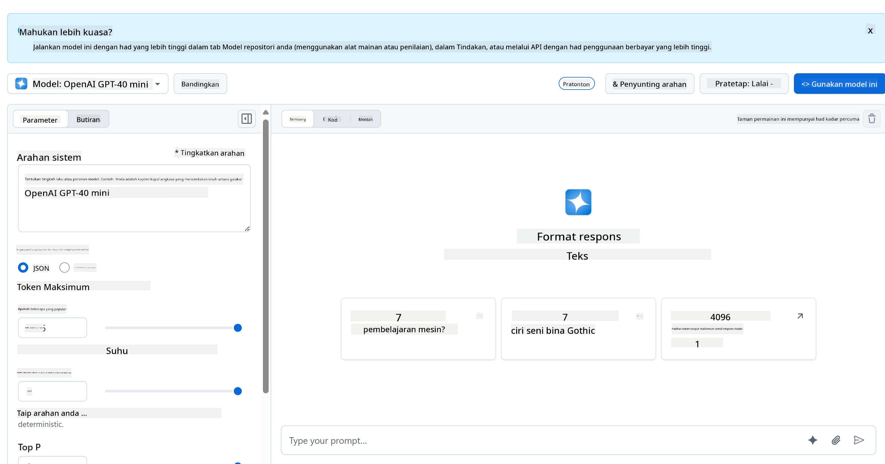
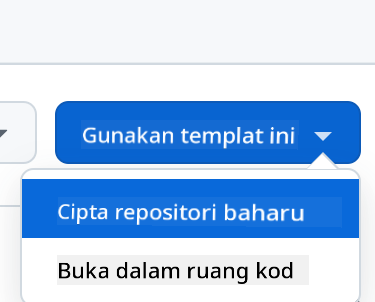
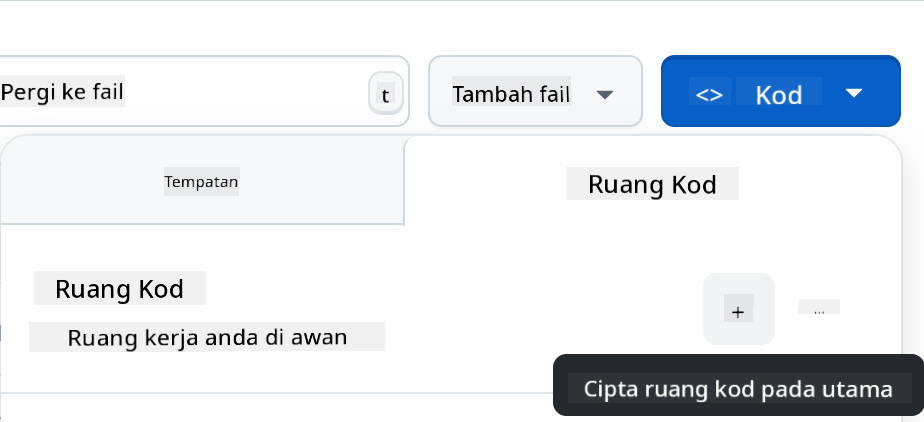

<!--
CO_OP_TRANSLATOR_METADATA:
{
  "original_hash": "11cf36165c243947b6cd85b88cf6faa6",
  "translation_date": "2025-09-01T16:59:16+00:00",
  "source_file": "9-chat-project/README.md",
  "language_code": "ms"
}
-->
# Projek Chat

Projek chat ini menunjukkan cara membina Pembantu Chat menggunakan Model GitHub.

Berikut adalah rupa projek yang telah siap:


Sedikit konteks, membina pembantu chat menggunakan AI generatif adalah cara yang hebat untuk mula belajar tentang AI. Apa yang akan anda pelajari ialah cara mengintegrasikan AI generatif ke dalam aplikasi web sepanjang pelajaran ini, mari kita mulakan.

## Menyambung ke AI Generatif

Untuk bahagian backend, kami menggunakan Model GitHub. Ia adalah perkhidmatan hebat yang membolehkan anda menggunakan AI secara percuma. Pergi ke ruang mainannya dan ambil kod yang sepadan dengan bahasa backend pilihan anda. Berikut adalah rupa ruang mainan di [GitHub Models Playground](https://github.com/marketplace/models/azure-openai/gpt-4o-mini/playground)



Seperti yang dinyatakan, pilih tab "Code" dan runtime pilihan anda.


### Menggunakan Python

Dalam kes ini, kami memilih Python, yang bermaksud kami memilih kod ini:

```python
"""Run this model in Python

> pip install openai
"""
import os
from openai import OpenAI

# To authenticate with the model you will need to generate a personal access token (PAT) in your GitHub settings. 
# Create your PAT token by following instructions here: https://docs.github.com/en/authentication/keeping-your-account-and-data-secure/managing-your-personal-access-tokens
client = OpenAI(
    base_url="https://models.github.ai/inference",
    api_key=os.environ["GITHUB_TOKEN"],
)

response = client.chat.completions.create(
    messages=[
        {
            "role": "system",
            "content": "",
        },
        {
            "role": "user",
            "content": "What is the capital of France?",
        }
    ],
    model="openai/gpt-4o-mini",
    temperature=1,
    max_tokens=4096,
    top_p=1
)

print(response.choices[0].message.content)
```

Mari bersihkan kod ini sedikit supaya ia boleh digunakan semula:

```python
def call_llm(prompt: str, system_message: str):
    response = client.chat.completions.create(
        messages=[
            {
                "role": "system",
                "content": system_message,
            },
            {
                "role": "user",
                "content": prompt,
            }
        ],
        model="openai/gpt-4o-mini",
        temperature=1,
        max_tokens=4096,
        top_p=1
    )

    return response.choices[0].message.content
```

Dengan fungsi `call_llm` ini, kita kini boleh mengambil prompt dan sistem prompt, dan fungsi ini akan mengembalikan hasilnya.

### Sesuaikan Pembantu AI

Jika anda ingin menyesuaikan pembantu AI, anda boleh menentukan bagaimana anda mahu ia berkelakuan dengan mengisi sistem prompt seperti berikut:

```python
call_llm("Tell me about you", "You're Albert Einstein, you only know of things in the time you were alive")
```

## Dedahkan melalui Web API

Hebat, kita telah menyelesaikan bahagian AI, mari kita lihat bagaimana kita boleh mengintegrasikannya ke dalam Web API. Untuk Web API, kami memilih untuk menggunakan Flask, tetapi mana-mana rangka kerja web sepatutnya berfungsi. Mari lihat kodnya:

### Menggunakan Python

```python
# api.py
from flask import Flask, request, jsonify
from llm import call_llm
from flask_cors import CORS

app = Flask(__name__)
CORS(app)   # *   example.com

@app.route("/", methods=["GET"])
def index():
    return "Welcome to this API. Call POST /hello with 'message': 'my message' as JSON payload"


@app.route("/hello", methods=["POST"])
def hello():
    # get message from request body  { "message": "do this taks for me" }
    data = request.get_json()
    message = data.get("message", "")

    response = call_llm(message, "You are a helpful assistant.")
    return jsonify({
        "response": response
    })

if __name__ == "__main__":
    app.run(host="0.0.0.0", port=5000)
```

Di sini, kami mencipta API Flask dan mentakrifkan laluan lalai "/" dan "/chat". Laluan kedua ini bertujuan untuk digunakan oleh frontend kami untuk menghantar soalan kepadanya.

Untuk mengintegrasikan *llm.py*, berikut adalah apa yang perlu kita lakukan:

- Import fungsi `call_llm`:

   ```python
   from llm import call_llm
   from flask import Flask, request
   ```

- Panggil fungsi ini dari laluan "/chat":

   ```python
   @app.route("/hello", methods=["POST"])
   def hello():
      # get message from request body  { "message": "do this taks for me" }
      data = request.get_json()
      message = data.get("message", "")

      response = call_llm(message, "You are a helpful assistant.")
      return jsonify({
         "response": response
      })
   ```

   Di sini, kami menganalisis permintaan yang masuk untuk mendapatkan sifat `message` daripada badan JSON. Selepas itu, kami memanggil LLM dengan panggilan ini:

   ```python
   response = call_llm(message, "You are a helpful assistant")

   # return the response as JSON
   return jsonify({
      "response": response 
   })
   ```

Hebat, sekarang kita telah menyelesaikan apa yang diperlukan.

## Konfigurasi Cors

Kami perlu menyebut bahawa kami menyediakan sesuatu seperti CORS, perkongsian sumber silang asal. Ini bermaksud bahawa kerana backend dan frontend kami akan berjalan pada port yang berbeza, kami perlu membenarkan frontend untuk memanggil backend.

### Menggunakan Python

Terdapat sekeping kod dalam *api.py* yang menyediakan ini:

```python
from flask_cors import CORS

app = Flask(__name__)
CORS(app)   # *   example.com
```

Sekarang ia telah disediakan untuk membenarkan "*" iaitu semua asal, dan ini agak tidak selamat. Kita harus menyekatnya apabila kita pergi ke pengeluaran.

## Jalankan Projek Anda

Untuk menjalankan projek anda, anda perlu memulakan backend terlebih dahulu dan kemudian frontend anda.

### Menggunakan Python

Baiklah, jadi kita ada *llm.py* dan *api.py*, bagaimana kita boleh membuat ini berfungsi dengan backend? Ada dua perkara yang perlu kita lakukan:

- Pasang kebergantungan:

   ```sh
   cd backend
   python -m venv venv
   source ./venv/bin/activate

   pip install openai flask flask-cors openai
   ```

- Mulakan API

   ```sh
   python api.py
   ```

   Jika anda berada dalam Codespaces, anda perlu pergi ke Ports di bahagian bawah editor, klik kanan di atasnya dan klik "Port Visibility" dan pilih "Public".

### Kerja pada Frontend

Sekarang kita mempunyai API yang berjalan, mari kita cipta frontend untuk ini. Frontend minimum yang akan kita tingkatkan secara berperingkat. Dalam folder *frontend*, cipta perkara berikut:

```text
backend/
frontend/
index.html
app.js
styles.css
```

Mari mulakan dengan **index.html**:

```html
<html>
    <head>
        <link rel="stylesheet" href="styles.css">
    </head>
    <body>
      <form>
        <textarea id="messages"></textarea>
        <input id="input" type="text" />
        <button type="submit" id="sendBtn">Send</button>  
      </form>  
      <script src="app.js" />
    </body>
</html>    
```

Di atas adalah minimum mutlak yang anda perlukan untuk menyokong tetingkap chat, kerana ia terdiri daripada textarea di mana mesej akan dipaparkan, input untuk menaip mesej, dan butang untuk menghantar mesej anda ke backend. Mari lihat JavaScript seterusnya dalam *app.js*

**app.js**

```js
// app.js

(function(){
  // 1. set up elements  
  const messages = document.getElementById("messages");
  const form = document.getElementById("form");
  const input = document.getElementById("input");

  const BASE_URL = "change this";
  const API_ENDPOINT = `${BASE_URL}/hello`;

  // 2. create a function that talks to our backend
  async function callApi(text) {
    const response = await fetch(API_ENDPOINT, {
      method: "POST",
      headers: { "Content-Type": "application/json" },
      body: JSON.stringify({ message: text })
    });
    let json = await response.json();
    return json.response;
  }

  // 3. add response to our textarea
  function appendMessage(text, role) {
    const el = document.createElement("div");
    el.className = `message ${role}`;
    el.innerHTML = text;
    messages.appendChild(el);
  }

  // 4. listen to submit events
  form.addEventListener("submit", async(e) => {
    e.preventDefault();
   // someone clicked the button in the form
   
   // get input
   const text = input.value.trim();

   appendMessage(text, "user")

   // reset it
   input.value = '';

   const reply = await callApi(text);

   // add to messages
   appendMessage(reply, "assistant");

  })
})();
```

Mari kita lihat kod ini mengikut bahagian:

- 1) Di sini kita mendapatkan rujukan kepada semua elemen yang akan kita rujuk kemudian dalam kod.
- 2) Dalam bahagian ini, kita mencipta fungsi yang menggunakan kaedah `fetch` terbina dalam untuk memanggil backend kita.
- 3) `appendMessage` membantu menambah respons serta apa yang anda taip sebagai pengguna.
- 4) Di sini kita mendengar acara submit dan akhirnya membaca medan input, meletakkan mesej pengguna dalam textarea, memanggil API, dan memaparkan respons dalam textarea.

Mari lihat gaya seterusnya, di sini anda boleh menjadi kreatif dan membuatnya kelihatan seperti yang anda mahu, tetapi berikut adalah beberapa cadangan:

**styles.css**

```
.message {
    background: #222;
    box-shadow: 0 0 0 10px orange;
    padding: 10px:
    margin: 5px;
}

.message.user {
    background: blue;
}

.message.assistant {
    background: grey;
} 
```

Dengan tiga kelas ini, anda akan menggayakan mesej secara berbeza bergantung pada asalnya, sama ada daripada pembantu atau anda sebagai pengguna. Jika anda ingin mendapatkan inspirasi, lihat folder `solution/frontend/styles.css`.

### Tukar Base Url

Ada satu perkara di sini yang belum kita tetapkan iaitu `BASE_URL`, ini tidak diketahui sehingga backend anda dimulakan. Untuk menetapkannya:

- Jika anda menjalankan API secara tempatan, ia sepatutnya ditetapkan kepada sesuatu seperti `http://localhost:5000`.
- Jika dijalankan dalam Codespaces, ia sepatutnya kelihatan seperti "[name]app.github.dev".

## Tugasan

Cipta folder anda sendiri *project* dengan kandungan seperti berikut:

```text
project/
  frontend/
    index.html
    app.js
    styles.css
  backend/
    ...
```

Salin kandungan daripada apa yang diarahkan di atas tetapi jangan ragu untuk menyesuaikan mengikut kesukaan anda.

## Penyelesaian

[Penyelesaian](./solution/README.md)

## Bonus

Cuba ubah personaliti pembantu AI.

### Untuk Python

Apabila anda memanggil `call_llm` dalam *api.py*, anda boleh menukar argumen kedua kepada apa yang anda mahu, contohnya:

```python
call_llm(message, "You are Captain Picard")
```

### Frontend

Ubah juga CSS dan teks mengikut kesukaan anda, jadi buat perubahan dalam *index.html* dan *styles.css*.

## Ringkasan

Hebat, anda telah belajar dari awal cara mencipta pembantu peribadi menggunakan AI. Kami telah melakukannya menggunakan Model GitHub, backend dalam Python, dan frontend dalam HTML, CSS, dan JavaScript.

## Sediakan dengan Codespaces

- Navigasi ke: [Repo Web Dev For Beginners](https://github.com/microsoft/Web-Dev-For-Beginners)
- Cipta daripada templat (pastikan anda log masuk ke GitHub) di sudut kanan atas:

    

- Setelah berada dalam repo anda, cipta Codespace:

    

    Ini sepatutnya memulakan persekitaran yang kini boleh anda gunakan.

---

**Penafian**:  
Dokumen ini telah diterjemahkan menggunakan perkhidmatan terjemahan AI [Co-op Translator](https://github.com/Azure/co-op-translator). Walaupun kami berusaha untuk memastikan ketepatan, sila ambil perhatian bahawa terjemahan automatik mungkin mengandungi kesilapan atau ketidaktepatan. Dokumen asal dalam bahasa asalnya harus dianggap sebagai sumber yang berwibawa. Untuk maklumat yang kritikal, terjemahan manusia profesional adalah disyorkan. Kami tidak bertanggungjawab atas sebarang salah faham atau salah tafsir yang timbul daripada penggunaan terjemahan ini.