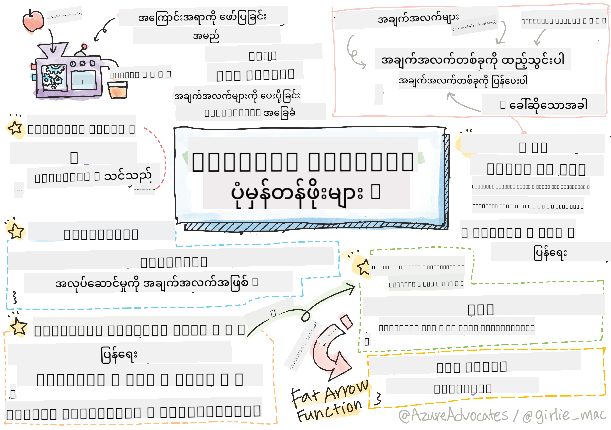

<!--
CO_OP_TRANSLATOR_METADATA:
{
  "original_hash": "92e136090efc4341b1d51c37924c1802",
  "translation_date": "2025-08-28T18:41:24+00:00",
  "source_file": "2-js-basics/2-functions-methods/README.md",
  "language_code": "my"
}
-->
# JavaScript အခြေခံ: Methods နှင့် Functions


> Sketchnote by [Tomomi Imura](https://twitter.com/girlie_mac)

## မိန့်ခွန်းမပြောမီ Quiz
[Pre-lecture quiz](https://ff-quizzes.netlify.app)

Code ရေးသားတဲ့အခါမှာ အမြဲတမ်း code ကိုဖတ်ရလွယ်အောင်လုပ်ဖို့လိုအပ်ပါတယ်။ ဒါဟာ အနည်းငယ်ဆန့်ကျင်ဖွယ်ရှိပေမယ့် code ကိုရေးသားတာထက် ဖတ်တာပိုများပါတယ်။ Developer တွေရဲ့ toolbox မှာ code ကို maintain လုပ်ဖို့အတွက် အရေးကြီးတဲ့ tool တစ်ခုက **function** ဖြစ်ပါတယ်။

[](https://youtube.com/watch?v=XgKsD6Zwvlc "Methods and Functions")

> 🎥 အထက်ပါပုံကို click လုပ်ပြီး methods နှင့် functions အကြောင်း video ကြည့်ပါ။

> Microsoft Learn မှာ ဒီသင်ခန်းစာကို [ယူနိုင်ပါတယ်](https://docs.microsoft.com/learn/modules/web-development-101-functions/?WT.mc_id=academic-77807-sagibbon)!

## Functions

Function ဆိုတာ အခြေခံအားဖြင့် လိုအပ်တဲ့အခါမှာ run လုပ်နိုင်တဲ့ code block တစ်ခုဖြစ်ပါတယ်။ ဒီဟာက တစ်ခါထက်မက အလုပ်တစ်ခုကိုလုပ်ဖို့လိုအပ်တဲ့အခါ အထူးသင့်တော်ပါတယ်။ Logic ကိုနေရာတစ်ခုထက်မကမှာ ထပ်တူရေးသားမယ်ဆိုရင် (နောက်ပိုင်းမှာ update လုပ်ဖို့ခက်ခဲနိုင်ပါတယ်) function ကိုတစ်နေရာမှာ centralized လုပ်ပြီး လိုအပ်တဲ့အခါမှာ call လုပ်နိုင်ပါတယ်။ Function တွေကို function အခြား function တွေထဲကနေပါ call လုပ်နိုင်ပါတယ်။

Function ကိုနာမည်ပေးနိုင်ခြင်းလည်း အရေးကြီးပါတယ်။ ဒါဟာ အနည်းငယ်အရေးမကြီးသလိုထင်ရပေမယ့် နာမည်က code ရဲ့အပိုင်းတစ်ခုကို documentation လုပ်ဖို့အတွက် အလွယ်တကူနည်းလမ်းပေးပါတယ်။ Button ရဲ့ label တစ်ခုလိုပဲ။ "Cancel timer" ဆိုတဲ့ button ကို click လုပ်ရင် timer ကိုရပ်မယ်ဆိုတာသိနိုင်ပါတယ်။

## Function တစ်ခုကိုဖန်တီးခြင်းနှင့် call လုပ်ခြင်း

Function ရဲ့ syntax က အောက်ပါအတိုင်းဖြစ်ပါတယ်-

```javascript
function nameOfFunction() { // function definition
 // function definition/body
}
```

Greeting ပြသဖို့ function တစ်ခုဖန်တီးချင်တယ်ဆိုရင် အောက်ပါအတိုင်းဖြစ်နိုင်ပါတယ်-

```javascript
function displayGreeting() {
  console.log('Hello, world!');
}
```

Function ကို call (invoke) လုပ်ချင်တဲ့အခါ function ရဲ့နာမည်နောက်မှာ `()` သုံးပါ။ Function ကို define လုပ်တာက call လုပ်တာမတိုင်မီလည်းဖြစ်နိုင်ပါတယ်၊ call လုပ်ပြီးနောက်မှာလည်းဖြစ်နိုင်ပါတယ်။ JavaScript compiler က function ကိုရှာပေးပါလိမ့်မယ်။

```javascript
// calling our function
displayGreeting();
```

> **NOTE:** Function ရဲ့အထူးအမျိုးအစားတစ်ခုကို **method** လို့ခေါ်ပါတယ်၊ ဒါကိုသင်ပြီးသားသုံးနေပါတယ်! ဥပမာအားဖြင့် `console.log` ကိုသုံးတဲ့အခါမှာ method ကိုသုံးနေပါတယ်။ Method က object (`console` က ဥပမာ) တစ်ခုနဲ့ပတ်သက်ပြီးရှိပါတယ်၊ function ကတော့ independent ဖြစ်ပါတယ်။ Developer အများစုက method နဲ့ function ဆိုတာကို အတူတူသုံးတတ်ပါတယ်။

### Function ရေးသားရာမှာအကောင်းဆုံးနည်းလမ်းများ

Function ဖန်တီးတဲ့အခါမှာ အောက်ပါအချက်များကိုသတိထားပါ-

- အမြဲတမ်း နာမည်ကိုရှင်းလင်းပြီး function ရဲ့လုပ်ဆောင်မှုကိုသိနိုင်အောင်ရေးပါ
- **camelCasing** ကိုအသုံးပြုပြီး စကားလုံးများကိုပေါင်းစည်းပါ
- Function ကို အထူးလုပ်ဆောင်မှုတစ်ခုအပေါ်အာရုံစိုက်အောင်ထားပါ

## Function ကိုသို့မဟုတ် parameter ထည့်ခြင်း

Function ကိုပိုပြီးအသုံးဝင်အောင်လုပ်ဖို့ parameter ထည့်သွင်းတတ်ရပါမယ်။ ဥပမာအားဖြင့် `displayGreeting` function က **Hello, world!** ကိုသာပြသနိုင်ပါတယ်။ Function ကိုပိုပြီး flexible ဖြစ်အောင်လုပ်ချင်ရင် parameter (sometimes called **argument**) ထည့်သွင်းနိုင်ပါတယ်။

Parameter တွေကို parenthesis အတွင်းမှာ comma ဖြင့်ခွဲပြီးရေးပါ-

```javascript
function name(param, param2, param3) {

}
```

`displayGreeting` ကို update လုပ်ပြီး name ကိုပြသနိုင်အောင်လုပ်ပါ။

```javascript
function displayGreeting(name) {
  const message = `Hello, ${name}!`;
  console.log(message);
}
```

Function ကို call လုပ်ပြီး parameter ထည့်ချင်ရင် parenthesis အတွင်းမှာရေးပါ။

```javascript
displayGreeting('Christopher');
// displays "Hello, Christopher!" when run
```

## Default values

Function ကိုပိုပြီး flexible ဖြစ်အောင် parameter တွေထပ်ထည့်နိုင်ပါတယ်။ ဒါပေမယ့် parameter တစ်ခုစီကိုမဖြည့်ရမယ်ဆိုရင် default value ကိုပေးနိုင်ပါတယ်။ ဥပမာအားဖြင့် name ကိုလိုအပ်တဲ့ parameter အဖြစ်ထားပြီး salutation ကို optional default value ပေးနိုင်ပါတယ်။

```javascript
function displayGreeting(name, salutation='Hello') {
  console.log(`${salutation}, ${name}`);
}
```

Function ကို call လုပ်တဲ့အခါ salutation ကိုပေးမလားမပေးမလားဆုံးဖြတ်နိုင်ပါတယ်။

```javascript
displayGreeting('Christopher');
// displays "Hello, Christopher"

displayGreeting('Christopher', 'Hi');
// displays "Hi, Christopher"
```

## Return values

Function တွေဟာ console output ပေးနိုင်ပါတယ်။ ဒါဟာတစ်ခါတစ်ရံမှာလိုအပ်တဲ့အရာဖြစ်နိုင်ပါတယ်။ ဒါပေမယ့် calculation လုပ်ပြီး value ကိုပြန်ပေးချင်ရင် return value ကိုအသုံးပြုနိုင်ပါတယ်။

Function တစ်ခု return value ပေးမယ်ဆိုရင် `return` keyword ကိုအသုံးပြုပါ။ `return` keyword က value သို့မဟုတ် reference ကိုပြန်ပေးပါမယ်။

```javascript
return myVariable;
```  

Greeting message တစ်ခုဖန်တီးပြီး value ကိုပြန်ပေးတဲ့ function ကိုဖန်တီးနိုင်ပါတယ်-

```javascript
function createGreetingMessage(name) {
  const message = `Hello, ${name}`;
  return message;
}
```

Function ကို call လုပ်တဲ့အခါ value ကို variable ထဲမှာသိမ်းနိုင်ပါတယ်။

```javascript
const greetingMessage = createGreetingMessage('Christopher');
```

## Functions as parameters for functions

Programming အတတ်ပညာမှာ function တွေကို parameter အဖြစ်အသုံးပြုနိုင်ပါတယ်။ ဥပမာအားဖြင့် [setTimeout](https://developer.mozilla.org/docs/Web/API/WindowOrWorkerGlobalScope/setTimeout) က timer ကိုစပြီး timer ပြီးတဲ့အခါ code ကို run လုပ်ပါမယ်။

Code ကို run လုပ်ပါက ၃ စက္ကန့်အကြာမှာ **3 seconds has elapsed** ဆိုတဲ့ message ကိုတွေ့ပါမယ်။

```javascript
function displayDone() {
  console.log('3 seconds has elapsed');
}
// timer value is in milliseconds
setTimeout(displayDone, 3000);
```

### Anonymous functions

Function တစ်ခုကိုနာမည်ပေးပြီး တစ်ခါသာအသုံးပြုမယ်ဆိုရင် anonymous function ကိုအသုံးပြုနိုင်ပါတယ်။

```javascript
setTimeout(function() {
  console.log('3 seconds has elapsed');
}, 3000);
```

### Fat arrow functions

Fat arrow function သည် `=>` ကိုအသုံးပြုပြီး function ကိုရေးသားနိုင်ပါတယ်။

```javascript
setTimeout(() => {
  console.log('3 seconds has elapsed');
}, 3000);
```

### Strategy အသုံးပြုရန်အချိန်

Function ကိုတစ်ခါထက်မကအသုံးပြုမယ်ဆိုရင် နာမည်ပေးပြီးဖန်တီးပါ။ တစ်ခါသာအသုံးပြုမယ်ဆိုရင် anonymous function ကိုသုံးပါ။ Fat arrow function သို့မဟုတ် traditional syntax ကိုသုံးမယ်ဆိုတာ developer ရဲ့ရွေးချယ်မှုဖြစ်ပါတယ်။

---

## 🚀 စိန်ခေါ်မှု

Function နဲ့ method ရဲ့ကွာခြားချက်ကို တစ်ကြောင်းစာနဲ့ရှင်းပြနိုင်ပါသလား?

## မိန့်ခွန်းပြီး Quiz
[Post-lecture quiz](https://ff-quizzes.netlify.app)

## ပြန်လည်သုံးသပ်ခြင်းနှင့် ကိုယ်တိုင်လေ့လာခြင်း

[Arrow functions](https://developer.mozilla.org/docs/Web/JavaScript/Reference/Functions/Arrow_functions) အကြောင်းပိုမိုလေ့လာပါ။ Function တစ်ခုရေးပြီး arrow syntax နဲ့ပြန်ရေးပါ။

## အိမ်စာ

[Fun with Functions](assignment.md)

---

**အကြောင်းကြားချက်**:  
ဤစာရွက်စာတမ်းကို AI ဘာသာပြန်ဝန်ဆောင်မှု [Co-op Translator](https://github.com/Azure/co-op-translator) ကို အသုံးပြု၍ ဘာသာပြန်ထားပါသည်။ ကျွန်ုပ်တို့သည် တိကျမှုအတွက် ကြိုးစားနေသော်လည်း၊ အလိုအလျောက် ဘာသာပြန်မှုများတွင် အမှားများ သို့မဟုတ် မတိကျမှုများ ပါဝင်နိုင်သည်ကို သတိပြုပါ။ မူရင်းစာရွက်စာတမ်းကို ၎င်း၏ မူရင်းဘာသာစကားဖြင့် အာဏာတရားရှိသော အရင်းအမြစ်အဖြစ် သတ်မှတ်သင့်ပါသည်။ အရေးကြီးသော အချက်အလက်များအတွက် လူက ဘာသာပြန်မှုကို အသုံးပြုရန် အကြံပြုပါသည်။ ဤဘာသာပြန်မှုကို အသုံးပြုခြင်းမှ ဖြစ်ပေါ်လာသော အလွဲအလွတ်များ သို့မဟုတ် အနားယူမှုများအတွက် ကျွန်ုပ်တို့သည် တာဝန်မယူပါ။