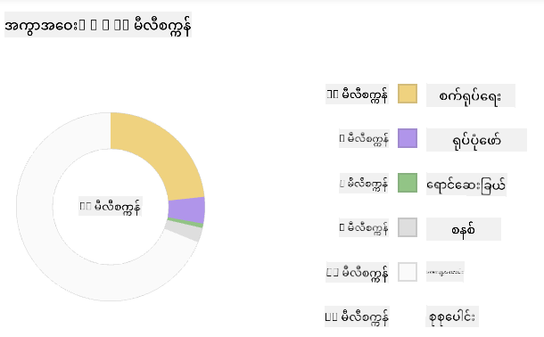

<!--
CO_OP_TRANSLATOR_METADATA:
{
  "original_hash": "49b58721a71cfda824e2f3e1f46908c6",
  "translation_date": "2025-08-28T18:35:41+00:00",
  "source_file": "5-browser-extension/3-background-tasks-and-performance/README.md",
  "language_code": "my"
}
-->
# Browser Extension Project Part 3: Background Tasks နှင့် Performance ကိုလေ့လာပါ

## မိန့်ခွန်းမတင်မီ စစ်ဆေးမှု

[မိန့်ခွန်းမတင်မီ စစ်ဆေးမှု](https://ff-quizzes.netlify.app/web/quiz/27)

### နိဒါန်း

ဒီ module ရဲ့ နောက်ဆုံးအတန်းနှစ်ခုမှာ API ကနေ data ကို ရယူပြီး ဖောင်နှင့် ပြသမှုဧရိယာကို ဘယ်လိုတည်ဆောက်ရမယ်ဆိုတာကို သင်လေ့လာခဲ့ပါတယ်။ ဒါဟာ web ပေါ်မှာ web presence တစ်ခုကို ဖန်တီးတဲ့ အခြေခံနည်းလမ်းတစ်ခုဖြစ်ပါတယ်။ သင် asynchronous data fetching ကို handle ဘယ်လိုလုပ်ရမယ်ဆိုတာတောင်လေ့လာခဲ့ပါတယ်။ သင့် browser extension ဟာ အနည်းငယ်ပဲ ကျန်တော့ပြီး ပြီးစီးတော့မယ်ဖြစ်ပါတယ်။

အခုတော့ background tasks တချို့ကို စီမံခန့်ခွဲဖို့လိုအပ်ပါတယ်၊ အထူးသဖြင့် extension ရဲ့ icon အရောင်ကို refresh လုပ်တာပါ။ ဒါကြောင့် browser က ဒီလို tasks တွေကို ဘယ်လိုစီမံတယ်ဆိုတာကို ပြောဖို့ အချိန်ကောင်းတစ်ခုဖြစ်ပါတယ်။ သင့်ရဲ့ web assets တွေကို တည်ဆောက်နေစဉ်မှာ ဒီ browser tasks တွေကို performance ရဲ့ အရပ်ကနေ စဉ်းစားကြည့်ရအောင်။

## Web Performance အခြေခံ

> "Website performance ဆိုတာ နှစ်ခုပါပဲ - စာမျက်နှာဘယ်လောက်မြန်မြန် load တယ်၊ နဲ့ အဲ့ဒီမှာရှိတဲ့ code ဘယ်လောက်မြန်မြန် run တယ်။" -- [Zack Grossbart](https://www.smashingmagazine.com/2012/06/javascript-profiling-chrome-developer-tools/)

Website တွေကို အမျိုးမျိုးသော device တွေ၊ user တွေ၊ နဲ့ အခြေအနေတွေမှာ အလွန်မြန်ဆန်အောင်လုပ်ပေးဖို့နည်းလမ်းတွေဟာ အလွန်ကျယ်ပြန့်ပါတယ်။ သင် browser extension တစ်ခုဖြစ်စေ၊ standard web project တစ်ခုဖြစ်စေ တည်ဆောက်နေစဉ်မှာ သတိထားရမယ့်အချက်တချို့ကို ဒီမှာဖော်ပြထားပါတယ်။

သင့် site ကို ထိရောက်စွာ run နိုင်အောင်လုပ်ဖို့ ပထမဆုံး လိုအပ်တာက performance data ကို စုဆောင်းဖို့ပါ။ ဒီအချက်ကို သင့် web browser ရဲ့ developer tools မှာ စတင်စစ်ဆေးနိုင်ပါတယ်။ Edge browser မှာ "Settings and more" button (browser ရဲ့ အပေါ်ယံညာဘက်ထောင့်မှာရှိတဲ့ သုံးစင်း icon) ကိုရွေးပြီး More Tools > Developer Tools ကိုသွားပြီး Performance tab ကိုဖွင့်ပါ။ Windows မှာ `Ctrl` + `Shift` + `I` သို့မဟုတ် Mac မှာ `Option` + `Command` + `I` ကို အသုံးပြုပြီး developer tools ကိုဖွင့်နိုင်ပါတယ်။

Performance tab မှာ Profiling tool တစ်ခုပါဝင်ပါတယ်။ Website တစ်ခုကိုဖွင့်ပါ (ဥပမာ [https://www.microsoft.com](https://www.microsoft.com/?WT.mc_id=academic-77807-sagibbon))၊ 'Record' button ကိုနှိပ်ပြီး site ကို refresh လုပ်ပါ။ အချိန်မရွေး recording ကိုရပ်လိုက်ပါ၊ သင် 'script', 'render', နဲ့ 'paint' လုပ်တဲ့ routines တွေကိုကြည့်နိုင်ပါလိမ့်မယ်။


✅ [Microsoft Documentation](https://docs.microsoft.com/microsoft-edge/devtools-guide/performance/?WT.mc_id=academic-77807-sagibbon) မှာ Edge ရဲ့ Performance panel ကိုလေ့လာပါ။

> အကြံပြုချက် - သင့် website ရဲ့ startup time ကို တိကျစွာဖော်ပြဖို့ browser ရဲ့ cache ကို ရှင်းလင်းပါ။

Profile timeline ရဲ့ အစိတ်အပိုင်းတွေကိုရွေးပြီး သင့်စာမျက်နှာ load လုပ်နေစဉ်ဖြစ်ပျက်တဲ့ အဖြစ်အပျက်တွေကို zoom in လုပ်ကြည့်ပါ။

Profile timeline ရဲ့ အစိတ်အပိုင်းတစ်ခုကိုရွေးပြီး summary pane မှာ သင့်စာမျက်နှာ performance ရဲ့ snapshot ကိုကြည့်ပါ။



Event Log pane ကိုစစ်ဆေးပြီး 15 ms ထက်ပိုကြာတဲ့ event တစ်ခုခုရှိမရှိကြည့်ပါ။


✅ သင့် profiler ကိုနားလည်ပါ! ဒီ site ရဲ့ developer tools ကိုဖွင့်ပြီး bottlenecks ရှိမရှိကြည့်ပါ။ ဘယ် asset က အမြန်ဆုံး load လုပ်သလဲ? ဘယ် asset က အနှေးဆုံးလဲ?

## Profiling စစ်ဆေးမှုများ

ယေဘူယျအားဖြင့် site တစ်ခုကို production မှာ deploy လုပ်ဖို့အချိန်ရောက်တဲ့အခါ အဆိုးရွားဆုံးအံ့ဩစရာတွေကိုရှောင်ရှားဖို့အတွက် web developer တစ်ဦးအနေနဲ့ သတိထားရမယ့် "ပြဿနာဧရိယာ" တချို့ရှိပါတယ်။

**Asset sizes**: Web ဟာ မကြာသေးခင်ကတည်းက 'ပိုလေး'လာပြီး အနှေးလာပါတယ်။ ဒီအလေးတစ်ခုမှာ images တွေကို အသုံးပြုမှုနဲ့ဆက်စပ်ပါတယ်။

✅ [Internet Archive](https://httparchive.org/reports/page-weight) ကိုကြည့်ပြီး page weight ရဲ့ သမိုင်းကြောင်းနဲ့ပိုမိုသိရှိပါ။

သင့် images တွေကို optimize လုပ်ပြီး သင့် user တွေအတွက် size နဲ့ resolution မှန်ကန်တဲ့အတိုင်းပေးပို့တာက လုပ်ဆောင်သင့်တဲ့အရာတစ်ခုဖြစ်ပါတယ်။

**DOM traversals**: Browser ဟာ သင့်ရေးထားတဲ့ code အပေါ်မူတည်ပြီး Document Object Model ကို တည်ဆောက်ရပါတယ်။ ဒါကြောင့် သင့်စာမျက်နှာ performance ကိုကောင်းမွန်အောင်လုပ်ဖို့ tags တွေကို အနည်းဆုံးထားပြီး စာမျက်နှာအတွက်လိုအပ်တာပဲ အသုံးပြုနဲ့ style လုပ်ပါ။ ဥပမာအားဖြင့် တစ်ခုတည်းသောစာမျက်နှာမှာသာအသုံးပြုမယ့် styles တွေကို main style sheet မှာထည့်စရာမလိုပါဘူး။

**JavaScript**: JavaScript developer တစ်ဦးအနေနဲ့ 'render-blocking' scripts တွေကို သတိထားရပါမယ်။ အဲ့ဒီ scripts တွေဟာ DOM ကို traverse နဲ့ paint လုပ်ဖို့မတိုင်ခင် load လုပ်ဖို့လိုအပ်ပါတယ်။ `defer` ကို inline scripts တွေမှာအသုံးပြုဖို့စဉ်းစားပါ (Terrarium module မှာလုပ်သလို)။

✅ [Site Speed Test website](https://www.webpagetest.org/) မှာ site performance ကိုစစ်ဆေးတဲ့အခါ သာမန်စစ်ဆေးမှုတွေကိုလေ့လာပါ။

Browser က သင့်ပေးပို့တဲ့ assets တွေကို ဘယ်လို render လုပ်တယ်ဆိုတာကို နားလည်ပြီးပြီဆိုရင် သင့် extension ကိုပြီးစီးဖို့လိုအပ်တဲ့ အနောက်ဆုံးအချက်အချို့ကိုကြည့်ရအောင်:

### အရောင်တွက်ချက်ဖို့ function တစ်ခုဖန်တီးပါ

`/src/index.js` မှာ `calculateColor()` လို့ခေါ်တဲ့ function တစ်ခုကို DOM ကို access လုပ်ဖို့ သတ်မှတ်ထားတဲ့ `const` variables တွေရဲ့နောက်မှာထည့်ပါ။

```JavaScript
function calculateColor(value) {
	let co2Scale = [0, 150, 600, 750, 800];
	let colors = ['#2AA364', '#F5EB4D', '#9E4229', '#381D02', '#381D02'];

	let closestNum = co2Scale.sort((a, b) => {
		return Math.abs(a - value) - Math.abs(b - value);
	})[0];
	console.log(value + ' is closest to ' + closestNum);
	let num = (element) => element > closestNum;
	let scaleIndex = co2Scale.findIndex(num);

	let closestColor = colors[scaleIndex];
	console.log(scaleIndex, closestColor);

	chrome.runtime.sendMessage({ action: 'updateIcon', value: { color: closestColor } });
}
```

ဒီမှာဘာဖြစ်နေလဲ? သင် API call ကနေရရှိတဲ့ carbon intensity value ကို pass လုပ်ပြီး colors array မှာရှိတဲ့ index နဲ့ ဘယ်လောက်နီးလဲဆိုတာတွက်ချက်ပါတယ်။ ပြီးရင် အဲ့ဒီနီးဆုံး color value ကို chrome runtime ကိုပို့ပါတယ်။

Chrome.runtime မှာ background tasks အမျိုးမျိုးကို handle လုပ်တဲ့ [API](https://developer.chrome.com/extensions/runtime) ရှိပါတယ်၊ သင့် extension က အဲ့ဒီ API ကိုအသုံးပြုနေပါတယ်။

> "Chrome.runtime API ကို background page ကို retrieve လုပ်ဖို့၊ manifest အကြောင်းအရာတွေကိုပြန်ပေးဖို့၊ နဲ့ app သို့မဟုတ် extension lifecycle မှာဖြစ်ပျက်တဲ့ events တွေကိုနားထောင်ပြီး တုံ့ပြန်ဖို့အသုံးပြုပါ။ ဒီ API ကို relative path URLs တွေကို fully-qualified URLs တွေပြောင်းဖို့လည်းအသုံးပြုနိုင်ပါတယ်။"

✅ သင် Edge အတွက် browser extension တစ်ခုကို develop လုပ်နေတယ်ဆိုရင် chrome API ကိုအသုံးပြုနေတာအံ့ဩစရာဖြစ်နိုင်ပါတယ်။ Edge ရဲ့ နောက်ဆုံး browser versions တွေဟာ Chromium browser engine ပေါ်မှာ run လုပ်တာကြောင့် ဒီ tools တွေကိုအသုံးပြုနိုင်ပါတယ်။

> မှတ်ချက် - browser extension တစ်ခုကို profile လုပ်ချင်တယ်ဆိုရင် extension ကိုယ်တိုင်ရဲ့ dev tools မှာဖွင့်ပြီးစစ်ဆေးပါ၊ အဲ့ဒါဟာ သီးခြား browser instance တစ်ခုဖြစ်ပါတယ်။

### Default icon color ကိုသတ်မှတ်ပါ

အခုတော့ `init()` function မှာ chrome ရဲ့ `updateIcon` action ကိုခေါ်ပြီး generic green အဖြစ် icon ကိုစတင်သတ်မှတ်ပါ။

```JavaScript
chrome.runtime.sendMessage({
	action: 'updateIcon',
		value: {
			color: 'green',
		},
});
```

### Function ကိုခေါ်ပြီး call ကို execute လုပ်ပါ

နောက်ဆုံးမှာ သင်ဖန်တီးထားတဲ့ function ကို C02Signal API က promise ပြန်ပေးတဲ့နေရာမှာထည့်ပါ။

```JavaScript
//let CO2...
calculateColor(CO2);
```

နောက်ဆုံးမှာ `/dist/background.js` မှာ background action calls တွေကိုနားထောင်ဖို့ listener တစ်ခုထည့်ပါ။

```JavaScript
chrome.runtime.onMessage.addListener(function (msg, sender, sendResponse) {
	if (msg.action === 'updateIcon') {
		chrome.browserAction.setIcon({ imageData: drawIcon(msg.value) });
	}
});
//borrowed from energy lollipop extension, nice feature!
function drawIcon(value) {
	let canvas = document.createElement('canvas');
	let context = canvas.getContext('2d');

	context.beginPath();
	context.fillStyle = value.color;
	context.arc(100, 100, 50, 0, 2 * Math.PI);
	context.fill();

	return context.getImageData(50, 50, 100, 100);
}
```

ဒီ code မှာ backend task manager ကိုလာတဲ့ messages တွေအားလုံးအတွက် listener တစ်ခုထည့်ထားပါတယ်။ 'updateIcon' လို့ခေါ်ရင်တော့ Canvas API ကိုအသုံးပြုပြီး သင့်ရဲ့ icon ကိုမှန်ကန်တဲ့အရောင်နဲ့ဆွဲဆောင်ဖို့ code ကို run လုပ်ပါတယ်။

✅ [Space Game lessons](../../6-space-game/2-drawing-to-canvas/README.md) မှာ Canvas API အကြောင်းပိုမိုလေ့လာနိုင်ပါမယ်။

အခုတော့ သင့် extension ကိုပြန်တည်ဆောက်ပါ (`npm run build`), refresh လုပ်ပြီး extension ကိုဖွင့်ပါ၊ အရောင်ပြောင်းတာကိုကြည့်ပါ။ အခုတော့ errands သွားလုပ်ဖို့ သို့မဟုတ် ပန်းကန်ဆေးဖို့အချိန်ကောင်းလား? အခုတော့သိပြီနော်!

သင်အသုံးဝင်တဲ့ browser extension တစ်ခုကိုတည်ဆောက်ပြီး browser ဘယ်လိုအလုပ်လုပ်တယ်ဆိုတာနဲ့ performance ကိုဘယ်လို profile လုပ်ရမယ်ဆိုတာကိုလေ့လာပြီးပါပြီ။

---

## 🚀 စိန်ခေါ်မှု

အရင်ကတည်ရှိခဲ့တဲ့ open source websites တချို့ကိုစူးစမ်းပြီး၊ GitHub history အပေါ်မူတည်ပြီး performance အတွက် ဘယ်လို optimize လုပ်ခဲ့တယ်ဆိုတာရှာဖွေကြည့်ပါ။ အများဆုံး pain point ကဘာလဲ?

## မိန့်ခွန်းပြီးနောက် စစ်ဆေးမှု

[မိန့်ခွန်းပြီးနောက် စစ်ဆေးမှု](https://ff-quizzes.netlify.app/web/quiz/28)

## ပြန်လည်သုံးသပ်ခြင်းနှင့် ကိုယ်တိုင်လေ့လာခြင်း

[performance newsletter](https://perf.email/) တစ်ခုအတွက် စာရင်းသွင်းစဉ်းစားပါ။

Browser တွေက web performance ကိုဘယ်လိုတိုင်းတာတယ်ဆိုတာကို သူတို့ရဲ့ web tools ရဲ့ performance tabs တွေကိုကြည့်ပြီးစူးစမ်းပါ။ အဓိကကွာခြားချက်တစ်ခုခုတွေတွေ့ရလား?

## အိမ်စာ

[Site performance ကိုခွဲခြမ်းစိတ်ဖြာပါ](assignment.md)

---

**အကြောင်းကြားချက်**:  
ဤစာရွက်စာတမ်းကို AI ဘာသာပြန်ဝန်ဆောင်မှု [Co-op Translator](https://github.com/Azure/co-op-translator) ကို အသုံးပြု၍ ဘာသာပြန်ထားပါသည်။ ကျွန်ုပ်တို့သည် တိကျမှုအတွက် ကြိုးစားနေသော်လည်း၊ အလိုအလျောက် ဘာသာပြန်မှုများတွင် အမှားများ သို့မဟုတ် မမှန်ကန်မှုများ ပါဝင်နိုင်သည်ကို သတိပြုပါ။ မူရင်းစာရွက်စာတမ်းကို ၎င်း၏ မူလဘာသာစကားဖြင့် အာဏာတရားရှိသော အရင်းအမြစ်အဖြစ် သတ်မှတ်သင့်ပါသည်။ အရေးကြီးသော အချက်အလက်များအတွက် လူက ဘာသာပြန်မှု ဝန်ဆောင်မှုကို အသုံးပြုရန် အကြံပြုပါသည်။ ဤဘာသာပြန်မှုကို အသုံးပြုခြင်းမှ ဖြစ်ပေါ်လာသော အလွဲအလွတ်များ သို့မဟုတ် အနားလွဲမှုများအတွက် ကျွန်ုပ်တို့သည် တာဝန်မယူပါ။