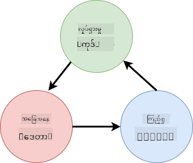
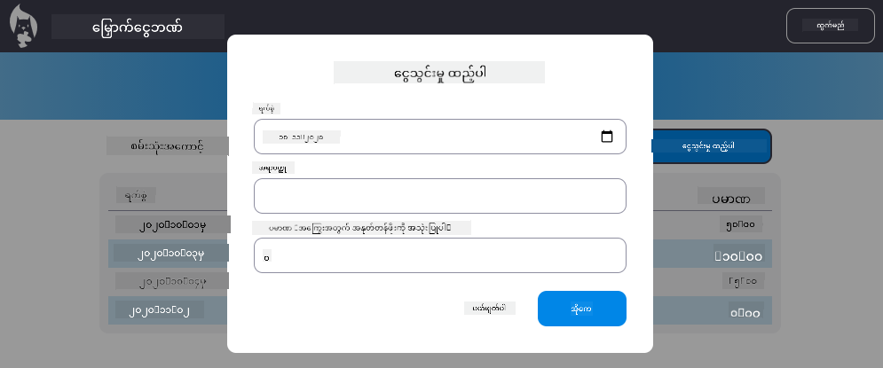

<!--
CO_OP_TRANSLATOR_METADATA:
{
  "original_hash": "5d2efabbc8f94d89f4317ee8646c3ce9",
  "translation_date": "2025-08-28T18:32:22+00:00",
  "source_file": "7-bank-project/4-state-management/README.md",
  "language_code": "my"
}
-->
# ဘဏ်လုပ်ငန်းအက်ပ် တည်ဆောက်ခြင်း အပိုင်း ၄: အခြေအနေ စီမံခန့်ခွဲမှု၏ အယူအဆများ

## မိန့်ခွန်းမတိုင်မီ မေးခွန်းများ

[မိန့်ခွန်းမတိုင်မီ မေးခွန်းများ](https://ff-quizzes.netlify.app/web/quiz/47)

### အကျဉ်းချုပ်

ဝက်ဘ်အက်ပ်တစ်ခု ကြီးထွားလာသည့်အခါ၊ ဒေတာများကို စီမံခန့်ခွဲရန် အခက်အခဲများ ဖြစ်လာနိုင်သည်။ ဘယ်ကုဒ်က ဒေတာကို ရယူသလဲ၊ ဘယ်စာမျက်နှာက ဒေတာကို သုံးစွဲသလဲ၊ ဘယ်နေရာမှာ၊ ဘယ်အချိန်မှာ ဒေတာကို ပြန်လည် အပ်ဒိတ်လုပ်ရမလဲ... အလွယ်တကူ စီမံခန့်ခွဲရန် ခက်ခဲသော ကုဒ်များဖြစ်လာနိုင်သည်။ အထူးသဖြင့် သင့်အက်ပ်၏ စာမျက်နှာများအကြား ဒေတာများကို မျှဝေရန် လိုအပ်သောအခါ၊ ဥပမာအားဖြင့် အသုံးပြုသူ၏ ဒေတာကို မျှဝေလိုသောအခါ၊ *state management* (အခြေအနေ စီမံခန့်ခွဲမှု) ဆိုသည့် အယူအဆသည် အစဉ်အမြဲ ရှိနေခဲ့ပြီး၊ ဝက်ဘ်အက်ပ်များ ကြီးထွားလာသည့်အခါ၊ အရေးပါသော အချက်တစ်ခုအဖြစ် ဖွံ့ဖြိုးတိုးတက်မှုအတွင်းတွင် စဉ်းစားရန် လိုအပ်လာသည်။

ဒီအပိုင်းနောက်ဆုံးတွင်၊ သင့်အက်ပ်ကို ပြန်လည်စဉ်းစားပြီး state ကို စီမံခန့်ခွဲပုံကို ပြောင်းလဲကြည့်မည်ဖြစ်ပြီး၊ ဘရောက်ဆာကို မည်သည့်အချိန်တွင်မဆို refresh လုပ်နိုင်ရန်နှင့် အသုံးပြုသူ session များအကြား ဒေတာကို ထိန်းသိမ်းထားနိုင်ရန် အထောက်အပံ့ပေးမည်ဖြစ်သည်။

### ကြိုတင်လိုအပ်ချက်

ဒီသင်ခန်းစာအတွက် [data fetching](../3-data/README.md) အပိုင်းကို ပြီးစီးထားရန် လိုအပ်သည်။ [Node.js](https://nodejs.org) ကို install လုပ်ပြီး [server API](../api/README.md) ကို locally run လုပ်ရန် လိုအပ်သည်။ သင့်အကောင့်ဒေတာကို စီမံခန့်ခွဲနိုင်ရန် server ကို run လုပ်ထားသည်ကို terminal မှာ အောက်ပါ command ကို အသုံးပြု၍ စမ်းသပ်နိုင်သည်။

```sh
curl http://localhost:5000/api
# -> should return "Bank API v1.0.0" as a result
```

---

## အခြေအနေ စီမံခန့်ခွဲမှုကို ပြန်လည်စဉ်းစားခြင်း

[ယခင်သင်ခန်းစာ](../3-data/README.md) တွင်၊ global `account` variable ကို အသုံးပြု၍ လက်ရှိ login လုပ်ထားသော အသုံးပြုသူ၏ ဘဏ်ဒေတာကို ထည့်သွင်းထားသော state အခြေခံအယူအဆကို မိတ်ဆက်ခဲ့သည်။ သို့သော်လည်း၊ လက်ရှိ implementation တွင် အချို့သော အားနည်းချက်များ ရှိနေသည်။ Dashboard တွင် refresh လုပ်ကြည့်ပါ။ ဘာဖြစ်သလဲ?

လက်ရှိကုဒ်တွင် အခက်အခဲ ၃ ခု ရှိသည်-

- state ကို ထိန်းသိမ်းထားခြင်းမရှိသဖြင့် browser refresh လုပ်လိုက်သည်နှင့် login စာမျက်နှာသို့ ပြန်သွားသည်။
- state ကို ပြောင်းလဲသည့် function များစွာ ရှိသည်။ အက်ပ်ကြီးလာသည်နှင့် အပြောင်းအလဲများကို စဉ်းစားရန် ခက်ခဲလာပြီး function တစ်ခုကို အပ်ဒိတ်လုပ်ရန် မေ့နိုင်သည်။
- state ကို သန့်ရှင်းမလုပ်သဖြင့် *Logout* ကို နှိပ်လိုက်သည်နှင့် login စာမျက်နှာတွင် ရောက်နေသော်လည်း account data သေးသေးလေး ရှိနေသည်။

ဒီအခက်အခဲများကို တစ်ခုချင်းစီ ဖြေရှင်းရန် ကုဒ်ကို update လုပ်နိုင်သော်လည်း၊ ကုဒ်များ ထပ်တူထပ်မျှဖြစ်လာပြီး အက်ပ်ကို စီမံခန့်ခွဲရန် ခက်ခဲလာနိုင်သည်။ ဒါမှမဟုတ်၊ အနည်းငယ် ခေတ္တရပ်ပြီး မိမိ၏ strategy ကို ပြန်လည်စဉ်းစားနိုင်သည်။

> ဒီအခက်အခဲများကို အမှန်တကယ် ဖြေရှင်းရန် ဘာတွေကို စဉ်းစားရမလဲ?

[State management](https://en.wikipedia.org/wiki/State_management) ဆိုတာ အက်ပ်တစ်ခုတွင် အောက်ပါ ၂ ချက်ကို ဖြေရှင်းရန် အကောင်းဆုံးနည်းလမ်းကို ရှာဖွေခြင်းဖြစ်သည်-

- အက်ပ်တွင် ဒေတာများကို နားလည်ရန် လွယ်ကူစေရန် ဘယ်လိုလုပ်မလဲ?
- state data ကို အသုံးပြုသူ interface နှင့် အမြဲအချိန်တိုင်အောင် (vice versa) ဘယ်လို sync လုပ်မလဲ?

ဒီအချက်များကို ပြုလုပ်ပြီးပါက၊ သင်ရရှိနိုင်သော အခြားသော အခက်အခဲများသည် အတော်များများ ဖြေရှင်းပြီးဖြစ်နိုင်သည်။ ဒါမှမဟုတ်၊ ဖြေရှင်းရန် ပိုမိုလွယ်ကူလာနိုင်သည်။ ဒီအခက်အခဲများကို ဖြေရှင်းရန် နည်းလမ်းများစွာ ရှိသော်လည်း၊ **ဒေတာနှင့် ဒေတာကို ပြောင်းလဲရန် နည်းလမ်းများကို အလယ်တွင် စုစည်းထားခြင်း** ဆိုသည့် နည်းလမ်းကို အသုံးပြုမည်ဖြစ်သည်။ ဒေတာများ၏ လှိုင်းများသည် အောက်ပါအတိုင်း ဖြစ်မည်-



> ဒီနေရာတွင် view update ကို အလိုအလျောက် trigger လုပ်သည့် အပိုင်းကို မဖော်ပြပါ၊ အကြောင်းမှာ [Reactive Programming](https://en.wikipedia.org/wiki/Reactive_programming) ဆိုသည့် အဆင့်မြင့်အယူအဆများနှင့် ဆက်စပ်နေသောကြောင့် ဖြစ်သည်။ အနက်ရှိုင်းစွာ လေ့လာလိုပါက အကောင်းဆုံးအကြောင်းအရာတစ်ခုဖြစ်သည်။

✅ State management အတွက် library များစွာ ရှိပြီး၊ [Redux](https://redux.js.org) သည် လူကြိုက်များသော ရွေးချယ်မှုတစ်ခုဖြစ်သည်။ အကြီးမားသော ဝက်ဘ်အက်ပ်များတွင် ကြုံရနိုင်သော အခက်အခဲများနှင့် ဖြေရှင်းနိုင်သော နည်းလမ်းများကို သင်ယူရန် concept များနှင့် pattern များကို ကြည့်ရှုပါ။

### လုပ်ငန်း

အနည်းငယ် refactoring ဖြင့် စတင်မည်။ `account` ကို အောက်ပါအတိုင်း ပြောင်းလဲပါ-

```js
let account = null;
```

အစား-

```js
let state = {
  account: null
};
```

ဒီအယူအဆမှာ *state object* တစ်ခုတွင် အက်ပ်၏ ဒေတာအားလုံးကို စုစည်းထားရန် ဖြစ်သည်။ လက်ရှိ state တွင် `account` သာ ရှိသည့်အတွက် အများကြီး မပြောင်းလဲသော်လည်း၊ အနာဂတ်အတွက် လမ်းကြောင်းတစ်ခု ဖန်တီးပေးသည်။

ဒါ့အပြင်၊ function များကို update လုပ်ရန် လိုအပ်သည်။ `register()` နှင့် `login()` function များတွင် `account = ...` ကို `state.account = ...` ဖြင့် အစားထိုးပါ။

`updateDashboard()` function ၏ အပေါ်တွင် အောက်ပါလိုင်းကို ထည့်ပါ-

```js
const account = state.account;
```

ဒီ refactoring ကိုယ်တိုင်က အများကြီး တိုးတက်မှု မဖြစ်ပေမယ့်၊ နောက်ထပ် ပြောင်းလဲမှုများအတွက် အခြေခံအုတ်မြစ်ကို ဖန်တီးရန် ရည်ရွယ်သည်။

## ဒေတာပြောင်းလဲမှုများကို စောင့်ကြည့်ခြင်း

state object ကို ဒေတာသိမ်းဆည်းရန် အသုံးပြုပြီးနောက်၊ နောက်တစ်ဆင့်မှာ update များကို စုစည်းထားရန် ဖြစ်သည်။ အပြောင်းအလဲများနှင့် အချိန်ကို စောင့်ကြည့်ရန် ပိုမိုလွယ်ကူစေရန် ရည်ရွယ်သည်။

state object ကို ပြောင်းလဲမှုများ မဖြစ်စေရန် [*immutable*](https://en.wikipedia.org/wiki/Immutable_object) အဖြစ် စဉ်းစားရန် သင့်တော်သည်။ ဒါက state object ကို ပြောင်းလဲလို့ မရဘဲ၊ state object အသစ်တစ်ခု ဖန်တီးရန် လိုအပ်သည်။ ဒီလိုလုပ်ခြင်းဖြင့် မလိုလားအပ်သော [side effects](https://en.wikipedia.org/wiki/Side_effect_(computer_science)) များကို ကာကွယ်ပေးပြီး၊ undo/redo ကို အကောင်အထည်ဖော်ခြင်းကဲ့သို့သော feature အသစ်များကို အက်ပ်တွင် ထည့်သွင်းနိုင်သည်။ ထို့အပြင်၊ debug လုပ်ရန် ပိုမိုလွယ်ကူစေသည်။ ဥပမာအားဖြင့်၊ state ပြောင်းလဲမှုများအားလုံးကို log လုပ်ပြီး၊ bug ရှိနေသော အရင်းအမြစ်ကို နားလည်ရန် ပြောင်းလဲမှုများ၏ သမိုင်းကို သိမ်းဆည်းနိုင်သည်။

JavaScript တွင် [`Object.freeze()`](https://developer.mozilla.org/docs/Web/JavaScript/Reference/Global_Objects/Object/freeze) ကို အသုံးပြု၍ object တစ်ခု၏ immutable version ကို ဖန်တီးနိုင်သည်။ immutable object ကို ပြောင်းလဲရန် ကြိုးစားပါက exception တစ်ခု ထွက်လာမည်။

✅ *shallow* immutable object နှင့် *deep* immutable object တစ်ခု၏ ကွာခြားချက်ကို သိပါသလား? [ဒီနေရာ](https://developer.mozilla.org/docs/Web/JavaScript/Reference/Global_Objects/Object/freeze#What_is_shallow_freeze) တွင် ဖတ်ရှုနိုင်သည်။

### လုပ်ငန်း

`updateState()` function အသစ်တစ်ခု ဖန်တီးပါ-

```js
function updateState(property, newData) {
  state = Object.freeze({
    ...state,
    [property]: newData
  });
}
```

ဒီ function တွင်၊ state object အသစ်တစ်ခု ဖန်တီးပြီး၊ [*spread (`...`) operator*](https://developer.mozilla.org/docs/Web/JavaScript/Reference/Operators/Spread_syntax#Spread_in_object_literals) ကို အသုံးပြု၍ ယခင် state မှ ဒေတာကို ကူးယူသည်။ ထို့နောက်၊ [bracket notation](https://developer.mozilla.org/docs/Web/JavaScript/Guide/Working_with_Objects#Objects_and_properties) `[property]` ကို အသုံးပြု၍ state object ၏ အထူး property တစ်ခုကို override လုပ်သည်။ နောက်ဆုံးတွင် `Object.freeze()` ကို အသုံးပြု၍ object ကို lock လုပ်သည်။ state တွင် လက်ရှိ `account` property သာ ရှိသော်လည်း၊ ဒီနည်းလမ်းဖြင့် state တွင် လိုအပ်သည့် property များစွာ ထည့်သွင်းနိုင်သည်။

state initialization ကို update လုပ်ပြီး၊ initial state ကိုလည်း freeze လုပ်ထားရန် သေချာပါ-

```js
let state = Object.freeze({
  account: null
});
```

ထို့နောက်၊ `register` function တွင် `state.account = result;` assignment ကို အစား-

```js
updateState('account', result);
```

`login` function တွင်လည်း `state.account = data;` ကို အစား-

```js
updateState('account', data);
```

အခုတော့ *Logout* ကို နှိပ်လိုက်သည်နှင့် အသုံးပြုသူ၏ account data များကို ဖယ်ရှားရန် ပြဿနာကို ဖြေရှင်းရန် အခွင့်အရေးရရှိပါပြီ။

`logout()` function အသစ်တစ်ခု ဖန်တီးပါ-

```js
function logout() {
  updateState('account', null);
  navigate('/login');
}
```

`updateDashboard()` တွင် `return navigate('/login');` redirection ကို `return logout();` ဖြင့် အစားထိုးပါ။

အကောင့်အသစ်တစ်ခု register လုပ်ပြီး၊ logout နှင့် login ပြန်လုပ်ပါ။ အားလုံး အဆင်ပြေသလား စစ်ဆေးပါ။

> အကြံပြုချက်- `updateState()` ၏ အောက်ဆုံးတွင် `console.log(state)` ကို ထည့်ပြီး၊ browser development tools တွင် console ကို ဖွင့်ကာ state ပြောင်းလဲမှုအားလုံးကို ကြည့်ရှုနိုင်သည်။

## state ကို ထိန်းသိမ်းခြင်း

ဝက်ဘ်အက်ပ်များအများစုသည် data ကို ထိန်းသိမ်းရန် လိုအပ်သည်။ အရေးကြီးသော data အားလုံးကို database တွင် သိမ်းဆည်းပြီး၊ server API မှတဆင့် access လုပ်သည်။ သို့သော်၊ browser တွင် client app တွင် data တစ်ချို့ကို သိမ်းဆည်းခြင်းသည် အသုံးပြုသူအတွေ့အကြုံကို ပိုမိုကောင်းမွန်စေခြင်း သို့မဟုတ် loading performance ကို တိုးတက်စေခြင်းအတွက် စိတ်ဝင်စားစရာကောင်းသည်။

browser တွင် data ကို သိမ်းဆည်းလိုပါက၊ အရေးကြီးသော မေးခွန်းများကို မေးရမည်-

- *ဒီ data သည် sensitive ဖြစ်ပါသလား?* အသုံးပြုသူ၏ password ကဲ့သို့သော sensitive data များကို client တွင် သိမ်းဆည်းရန် ရှောင်ရှားသင့်သည်။
- *ဒီ data ကို ဘယ်လောက်ကြာအောင် သိမ်းဆည်းလိုပါသလဲ?* ဒီ data ကို လက်ရှိ session အတွက်သာ အသုံးပြုလိုပါသလား၊ ဒါမှမဟုတ် အမြဲတမ်း သိမ်းဆည်းလိုပါသလား?

ဝက်ဘ်အက်ပ်တွင် data ကို သိမ်းဆည်းရန် နည်းလမ်းများစွာ ရှိသည်။ ဥပမာအားဖြင့်၊ search query ကို URL တွင် သိမ်းဆည်းပြီး၊ အသုံးပြုသူများအကြား မျှဝေနိုင်သည်။ [authentication](https://en.wikipedia.org/wiki/Authentication) အချက်အလက်ကဲ့သို့ server နှင့် data ကို မျှဝေလိုပါက [HTTP cookies](https://developer.mozilla.org/docs/Web/HTTP/Cookies) ကို အသုံးပြုနိုင်သည်။

browser API များစွာ ရှိပြီး၊ data သိမ်းဆည်းရန် အထူးစိတ်ဝင်စားစရာကောင်းသော API နှစ်ခု ရှိသည်-

- [`localStorage`](https://developer.mozilla.org/docs/Web/API/Window/localStorage): [Key/Value store](https://en.wikipedia.org/wiki/Key%E2%80%93value_database) တစ်ခုဖြစ်ပြီး၊ လက်ရှိ website-specific data ကို session များအကြား ထိန်းသိမ်းထားနိုင်သည်။ သိမ်းဆည်းထားသော data သည် expiration မရှိပါ။
- [`sessionStorage`](https://developer.mozilla.org/docs/Web/API/Window/sessionStorage): ဒီ API သည် `localStorage` နှင့် တူသော်လည်း၊ session ပြီးဆုံးသည့်အခါ (browser ကို ပိတ်သည့်အခါ) data ကို ဖျက်သိမ်းသည်။

API နှစ်ခုလုံးသည် [strings](https://developer.mozilla.org/docs/Web/JavaScript/Reference/Global_Objects/String) ကိုသာ သိမ်းဆည်းနိုင်သည်။ complex object များကို သိမ်းဆည်းလိုပါက၊ [`JSON.stringify()`](https://developer.mozilla.org/docs/Web/JavaScript/Reference/Global_Objects/JSON/stringify) ကို အသုံးပြု၍ [JSON](https://developer.mozilla.org/docs/Web/JavaScript/Reference/Global_Objects/JSON) format သို့ serialize လုပ်ရန် လိုအပ်သည်။

✅ server မရှိသော ဝက်ဘ်အက်ပ်တစ်ခု ဖန်တီးလိုပါက၊ [`IndexedDB` API](https://developer.mozilla.org/docs/Web/API/IndexedDB_API) ကို အသုံးပြု၍ client တွင် database တစ်ခု ဖန်တီးနိုင်သည်။ ဒီ API သည် အဆင့်မြင့်အသုံးပြုမှုများ သို့မဟုတ် data အများကြီး သိမ်းဆည်းလိုပါက သင့်တော်သည်၊ အကြောင်းမှာ အသုံးပြုရန် ပိုမိုရှုပ်ထွေးသောကြောင့် ဖြစ်သည်။

### လုပ်ငန်း

အသုံးပြုသူများသည် *Logout* button ကို explicitly နှိပ်သည်အထိ login လုပ်ထားနိုင်ရန် `localStorage` ကို အသုံးပြု၍ account data ကို သိမ်းဆည်းမည်။ အရင်ဆုံး၊ data သိမ်းဆည်းရန် အသုံးပြုမည့် key ကို သတ်မှတ်ပါ။

```js
const storageKey = 'savedAccount';
```

ထို့နောက် `updateState()` function ၏ အဆုံးတွင် အောက်ပါလိုင်းကို ထည့်ပါ-

```js
localStorage.setItem(storageKey, JSON.stringify(state.account));
```

ဒီနည်းလမ်းဖြင့်၊ အသုံးပြုသူ၏ account data ကို သိမ်းဆည်းပြီး၊ state update များအားလုံးကို centralized လုပ်ထားသည့်အတွက် အမြဲတမ်း up-to-date ဖြစ်နေမည်။ ဒီနေရာတွင် ယခင် refactor များ၏ အကျိုးကျေးဇူးကို စတင်ခံစားရမည် 🙂။

data ကို သိမ်းဆည်းထားသည့်အတွက်၊ app ကို load လုပ်သောအခါ data ကို ပြ
[လုပ်ဆောင်ရန် "ငွေသွင်းမှု ထည့်သွင်းရန်" ဆွေးနွေးမှုကို အကောင်အထည်ဖော်ပါ](assignment.md)

ဤလုပ်ငန်းကို ပြီးမြောက်ပြီးနောက်ရရှိသော နမူနာရလဒ်ဖြစ်သည် -



---

**ဝက်ဘ်ဆိုက်မှတ်ချက်**:  
ဤစာရွက်စာတမ်းကို AI ဘာသာပြန်ဝန်ဆောင်မှု [Co-op Translator](https://github.com/Azure/co-op-translator) ကို အသုံးပြု၍ ဘာသာပြန်ထားပါသည်။ ကျွန်ုပ်တို့သည် တိကျမှန်ကန်မှုအတွက် ကြိုးစားနေသော်လည်း၊ အလိုအလျောက်ဘာသာပြန်ခြင်းတွင် အမှားများ သို့မဟုတ် မမှန်ကန်မှုများ ပါဝင်နိုင်ကြောင်း သတိပြုပါ။ မူလဘာသာစကားဖြင့် ရေးသားထားသော စာရွက်စာတမ်းကို အာဏာတည်သော ရင်းမြစ်အဖြစ် သတ်မှတ်သင့်ပါသည်။ အရေးကြီးသော အချက်အလက်များအတွက် လူ့ဘာသာပြန်ပညာရှင်များကို အသုံးပြုရန် အကြံပြုပါသည်။ ဤဘာသာပြန်ကို အသုံးပြုခြင်းမှ ဖြစ်ပေါ်လာသော နားလည်မှုမှားများ သို့မဟုတ် အဓိပ္ပာယ်မှားများအတွက် ကျွန်ုပ်တို့သည် တာဝန်မရှိပါ။