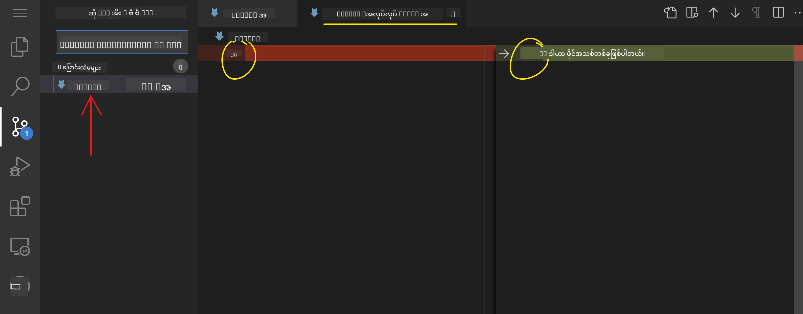
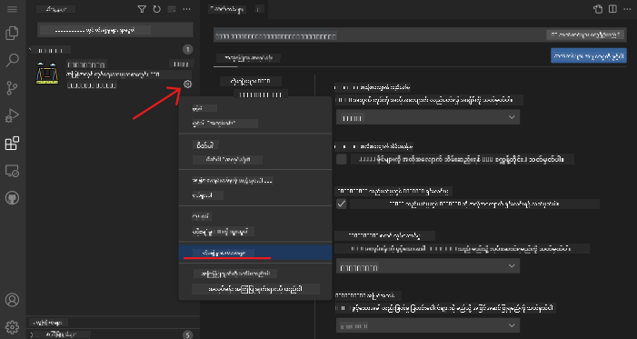

<!--
CO_OP_TRANSLATOR_METADATA:
{
  "original_hash": "1ba61d96a11309a2a6ea507496dcf7e5",
  "translation_date": "2025-08-28T18:46:26+00:00",
  "source_file": "8-code-editor/1-using-a-code-editor/README.md",
  "language_code": "my"
}
-->
# ကုဒ်အယ်ဒီတာအသုံးပြုခြင်း

ဒီသင်ခန်းစာမှာ [VSCode.dev](https://vscode.dev) ဆိုတဲ့ ဝဘ်အခြေပြုကုဒ်အယ်ဒီတာကို အသုံးပြုပြီး သင့်ကုဒ်ကို ပြင်ဆင်ခြင်းနှင့် ပရောဂျက်တစ်ခုမှာ ပါဝင်ဆောင်ရွက်နိုင်ဖို့ အခြေခံအချက်များကို လေ့လာပါမည်။ ဒီအရာတွေကို သင့်ကွန်ပျူတာမှာ ဘာမှ ထည့်သွင်းမလိုဘဲ လုပ်ဆောင်နိုင်ပါတယ်။

## သင်ခန်းစာရည်မှန်းချက်များ

ဒီသင်ခန်းစာအပြီးမှာ သင်တတ်မြောက်မည့်အရာများမှာ -

- ကုဒ်ပရောဂျက်တစ်ခုမှာ ကုဒ်အယ်ဒီတာကို အသုံးပြုနိုင်ခြင်း
- ဗားရှင်းထိန်းချုပ်မှုဖြင့် ပြောင်းလဲမှုများကို ထိန်းသိမ်းနိုင်ခြင်း
- ဖွံ့ဖြိုးတိုးတက်မှုအတွက် အယ်ဒီတာကို စိတ်ကြိုက်ပြင်ဆင်နိုင်ခြင်း

### ကြိုတင်လိုအပ်ချက်များ

စတင်မတိုင်မီ [GitHub](https://github.com) တွင် အကောင့်တစ်ခု ဖန်တီးထားရန် လိုအပ်ပါသည်။ [GitHub](https://github.com/) သို့ သွားပြီး အကောင့်မရှိသေးပါက ဖန်တီးပါ။

### နိဒါန်း

ကုဒ်အယ်ဒီတာသည် ပရိုဂရမ်ရေးသားခြင်းနှင့် ရှိပြီးသားကုဒ်ပရောဂျက်များတွင် ပူးပေါင်းဆောင်ရွက်ရန် အရေးကြီးသော ကိရိယာတစ်ခုဖြစ်သည်။ အယ်ဒီတာ၏ အခြေခံအချက်များနှင့် ၎င်း၏ လုပ်ဆောင်ချက်များကို နားလည်ပြီးပါက သင့်ကုဒ်ရေးသားမှုတွင် အသုံးချနိုင်ပါမည်။

## VSCode.dev ဖြင့် စတင်ခြင်း

[VSCode.dev](https://vscode.dev) သည် ဝဘ်ပေါ်တွင်ရှိသော ကုဒ်အယ်ဒီတာတစ်ခုဖြစ်သည်။ ၎င်းကို အသုံးပြုရန် ဘာမှ ထည့်သွင်းရန် မလိုအပ်ပါဘူး၊ အခြားဝဘ်ဆိုဒ်တစ်ခုဖွင့်သလိုပဲ ဖွင့်နိုင်ပါသည်။ စတင်ရန် [https://vscode.dev](https://vscode.dev) သို့ သွားပါ။ [GitHub](https://github.com/) တွင် လော့ဂ်အင်မလုပ်ထားပါက လော့ဂ်အင်လုပ်ရန် သို့မဟုတ် အကောင့်အသစ်ဖန်တီးရန် အဆင့်ဆင့်ညွှန်ကြားချက်များကို လိုက်နာပါ။

ဖွင့်ပြီးပါက အောက်ပါပုံနှင့် ဆင်တူသော အခြေအနေကို တွေ့ရမည်ဖြစ်သည် -


ဤအယ်ဒီတာတွင် အဓိကပိုင်း ၃ ခုရှိသည် -

1. _Activity bar_ - 🔎 မျှော်စင်၊ ⚙️ ဂီယာနှင့် အခြားအိုင်ကွန်များပါဝင်သည်။
2. _Side bar_ - _Explorer_ အဖြစ် အမည်ပေးထားသော အက်တစ်ဗစ်တစ်ခုဖြစ်သည်။
3. _Code area_ - ကုဒ်ရေးသားခြင်းနှင့် ပြင်ဆင်ရန် အဓိကနေရာ။

အိုင်ကွန်တစ်ခုချင်းစီကို နှိပ်ပြီး မီနူးအသစ်များကို ဖွင့်ပါ။ ပြီးလျှင် _Explorer_ ကို ပြန်နှိပ်ပါ။

သင့်ကုဒ်ကို ဖန်တီးခြင်း သို့မဟုတ် ပြင်ဆင်ခြင်းကို အညာပိုင်းအကြီးဆုံးနေရာတွင် ပြုလုပ်မည်ဖြစ်သည်။ 

## GitHub Repository ဖွင့်ခြင်း

GitHub repository တစ်ခုဖွင့်ရန် အမျိုးမျိုးသောနည်းလမ်းများရှိသည်။ ဒီအပိုင်းမှာ repository ဖွင့်နိုင်သော နည်းလမ်း ၂ မျိုးကို လေ့လာပါမည်။

### ၁။ အယ်ဒီတာဖြင့်

အယ်ဒီတာကို အသုံးပြု၍ remote repository တစ်ခုဖွင့်ပါ။ [VSCode.dev](https://vscode.dev) သို့ သွားပါက _"Open Remote Repository"_ ခလုတ်ကို တွေ့ရမည် -


သို့မဟုတ် Command Palette ကို အသုံးပြုပါ။ Command Palette သည် အမိန့် သို့မဟုတ် လုပ်ဆောင်ချက်တစ်ခုကို ရှာဖွေရန် input box တစ်ခုဖြစ်သည်။ _View_ ကိုရွေးပြီး _Command Palette_ ကို ရွေးပါ၊ သို့မဟုတ် Ctrl-Shift-P (MacOS တွင် Command-Shift-P) ကို အသုံးပြုပါ။


Command Palette ဖွင့်ပြီးပါက _open remote repository_ ဟု ရိုက်ထည့်ပြီး ပထမဆုံးရွေးချယ်မှုကို ရွေးပါ။ သင့်အနီးရှိ repository များ သို့မဟုတ် သင့်ရဲ့ GitHub URL တစ်ခုကို ရိုက်ထည့်နိုင်ပါသည်။

```
https://github.com/microsoft/Web-Dev-For-Beginners
```

✅ အောင်မြင်ပါက repository ရဲ့ ဖိုင်အားလုံးကို အယ်ဒီတာတွင် တွေ့ရမည်။

### ၂။ URL အသုံးပြုခြင်း

URL တစ်ခုကို တိုက်ရိုက်အသုံးပြု၍ repository ကို ဖွင့်နိုင်ပါသည်။ ဥပမာအားဖြင့် [https://github.com/microsoft/Web-Dev-For-Beginners](https://github.com/microsoft/Web-Dev-For-Beginners) သည် GitHub repository URL ဖြစ်သည်။ GitHub domain ကို `VSCode.dev/github` ဖြင့် အစားထိုးပြီး repository ကို တိုက်ရိုက်ဖွင့်နိုင်ပါသည်။ URL သည် [https://vscode.dev/github/microsoft/Web-Dev-For-Beginners](https://vscode.dev/github/microsoft/Web-Dev-For-Beginners) ဖြစ်ပါမည်။

## ဖိုင်များကို ပြင်ဆင်ခြင်း

repository ကို browser/vscode.dev တွင် ဖွင့်ပြီးပါက ပရောဂျက်ကို ပြင်ဆင်ရန် နောက်တစ်ဆင့်သို့ ရောက်ရှိပါမည်။

### ၁။ ဖိုင်အသစ်တစ်ခု ဖန်တီးခြင်း

ဖိုင်အသစ်တစ်ခုကို ရှိပြီးသား folder အတွင်း သို့မဟုတ် root directory/folder တွင် ဖန်တီးနိုင်ပါသည်။ ဖိုင်ကို သိမ်းဆည်းလိုသည့်နေရာ/ဒိုင်ရက်ထရီကို ဖွင့်ပြီး _'New file ...'_ အိုင်ကွန်ကို နှိပ်ပါ၊ နာမည်ပေးပြီး Enter နှိပ်ပါ။


### ၂။ ဖိုင်တစ်ခုကို ပြင်ဆင်ပြီး သိမ်းဆည်းခြင်း

vscode.dev ကို အသုံးပြုခြင်းသည် သင့်ပရောဂျက်ကို အလျင်အမြန် ပြင်ဆင်ရန် အထောက်အကူဖြစ်စေသည်။  
'Explorer' အိုင်ကွန်ကို နှိပ်ပြီး repository ရဲ့ ဖိုင်များနှင့် folder များကို ကြည့်ပါ။ ဖိုင်တစ်ခုကို ရွေးပြီး code area တွင် ဖွင့်ပါ၊ ပြင်ဆင်ပြီး သိမ်းဆည်းပါ။


ပြင်ဆင်မှုများပြီးပါက _`source control`_ အိုင်ကွန်ကို ရွေးပါ။ 

ပြောင်းလဲမှုများကို ကြည့်ရန် `Changes` folder ထဲမှ ဖိုင်(များ)ကို ရွေးပါ။ 'Working Tree' တွင် ပြောင်းလဲမှုများကို မြင်ရမည်။ အနီရောင်သည် ဖျက်ထားမှုကို ပြသပြီး အစိမ်းရောင်သည် ထည့်သွင်းမှုကို ပြသသည်။



ပြောင်းလဲမှုများကို သဘောကျပါက `Changes` folder ကို hover လုပ်ပြီး `+` ခလုတ်ကို နှိပ်ပါ။ 

ပြောင်းလဲမှုများကို commit message ရိုက်ထည့်ပြီး `check icon` ကို နှိပ်ပါ။

GitHub.com သို့ ပြန်သွားရန် `hamburger menu icon` ကို နှိပ်ပါ။


## Extension များ အသုံးပြုခြင်း

VSCode တွင် extension များထည့်သွင်းခြင်းဖြင့် သင့်ဖွံ့ဖြိုးတိုးတက်မှုအတွက် အသုံးဝင်သော features များကို ထည့်သွင်းနိုင်သည်။ 

### ၁။ Extension များ ထည့်သွင်းခြင်း

Search field တွင် extension ရဲ့ နာမည်ကို ရိုက်ထည့်ပြီး install ခလုတ်ကို နှိပ်ပါ။


### ၂။ Extension များကို စိတ်ကြိုက်ပြင်ဆင်ခြင်း

Installed folder တွင် extension ကို ရွေးပြီး Gear icon > Extensions Setting ကို သွားပါ။



### ၃။ Extension များကို စီမံခန့်ခွဲခြင်း

- **Disable:** Extension ကို ယာယီပိတ်ထားရန် Disable ကို ရွေးပါ။
- **Uninstall:** Extension ကို အပြီးဖျက်ရန် Uninstall ကို ရွေးပါ။

---

## လေ့ကျင့်ခန်း
[VSCode.dev ကို အသုံးပြု၍ CV ဝဘ်ဆိုဒ်တစ်ခု ဖန်တီးပါ](https://github.com/microsoft/Web-Dev-For-Beginners/blob/main/8-code-editor/1-using-a-code-editor/assignment.md)

## ပြန်လည်သုံးသပ်ခြင်းနှင့် ကိုယ်တိုင်လေ့လာခြင်း

[VSCode.dev](https://code.visualstudio.com/docs/editor/vscode-web?WT.mc_id=academic-0000-alfredodeza) နှင့် ၎င်း၏ အခြား features များအကြောင်း ပိုမိုဖတ်ရှုပါ။

---

**အကြောင်းကြားချက်**:  
ဤစာရွက်စာတမ်းကို AI ဘာသာပြန်ဝန်ဆောင်မှု [Co-op Translator](https://github.com/Azure/co-op-translator) ကို အသုံးပြု၍ ဘာသာပြန်ထားပါသည်။ ကျွန်ုပ်တို့သည် တိကျမှုအတွက် ကြိုးစားနေသော်လည်း၊ အလိုအလျောက် ဘာသာပြန်ခြင်းတွင် အမှားများ သို့မဟုတ် မတိကျမှုများ ပါရှိနိုင်သည်ကို သတိပြုပါ။ မူရင်းဘာသာစကားဖြင့် ရေးသားထားသော စာရွက်စာတမ်းကို အာဏာရှိသော ရင်းမြစ်အဖြစ် သတ်မှတ်သင့်ပါသည်။ အရေးကြီးသော အချက်အလက်များအတွက် လူ့ဘာသာပြန်ပညာရှင်များမှ ပရော်ဖက်ရှင်နယ် ဘာသာပြန်ခြင်းကို အကြံပြုပါသည်။ ဤဘာသာပြန်ကို အသုံးပြုခြင်းမှ ဖြစ်ပေါ်လာသော အလွဲအလွဲအချော်အချော်များ သို့မဟုတ် အနားလွဲမှုများအတွက် ကျွန်ုပ်တို့သည် တာဝန်မယူပါ။