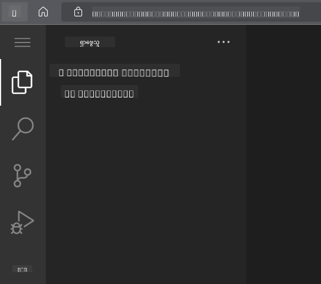

<!--
CO_OP_TRANSLATOR_METADATA:
{
  "original_hash": "bd3aa6d2b879c30ea496c43aec1c49ed",
  "translation_date": "2025-08-28T18:46:58+00:00",
  "source_file": "8-code-editor/1-using-a-code-editor/assignment.md",
  "language_code": "my"
}
-->
# vscode.dev ကို အသုံးပြု၍ ရှင်းလင်းသော CV-Website တစ်ခု ဖန်တီးခြင်း

_အလုပ်ရှင်တစ်ဦးက သင့် CV ကို တောင်းလိုက်တဲ့အခါ URL တစ်ခုပေးလိုက်တာ ဘယ်လောက်အေးမြလဲ?_ 😎

## ရည်မှန်းချက်များ

ဒီအလုပ်ကိုပြီးစီးပြီးနောက်မှာ သင်တစ်ဦးတည်းဖြင့်:

- သင့် CV ကို ပြသနိုင်မည့် website တစ်ခု ဖန်တီးနိုင်မည်

### လိုအပ်ချက်များ

1. GitHub အကောင့်တစ်ခု။ [GitHub](https://github.com/) သို့ သွားပြီး အကောင့်မရှိသေးပါက ဖန်တီးပါ။

## လုပ်ဆောင်ရန်အဆင့်များ

**အဆင့် ၁:** GitHub Repository အသစ်တစ်ခု ဖန်တီးပြီး `my-resume` ဟု အမည်ပေးပါ။

**အဆင့် ၂:** သင့် repository တွင် `index.html` ဖိုင်တစ်ခု ဖန်တီးပါ။ github.com တွင် ဖိုင်တစ်ခုထည့်ရန်လိုအပ်သည်၊ အကြောင်းမူမူဟာ vscode.dev တွင် အလွတ် repository မဖွင့်နိုင်ပါ။

`creating a new file` လင့်ကို နှိပ်ပြီး `index.html` ဟု အမည်ပေးပါ၊ ထို့နောက် `Commit new file` ခလုတ်ကို နှိပ်ပါ။


**အဆင့် ၃:** [VSCode.dev](https://vscode.dev) ကို ဖွင့်ပြီး `Open Remote Repository` ခလုတ်ကို ရွေးပါ။

သင့် CV site အတွက် ဖန်တီးထားသော repository ၏ URL ကို ကူးယူပြီး input box တွင် ထည့်ပါ။

_`your-username` ကို သင့် GitHub username ဖြင့် အစားထိုးပါ_

```
https://github.com/your-username/my-resume
```

✅ အောင်မြင်ပါက သင့် project နှင့် index.html ဖိုင်ကို browser တွင်ရှိသော text editor တွင် ဖွင့်ထားသည်ကို မြင်ရမည်။



**အဆင့် ၄:** `index.html` ဖိုင်ကို ဖွင့်ပြီး အောက်ပါ code ကို သင့် code အပိုင်းတွင် ကူးထည့်ပြီး သိမ်းပါ။

<details>
    <summary><b>သင့် CV website အတွက် HTML code</b></summary>
    
        <html>

            <head>
                <link href="style.css" rel="stylesheet">
                <link rel="stylesheet" href="https://cdnjs.cloudflare.com/ajax/libs/font-awesome/5.15.4/css/all.min.css">
                <title>သင့်နာမည်ကို ဒီမှာရေးပါ!</title>
            </head>
            <body>
                <header id="header">
                    <!-- CV header သင့်နာမည်နှင့် အလုပ်အကိုင် -->
                    <h1>သင့်နာမည်ကို ဒီမှာရေးပါ!</h1>
                    <hr>
                    သင့်အလုပ်အကိုင်!
                    <hr>
                </header>
                <main>
                    <article id="mainLeft">
                        <section>
                            <h2>ဆက်သွယ်ရန်</h2>
                            <!-- ဆက်သွယ်ရန်အချက်အလက်များ -->
                            <p>
                                <i class="fa fa-envelope" aria-hidden="true"></i>
                                <a href="mailto:username@domain.top-level domain">သင့် email ကို ဒီမှာရေးပါ</a>
                            </p>
                            <p>
                                <i class="fab fa-github" aria-hidden="true"></i>
                                <a href="github.com/yourGitHubUsername">သင့် GitHub username ကို ဒီမှာရေးပါ!</a>
                            </p>
                            <p>
                                <i class="fab fa-linkedin" aria-hidden="true"></i>
                                <a href="linkedin.com/yourLinkedInUsername">သင့် LinkedIn username ကို ဒီမှာရေးပါ!</a>
                            </p>
                        </section>
                        <section>
                            <h2>ကျွမ်းကျင်မှုများ</h2>
                            <!-- သင့်ကျွမ်းကျင်မှုများ -->
                            <ul>
                                <li>ကျွမ်းကျင်မှု ၁!</li>
                                <li>ကျွမ်းကျင်မှု ၂!</li>
                                <li>ကျွမ်းကျင်မှု ၃!</li>
                                <li>ကျွမ်းကျင်မှု ၄!</li>
                            </ul>
                        </section>
                        <section>
                            <h2>ပညာရေး</h2>
                            <!-- သင့်ပညာရေး -->
                            <h3>သင်ယူခဲ့သောဘာသာရပ်ကို ဒီမှာရေးပါ!</h3>
                            <p>
                                သင်တက်ခဲ့သောကျောင်း/တက္ကသိုလ်ကို ဒီမှာရေးပါ!
                            </p>
                            <p>
                                စတင်နှင့်ပြီးဆုံးသည့်ရက်စွဲ
                            </p>
                        </section>            
                    </article>
                    <article id="mainRight">
                        <section>
                            <h2>ကိုယ်ရေးအကျဉ်း</h2>
                            <!-- သင့်အကြောင်း -->
                            <p>သင့်ကိုယ်ရေးအကျဉ်းကို ဒီမှာရေးပါ!</p>
                        </section>
                        <section>
                            <h2>အလုပ်အတွေ့အကြုံ</h2>
                            <!-- သင့်အလုပ်အတွေ့အကြုံ -->
                            <h3>အလုပ်အမည်</h3>
                            <p>
                                အဖွဲ့အစည်းအမည် | စတင်လ – ပြီးဆုံးလ
                            </p>
                            <ul>
                                    <li>တာဝန် ၁ - သင်လုပ်ခဲ့တာရေးပါ!</li>
                                    <li>တာဝန် ၂ - သင်လုပ်ခဲ့တာရေးပါ!</li>
                                    <li>သင့်လုပ်ဆောင်မှု၏ရလဒ်/သက်ရောက်မှုကိုရေးပါ</li>
                                    
                            </ul>
                            <h3>အလုပ်အမည် ၂</h3>
                            <p>
                                အဖွဲ့အစည်းအမည် | စတင်လ – ပြီးဆုံးလ
                            </p>
                            <ul>
                                    <li>တာဝန် ၁ - သင်လုပ်ခဲ့တာရေးပါ!</li>
                                    <li>တာဝန် ၂ - သင်လုပ်ခဲ့တာရေးပါ!</li>
                                    <li>သင့်လုပ်ဆောင်မှု၏ရလဒ်/သက်ရောက်မှုကိုရေးပါ</li>
                                    
                            </ul>
                        </section>
                    </article>
                </main>
            </body>
        </html>
</details>

HTML code တွင် _placeholder text_ များကို သင့် CV အချက်အလက်များဖြင့် အစားထိုးပါ။

**အဆင့် ၅:** My-Resume folder တွင် `New File ...` icon ကို နှိပ်ပြီး `style.css` နှင့် `codeswing.json` ဖိုင် ၂ ခု ဖန်တီးပါ။

**အဆင့် ၆:** `style.css` ဖိုင်ကို ဖွင့်ပြီး အောက်ပါ code ကို ကူးထည့်ပြီး သိမ်းပါ။

<details>
        <summary><b>Website layout အတွက် CSS code</b></summary>
            
            body {
                font-family: 'Segoe UI', Tahoma, Geneva, Verdana, sans-serif;
                font-size: 16px;
                max-width: 960px;
                margin: auto;
            }
            h1 {
                font-size: 3em;
                letter-spacing: .6em;
                padding-top: 1em;
                padding-bottom: 1em;
            }

            h2 {
                font-size: 1.5em;
                padding-bottom: 1em;
            }

            h3 {
                font-size: 1em;
                padding-bottom: 1em;
            }
            main { 
                display: grid;
                grid-template-columns: 40% 60%;
                margin-top: 3em;
            }
            header {
                text-align: center;
                margin: auto 2em;
            }

            section {
                margin: auto 1em 4em 2em;
            }

            i {
                margin-right: .5em;
            }

            p {
                margin: .2em auto
            }

            hr {
                border: none;
                background-color: lightgray;
                height: 1px;
            }

            h1, h2, h3 {
                font-weight: 100;
                margin-bottom: 0;
            }
            #mainLeft {
                border-right: 1px solid lightgray;
            }
            
</details>

**အဆင့် ၇:** `codeswing.json` ဖိုင်ကို ဖွင့်ပြီး အောက်ပါ code ကို ကူးထည့်ပြီး သိမ်းပါ။

    {
    "scripts": [],
    "styles": []
    }

**အဆင့် ၈:** `Codeswing extension` ကို install လုပ်ပြီး resume website ကို preview လုပ်ပါ။

`Extensions` icon ကို နှိပ်ပြီး Codeswing ဟု ရိုက်ထည့်ပါ။ Install ခလုတ်ကို နှိပ်ပြီး extension ကို install လုပ်ပါ။ Install ပြီးပါက သင့် project တွင် ပြောင်းလဲမှုများကို မြင်ရမည် 😃


သင့် project တွင် ပြောင်းလဲမှုများကို စိတ်ကျေနပ်ပါက `Changes` folder တွင် `+` ခလုတ်ကို နှိပ်ပြီး ပြောင်းလဲမှုများကို stage လုပ်ပါ။

ပြောင်းလဲမှုအတွက် commit message ရိုက်ထည့်ပြီး `check` ခလုတ်ကို နှိပ်ပါ။ Project အလုပ်ပြီးပါက GitHub repository သို့ ပြန်သွားရန် အပေါ်ဘက်လက်ဝဲရှိ hamburger menu icon ကို နှိပ်ပါ။

ဂုဏ်ယူပါတယ် 🎉 သင်သည် vscode.dev ကို အသုံးပြု၍ သင့် CV website ကို အဆင့်အဆင့် ဖန်တီးပြီးပါပြီ။

## 🚀 စိန်ခေါ်မှု

သင့်တွင် ပြင်ဆင်ခွင့်ရှိသော remote repository တစ်ခု ဖွင့်ပြီး ဖိုင်များကို update လုပ်ပါ။ ထို့နောက် သင့်ပြောင်းလဲမှုများနှင့် branch အသစ်တစ်ခု ဖန်တီးပြီး Pull Request တင်ပါ။

## ပြန်လည်သုံးသပ်ခြင်းနှင့် ကိုယ်တိုင်လေ့လာခြင်း

[VSCode.dev](https://code.visualstudio.com/docs/editor/vscode-web?WT.mc_id=academic-0000-alfredodeza) နှင့် ၎င်း၏ အခြား features များအကြောင်း ပိုမိုဖတ်ရှုပါ။

---

**အကြောင်းကြားချက်**:  
ဤစာရွက်စာတမ်းကို AI ဘာသာပြန်ဝန်ဆောင်မှု [Co-op Translator](https://github.com/Azure/co-op-translator) ကို အသုံးပြု၍ ဘာသာပြန်ထားပါသည်။ ကျွန်ုပ်တို့သည် တိကျမှုအတွက် ကြိုးစားနေသော်လည်း၊ အလိုအလျောက် ဘာသာပြန်မှုများတွင် အမှားများ သို့မဟုတ် မတိကျမှုများ ပါဝင်နိုင်သည်ကို သတိပြုပါ။ မူရင်းဘာသာစကားဖြင့် ရေးသားထားသော စာရွက်စာတမ်းကို အာဏာတရ အရင်းအမြစ်အဖြစ် ရှုလေ့လာသင့်ပါသည်။ အရေးကြီးသော အချက်အလက်များအတွက် လူ့ဘာသာပြန်ပညာရှင်များကို အသုံးပြု၍ ဘာသာပြန်ခြင်းကို အကြံပြုပါသည်။ ဤဘာသာပြန်မှုကို အသုံးပြုခြင်းမှ ဖြစ်ပေါ်လာသော အလွဲအလွတ်များ သို့မဟုတ် အနားလွဲမှုများအတွက် ကျွန်ုပ်တို့သည် တာဝန်မယူပါ။