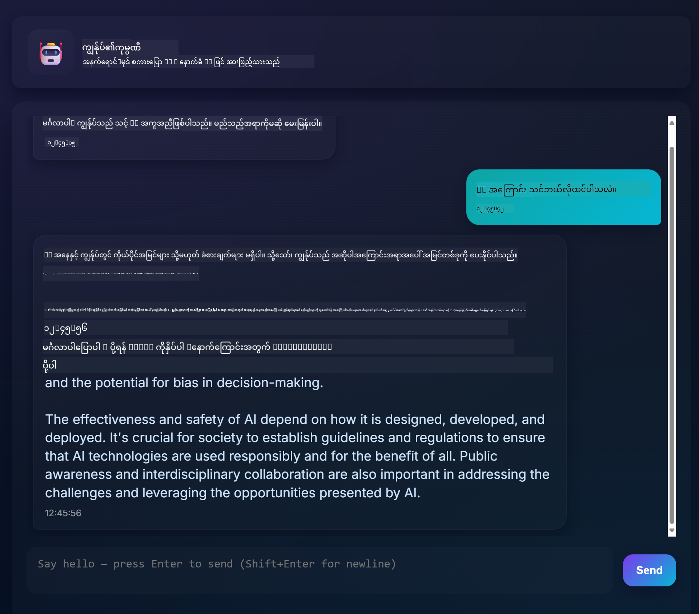
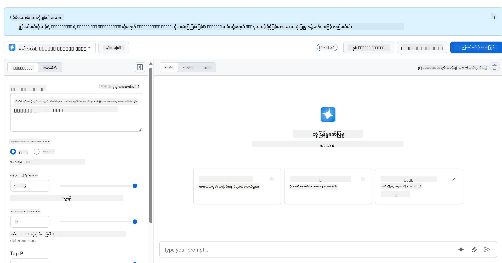
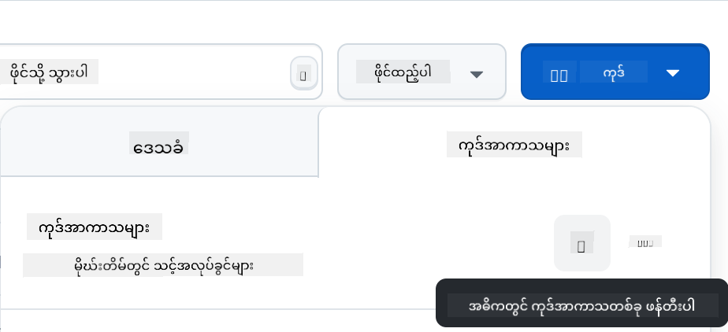

<!--
CO_OP_TRANSLATOR_METADATA:
{
  "original_hash": "11cf36165c243947b6cd85b88cf6faa6",
  "translation_date": "2025-09-01T17:03:47+00:00",
  "source_file": "9-chat-project/README.md",
  "language_code": "my"
}
-->
# Chat project

ဒီ chat project က GitHub Models ကို အသုံးပြုပြီး Chat Assistant တစ်ခုကို ဘယ်လိုတည်ဆောက်ရမလဲဆိုတာ ပြသပေးပါတယ်။

အဆုံးသတ် project ရဲ့ ရုပ်ပုံက ဒီလိုပဲဖြစ်ပါတယ်:



အနည်းငယ် context ပေးရမယ်ဆိုရင်၊ generative AI ကို အသုံးပြုပြီး Chat assistants တစ်ခုကို တည်ဆောက်တာက AI ကို စတင်လေ့လာဖို့အတွက် အကောင်းဆုံးနည်းလမ်းတစ်ခုဖြစ်ပါတယ်။ ဒီသင်ခန်းစာတစ်ခုလုံးအတွင်းမှာ generative AI ကို web app အတွင်းမှာ ပေါင်းစည်းအသုံးပြုနည်းကို သင်ယူရမှာဖြစ်ပါတယ်။ စတင်လိုက်ကြစို့။

## Generative AI ကို ချိတ်ဆက်ခြင်း

Backend အတွက် GitHub Models ကို အသုံးပြုထားပါတယ်။ AI ကို အခမဲ့အသုံးပြုနိုင်တဲ့ အကောင်းဆုံးဝန်ဆောင်မှုတစ်ခုဖြစ်ပါတယ်။ သူ့ရဲ့ playground ကို သွားပြီး သင့်ရဲ့ backend language ရွေးချယ်မှုနဲ့ ကိုက်ညီတဲ့ code ကို ရယူပါ။ GitHub Models Playground မှာ ဒီလိုပုံစံဖြစ်ပါတယ် [GitHub Models Playground](https://github.com/marketplace/models/azure-openai/gpt-4o-mini/playground)



အဆိုပါ "Code" tab ကို ရွေးချယ်ပြီး သင့်ရဲ့ runtime ကို ရွေးပါ။


### Python ကို အသုံးပြုခြင်း

ဒီအခါမှာ Python ကို ရွေးချယ်ပြီး ဒီ code ကို ရွေးပါ:

```python
"""Run this model in Python

> pip install openai
"""
import os
from openai import OpenAI

# To authenticate with the model you will need to generate a personal access token (PAT) in your GitHub settings. 
# Create your PAT token by following instructions here: https://docs.github.com/en/authentication/keeping-your-account-and-data-secure/managing-your-personal-access-tokens
client = OpenAI(
    base_url="https://models.github.ai/inference",
    api_key=os.environ["GITHUB_TOKEN"],
)

response = client.chat.completions.create(
    messages=[
        {
            "role": "system",
            "content": "",
        },
        {
            "role": "user",
            "content": "What is the capital of France?",
        }
    ],
    model="openai/gpt-4o-mini",
    temperature=1,
    max_tokens=4096,
    top_p=1
)

print(response.choices[0].message.content)
```

ဒီ code ကို အသုံးပြုနိုင်အောင် နည်းနည်းသန့်စင်လိုက်ရအောင်:

```python
def call_llm(prompt: str, system_message: str):
    response = client.chat.completions.create(
        messages=[
            {
                "role": "system",
                "content": system_message,
            },
            {
                "role": "user",
                "content": prompt,
            }
        ],
        model="openai/gpt-4o-mini",
        temperature=1,
        max_tokens=4096,
        top_p=1
    )

    return response.choices[0].message.content
```

ဒီ `call_llm` function နဲ့ prompt တစ်ခုနဲ့ system prompt တစ်ခုကို ထည့်ပြီး function က အဖြေကို ပြန်ပေးပါလိမ့်မယ်။

### AI Assistant ကို Customize လုပ်ခြင်း

AI assistant ကို သင့်လိုအပ်ချက်အတိုင်း ပြင်ဆင်ချင်ရင် system prompt ကို ဒီလိုပုံစံဖြင့် ဖြည့်စွက်နိုင်ပါတယ်:

```python
call_llm("Tell me about you", "You're Albert Einstein, you only know of things in the time you were alive")
```

## Web API မှတဆင့် ထုတ်ဖော်ခြင်း

အကောင်းဆုံးပါပြီ၊ AI အပိုင်းကို ပြီးမြောက်သွားပြီ၊ အခု Web API အတွင်းမှာ ပေါင်းစည်းပေးရအောင်။ Web API အတွက် Flask ကို ရွေးချယ်ထားပါတယ်၊ ဒါပေမယ့် ဘယ် web framework မဆို အသုံးပြုနိုင်ပါတယ်။ ဒီ code ကို ကြည့်လိုက်ရအောင်:

### Python ကို အသုံးပြုခြင်း

```python
# api.py
from flask import Flask, request, jsonify
from llm import call_llm
from flask_cors import CORS

app = Flask(__name__)
CORS(app)   # *   example.com

@app.route("/", methods=["GET"])
def index():
    return "Welcome to this API. Call POST /hello with 'message': 'my message' as JSON payload"


@app.route("/hello", methods=["POST"])
def hello():
    # get message from request body  { "message": "do this taks for me" }
    data = request.get_json()
    message = data.get("message", "")

    response = call_llm(message, "You are a helpful assistant.")
    return jsonify({
        "response": response
    })

if __name__ == "__main__":
    app.run(host="0.0.0.0", port=5000)
```

ဒီမှာ flask API တစ်ခုကို ဖန်တီးပြီး "/" နဲ့ "/chat" ဆိုတဲ့ default route ကို သတ်မှတ်ထားပါတယ်။ နောက်ဆုံး route က frontend ကနေ backend ကို မေးခွန်းတွေ ပေးပို့ဖို့အတွက် ဖြစ်ပါတယ်။

*llm.py* ကို ပေါင်းစည်းဖို့ ဒီလိုလုပ်ရပါမယ်:

- `call_llm` function ကို Import လုပ်ပါ:

   ```python
   from llm import call_llm
   from flask import Flask, request
   ```

- "/chat" route မှာ function ကို ခေါ်ပါ:

   ```python
   @app.route("/hello", methods=["POST"])
   def hello():
      # get message from request body  { "message": "do this taks for me" }
      data = request.get_json()
      message = data.get("message", "")

      response = call_llm(message, "You are a helpful assistant.")
      return jsonify({
         "response": response
      })
   ```

   ဒီမှာ JSON body မှ message property ကို ရယူဖို့ incoming request ကို parse လုပ်ပါတယ်။ ထို့နောက် LLM ကို ဒီလိုခေါ်ပါတယ်:

   ```python
   response = call_llm(message, "You are a helpful assistant")

   # return the response as JSON
   return jsonify({
      "response": response 
   })
   ```

အကောင်းဆုံးပါပြီ၊ လိုအပ်တာတွေ ပြီးမြောက်သွားပါပြီ။

## Cors ကို Configure လုပ်ပါ

Cors, cross-origin resource sharing ကို စီစဉ်ထားတာကို ပြောပြရမယ်။ ဒါက backend နဲ့ frontend က အခြား port တွေမှာ run ဖြစ်နေတဲ့အတွက် frontend က backend ကို ခေါ်နိုင်ဖို့ လိုအပ်ပါတယ်။

### Python ကို အသုံးပြုခြင်း

*api.py* မှာ ဒီကို စီစဉ်ထားတဲ့ code တစ်ခုရှိပါတယ်:

```python
from flask_cors import CORS

app = Flask(__name__)
CORS(app)   # *   example.com
```

အခု "*" ဆိုတဲ့ all origins ကို ခွင့်ပြုထားပါတယ်၊ ဒါက production မှာ သွားရောက်တဲ့အခါမှာ အန္တရာယ်ရှိနိုင်ပါတယ်၊ ထို့ကြောင့် ထိန်းချုပ်ထားသင့်ပါတယ်။

## Project ကို Run လုပ်ပါ

Project ကို run လုပ်ဖို့ backend ကို အရင်စတင်ပြီး frontend ကို စတင်ရပါမယ်။

### Python ကို အသုံးပြုခြင်း

အခု *llm.py* နဲ့ *api.py* ရှိပြီး backend နဲ့ အလုပ်လုပ်ဖို့ ဘာလုပ်ရမလဲ? အခုလုပ်ရမယ့်အရာနှစ်ခုရှိပါတယ်:

- Dependencies တွေကို Install လုပ်ပါ:

   ```sh
   cd backend
   python -m venv venv
   source ./venv/bin/activate

   pip install openai flask flask-cors openai
   ```

- API ကို စတင်ပါ:

   ```sh
   python api.py
   ```

   Codespaces မှာ run လုပ်ရင် editor ရဲ့ အောက်ပိုင်းမှာ Ports ကို သွားပြီး right-click လုပ်ပါ၊ "Port Visibility" ကို click လုပ်ပြီး "Public" ကို ရွေးပါ။

### Frontend အပေါ်မှာ အလုပ်လုပ်ပါ

API run ဖြစ်ပြီးသားဖြစ်တဲ့အခါ frontend တစ်ခုကို ဖန်တီးရအောင်။ အနည်းဆုံး frontend တစ်ခုကို ဖန်တီးပြီး အဆင့်ဆင့်တိုးတက်အောင်လုပ်ပါမယ်။ *frontend* folder တစ်ခုမှာ ဒီလိုဖိုင်တွေ ဖန်တီးပါ:

```text
backend/
frontend/
index.html
app.js
styles.css
```

အရင်ဆုံး **index.html** ကို စတင်ကြည့်ပါ:

```html
<html>
    <head>
        <link rel="stylesheet" href="styles.css">
    </head>
    <body>
      <form>
        <textarea id="messages"></textarea>
        <input id="input" type="text" />
        <button type="submit" id="sendBtn">Send</button>  
      </form>  
      <script src="app.js" />
    </body>
</html>    
```

အထက်မှာ chat window ကို ပံ့ပိုးဖို့အတွက် လိုအပ်တဲ့ အနည်းဆုံးအရာတွေပါဝင်ပါတယ်၊ textarea တစ်ခုမှာ message တွေကို ပြသပေးပြီး input တစ်ခုမှာ message ကို ရိုက်ထည့်နိုင်ပါတယ်၊ button တစ်ခုက message ကို backend ကို ပေးပို့ဖို့အတွက် ဖြစ်ပါတယ်။ နောက်တစ်ခု JavaScript ကို *app.js* မှာ ကြည့်လိုက်ရအောင်။

**app.js**

```js
// app.js

(function(){
  // 1. set up elements  
  const messages = document.getElementById("messages");
  const form = document.getElementById("form");
  const input = document.getElementById("input");

  const BASE_URL = "change this";
  const API_ENDPOINT = `${BASE_URL}/hello`;

  // 2. create a function that talks to our backend
  async function callApi(text) {
    const response = await fetch(API_ENDPOINT, {
      method: "POST",
      headers: { "Content-Type": "application/json" },
      body: JSON.stringify({ message: text })
    });
    let json = await response.json();
    return json.response;
  }

  // 3. add response to our textarea
  function appendMessage(text, role) {
    const el = document.createElement("div");
    el.className = `message ${role}`;
    el.innerHTML = text;
    messages.appendChild(el);
  }

  // 4. listen to submit events
  form.addEventListener("submit", async(e) => {
    e.preventDefault();
   // someone clicked the button in the form
   
   // get input
   const text = input.value.trim();

   appendMessage(text, "user")

   // reset it
   input.value = '';

   const reply = await callApi(text);

   // add to messages
   appendMessage(reply, "assistant");

  })
})();
```

Code ကို အပိုင်းလိုက်ကြည့်ရအောင်:

- 1) ဒီမှာ element တွေကို reference လုပ်ပြီး နောက် code မှာ အသုံးပြုမယ့်အတွက် ရယူထားပါတယ်။
- 2) ဒီအပိုင်းမှာ built-in `fetch` method ကို အသုံးပြုပြီး backend ကို ခေါ်တဲ့ function တစ်ခုကို ဖန်တီးထားပါတယ်။
- 3) `appendMessage` က assistant response တွေကို user ရဲ့ message နဲ့အတူ textarea မှာ ထည့်ပေးပါတယ်။
- 4) submit event ကို နားထောင်ပြီး input field ကို ဖတ်ပြီး user ရဲ့ message ကို textarea မှာ ထည့်ပေးပြီး API ကို ခေါ်ပြီး response ကို textarea မှာ ပြသပေးပါတယ်။

Styling ကို ကြည့်လိုက်ရအောင်၊ ဒီမှာ သင့်စိတ်ကြိုက် ပြင်ဆင်နိုင်ပါတယ်၊ ဒါပေမယ့် အောက်ပါအတိုင်း အကြံပေးထားပါတယ်:

**styles.css**

```
.message {
    background: #222;
    box-shadow: 0 0 0 10px orange;
    padding: 10px:
    margin: 5px;
}

.message.user {
    background: blue;
}

.message.assistant {
    background: grey;
} 
```

ဒီ classes သုံးခုနဲ့ message တွေကို assistant ကနေလာတာလား user ကနေလာတာလားဆိုတာကို ခွဲခြားပြီး style လုပ်နိုင်ပါတယ်။ အခြား design အတွက် `solution/frontend/styles.css` folder ကို ကြည့်ပါ။

### Base Url ကို ပြောင်းပါ

ဒီမှာ မသတ်မှတ်ထားတဲ့အရာတစ်ခုရှိပါတယ်၊ အဲဒါက `BASE_URL` ဖြစ်ပါတယ်၊ backend စတင်ပြီးမှ သိနိုင်ပါတယ်။ သတ်မှတ်ဖို့:

- API ကို locally run လုပ်ရင် `http://localhost:5000` လိုမျိုး သတ်မှတ်ပါ။
- Codespaces မှာ run လုပ်ရင် "[name]app.github.dev" လိုမျိုး ဖြစ်ပါတယ်။

## Assignment

*project* folder တစ်ခု ဖန်တီးပြီး အောက်ပါအတိုင်း content ထည့်ပါ:

```text
project/
  frontend/
    index.html
    app.js
    styles.css
  backend/
    ...
```

အထက်မှာ ပြောထားတဲ့အတိုင်း content ကို ကူးယူပြီး သင့်စိတ်ကြိုက် ပြင်ဆင်နိုင်ပါတယ်။

## Solution

[Solution](./solution/README.md)

## Bonus

AI assistant ရဲ့ personality ကို ပြောင်းကြည့်ပါ။

### Python အတွက်

*api.py* မှာ `call_llm` ကို ခေါ်တဲ့အခါ ဒုတိယ argument ကို သင့်လိုအပ်ချက်အတိုင်း ပြောင်းနိုင်ပါတယ်၊ ဥပမာ:

```python
call_llm(message, "You are Captain Picard")
```

### Frontend

CSS နဲ့ text ကို သင့်စိတ်ကြိုက် ပြောင်းပါ၊ *index.html* နဲ့ *styles.css* မှာ ပြင်ဆင်ပါ။

## Summary

အကောင်းဆုံးပါပြီ၊ AI ကို အသုံးပြုပြီး personal assistant တစ်ခုကို ဘယ်လိုတည်ဆောက်ရမလဲဆိုတာ အခြေခံကနေ သင်ယူပြီးပြီ။ GitHub Models ကို အသုံးပြုပြီး Python backend နဲ့ HTML, CSS, JavaScript frontend ကို အသုံးပြုထားပါတယ်။

## Codespaces နဲ့ Set up လုပ်ပါ

- သွားပါ: [Web Dev For Beginners repo](https://github.com/microsoft/Web-Dev-For-Beginners)
- Template မှာ Create လုပ်ပါ (GitHub မှာ login လုပ်ထားတာ သေချာပါစေ) အပေါ်ညာဘက်မှာ:

    

- သင့် repo မှာ Codespace တစ်ခု ဖန်တီးပါ:

    

    ဒီမှာ သင့်အလုပ်လုပ်နိုင်တဲ့ environment တစ်ခု စတင်ပါလိမ့်မယ်။

---

**အကြောင်းကြားချက်**:  
ဤစာရွက်စာတမ်းကို AI ဘာသာပြန်ဝန်ဆောင်မှု [Co-op Translator](https://github.com/Azure/co-op-translator) ကို အသုံးပြု၍ ဘာသာပြန်ထားပါသည်။ ကျွန်ုပ်တို့သည် တိကျမှုအတွက် ကြိုးစားနေသော်လည်း၊ အလိုအလျောက် ဘာသာပြန်ခြင်းတွင် အမှားများ သို့မဟုတ် မတိကျမှုများ ပါဝင်နိုင်သည်ကို သတိပြုပါ။ မူရင်းစာရွက်စာတမ်းကို ၎င်း၏ မူရင်းဘာသာစကားဖြင့် အာဏာတရားရှိသော ရင်းမြစ်အဖြစ် သတ်မှတ်သင့်ပါသည်။ အရေးကြီးသော အချက်အလက်များအတွက် လူက ဘာသာပြန်ခြင်းကို အကြံပြုပါသည်။ ဤဘာသာပြန်ကို အသုံးပြုခြင်းမှ ဖြစ်ပေါ်လာသော အလွဲအလွတ်များ သို့မဟုတ် အနားယူမှုမှားများအတွက် ကျွန်ုပ်တို့သည် တာဝန်မယူပါ။