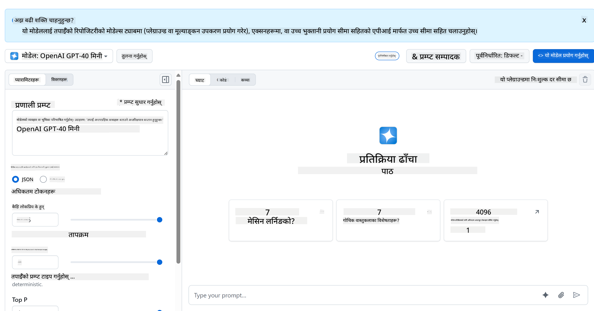
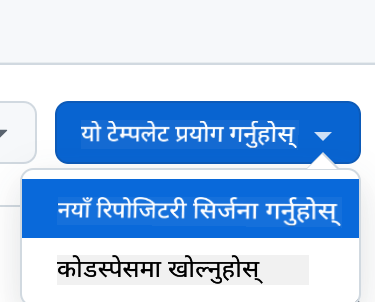
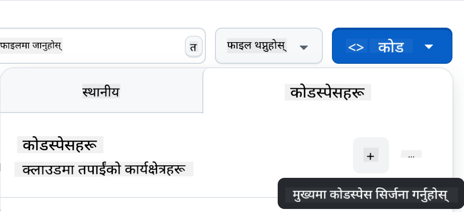

<!--
CO_OP_TRANSLATOR_METADATA:
{
  "original_hash": "11cf36165c243947b6cd85b88cf6faa6",
  "translation_date": "2025-09-01T16:52:33+00:00",
  "source_file": "9-chat-project/README.md",
  "language_code": "ne"
}
-->
# च्याट प्रोजेक्ट

यो च्याट प्रोजेक्टले GitHub Models प्रयोग गरेर च्याट सहायक कसरी निर्माण गर्ने देखाउँछ।

तपाईंले तयार प्रोजेक्ट यस्तो देखिनेछ:


थप सन्दर्भको लागि, जेनेरेटिभ एआई प्रयोग गरेर च्याट सहायक निर्माण गर्नु एआई सिक्न सुरु गर्ने उत्कृष्ट तरिका हो। यस पाठको क्रममा, तपाईंले जेनेरेटिभ एआईलाई वेब एपमा कसरी एकीकृत गर्ने सिक्नुहुनेछ। सुरु गरौं।

## जेनेरेटिभ एआईसँग जडान गर्नुहोस्

ब्याकएन्डको लागि, हामी GitHub Models प्रयोग गर्दैछौं। यो एक उत्कृष्ट सेवा हो जसले तपाईंलाई निःशुल्क एआई प्रयोग गर्न सक्षम बनाउँछ। यसको प्लेग्राउन्डमा जानुहोस् र तपाईंले रोजेको ब्याकएन्ड भाषासँग मेल खाने कोड प्राप्त गर्नुहोस्। यो [GitHub Models Playground](https://github.com/marketplace/models/azure-openai/gpt-4o-mini/playground) मा यस्तो देखिन्छ।



जसरी भनिएको थियो, "Code" ट्याब र तपाईंले रोजेको रनटाइम चयन गर्नुहोस्।


### Python प्रयोग गर्दै

यस अवस्थामा हामी Python चयन गर्छौं, जसले हामीलाई यो कोड चयन गर्नुपर्ने हुन्छ:

```python
"""Run this model in Python

> pip install openai
"""
import os
from openai import OpenAI

# To authenticate with the model you will need to generate a personal access token (PAT) in your GitHub settings. 
# Create your PAT token by following instructions here: https://docs.github.com/en/authentication/keeping-your-account-and-data-secure/managing-your-personal-access-tokens
client = OpenAI(
    base_url="https://models.github.ai/inference",
    api_key=os.environ["GITHUB_TOKEN"],
)

response = client.chat.completions.create(
    messages=[
        {
            "role": "system",
            "content": "",
        },
        {
            "role": "user",
            "content": "What is the capital of France?",
        }
    ],
    model="openai/gpt-4o-mini",
    temperature=1,
    max_tokens=4096,
    top_p=1
)

print(response.choices[0].message.content)
```

यो कोडलाई पुन: प्रयोगयोग्य बनाउनका लागि सफा गरौं:

```python
def call_llm(prompt: str, system_message: str):
    response = client.chat.completions.create(
        messages=[
            {
                "role": "system",
                "content": system_message,
            },
            {
                "role": "user",
                "content": prompt,
            }
        ],
        model="openai/gpt-4o-mini",
        temperature=1,
        max_tokens=4096,
        top_p=1
    )

    return response.choices[0].message.content
```

यो `call_llm` फङ्सनको साथमा हामीले अब एक प्रम्प्ट र सिस्टम प्रम्प्ट लिन सक्छौं र फङ्सनले नतिजा फर्काउँछ।

### एआई सहायकलाई अनुकूलित गर्नुहोस्

यदि तपाईं एआई सहायकलाई अनुकूलित गर्न चाहनुहुन्छ भने, तपाईंले सिस्टम प्रम्प्टलाई यसरी भरिदिएर यसको व्यवहार निर्दिष्ट गर्न सक्नुहुन्छ:

```python
call_llm("Tell me about you", "You're Albert Einstein, you only know of things in the time you were alive")
```

## वेब एपीआई मार्फत यसलाई सार्वजनिक गर्नुहोस्

उत्तम, हामीले एआई भाग पूरा गर्यौं, अब हेर्नुहोस् कि हामी यसलाई वेब एपीआईमा कसरी एकीकृत गर्न सक्छौं। वेब एपीआईको लागि, हामी Flask प्रयोग गर्दैछौं, तर कुनै पनि वेब फ्रेमवर्क राम्रो हुनेछ। यसको कोड हेर्नुहोस्:

### Python प्रयोग गर्दै

```python
# api.py
from flask import Flask, request, jsonify
from llm import call_llm
from flask_cors import CORS

app = Flask(__name__)
CORS(app)   # *   example.com

@app.route("/", methods=["GET"])
def index():
    return "Welcome to this API. Call POST /hello with 'message': 'my message' as JSON payload"


@app.route("/hello", methods=["POST"])
def hello():
    # get message from request body  { "message": "do this taks for me" }
    data = request.get_json()
    message = data.get("message", "")

    response = call_llm(message, "You are a helpful assistant.")
    return jsonify({
        "response": response
    })

if __name__ == "__main__":
    app.run(host="0.0.0.0", port=5000)
```

यहाँ, हामीले एक फ्लास्क एपीआई सिर्जना गर्छौं र "/" र "/chat" नामक डिफल्ट रुट परिभाषित गर्छौं। पछिल्लो रुट हाम्रो फ्रन्टएन्डले प्रश्नहरू पठाउन प्रयोग गर्न सकिन्छ।

*llm.py* लाई एकीकृत गर्नका लागि हामीले निम्न गर्नुपर्छ:

- `call_llm` फङ्सनलाई इम्पोर्ट गर्नुहोस्:

   ```python
   from llm import call_llm
   from flask import Flask, request
   ```

- "/chat" रुटबाट यसलाई कल गर्नुहोस्:

   ```python
   @app.route("/hello", methods=["POST"])
   def hello():
      # get message from request body  { "message": "do this taks for me" }
      data = request.get_json()
      message = data.get("message", "")

      response = call_llm(message, "You are a helpful assistant.")
      return jsonify({
         "response": response
      })
   ```

   यहाँ हामीले आउने अनुरोधलाई पार्स गरेर JSON बडीबाट `message` प्रोपर्टी प्राप्त गर्छौं। त्यसपछि हामीले LLMलाई यसरी कल गर्छौं:

   ```python
   response = call_llm(message, "You are a helpful assistant")

   # return the response as JSON
   return jsonify({
      "response": response 
   })
   ```

उत्तम, अब हामीले आवश्यक सबै काम गर्यौं।

## Cors कन्फिगर गर्नुहोस्

हामीले Cors, अर्थात् क्रस-ओरिजिन रिसोर्स सेयरिङ सेटअप गरेको कुरा उल्लेख गर्नुपर्छ। यसको मतलब हाम्रो ब्याकएन्ड र फ्रन्टएन्ड फरक पोर्टमा चल्ने भएकाले, हामीले फ्रन्टएन्डलाई ब्याकएन्डमा कल गर्न अनुमति दिनुपर्छ।

### Python प्रयोग गर्दै

*api.py* मा यस्तो कोड छ जसले यसलाई सेटअप गर्छ:

```python
from flask_cors import CORS

app = Flask(__name__)
CORS(app)   # *   example.com
```

हाल "*", अर्थात् सबै ओरिजिनलाई अनुमति दिइएको छ, जुन अलि असुरक्षित छ। हामीले यो उत्पादनमा जाँदा सीमित गर्नुपर्छ।

## आफ्नो प्रोजेक्ट चलाउनुहोस्

आफ्नो प्रोजेक्ट चलाउन, तपाईंले पहिले आफ्नो ब्याकएन्ड सुरु गर्नुपर्छ र त्यसपछि फ्रन्टएन्ड।

### Python प्रयोग गर्दै

ठिक छ, हामीसँग *llm.py* र *api.py* छ, अब ब्याकएन्डसँग यो कसरी काम गर्ने बनाउने? दुई कुरा गर्नुपर्छ:

- डिपेन्डेन्सीहरू इन्स्टल गर्नुहोस्:

   ```sh
   cd backend
   python -m venv venv
   source ./venv/bin/activate

   pip install openai flask flask-cors openai
   ```

- एपीआई सुरु गर्नुहोस्:

   ```sh
   python api.py
   ```

   यदि तपाईं Codespaces मा हुनुहुन्छ भने, तपाईंले एडिटरको तल्लो भागमा Ports मा जानुपर्छ, त्यसमा राइट-क्लिक गरेर "Port Visibility" मा क्लिक गर्नुहोस् र "Public" चयन गर्नुहोस्।

### फ्रन्टएन्डमा काम गर्नुहोस्

अब हामीसँग एपीआई चलिरहेको छ, यसका लागि फ्रन्टएन्ड बनाउँ। एक न्यूनतम फ्रन्टएन्ड जसलाई हामी क्रमिक रूपमा सुधार गर्नेछौं। *frontend* फोल्डरमा निम्न सिर्जना गर्नुहोस्:

```text
backend/
frontend/
index.html
app.js
styles.css
```

**index.html** बाट सुरु गरौं:

```html
<html>
    <head>
        <link rel="stylesheet" href="styles.css">
    </head>
    <body>
      <form>
        <textarea id="messages"></textarea>
        <input id="input" type="text" />
        <button type="submit" id="sendBtn">Send</button>  
      </form>  
      <script src="app.js" />
    </body>
</html>    
```

माथिको कोड च्याट विन्डोलाई समर्थन गर्न आवश्यक न्यूनतम हो। यसमा टेक्स्ट एरिया छ जहाँ सन्देशहरू देखिन्छन्, इनपुट छ जहाँ सन्देश टाइप गर्न सकिन्छ, र बटन छ जसले सन्देशलाई ब्याकएन्डमा पठाउँछ। अब *app.js* मा JavaScript हेर्नुहोस्।

**app.js**

```js
// app.js

(function(){
  // 1. set up elements  
  const messages = document.getElementById("messages");
  const form = document.getElementById("form");
  const input = document.getElementById("input");

  const BASE_URL = "change this";
  const API_ENDPOINT = `${BASE_URL}/hello`;

  // 2. create a function that talks to our backend
  async function callApi(text) {
    const response = await fetch(API_ENDPOINT, {
      method: "POST",
      headers: { "Content-Type": "application/json" },
      body: JSON.stringify({ message: text })
    });
    let json = await response.json();
    return json.response;
  }

  // 3. add response to our textarea
  function appendMessage(text, role) {
    const el = document.createElement("div");
    el.className = `message ${role}`;
    el.innerHTML = text;
    messages.appendChild(el);
  }

  // 4. listen to submit events
  form.addEventListener("submit", async(e) => {
    e.preventDefault();
   // someone clicked the button in the form
   
   // get input
   const text = input.value.trim();

   appendMessage(text, "user")

   // reset it
   input.value = '';

   const reply = await callApi(text);

   // add to messages
   appendMessage(reply, "assistant");

  })
})();
```

कोडलाई खण्ड अनुसार हेर्नुहोस्:

- १) यहाँ हामीले सबै एलिमेन्टहरूको रेफरेन्स लिन्छौं जसलाई पछि कोडमा प्रयोग गरिन्छ।
- २) यस खण्डमा, हामीले एक फङ्सन बनाउँछौं जसले बिल्ट-इन `fetch` मेथड प्रयोग गरेर हाम्रो ब्याकएन्डलाई कल गर्छ।
- ३) `appendMessage` ले प्रतिक्रियाहरू र प्रयोगकर्ताले टाइप गरेको सन्देश थप्न मद्दत गर्छ।
- ४) यहाँ हामीले सबमिट इभेन्टलाई सुन्छौं र इनपुट फिल्ड पढ्छौं, प्रयोगकर्ताको सन्देश टेक्स्ट एरियामा राख्छौं, एपीआईलाई कल गर्छौं, र प्रतिक्रियालाई टेक्स्ट एरियामा देखाउँछौं।

अब स्टाइलिङ हेर्नुहोस्, यहाँ तपाईंले आफ्नो इच्छाअनुसार डिजाइन गर्न सक्नुहुन्छ, तर केही सुझावहरू यहाँ छन्:

**styles.css**

```
.message {
    background: #222;
    box-shadow: 0 0 0 10px orange;
    padding: 10px:
    margin: 5px;
}

.message.user {
    background: blue;
}

.message.assistant {
    background: grey;
} 
```

यी तीन क्लासहरूले सन्देशलाई सहायकबाट आएको हो वा प्रयोगकर्ताबाट आएको हो भनेर फरक देखाउन स्टाइल गर्छ। प्रेरित हुन चाहनुहुन्छ भने `solution/frontend/styles.css` फोल्डर हेर्नुहोस्।

### Base Url परिवर्तन गर्नुहोस्

यहाँ एउटा कुरा सेट गरिएको थिएन, त्यो हो `BASE_URL`, यो ब्याकएन्ड सुरु नभएसम्म थाहा हुँदैन। यसलाई सेट गर्न:

- यदि तपाईंले एपीआई स्थानीय रूपमा चलाउनुहुन्छ भने, यसलाई `http://localhost:5000` जस्तो सेट गर्नुपर्छ।
- यदि Codespaces मा चलाउनुहुन्छ भने, यो "[name]app.github.dev" जस्तो देखिन्छ।

## असाइनमेन्ट

आफ्नै *project* फोल्डर बनाउनुहोस् जसको सामग्री यस प्रकार हो:

```text
project/
  frontend/
    index.html
    app.js
    styles.css
  backend/
    ...
```

माथि उल्लेख गरिएको सामग्रीलाई प्रतिलिपि गर्नुहोस् तर आफ्नो इच्छाअनुसार अनुकूलित गर्न स्वतन्त्र हुनुहोस्।

## समाधान

[Solution](./solution/README.md)

## बोनस

एआई सहायकको व्यक्तित्व परिवर्तन गर्न प्रयास गर्नुहोस्।

### Python को लागि

जब तपाईं *api.py* मा `call_llm` कल गर्नुहुन्छ, तपाईंले दोस्रो आर्गुमेन्टलाई आफ्नो इच्छाअनुसार परिवर्तन गर्न सक्नुहुन्छ, उदाहरणका लागि:

```python
call_llm(message, "You are Captain Picard")
```

### फ्रन्टएन्ड

CSS र टेक्स्टलाई पनि आफ्नो इच्छाअनुसार परिवर्तन गर्नुहोस्, त्यसैले *index.html* र *styles.css* मा परिवर्तन गर्नुहोस्।

## सारांश

उत्तम, तपाईंले एआई प्रयोग गरेर व्यक्तिगत सहायक कसरी बनाउने भन्ने कुरा सुरुबाट सिक्नुभयो। हामीले GitHub Models, Python मा ब्याकएन्ड, र HTML, CSS, JavaScript मा फ्रन्टएन्ड प्रयोग गरेर यो गरेका छौं।

## Codespaces सेटअप गर्नुहोस्

- यहाँ जानुहोस्: [Web Dev For Beginners repo](https://github.com/microsoft/Web-Dev-For-Beginners)
- टेम्प्लेटबाट सिर्जना गर्नुहोस् (GitHub मा लगइन भएको सुनिश्चित गर्नुहोस्) माथि-दायाँ कुनामा:

    

- एकपटक तपाईंको रिपोमा, Codespace सिर्जना गर्नुहोस्:

    

    यसले तपाईंलाई काम गर्न सक्ने वातावरण सुरु गर्नुपर्छ।

---

**अस्वीकरण**:  
यो दस्तावेज़ AI अनुवाद सेवा [Co-op Translator](https://github.com/Azure/co-op-translator) प्रयोग गरेर अनुवाद गरिएको छ। हामी शुद्धताको लागि प्रयास गर्छौं, तर कृपया ध्यान दिनुहोस् कि स्वचालित अनुवादहरूमा त्रुटिहरू वा अशुद्धताहरू हुन सक्छ। यसको मूल भाषा मा रहेको मूल दस्तावेज़लाई आधिकारिक स्रोत मानिनुपर्छ। महत्वपूर्ण जानकारीको लागि, व्यावसायिक मानव अनुवाद सिफारिस गरिन्छ। यस अनुवादको प्रयोगबाट उत्पन्न हुने कुनै पनि गलतफहमी वा गलत व्याख्याको लागि हामी जिम्मेवार हुने छैनौं।