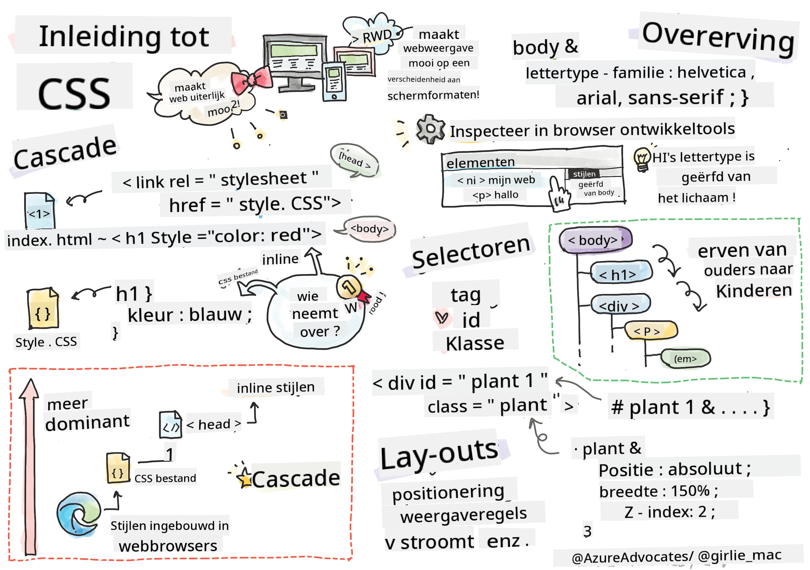
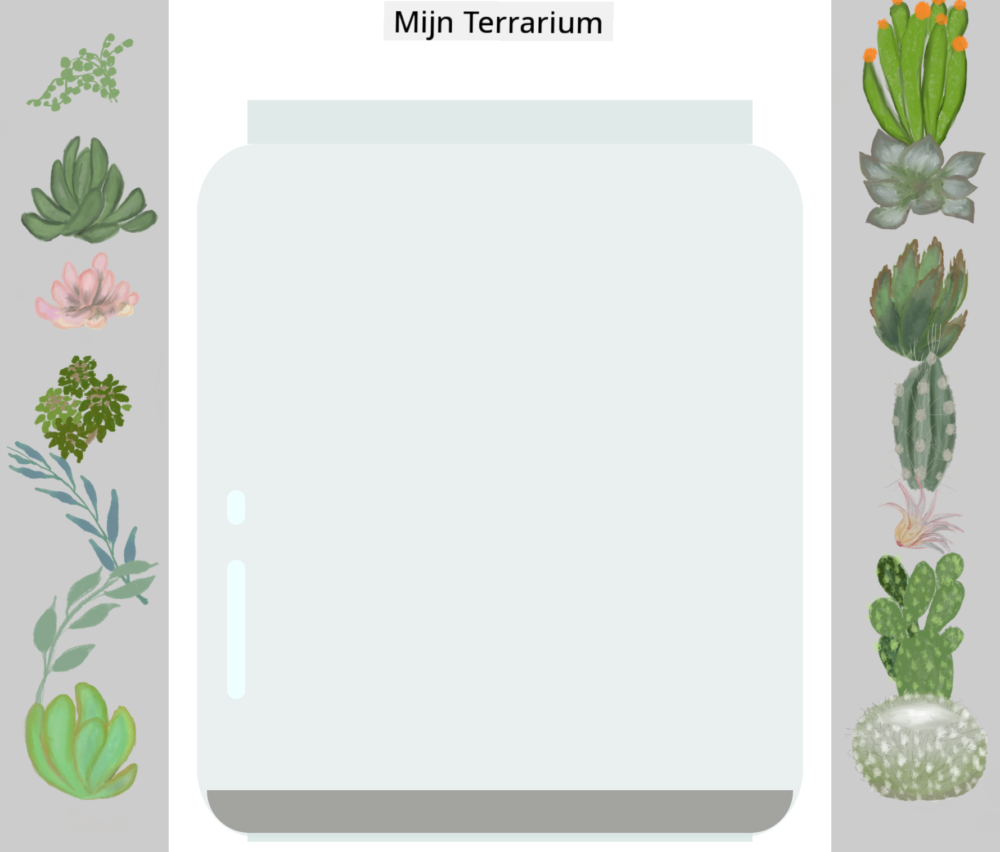

<!--
CO_OP_TRANSLATOR_METADATA:
{
  "original_hash": "acb5ae00cde004304296bb97da8ff4c3",
  "translation_date": "2025-08-29T01:01:47+00:00",
  "source_file": "3-terrarium/2-intro-to-css/README.md",
  "language_code": "nl"
}
-->
# Terrarium Project Deel 2: Introductie tot CSS

  
> Sketchnote door [Tomomi Imura](https://twitter.com/girlie_mac)

## Pre-Lecture Quiz

[Pre-lecture quiz](https://ff-quizzes.netlify.app/web/quiz/17)

### Introductie

CSS, oftewel Cascading Style Sheets, lost een belangrijk probleem op in webontwikkeling: hoe je je website er mooi uit kunt laten zien. Het stylen van je apps maakt ze gebruiksvriendelijker en aantrekkelijker; je kunt CSS ook gebruiken om Responsive Web Design (RWD) te creëren, zodat je apps er goed uitzien, ongeacht het schermformaat waarop ze worden weergegeven. CSS gaat niet alleen over het uiterlijk van je app; de specificatie bevat ook animaties en transformaties die geavanceerde interacties mogelijk maken. De CSS Working Group helpt bij het onderhouden van de huidige CSS-specificaties; je kunt hun werk volgen op de [site van het World Wide Web Consortium](https://www.w3.org/Style/CSS/members).

> Let op, CSS is een taal die evolueert, net als alles op het web, en niet alle browsers ondersteunen de nieuwste delen van de specificatie. Controleer je implementaties altijd via [CanIUse.com](https://caniuse.com).

In deze les gaan we stijlen toevoegen aan ons online terrarium en meer leren over verschillende CSS-concepten: de cascade, overerving, het gebruik van selectors, positionering en het bouwen van layouts met CSS. Tijdens dit proces zullen we het terrarium opmaken en het daadwerkelijke terrarium creëren.

### Vereiste

Je moet de HTML voor je terrarium al hebben gebouwd en klaar hebben om te stylen.

> Bekijk de video

> 
> [](https://www.youtube.com/watch?v=6yIdOIV9p1I)

### Taak

Maak in je terrarium-map een nieuw bestand aan genaamd `style.css`. Importeer dat bestand in de `<head>`-sectie:

```html
<link rel="stylesheet" href="./style.css" />
```

---

## De Cascade

Cascading Style Sheets bevatten het idee dat stijlen 'cascaderen', wat betekent dat de toepassing van een stijl wordt geleid door de prioriteit ervan. Stijlen die door een website-auteur zijn ingesteld, hebben prioriteit boven die van een browser. Inline stijlen hebben prioriteit boven stijlen die in een extern stylesheet zijn ingesteld.

### Taak

Voeg de inline stijl "color: red" toe aan je `<h1>`-tag:

```HTML
<h1 style="color: red">My Terrarium</h1>
```

Voeg vervolgens de volgende code toe aan je `style.css`-bestand:

```CSS
h1 {
 color: blue;
}
```

✅ Welke kleur wordt weergegeven in je webapp? Waarom? Kun je een manier vinden om stijlen te overschrijven? Wanneer zou je dit willen doen, of waarom niet?

---

## Overerving

Stijlen worden geërfd van een voorouderstijl naar een afstammeling, zodat geneste elementen de stijlen van hun ouders overnemen.

### Taak

Stel het lettertype van de body in op een bepaald lettertype en controleer of een genest element hetzelfde lettertype gebruikt:

```CSS
body {
	font-family: helvetica, arial, sans-serif;
}
```

Open de console van je browser en ga naar het tabblad 'Elements' om het lettertype van de H1 te bekijken. Het erft zijn lettertype van de body, zoals aangegeven in de browser:


✅ Kun je een geneste stijl een andere eigenschap laten overerven?

---

## CSS Selectors

### Tags

Tot nu toe heeft je `style.css`-bestand slechts een paar tags gestyled, en de app ziet er nogal vreemd uit:

```CSS
body {
	font-family: helvetica, arial, sans-serif;
}

h1 {
	color: #3a241d;
	text-align: center;
}
```

Deze manier van het stylen van een tag geeft je controle over unieke elementen, maar je moet de stijlen van veel planten in je terrarium beheren. Om dat te doen, moet je gebruik maken van CSS-selectors.

### Id's

Voeg wat stijl toe om de linker- en rechtercontainers op te maken. Omdat er slechts één linkercontainer en één rechtercontainer is, hebben ze id's gekregen in de markup. Om ze te stylen, gebruik je `#`:

```CSS
#left-container {
	background-color: #eee;
	width: 15%;
	left: 0px;
	top: 0px;
	position: absolute;
	height: 100%;
	padding: 10px;
}

#right-container {
	background-color: #eee;
	width: 15%;
	right: 0px;
	top: 0px;
	position: absolute;
	height: 100%;
	padding: 10px;
}
```

Hier heb je deze containers met absolute positionering aan de uiterste linker- en rechterkant van het scherm geplaatst en percentages gebruikt voor hun breedte, zodat ze kunnen schalen voor kleine mobiele schermen.

✅ Deze code wordt vaak herhaald en is dus niet "DRY" (Don't Repeat Yourself); kun je een betere manier vinden om deze id's te stylen, misschien met een combinatie van een id en een class? Je zou de markup en de CSS moeten aanpassen:

```html
<div id="left-container" class="container"></div>
```

### Classes

In het bovenstaande voorbeeld heb je twee unieke elementen op het scherm gestyled. Als je stijlen wilt toepassen op meerdere elementen op het scherm, kun je CSS-classes gebruiken. Doe dit om de planten in de linker- en rechtercontainers op te maken.

Merk op dat elke plant in de HTML-markup een combinatie van id's en classes heeft. De id's worden hier gebruikt door de JavaScript die je later toevoegt om de plaatsing van de terrariumplanten te manipuleren. De classes geven echter alle planten een bepaalde stijl.

```html
<div class="plant-holder">
	
</div>
```

Voeg het volgende toe aan je `style.css`-bestand:

```CSS
.plant-holder {
	position: relative;
	height: 13%;
	left: -10px;
}

.plant {
	position: absolute;
	max-width: 150%;
	max-height: 150%;
	z-index: 2;
}
```

Opvallend in dit fragment is de mix van relatieve en absolute positionering, wat we in de volgende sectie zullen behandelen. Bekijk hoe hoogtes worden behandeld met percentages:

Je stelt de hoogte van de plantenhouder in op 13%, een goed getal om ervoor te zorgen dat alle planten in elke verticale container worden weergegeven zonder dat scrollen nodig is.

Je stelt de plantenhouder in om naar links te bewegen, zodat de planten meer gecentreerd zijn binnen hun container. De afbeeldingen hebben een grote hoeveelheid transparante achtergrond om ze beter verplaatsbaar te maken, dus moeten ze naar links worden verschoven om beter op het scherm te passen.

Vervolgens krijgt de plant zelf een maximale breedte van 150%. Dit zorgt ervoor dat deze kleiner wordt als de browser kleiner wordt. Probeer je browser te verkleinen; de planten blijven in hun containers maar schalen naar beneden om te passen.

Ook opvallend is het gebruik van z-index, waarmee de relatieve hoogte van een element wordt geregeld (zodat de planten bovenop de container zitten en in het terrarium lijken te zitten).

✅ Waarom heb je zowel een plantenhouder- als een plant-CSS-selector nodig?

## CSS Positionering

Het combineren van positioneringseigenschappen (er zijn statische, relatieve, vaste, absolute en plakkerige posities) kan een beetje lastig zijn, maar als het goed wordt gedaan, geeft het je goede controle over de elementen op je pagina's.

Absoluut gepositioneerde elementen worden gepositioneerd ten opzichte van hun dichtstbijzijnde gepositioneerde voorouders, en als die er niet zijn, worden ze gepositioneerd volgens het documentbody.

Relatief gepositioneerde elementen worden gepositioneerd op basis van de CSS-instructies om hun plaatsing aan te passen ten opzichte van hun oorspronkelijke positie.

In ons voorbeeld is de `plant-holder` een relatief gepositioneerd element dat is gepositioneerd binnen een absoluut gepositioneerde container. Het resulterende gedrag is dat de zijbalkcontainers links en rechts worden vastgezet, en de plantenhouder genest is, zichzelf aanpast binnen de zijbalken en ruimte geeft voor de planten om in een verticale rij te worden geplaatst.

> De `plant` zelf heeft ook absolute positionering, wat nodig is om het verplaatsbaar te maken, zoals je in de volgende les zult ontdekken.

✅ Experimenteer met het wisselen van de soorten positionering van de zijcontainers en de plantenhouder. Wat gebeurt er?

## CSS Layouts

Nu ga je wat je hebt geleerd gebruiken om het terrarium zelf te bouwen, allemaal met CSS!

Stijl eerst de `.terrarium`-div-kinderen als een afgeronde rechthoek met CSS:

```CSS
.jar-walls {
	height: 80%;
	width: 60%;
	background: #d1e1df;
	border-radius: 1rem;
	position: absolute;
	bottom: 0.5%;
	left: 20%;
	opacity: 0.5;
	z-index: 1;
}

.jar-top {
	width: 50%;
	height: 5%;
	background: #d1e1df;
	position: absolute;
	bottom: 80.5%;
	left: 25%;
	opacity: 0.7;
	z-index: 1;
}

.jar-bottom {
	width: 50%;
	height: 1%;
	background: #d1e1df;
	position: absolute;
	bottom: 0%;
	left: 25%;
	opacity: 0.7;
}

.dirt {
	width: 60%;
	height: 5%;
	background: #3a241d;
	position: absolute;
	border-radius: 0 0 1rem 1rem;
	bottom: 1%;
	left: 20%;
	opacity: 0.7;
	z-index: -1;
}
```

Let op het gebruik van percentages hier. Als je je browser verkleint, kun je zien hoe de pot ook schaalt. Let ook op de breedtes en hoogtes in percentages voor de pot-elementen en hoe elk element absoluut in het midden is gepositioneerd, vastgezet aan de onderkant van het viewport.

We gebruiken ook `rem` voor de border-radius, een lettertype-relatieve lengte. Lees meer over dit type relatieve meting in de [CSS-specificatie](https://www.w3.org/TR/css-values-3/#font-relative-lengths).

✅ Probeer de kleuren en de doorzichtigheid van de pot en de aarde te veranderen. Wat gebeurt er? Waarom?

---

## 🚀Uitdaging

Voeg een 'bubbel'-glans toe aan de linkeronderkant van de pot om deze er meer als glas uit te laten zien. Je gaat de `.jar-glossy-long` en `.jar-glossy-short` stylen om eruit te zien als een gereflecteerde glans. Zo zou het eruit zien:



Om de post-lecture quiz te voltooien, doorloop deze Learn-module: [Style your HTML app with CSS](https://docs.microsoft.com/learn/modules/build-simple-website/4-css-basics/?WT.mc_id=academic-77807-sagibbon)

## Post-Lecture Quiz

[Post-lecture quiz](https://ff-quizzes.netlify.app/web/quiz/18)

## Review & Zelfstudie

CSS lijkt bedrieglijk eenvoudig, maar er zijn veel uitdagingen bij het proberen een app perfect te stylen voor alle browsers en schermformaten. CSS-Grid en Flexbox zijn tools die zijn ontwikkeld om het werk wat gestructureerder en betrouwbaarder te maken. Leer over deze tools door [Flexbox Froggy](https://flexboxfroggy.com/) en [Grid Garden](https://codepip.com/games/grid-garden/) te spelen.

## Opdracht

[CSS Refactoring](assignment.md)

---

**Disclaimer**:  
Dit document is vertaald met behulp van de AI-vertalingsservice [Co-op Translator](https://github.com/Azure/co-op-translator). Hoewel we streven naar nauwkeurigheid, willen we u erop wijzen dat geautomatiseerde vertalingen fouten of onnauwkeurigheden kunnen bevatten. Het originele document in de oorspronkelijke taal moet worden beschouwd als de gezaghebbende bron. Voor kritieke informatie wordt professionele menselijke vertaling aanbevolen. Wij zijn niet aansprakelijk voor misverstanden of verkeerde interpretaties die voortvloeien uit het gebruik van deze vertaling.