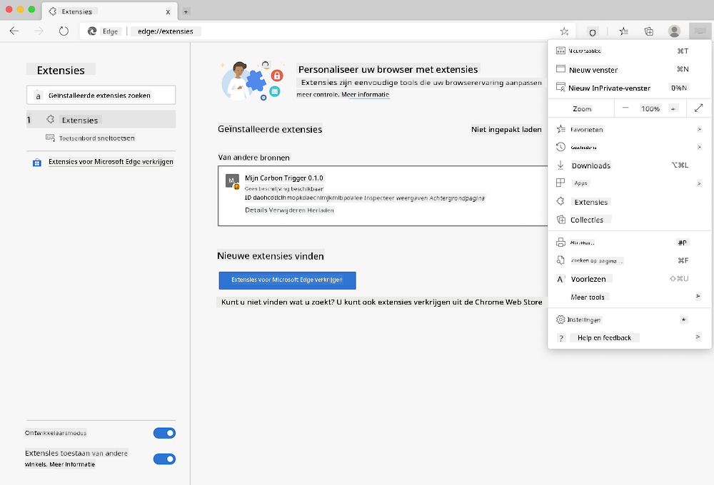

<!--
CO_OP_TRANSLATOR_METADATA:
{
  "original_hash": "26fd39046d264ba185dcb086d3a8cf3e",
  "translation_date": "2025-08-27T20:46:28+00:00",
  "source_file": "5-browser-extension/start/README.md",
  "language_code": "nl"
}
-->
# Carbon Trigger Browserextensie: Startcode

Met behulp van de CO2 Signal API van tmrow om elektriciteitsgebruik bij te houden, bouw je een browserextensie zodat je direct in je browser een herinnering hebt over hoe zwaar het elektriciteitsgebruik in jouw regio is. Door deze extensie ad hoc te gebruiken, kun je beter beslissingen nemen over je activiteiten op basis van deze informatie.


## Aan de slag

Je moet [npm](https://npmjs.com) geïnstalleerd hebben. Download een kopie van deze code naar een map op je computer.

Installeer alle benodigde pakketten:

```
npm install
```

Bouw de extensie met webpack:

```
npm run build
```

Om de extensie op Edge te installeren, gebruik je het menu met de 'drie puntjes' rechtsboven in de browser om het Extensiepaneel te vinden. Selecteer daar 'Load Unpacked' om een nieuwe extensie te laden. Open de map 'dist' wanneer daarom wordt gevraagd, en de extensie wordt geladen. Om de extensie te gebruiken, heb je een API-sleutel nodig voor de CO2 Signal API ([hier aanvragen via e-mail](https://www.co2signal.com/) - voer je e-mailadres in op deze pagina) en de [code voor jouw regio](http://api.electricitymap.org/v3/zones) die overeenkomt met de [Electricity Map](https://www.electricitymap.org/map) (in Boston gebruik ik bijvoorbeeld 'US-NEISO').



Zodra de API-sleutel en regio zijn ingevoerd in de interface van de extensie, zou de gekleurde stip in de browserextensiebalk moeten veranderen om het energiegebruik in jouw regio weer te geven. Het geeft je ook een aanwijzing over welke energie-intensieve activiteiten geschikt zijn om te doen. Het idee achter dit 'stip'-systeem is geïnspireerd door de [Energy Lollipop-extensie](https://energylollipop.com/) voor emissies in Californië.

---

**Disclaimer**:  
Dit document is vertaald met behulp van de AI-vertalingsservice [Co-op Translator](https://github.com/Azure/co-op-translator). Hoewel we streven naar nauwkeurigheid, dient u zich ervan bewust te zijn dat geautomatiseerde vertalingen fouten of onnauwkeurigheden kunnen bevatten. Het originele document in zijn oorspronkelijke taal moet worden beschouwd als de gezaghebbende bron. Voor cruciale informatie wordt professionele menselijke vertaling aanbevolen. Wij zijn niet aansprakelijk voor eventuele misverstanden of verkeerde interpretaties die voortvloeien uit het gebruik van deze vertaling.