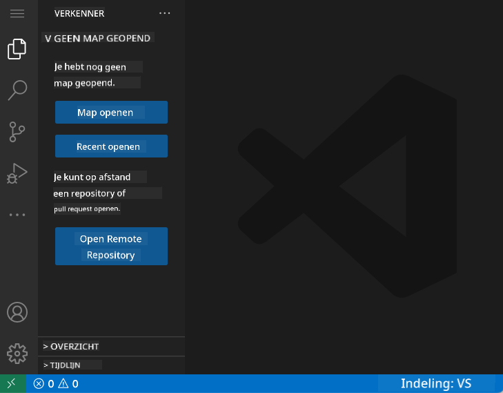
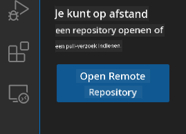
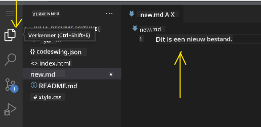
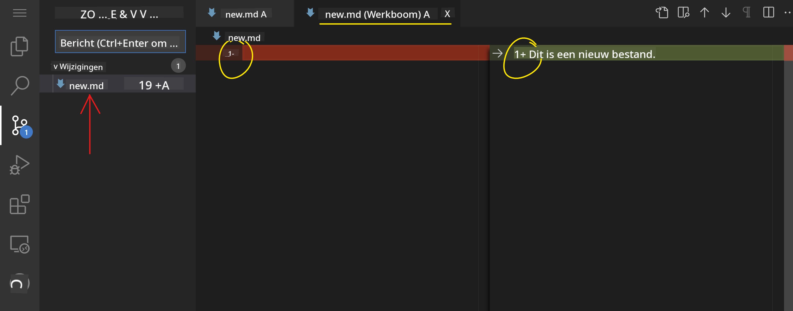
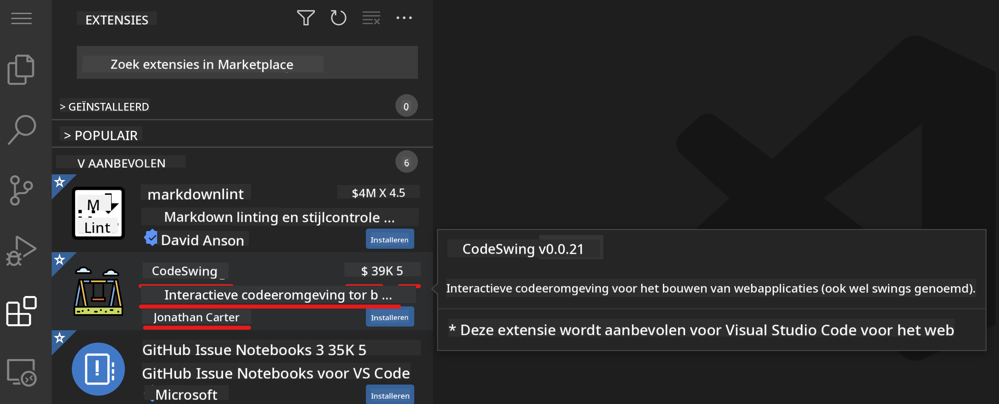
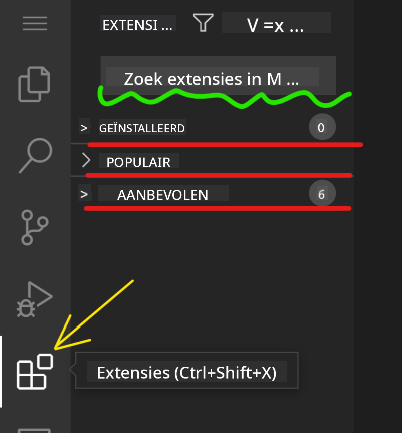
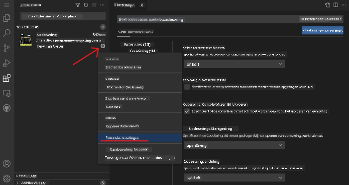

<!--
CO_OP_TRANSLATOR_METADATA:
{
  "original_hash": "1ba61d96a11309a2a6ea507496dcf7e5",
  "translation_date": "2025-08-29T01:02:49+00:00",
  "source_file": "8-code-editor/1-using-a-code-editor/README.md",
  "language_code": "nl"
}
-->
# Een code-editor gebruiken

Deze les behandelt de basisprincipes van het gebruik van [VSCode.dev](https://vscode.dev), een webgebaseerde code-editor, zodat je wijzigingen kunt aanbrengen in je code en kunt bijdragen aan een project zonder iets op je computer te installeren.

<!----
TODO: voeg een optionele afbeelding toe

> Sketchnote door [Auteur naam](https://example.com)
---->

<!---
## Pre-Lecture Quiz
[Pre-lecture quiz](https://ff-quizzes.netlify.app/web/quiz/3)
---->

## Leerdoelen

In deze les leer je:

- Een code-editor gebruiken in een codeproject
- Wijzigingen bijhouden met versiebeheer
- De editor aanpassen voor ontwikkeling

### Vereisten

Voordat je begint, moet je een account aanmaken bij [GitHub](https://github.com). Ga naar [GitHub](https://github.com/) en maak een account aan als je dat nog niet hebt gedaan.

### Introductie

Een code-editor is een essentieel hulpmiddel voor het schrijven van programma's en het samenwerken aan bestaande codeprojecten. Zodra je de basisprincipes van een editor begrijpt en weet hoe je de functies kunt gebruiken, kun je ze toepassen bij het schrijven van code.

## Aan de slag met VSCode.dev

[VSCode.dev](https://vscode.dev) is een code-editor op het web. Je hoeft niets te installeren om het te gebruiken, net zoals je een andere website opent. Om te beginnen met de editor, open je de volgende link: [https://vscode.dev](https://vscode.dev). Als je niet bent ingelogd bij [GitHub](https://github.com/), volg dan de aanwijzingen om in te loggen of een nieuw account aan te maken en log vervolgens in.

Zodra het is geladen, zou het er ongeveer zo uit moeten zien:



Er zijn drie hoofdsecties, beginnend vanaf de meest linkse kant en bewegend naar rechts:

1. De _activiteitsbalk_ met enkele pictogrammen, zoals het vergrootglas 🔎, het tandwiel ⚙️, en een paar andere.
2. De uitgebreide activiteitsbalk die standaard de _Explorer_ toont, ook wel de _zijbalk_ genoemd.
3. En tot slot het codegebied aan de rechterkant.

Klik op elk van de pictogrammen om een ander menu weer te geven. Als je klaar bent, klik je op de _Explorer_ zodat je terug bent waar je begon.

Wanneer je begint met het maken van code of het wijzigen van bestaande code, gebeurt dit in het grootste gebied aan de rechterkant. Je gebruikt dit gebied ook om bestaande code te visualiseren, wat je hierna zult doen.

## Een GitHub-repository openen

Het eerste wat je nodig hebt, is een GitHub-repository openen. Er zijn meerdere manieren om een repository te openen. In deze sectie zie je twee verschillende manieren waarop je een repository kunt openen om wijzigingen aan te brengen.

### 1. Met de editor

Gebruik de editor zelf om een externe repository te openen. Als je naar [VSCode.dev](https://vscode.dev) gaat, zie je een knop _"Open Remote Repository"_:



Je kunt ook de opdrachtpalet gebruiken. De opdrachtpalet is een invoerveld waarin je een woord kunt typen dat deel uitmaakt van een opdracht of actie om de juiste opdracht te vinden en uit te voeren. Gebruik het menu linksboven, selecteer vervolgens _View_, en kies daarna _Command Palette_, of gebruik de volgende sneltoets: Ctrl-Shift-P (op MacOS is dat Command-Shift-P).


Wanneer het menu opent, typ je _open remote repository_, en selecteer je de eerste optie. Meerdere repositories waar je deel van uitmaakt of die je onlangs hebt geopend, worden weergegeven. Je kunt ook een volledige GitHub-URL gebruiken om er een te selecteren. Gebruik de volgende URL en plak deze in het veld:

```
https://github.com/microsoft/Web-Dev-For-Beginners
```

✅ Als het succesvol is, zie je alle bestanden van deze repository geladen in de teksteditor.

### 2. Met de URL

Je kunt ook direct een URL gebruiken om een repository te laden. Bijvoorbeeld, de volledige URL voor de huidige repository is [https://github.com/microsoft/Web-Dev-For-Beginners](https://github.com/microsoft/Web-Dev-For-Beginners), maar je kunt het GitHub-domein vervangen door `VSCode.dev/github` en de repository direct laden. De resulterende URL zou zijn [https://vscode.dev/github/microsoft/Web-Dev-For-Beginners](https://vscode.dev/github/microsoft/Web-Dev-For-Beginners).

## Bestanden bewerken

Zodra je de repository in de browser/vscode.dev hebt geopend, is de volgende stap het maken van updates of wijzigingen aan het project.

### 1. Een nieuw bestand maken

Je kunt een bestand maken in een bestaande map of in de hoofdmap. Om een nieuw bestand te maken, open je een locatie/map waar je het bestand wilt opslaan en selecteer je het pictogram _'Nieuw bestand ...'_ op de activiteitsbalk _(links)_, geef het een naam en druk op enter.


### 2. Een bestand bewerken en opslaan in de repository

Het gebruik van vscode.dev is handig wanneer je snel updates wilt maken aan je project zonder software lokaal te laden.  
Om je code bij te werken, klik je op het pictogram 'Explorer', ook te vinden op de activiteitsbalk, om bestanden en mappen in de repository te bekijken.  
Selecteer een bestand om het te openen in het codegebied, maak je wijzigingen en sla op.



Wanneer je klaar bent met het bijwerken van je project, selecteer je het pictogram _`source control`_, dat alle nieuwe wijzigingen bevat die je hebt aangebracht in je repository.

Om de wijzigingen te bekijken die je hebt aangebracht, selecteer je de bestanden in de map `Changes` in de uitgebreide activiteitsbalk. Dit opent een 'Working Tree' waarin je visueel de wijzigingen kunt zien die je hebt aangebracht in het bestand. Rood geeft een verwijdering aan, terwijl groen een toevoeging aangeeft.



Als je tevreden bent met de wijzigingen die je hebt aangebracht, beweeg je over de map `Changes` en klik je op de knop `+` om de wijzigingen te stage-en. Stage-en betekent simpelweg dat je je wijzigingen voorbereidt om ze te committen naar GitHub.

Als je echter niet tevreden bent met sommige wijzigingen en ze wilt verwijderen, beweeg je over de map `Changes` en selecteer je het pictogram `undo`.

Typ vervolgens een `commit message` _(Een beschrijving van de wijziging die je hebt aangebracht in het project)_, klik op het `check-pictogram` om te committen en je wijzigingen te pushen.

Wanneer je klaar bent met werken aan je project, selecteer je het pictogram `hamburgermenu` linksboven om terug te keren naar de repository op github.com.


## Extensies gebruiken

Het installeren van extensies in VSCode stelt je in staat om nieuwe functies en opties voor een aangepaste ontwikkelomgeving toe te voegen aan je editor om je ontwikkelworkflow te verbeteren. Deze extensies helpen je ook ondersteuning toe te voegen voor meerdere programmeertalen en zijn vaak generieke extensies of taalgebaseerde extensies.

Om door de lijst van alle beschikbare extensies te bladeren, klik je op het pictogram _`Extensies`_ op de activiteitsbalk en begin je de naam van de extensie te typen in het tekstveld met het label _'Search Extensions in Marketplace'_.  
Je ziet een lijst met extensies, elk met **de naam van de extensie, de naam van de uitgever, een korte beschrijving, het aantal downloads** en **een sterbeoordeling**.



Je kunt ook alle eerder geïnstalleerde extensies bekijken door de map _`Installed`_ uit te vouwen, populaire extensies die door de meeste ontwikkelaars worden gebruikt in de map _`Popular`_ en aanbevolen extensies voor jou, gebaseerd op gebruikers in dezelfde werkruimte of op je recent geopende bestanden, in de map _`Recommended`_.



### 1. Extensies installeren

Om een extensie te installeren, typ je de naam van de extensie in het zoekveld en klik je erop om aanvullende informatie over de extensie te bekijken in het codegebied zodra deze verschijnt in de uitgebreide activiteitsbalk.

Je kunt op de _blauwe install-knop_ klikken in de uitgebreide activiteitsbalk om te installeren of de install-knop gebruiken die verschijnt in het codegebied zodra je de extensie selecteert om aanvullende informatie te laden.


### 2. Extensies aanpassen

Na het installeren van de extensie moet je mogelijk het gedrag aanpassen en personaliseren op basis van je voorkeuren. Om dit te doen, selecteer je het pictogram Extensies, en deze keer verschijnt je extensie in de map _Installed_, klik op het _**tandwielpictogram**_ en navigeer naar _Extensions Setting_.



### 3. Extensies beheren

Na het installeren en gebruiken van je extensie biedt vscode.dev opties om je extensie te beheren op basis van verschillende behoeften. Bijvoorbeeld, je kunt ervoor kiezen om:

- **Uitschakelen:** _(Je schakelt een extensie tijdelijk uit wanneer je deze niet meer nodig hebt, maar niet volledig wilt verwijderen)_

    Selecteer de geïnstalleerde extensie in de uitgebreide activiteitsbalk > klik op het tandwielpictogram > selecteer 'Disable' of 'Disable (Workspace)' **OF** Open de extensie in het codegebied en klik op de blauwe Disable-knop.

- **Verwijderen:** Selecteer de geïnstalleerde extensie in de uitgebreide activiteitsbalk > klik op het tandwielpictogram > selecteer 'Uninstall' **OF** Open de extensie in het codegebied en klik op de blauwe Uninstall-knop.

---

## Opdracht

[Maak een cv-website met vscode.dev](https://github.com/microsoft/Web-Dev-For-Beginners/blob/main/8-code-editor/1-using-a-code-editor/assignment.md)

<!----
## Post-Lecture Quiz
[Post-lecture quiz](https://ff-quizzes.netlify.app/web/quiz/4)
---->

## Review & Zelfstudie

Lees meer over [VSCode.dev](https://code.visualstudio.com/docs/editor/vscode-web?WT.mc_id=academic-0000-alfredodeza) en enkele van de andere functies ervan.

---

**Disclaimer**:  
Dit document is vertaald met behulp van de AI-vertalingsservice [Co-op Translator](https://github.com/Azure/co-op-translator). Hoewel we streven naar nauwkeurigheid, dient u zich ervan bewust te zijn dat geautomatiseerde vertalingen fouten of onnauwkeurigheden kunnen bevatten. Het originele document in de oorspronkelijke taal moet worden beschouwd als de gezaghebbende bron. Voor kritieke informatie wordt professionele menselijke vertaling aanbevolen. Wij zijn niet aansprakelijk voor misverstanden of verkeerde interpretaties die voortvloeien uit het gebruik van deze vertaling.