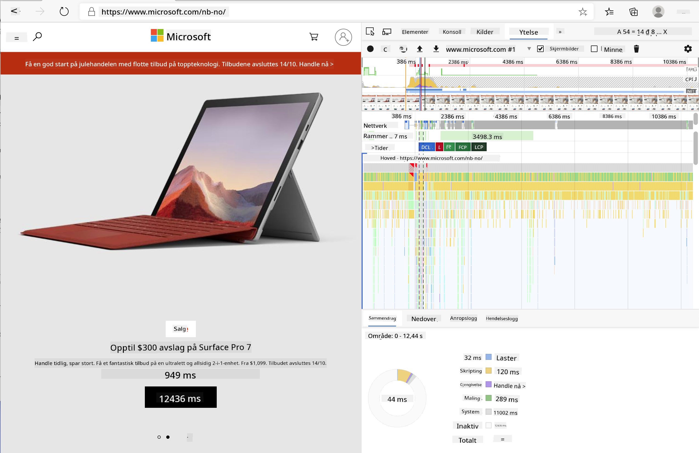
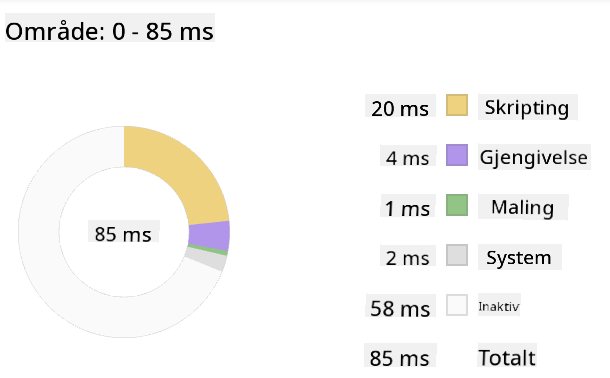

<!--
CO_OP_TRANSLATOR_METADATA:
{
  "original_hash": "49b58721a71cfda824e2f3e1f46908c6",
  "translation_date": "2025-08-29T08:32:11+00:00",
  "source_file": "5-browser-extension/3-background-tasks-and-performance/README.md",
  "language_code": "no"
}
-->
# Nettleserutvidelsesprosjekt Del 3: Lær om bakgrunnsoppgaver og ytelse

## Quiz før forelesning

[Quiz før forelesning](https://ff-quizzes.netlify.app/web/quiz/27)

### Introduksjon

I de to siste leksjonene i dette modulen lærte du hvordan du bygger et skjema og et visningsområde for data hentet fra en API. Dette er en veldig standard måte å skape en webtilstedeværelse på nettet. Du lærte til og med hvordan du håndterer asynkron datainnhenting. Nettleserutvidelsen din er nesten ferdig.

Det gjenstår å håndtere noen bakgrunnsoppgaver, inkludert oppdatering av fargen på utvidelsens ikon, så dette er et godt tidspunkt å snakke om hvordan nettleseren håndterer denne typen oppgaver. La oss tenke på disse nettleseroppgavene i sammenheng med ytelsen til webressursene dine mens du bygger dem.

## Grunnleggende om webytelse

> "Nettstedytelse handler om to ting: hvor raskt siden lastes, og hvor raskt koden på den kjører." -- [Zack Grossbart](https://www.smashingmagazine.com/2012/06/javascript-profiling-chrome-developer-tools/)

Temaet om hvordan du gjør nettstedene dine lynraske på alle slags enheter, for alle slags brukere, i alle slags situasjoner, er ikke overraskende omfattende. Her er noen punkter å huske på mens du bygger enten et standard webprosjekt eller en nettleserutvidelse.

Det første du må gjøre for å sikre at nettstedet ditt kjører effektivt, er å samle data om ytelsen. Det første stedet å gjøre dette er i utviklerverktøyene til nettleseren din. I Edge kan du velge "Innstillinger og mer"-knappen (ikonet med tre prikker øverst til høyre i nettleseren), deretter navigere til Flere verktøy > Utviklerverktøy og åpne Ytelse-fanen. Du kan også bruke hurtigtastene `Ctrl` + `Shift` + `I` på Windows eller `Option` + `Command` + `I` på Mac for å åpne utviklerverktøyene.

Ytelse-fanen inneholder et profileringsverktøy. Åpne et nettsted (prøv for eksempel [https://www.microsoft.com](https://www.microsoft.com/?WT.mc_id=academic-77807-sagibbon)) og klikk på 'Record'-knappen, deretter oppdater nettstedet. Stopp opptaket når som helst, og du vil kunne se rutinene som genereres for 'script', 'render' og 'paint' av nettstedet:



✅ Besøk [Microsoft-dokumentasjonen](https://docs.microsoft.com/microsoft-edge/devtools-guide/performance/?WT.mc_id=academic-77807-sagibbon) om Ytelse-panelet i Edge

> Tips: For å få en nøyaktig måling av nettstedets oppstartstid, tøm nettleserens cache.

Velg elementer i profilens tidslinje for å zoome inn på hendelser som skjer mens siden din lastes.

Få et øyeblikksbilde av sidens ytelse ved å velge en del av profilens tidslinje og se på oppsummeringspanelet:



Sjekk hendelseslogg-panelet for å se om noen hendelser tok lengre tid enn 15 ms:


✅ Bli kjent med profileringsverktøyet ditt! Åpne utviklerverktøyene på dette nettstedet og se om det er noen flaskehalser. Hva er den tregest lastende ressursen? Den raskeste?

## Profileringstester

Generelt er det noen "problemområder" som enhver webutvikler bør være oppmerksom på når de bygger et nettsted for å unngå ubehagelige overraskelser når det er tid for å distribuere til produksjon.

**Ressursstørrelser**: Nettet har blitt 'tyngre', og dermed tregere, de siste årene. Noe av denne vekten har å gjøre med bruken av bilder.

✅ Se gjennom [Internet Archive](https://httparchive.org/reports/page-weight) for en historisk oversikt over sidens vekt og mer.

En god praksis er å sørge for at bildene dine er optimalisert og levert i riktig størrelse og oppløsning for brukerne dine.

**DOM-traverseringer**: Nettleseren må bygge sitt Document Object Model basert på koden du skriver, så det er i interesse av god sideytelse å holde taggene minimale, og kun bruke og style det siden trenger. I denne sammenhengen kan overflødig CSS knyttet til en side optimaliseres; stiler som bare trenger å brukes på én side, trenger for eksempel ikke å inkluderes i hovedstilarket.

**JavaScript**: Hver JavaScript-utvikler bør være oppmerksom på 'render-blokkerende' skript som må lastes før resten av DOM kan traverseres og males til nettleseren. Vurder å bruke `defer` med dine inline-skript (som det gjøres i Terrarium-modulen).

✅ Prøv noen nettsteder på en [Site Speed Test-nettside](https://www.webpagetest.org/) for å lære mer om de vanlige testene som gjøres for å bestemme nettstedets ytelse.

Nå som du har en idé om hvordan nettleseren gjengir ressursene du sender til den, la oss se på de siste tingene du må gjøre for å fullføre utvidelsen din:

### Lag en funksjon for å beregne farge

Arbeid i `/src/index.js`, og legg til en funksjon kalt `calculateColor()` etter serien av `const`-variabler du satte for å få tilgang til DOM:

```JavaScript
function calculateColor(value) {
	let co2Scale = [0, 150, 600, 750, 800];
	let colors = ['#2AA364', '#F5EB4D', '#9E4229', '#381D02', '#381D02'];

	let closestNum = co2Scale.sort((a, b) => {
		return Math.abs(a - value) - Math.abs(b - value);
	})[0];
	console.log(value + ' is closest to ' + closestNum);
	let num = (element) => element > closestNum;
	let scaleIndex = co2Scale.findIndex(num);

	let closestColor = colors[scaleIndex];
	console.log(scaleIndex, closestColor);

	chrome.runtime.sendMessage({ action: 'updateIcon', value: { color: closestColor } });
}
```

Hva skjer her? Du sender inn en verdi (karbonintensiteten) fra API-kallet du fullførte i forrige leksjon, og deretter beregner du hvor nær verdien er indeksen som presenteres i fargearrayen. Deretter sender du den nærmeste fargeverdien videre til chrome runtime.

Chrome.runtime har [en API](https://developer.chrome.com/extensions/runtime) som håndterer alle slags bakgrunnsoppgaver, og utvidelsen din utnytter dette:

> "Bruk chrome.runtime API for å hente bakgrunnssiden, returnere detaljer om manifestet, og lytte til og svare på hendelser i app- eller utvidelseslivssyklusen. Du kan også bruke denne API-en til å konvertere relative URL-stier til fullstendige URL-er."

✅ Hvis du utvikler denne nettleserutvidelsen for Edge, kan det overraske deg at du bruker en chrome API. De nyere Edge-nettleserversjonene kjører på Chromium-nettlesermotoren, så du kan utnytte disse verktøyene.

> Merk, hvis du vil profilere en nettleserutvidelse, åpne utviklerverktøyene fra selve utvidelsen, da den er sin egen separate nettleserinstans.

### Sett en standard ikonfarge

Nå, i `init()`-funksjonen, sett ikonet til å være generisk grønt til å begynne med ved igjen å kalle chromes `updateIcon`-handling:

```JavaScript
chrome.runtime.sendMessage({
	action: 'updateIcon',
		value: {
			color: 'green',
		},
});
```

### Kall funksjonen, utfør kallet

Deretter, kall den funksjonen du nettopp opprettet ved å legge den til løftet som returneres av C02Signal API:

```JavaScript
//let CO2...
calculateColor(CO2);
```

Og til slutt, i `/dist/background.js`, legg til lytteren for disse bakgrunnsaksjonskallene:

```JavaScript
chrome.runtime.onMessage.addListener(function (msg, sender, sendResponse) {
	if (msg.action === 'updateIcon') {
		chrome.browserAction.setIcon({ imageData: drawIcon(msg.value) });
	}
});
//borrowed from energy lollipop extension, nice feature!
function drawIcon(value) {
	let canvas = document.createElement('canvas');
	let context = canvas.getContext('2d');

	context.beginPath();
	context.fillStyle = value.color;
	context.arc(100, 100, 50, 0, 2 * Math.PI);
	context.fill();

	return context.getImageData(50, 50, 100, 100);
}
```

I denne koden legger du til en lytter for eventuelle meldinger som kommer til bakgrunnsoppgavebehandleren. Hvis den kalles 'updateIcon', kjøres den neste koden for å tegne et ikon med riktig farge ved hjelp av Canvas API.

✅ Du vil lære mer om Canvas API i [Space Game-leksjonene](../../6-space-game/2-drawing-to-canvas/README.md).

Nå, bygg utvidelsen din på nytt (`npm run build`), oppdater og start utvidelsen, og se fargen endre seg. Er det et godt tidspunkt å ta en pause eller gjøre noe annet? Nå vet du!

Gratulerer, du har bygget en nyttig nettleserutvidelse og lært mer om hvordan nettleseren fungerer og hvordan du profilerer ytelsen.

---

## 🚀 Utfordring

Undersøk noen åpne kildekode-nettsteder som har eksistert lenge, og basert på deres GitHub-historie, se om du kan avgjøre hvordan de ble optimalisert for ytelse gjennom årene, hvis i det hele tatt. Hva er det vanligste problemet?

## Quiz etter forelesning

[Quiz etter forelesning](https://ff-quizzes.netlify.app/web/quiz/28)

## Gjennomgang og selvstudium

Vurder å melde deg på et [ytelsesnyhetsbrev](https://perf.email/)

Undersøk noen av måtene nettlesere vurderer webytelse ved å se gjennom ytelsespanelene i deres webverktøy. Finner du noen store forskjeller?

## Oppgave

[Analyser et nettsted for ytelse](assignment.md)

---

**Ansvarsfraskrivelse**:  
Dette dokumentet er oversatt ved hjelp av AI-oversettelsestjenesten [Co-op Translator](https://github.com/Azure/co-op-translator). Selv om vi tilstreber nøyaktighet, vær oppmerksom på at automatiske oversettelser kan inneholde feil eller unøyaktigheter. Det originale dokumentet på sitt opprinnelige språk bør anses som den autoritative kilden. For kritisk informasjon anbefales profesjonell menneskelig oversettelse. Vi er ikke ansvarlige for eventuelle misforståelser eller feiltolkninger som oppstår ved bruk av denne oversettelsen.