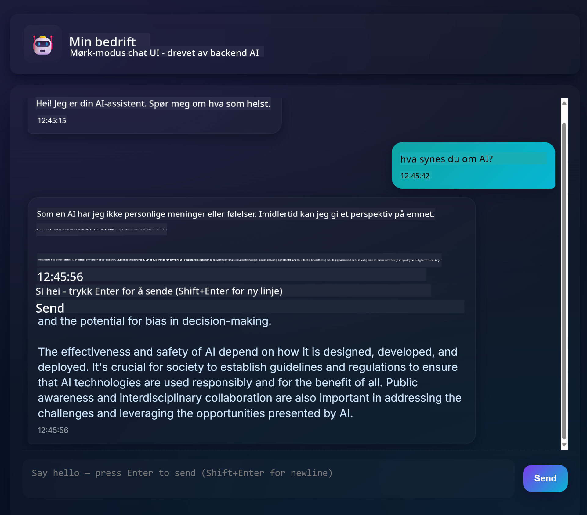
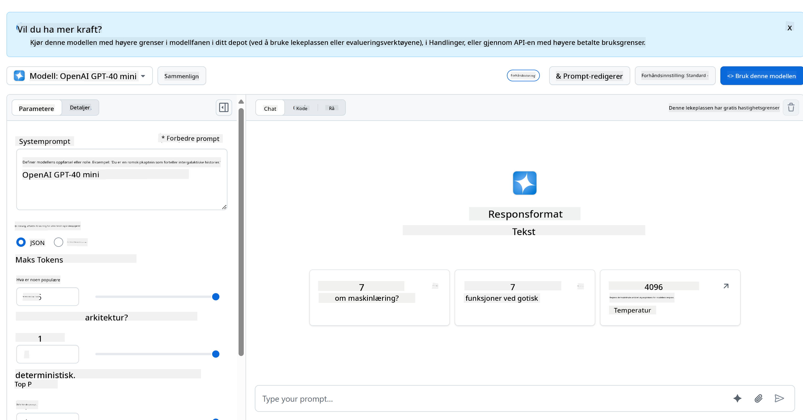
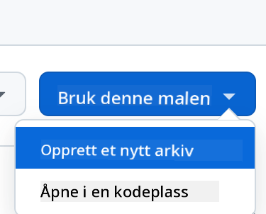
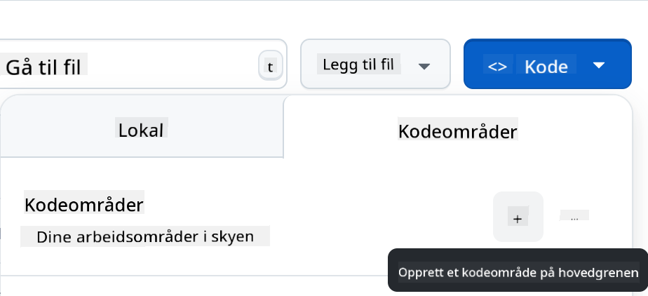

<!--
CO_OP_TRANSLATOR_METADATA:
{
  "original_hash": "11cf36165c243947b6cd85b88cf6faa6",
  "translation_date": "2025-09-01T16:56:50+00:00",
  "source_file": "9-chat-project/README.md",
  "language_code": "no"
}
-->
# Chat-prosjekt

Dette chat-prosjektet viser hvordan du kan bygge en Chat-assistent ved hjelp av GitHub Models.

Slik ser det ferdige prosjektet ut:



Litt kontekst: Å bygge chat-assistenter ved hjelp av generativ AI er en flott måte å begynne å lære om AI på. Det du vil lære her, er hvordan du integrerer generativ AI i en webapplikasjon gjennom denne leksjonen. La oss starte.

## Koble til generativ AI

For backend bruker vi GitHub Models. Det er en flott tjeneste som lar deg bruke AI gratis. Gå til deres playground og hent koden som tilsvarer ditt valgte backend-språk. Slik ser det ut på [GitHub Models Playground](https://github.com/marketplace/models/azure-openai/gpt-4o-mini/playground)



Som vi nevnte, velg fanen "Code" og ditt valgte runtime.


### Bruke Python

I dette tilfellet velger vi Python, noe som betyr at vi velger denne koden:

```python
"""Run this model in Python

> pip install openai
"""
import os
from openai import OpenAI

# To authenticate with the model you will need to generate a personal access token (PAT) in your GitHub settings. 
# Create your PAT token by following instructions here: https://docs.github.com/en/authentication/keeping-your-account-and-data-secure/managing-your-personal-access-tokens
client = OpenAI(
    base_url="https://models.github.ai/inference",
    api_key=os.environ["GITHUB_TOKEN"],
)

response = client.chat.completions.create(
    messages=[
        {
            "role": "system",
            "content": "",
        },
        {
            "role": "user",
            "content": "What is the capital of France?",
        }
    ],
    model="openai/gpt-4o-mini",
    temperature=1,
    max_tokens=4096,
    top_p=1
)

print(response.choices[0].message.content)
```

La oss rydde opp i denne koden litt slik at den kan gjenbrukes:

```python
def call_llm(prompt: str, system_message: str):
    response = client.chat.completions.create(
        messages=[
            {
                "role": "system",
                "content": system_message,
            },
            {
                "role": "user",
                "content": prompt,
            }
        ],
        model="openai/gpt-4o-mini",
        temperature=1,
        max_tokens=4096,
        top_p=1
    )

    return response.choices[0].message.content
```

Med denne funksjonen `call_llm` kan vi nå ta en prompt og en systemprompt, og funksjonen returnerer resultatet.

### Tilpasse AI-assistenten

Hvis du vil tilpasse AI-assistenten, kan du spesifisere hvordan du vil at den skal oppføre seg ved å fylle ut systemprompten slik:

```python
call_llm("Tell me about you", "You're Albert Einstein, you only know of things in the time you were alive")
```

## Eksponere det via et Web API

Flott, vi har AI-delen ferdig. La oss se hvordan vi kan integrere dette i et Web API. For Web API velger vi å bruke Flask, men hvilket som helst web-rammeverk burde fungere. La oss se koden for det:

### Bruke Python

```python
# api.py
from flask import Flask, request, jsonify
from llm import call_llm
from flask_cors import CORS

app = Flask(__name__)
CORS(app)   # *   example.com

@app.route("/", methods=["GET"])
def index():
    return "Welcome to this API. Call POST /hello with 'message': 'my message' as JSON payload"


@app.route("/hello", methods=["POST"])
def hello():
    # get message from request body  { "message": "do this taks for me" }
    data = request.get_json()
    message = data.get("message", "")

    response = call_llm(message, "You are a helpful assistant.")
    return jsonify({
        "response": response
    })

if __name__ == "__main__":
    app.run(host="0.0.0.0", port=5000)
```

Her oppretter vi et Flask-API og definerer en standardrute "/" og "/chat". Den siste er ment å brukes av frontend for å sende spørsmål til det.

For å integrere *llm.py*, her er hva vi må gjøre:

- Importer funksjonen `call_llm`:

   ```python
   from llm import call_llm
   from flask import Flask, request
   ```

- Kall den fra "/chat"-ruten:

   ```python
   @app.route("/hello", methods=["POST"])
   def hello():
      # get message from request body  { "message": "do this taks for me" }
      data = request.get_json()
      message = data.get("message", "")

      response = call_llm(message, "You are a helpful assistant.")
      return jsonify({
         "response": response
      })
   ```

   Her parser vi den innkommende forespørselen for å hente `message`-egenskapen fra JSON-bodyen. Deretter kaller vi LLM med dette kallet:

   ```python
   response = call_llm(message, "You are a helpful assistant")

   # return the response as JSON
   return jsonify({
      "response": response 
   })
   ```

Flott, nå har vi gjort det vi trenger.

## Konfigurere Cors

Vi bør nevne at vi setter opp noe som CORS, cross-origin resource sharing. Dette betyr at fordi backend og frontend vil kjøre på forskjellige porter, må vi tillate at frontend kan kalle backend.

### Bruke Python

Det er en kodebit i *api.py* som setter dette opp:

```python
from flask_cors import CORS

app = Flask(__name__)
CORS(app)   # *   example.com
```

Akkurat nå er det satt opp til å tillate "*" som er alle opprinnelser, og det er litt usikkert. Vi bør begrense det når vi går i produksjon.

## Kjør prosjektet ditt

For å kjøre prosjektet ditt må du starte opp backend først og deretter frontend.

### Bruke Python

Ok, så vi har *llm.py* og *api.py*. Hvordan kan vi få dette til å fungere med en backend? Vel, det er to ting vi må gjøre:

- Installer avhengigheter:

   ```sh
   cd backend
   python -m venv venv
   source ./venv/bin/activate

   pip install openai flask flask-cors openai
   ```

- Start API-et

   ```sh
   python api.py
   ```

   Hvis du er i Codespaces, må du gå til Ports nederst i editoren, høyreklikke på det og klikke "Port Visibility" og velge "Public".

### Jobbe med en frontend

Nå som vi har et API oppe og kjører, la oss lage en frontend for dette. En helt grunnleggende frontend som vi vil forbedre trinnvis. I en *frontend*-mappe, opprett følgende:

```text
backend/
frontend/
index.html
app.js
styles.css
```

La oss starte med **index.html**:

```html
<html>
    <head>
        <link rel="stylesheet" href="styles.css">
    </head>
    <body>
      <form>
        <textarea id="messages"></textarea>
        <input id="input" type="text" />
        <button type="submit" id="sendBtn">Send</button>  
      </form>  
      <script src="app.js" />
    </body>
</html>    
```

Dette er det absolutt minste du trenger for å støtte et chat-vindu, da det består av en tekstboks hvor meldinger vil bli vist, et input-felt for å skrive meldingen og en knapp for å sende meldingen til backend. La oss se på JavaScript i *app.js*.

**app.js**

```js
// app.js

(function(){
  // 1. set up elements  
  const messages = document.getElementById("messages");
  const form = document.getElementById("form");
  const input = document.getElementById("input");

  const BASE_URL = "change this";
  const API_ENDPOINT = `${BASE_URL}/hello`;

  // 2. create a function that talks to our backend
  async function callApi(text) {
    const response = await fetch(API_ENDPOINT, {
      method: "POST",
      headers: { "Content-Type": "application/json" },
      body: JSON.stringify({ message: text })
    });
    let json = await response.json();
    return json.response;
  }

  // 3. add response to our textarea
  function appendMessage(text, role) {
    const el = document.createElement("div");
    el.className = `message ${role}`;
    el.innerHTML = text;
    messages.appendChild(el);
  }

  // 4. listen to submit events
  form.addEventListener("submit", async(e) => {
    e.preventDefault();
   // someone clicked the button in the form
   
   // get input
   const text = input.value.trim();

   appendMessage(text, "user")

   // reset it
   input.value = '';

   const reply = await callApi(text);

   // add to messages
   appendMessage(reply, "assistant");

  })
})();
```

La oss gå gjennom koden seksjon for seksjon:

- 1) Her får vi en referanse til alle elementene vi vil referere til senere i koden.
- 2) I denne delen oppretter vi en funksjon som bruker den innebygde `fetch`-metoden for å kalle backend.
- 3) `appendMessage` hjelper med å legge til svar samt det du som bruker skriver.
- 4) Her lytter vi til submit-hendelsen, leser input-feltet, plasserer brukerens melding i tekstboksen, kaller API-et og viser svaret i tekstboksen.

La oss se på styling neste. Her kan du virkelig være kreativ og få det til å se ut som du vil, men her er noen forslag:

**styles.css**

```
.message {
    background: #222;
    box-shadow: 0 0 0 10px orange;
    padding: 10px:
    margin: 5px;
}

.message.user {
    background: blue;
}

.message.assistant {
    background: grey;
} 
```

Med disse tre klassene vil du style meldinger forskjellig avhengig av om de kommer fra assistenten eller deg som bruker. Hvis du vil bli inspirert, sjekk ut `solution/frontend/styles.css`-mappen.

### Endre Base URL

Det var én ting vi ikke satte her, og det var `BASE_URL`. Dette er ikke kjent før backend er startet. For å sette det:

- Hvis du kjører API lokalt, bør det settes til noe som `http://localhost:5000`.
- Hvis du kjører i Codespaces, bør det se ut som "[name]app.github.dev".

## Oppgave

Lag din egen mappe *project* med innhold som dette:

```text
project/
  frontend/
    index.html
    app.js
    styles.css
  backend/
    ...
```

Kopier innholdet fra det som ble instruert ovenfor, men føl deg fri til å tilpasse det etter eget ønske.

## Løsning

[Løsning](./solution/README.md)

## Bonus

Prøv å endre personligheten til AI-assistenten.

### For Python

Når du kaller `call_llm` i *api.py*, kan du endre det andre argumentet til det du ønsker, for eksempel:

```python
call_llm(message, "You are Captain Picard")
```

### Frontend

Endre også CSS og tekst etter eget ønske, så gjør endringer i *index.html* og *styles.css*.

## Oppsummering

Flott, du har lært fra bunnen av hvordan du lager en personlig assistent ved hjelp av AI. Vi har gjort dette ved hjelp av GitHub Models, en backend i Python og en frontend i HTML, CSS og JavaScript.

## Sett opp med Codespaces

- Naviger til: [Web Dev For Beginners repo](https://github.com/microsoft/Web-Dev-For-Beginners)
- Opprett fra en mal (sørg for at du er logget inn på GitHub) i øvre høyre hjørne:

    

- Når du er i repoet ditt, opprett en Codespace:

    

    Dette skal starte et miljø du nå kan jobbe med.

---

**Ansvarsfraskrivelse**:  
Dette dokumentet er oversatt ved hjelp av AI-oversettelsestjenesten [Co-op Translator](https://github.com/Azure/co-op-translator). Selv om vi streber etter nøyaktighet, vær oppmerksom på at automatiserte oversettelser kan inneholde feil eller unøyaktigheter. Det originale dokumentet på sitt opprinnelige språk bør anses som den autoritative kilden. For kritisk informasjon anbefales profesjonell menneskelig oversettelse. Vi er ikke ansvarlige for eventuelle misforståelser eller feiltolkninger som oppstår ved bruk av denne oversettelsen.