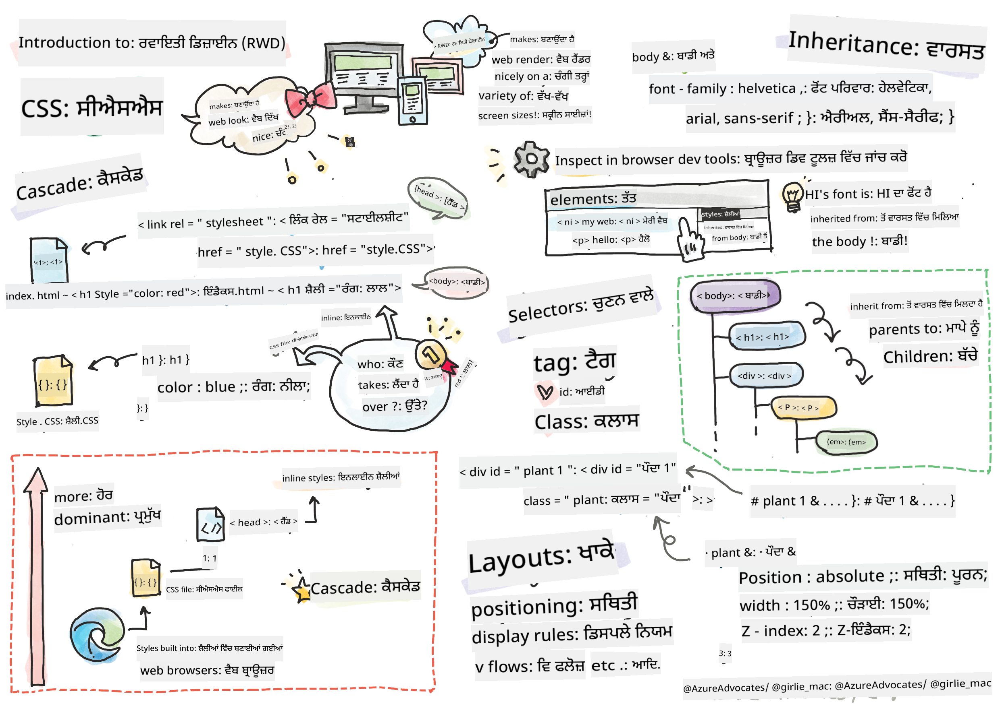
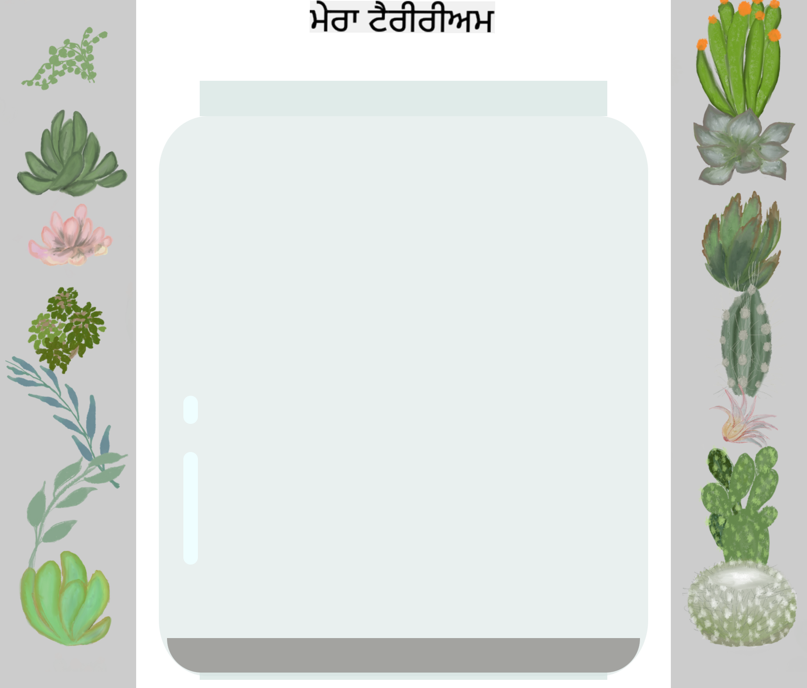

<!--
CO_OP_TRANSLATOR_METADATA:
{
  "original_hash": "acb5ae00cde004304296bb97da8ff4c3",
  "translation_date": "2025-08-28T17:09:14+00:00",
  "source_file": "3-terrarium/2-intro-to-css/README.md",
  "language_code": "pa"
}
-->
# ਟੈਰੀਰੀਅਮ ਪ੍ਰੋਜੈਕਟ ਭਾਗ 2: CSS ਦਾ ਪਰਚੇ


> ਸਕੈਚਨੋਟ [Tomomi Imura](https://twitter.com/girlie_mac) ਵੱਲੋਂ

## ਲੈਕਚਰ ਤੋਂ ਪਹਿਲਾਂ ਕਵਿਜ਼

[ਲੈਕਚਰ ਤੋਂ ਪਹਿਲਾਂ ਕਵਿਜ਼](https://ff-quizzes.netlify.app/web/quiz/17)

### ਪਰਚੇ

CSS, ਜਾਂ Cascading Style Sheets, ਵੈੱਬ ਡਿਵੈਲਪਮੈਂਟ ਦੀ ਇੱਕ ਮਹੱਤਵਪੂਰਨ ਸਮੱਸਿਆ ਦਾ ਹੱਲ ਕਰਦਾ ਹੈ: ਆਪਣੀ ਵੈੱਬਸਾਈਟ ਨੂੰ ਸੁੰਦਰ ਕਿਵੇਂ ਬਣਾਇਆ ਜਾਵੇ। ਆਪਣੇ ਐਪਸ ਨੂੰ ਸਜਾਉਣਾ ਉਨ੍ਹਾਂ ਨੂੰ ਜ਼ਿਆਦਾ ਵਰਤਣਯੋਗ ਅਤੇ ਸੁੰਦਰ ਬਣਾਉਂਦਾ ਹੈ; ਤੁਸੀਂ CSS ਦੀ ਵਰਤੋਂ ਕਰਕੇ Responsive Web Design (RWD) ਵੀ ਬਣਾ ਸਕਦੇ ਹੋ - ਜਿਸ ਨਾਲ ਤੁਹਾਡੇ ਐਪਸ ਕਿਸੇ ਵੀ ਸਕ੍ਰੀਨ ਸਾਈਜ਼ 'ਤੇ ਚੰਗੇ ਲੱਗਦੇ ਹਨ। CSS ਸਿਰਫ਼ ਤੁਹਾਡੇ ਐਪ ਨੂੰ ਸੁੰਦਰ ਬਣਾਉਣ ਬਾਰੇ ਨਹੀਂ ਹੈ; ਇਸ ਵਿੱਚ ਐਨੀਮੇਸ਼ਨ ਅਤੇ ਟ੍ਰਾਂਸਫਾਰਮ ਸ਼ਾਮਲ ਹਨ ਜੋ ਤੁਹਾਡੇ ਐਪਸ ਲਈ ਉੱਚ-ਪੱਧਰੀ ਇੰਟਰਐਕਸ਼ਨ ਨੂੰ ਯੋਗ ਕਰ ਸਕਦੇ ਹਨ। CSS ਵਰਕਿੰਗ ਗਰੁੱਪ ਮੌਜੂਦਾ CSS ਵਿਸ਼ੇਸ਼ਤਾਵਾਂ ਨੂੰ ਬਣਾਈ ਰੱਖਣ ਵਿੱਚ ਮਦਦ ਕਰਦਾ ਹੈ; ਤੁਸੀਂ ਉਨ੍ਹਾਂ ਦੇ ਕੰਮ ਨੂੰ [World Wide Web Consortium ਦੀ ਸਾਈਟ](https://www.w3.org/Style/CSS/members) 'ਤੇ ਫਾਲੋ ਕਰ ਸਕਦੇ ਹੋ।

> ਨੋਟ ਕਰੋ, CSS ਇੱਕ ਭਾਸ਼ਾ ਹੈ ਜੋ ਵੈੱਬ 'ਤੇ ਹਰ ਚੀਜ਼ ਵਾਂਗ ਵਿਕਸਿਤ ਹੁੰਦੀ ਹੈ, ਅਤੇ ਸਾਰੇ ਬ੍ਰਾਊਜ਼ਰ ਨਵੀਆਂ ਵਿਸ਼ੇਸ਼ਤਾਵਾਂ ਦਾ ਸਮਰਥਨ ਨਹੀਂ ਕਰਦੇ। ਹਮੇਸ਼ਾ [CanIUse.com](https://caniuse.com) ਦੀ ਸਲਾਹ ਲੈ ਕੇ ਆਪਣੀ ਇੰਪਲੀਮੈਂਟੇਸ਼ਨ ਦੀ ਜਾਂਚ ਕਰੋ।

ਇਸ ਪਾਠ ਵਿੱਚ, ਅਸੀਂ ਆਪਣੇ ਆਨਲਾਈਨ ਟੈਰੀਰੀਅਮ ਵਿੱਚ ਸਟਾਈਲਜ਼ ਸ਼ਾਮਲ ਕਰਨ ਜਾ ਰਹੇ ਹਾਂ ਅਤੇ CSS ਦੇ ਕਈ ਸੰਕਲਪਾਂ ਬਾਰੇ ਹੋਰ ਜਾਣਕਾਰੀ ਪ੍ਰਾਪਤ ਕਰਨ ਜਾ ਰਹੇ ਹਾਂ: ਕੈਸਕੇਡ, ਵਿਰਾਸਤ, ਅਤੇ ਸਿਲੈਕਟਰਜ਼ ਦੀ ਵਰਤੋਂ, ਪੋਜ਼ੀਸ਼ਨਿੰਗ, ਅਤੇ CSS ਦੀ ਵਰਤੋਂ ਕਰਕੇ ਲੇਆਉਟ ਬਣਾਉਣਾ। ਇਸ ਪ੍ਰਕਿਰਿਆ ਵਿੱਚ ਅਸੀਂ ਟੈਰੀਰੀਅਮ ਦਾ ਲੇਆਉਟ ਬਣਾਵਾਂਗੇ ਅਤੇ ਅਸਲ ਟੈਰੀਰੀਅਮ ਬਣਾਵਾਂਗੇ।

### ਪੂਰਵ ਸ਼ਰਤ

ਤੁਹਾਡੇ ਟੈਰੀਰੀਅਮ ਲਈ HTML ਬਣਾਈ ਹੋਈ ਹੋਣੀ ਚਾਹੀਦੀ ਹੈ ਅਤੇ ਸਟਾਈਲ ਕਰਨ ਲਈ ਤਿਆਰ ਹੋਣੀ ਚਾਹੀਦੀ ਹੈ।

> ਵੀਡੀਓ ਦੇਖੋ

> 
> [](https://www.youtube.com/watch?v=6yIdOIV9p1I)

### ਕੰਮ

ਆਪਣੇ ਟੈਰੀਰੀਅਮ ਫੋਲਡਰ ਵਿੱਚ, ਇੱਕ ਨਵੀਂ ਫਾਈਲ ਬਣਾਓ ਜਿਸਦਾ ਨਾਮ `style.css` ਹੋਵੇ। ਉਸ ਫਾਈਲ ਨੂੰ `<head>` ਸੈਕਸ਼ਨ ਵਿੱਚ ਇੰਪੋਰਟ ਕਰੋ:

```html
<link rel="stylesheet" href="./style.css" />
```

---

## ਕੈਸਕੇਡ

Cascading Style Sheets ਵਿੱਚ ਇਹ ਵਿਚਾਰ ਸ਼ਾਮਲ ਹੈ ਕਿ ਸਟਾਈਲ 'ਕੈਸਕੇਡ' ਕਰਦੇ ਹਨ ਜਿਸ ਨਾਲ ਸਟਾਈਲ ਦੇ ਲਾਗੂ ਕਰਨ ਦੀ ਪ੍ਰਾਥਮਿਕਤਾ ਦੁਆਰਾ ਮਾਰਗਦਰਸ਼ਨ ਹੁੰਦਾ ਹੈ। ਵੈੱਬਸਾਈਟ ਲੇਖਕ ਦੁਆਰਾ ਸੈਟ ਕੀਤੇ ਸਟਾਈਲਜ਼ ਬ੍ਰਾਊਜ਼ਰ ਦੁਆਰਾ ਸੈਟ ਕੀਤੇ ਸਟਾਈਲਜ਼ ਤੋਂ ਅਗੇਰੇ ਹੁੰਦੇ ਹਨ। 'ਇਨਲਾਈਨ' ਸੈਟ ਕੀਤੇ ਸਟਾਈਲਜ਼ ਬਾਹਰੀ ਸਟਾਈਲ ਸ਼ੀਟ ਵਿੱਚ ਸੈਟ ਕੀਤੇ ਸਟਾਈਲਜ਼ ਤੋਂ ਅਗੇਰੇ ਹੁੰਦੇ ਹਨ।

### ਕੰਮ

ਆਪਣੇ `<h1>` ਟੈਗ ਵਿੱਚ "color: red" ਇਨਲਾਈਨ ਸਟਾਈਲ ਸ਼ਾਮਲ ਕਰੋ:

```HTML
<h1 style="color: red">My Terrarium</h1>
```

ਫਿਰ, ਆਪਣੇ `style.css` ਫਾਈਲ ਵਿੱਚ ਹੇਠਾਂ ਦਿੱਤਾ ਕੋਡ ਸ਼ਾਮਲ ਕਰੋ:

```CSS
h1 {
 color: blue;
}
```

✅ ਤੁਹਾਡੇ ਵੈੱਬ ਐਪ ਵਿੱਚ ਕਿਹੜਾ ਰੰਗ ਦਿਖਾਈ ਦਿੰਦਾ ਹੈ? ਕਿਉਂ? ਕੀ ਤੁਸੀਂ ਸਟਾਈਲਜ਼ ਨੂੰ ਓਵਰਰਾਈਡ ਕਰਨ ਦਾ ਕੋਈ ਤਰੀਕਾ ਲੱਭ ਸਕਦੇ ਹੋ? ਤੁਸੀਂ ਇਹ ਕਿਉਂ ਕਰਨਾ ਚਾਹੁੰਦੇ ਹੋ ਜਾਂ ਕਿਉਂ ਨਹੀਂ?

---

## ਵਿਰਾਸਤ

ਸਟਾਈਲਜ਼ ਇੱਕ ਪੂਰਵਜ ਸਟਾਈਲ ਤੋਂ ਇੱਕ ਵੰਸ਼ਜ ਤੱਕ ਵਿਰਾਸਤ ਕੀਤੇ ਜਾਂਦੇ ਹਨ, ਜਿਸ ਨਾਲ ਨੇਸਟਡ ਐਲਿਮੈਂਟਸ ਆਪਣੇ ਮਾਤਾ-ਪਿਤਾ ਦੇ ਸਟਾਈਲਜ਼ ਨੂੰ ਵਿਰਾਸਤ ਕਰਦੇ ਹਨ।

### ਕੰਮ

ਬਾਡੀ ਦਾ ਫੋਂਟ ਇੱਕ ਦਿੱਤੇ ਗਏ ਫੋਂਟ 'ਤੇ ਸੈਟ ਕਰੋ, ਅਤੇ ਜਾਂਚ ਕਰੋ ਕਿ ਇੱਕ ਨੇਸਟਡ ਐਲਿਮੈਂਟ ਦਾ ਫੋਂਟ ਕੀ ਹੈ:

```CSS
body {
	font-family: helvetica, arial, sans-serif;
}
```

ਆਪਣੇ ਬ੍ਰਾਊਜ਼ਰ ਦੇ ਕਨਸੋਲ ਨੂੰ 'Elements' ਟੈਬ ਵਿੱਚ ਖੋਲ੍ਹੋ ਅਤੇ H1 ਦੇ ਫੋਂਟ ਨੂੰ ਦੇਖੋ। ਇਹ ਬ੍ਰਾਊਜ਼ਰ ਦੁਆਰਾ ਦਿੱਤੇ ਗਏ ਬਿਆਨ ਦੇ ਤੌਰ 'ਤੇ ਬਾਡੀ ਤੋਂ ਆਪਣਾ ਫੋਂਟ ਵਿਰਾਸਤ ਕਰਦਾ ਹੈ:


✅ ਕੀ ਤੁਸੀਂ ਇੱਕ ਨੇਸਟਡ ਸਟਾਈਲ ਨੂੰ ਇੱਕ ਵੱਖਰੇ ਗੁਣ ਨੂੰ ਵਿਰਾਸਤ ਕਰਨ ਲਈ ਬਣਾਉ ਸਕਦੇ ਹੋ?

---

## CSS ਸਿਲੈਕਟਰਜ਼

### ਟੈਗਜ਼

ਹੁਣ ਤੱਕ, ਤੁਹਾਡੇ `style.css` ਫਾਈਲ ਵਿੱਚ ਸਿਰਫ ਕੁਝ ਟੈਗ ਸਟਾਈਲ ਕੀਤੇ ਗਏ ਹਨ, ਅਤੇ ਐਪ ਕਾਫ਼ੀ ਅਜੀਬ ਲੱਗਦਾ ਹੈ:

```CSS
body {
	font-family: helvetica, arial, sans-serif;
}

h1 {
	color: #3a241d;
	text-align: center;
}
```

ਇਹ ਟੈਗ ਨੂੰ ਸਟਾਈਲ ਕਰਨ ਦਾ ਤਰੀਕਾ ਤੁਹਾਨੂੰ ਵਿਲੱਖਣ ਐਲਿਮੈਂਟਸ 'ਤੇ ਕੰਟਰੋਲ ਦਿੰਦਾ ਹੈ, ਪਰ ਤੁਹਾਨੂੰ ਆਪਣੇ ਟੈਰੀਰੀਅਮ ਵਿੱਚ ਕਈ ਪੌਦਿਆਂ ਦੇ ਸਟਾਈਲਜ਼ ਨੂੰ ਕੰਟਰੋਲ ਕਰਨ ਦੀ ਲੋੜ ਹੈ। ਇਸ ਲਈ, ਤੁਹਾਨੂੰ CSS ਸਿਲੈਕਟਰਜ਼ ਦੀ ਵਰਤੋਂ ਕਰਨ ਦੀ ਲੋੜ ਹੈ।

### Ids

ਖੱਬੇ ਅਤੇ ਸੱਜੇ ਕੰਟੇਨਰਜ਼ ਦਾ ਲੇਆਉਟ ਸਟਾਈਲ ਕਰਨ ਲਈ ਕੁਝ ਸਟਾਈਲ ਸ਼ਾਮਲ ਕਰੋ। ਕਿਉਂਕਿ ਮਾਰਕਅੱਪ ਵਿੱਚ ਸਿਰਫ ਇੱਕ ਖੱਬਾ ਕੰਟੇਨਰ ਅਤੇ ਸਿਰਫ ਇੱਕ ਸੱਜਾ ਕੰਟੇਨਰ ਹੈ, ਉਨ੍ਹਾਂ ਨੂੰ ids ਦਿੱਤੇ ਗਏ ਹਨ। ਉਨ੍ਹਾਂ ਨੂੰ ਸਟਾਈਲ ਕਰਨ ਲਈ, `#` ਦੀ ਵਰਤੋਂ ਕਰੋ:

```CSS
#left-container {
	background-color: #eee;
	width: 15%;
	left: 0px;
	top: 0px;
	position: absolute;
	height: 100%;
	padding: 10px;
}

#right-container {
	background-color: #eee;
	width: 15%;
	right: 0px;
	top: 0px;
	position: absolute;
	height: 100%;
	padding: 10px;
}
```

ਇੱਥੇ, ਤੁਸੀਂ ਇਹ ਕੰਟੇਨਰਜ਼ ਨੂੰ ਸਕ੍ਰੀਨ ਦੇ ਬਿਲਕੁਲ ਖੱਬੇ ਅਤੇ ਸੱਜੇ ਪਾਸੇ ਰੱਖਣ ਲਈ ਐਬਸੋਲਿਊਟ ਪੋਜ਼ੀਸ਼ਨਿੰਗ ਨਾਲ ਰੱਖਿਆ ਹੈ, ਅਤੇ ਉਨ੍ਹਾਂ ਦੀ ਚੌੜਾਈ ਲਈ ਪ੍ਰਤੀਸ਼ਤ ਦੀ ਵਰਤੋਂ ਕੀਤੀ ਹੈ ਤਾਂ ਕਿ ਉਹ ਛੋਟੇ ਮੋਬਾਈਲ ਸਕ੍ਰੀਨ ਲਈ ਸਕੇਲ ਕਰ ਸਕਣ।

✅ ਇਹ ਕੋਡ ਕਾਫ਼ੀ ਦੁਹਰਾਇਆ ਗਿਆ ਹੈ, ਇਸ ਲਈ "DRY" (Don't Repeat Yourself) ਨਹੀਂ ਹੈ; ਕੀ ਤੁਸੀਂ ids ਨੂੰ ਸਟਾਈਲ ਕਰਨ ਲਈ ਇੱਕ ਵਧੀਆ ਤਰੀਕਾ ਲੱਭ ਸਕਦੇ ਹੋ, ਸ਼ਾਇਦ ਇੱਕ id ਅਤੇ ਇੱਕ class ਨਾਲ? ਤੁਹਾਨੂੰ ਮਾਰਕਅੱਪ ਨੂੰ ਬਦਲਣ ਅਤੇ CSS ਨੂੰ ਰੀਫੈਕਟਰ ਕਰਨ ਦੀ ਲੋੜ ਹੋਵੇਗੀ:

```html
<div id="left-container" class="container"></div>
```

### ਕਲਾਸਾਂ

ਉਪਰੋਕਤ ਉਦਾਹਰਨ ਵਿੱਚ, ਤੁਸੀਂ ਸਕ੍ਰੀਨ 'ਤੇ ਦੋ ਵਿਲੱਖਣ ਐਲਿਮੈਂਟਸ ਨੂੰ ਸਟਾਈਲ ਕੀਤਾ। ਜੇ ਤੁਸੀਂ ਸਕ੍ਰੀਨ 'ਤੇ ਕਈ ਐਲਿਮੈਂਟਸ 'ਤੇ ਸਟਾਈਲਜ਼ ਲਾਗੂ ਕਰਨਾ ਚਾਹੁੰਦੇ ਹੋ, ਤਾਂ ਤੁਸੀਂ CSS ਕਲਾਸਾਂ ਦੀ ਵਰਤੋਂ ਕਰ ਸਕਦੇ ਹੋ। ਖੱਬੇ ਅਤੇ ਸੱਜੇ ਕੰਟੇਨਰਜ਼ ਵਿੱਚ ਪੌਦਿਆਂ ਦਾ ਲੇਆਉਟ ਕਰਨ ਲਈ ਇਹ ਕਰੋ।

ਧਿਆਨ ਦਿਓ ਕਿ HTML ਮਾਰਕਅੱਪ ਵਿੱਚ ਹਰ ਪੌਦੇ ਵਿੱਚ ids ਅਤੇ classes ਦਾ ਸੰਯੋਜਨ ਹੈ। ਇੱਥੇ ids ਦੀ ਵਰਤੋਂ ਜਾਵਾਸਕ੍ਰਿਪਟ ਦੁਆਰਾ ਕੀਤੀ ਜਾਵੇਗੀ ਜੋ ਤੁਸੀਂ ਬਾਅਦ ਵਿੱਚ ਟੈਰੀਰੀਅਮ ਪੌਦੇ ਦੀ ਪੋਜ਼ੀਸ਼ਨਿੰਗ ਨੂੰ ਮੈਨਿਪੁਲੇਟ ਕਰਨ ਲਈ ਸ਼ਾਮਲ ਕਰੋਗੇ। classes, ਹਾਲਾਂਕਿ, ਸਾਰੇ ਪੌਦਿਆਂ ਨੂੰ ਇੱਕ ਦਿੱਤਾ ਸਟਾਈਲ ਦਿੰਦੇ ਹਨ।

```html
<div class="plant-holder">
	
</div>
```

ਆਪਣੇ `style.css` ਫਾਈਲ ਵਿੱਚ ਹੇਠਾਂ ਦਿੱਤਾ ਕੋਡ ਸ਼ਾਮਲ ਕਰੋ:

```CSS
.plant-holder {
	position: relative;
	height: 13%;
	left: -10px;
}

.plant {
	position: absolute;
	max-width: 150%;
	max-height: 150%;
	z-index: 2;
}
```

ਇਸ ਸਨਿੱਪਟ ਵਿੱਚ ਗੌਰ ਕਰਨ ਵਾਲੀ ਗੱਲ ਇਹ ਹੈ ਕਿ ਰਿਲੇਟਿਵ ਅਤੇ ਐਬਸੋਲਿਊਟ ਪੋਜ਼ੀਸ਼ਨਿੰਗ ਦਾ ਮਿਸ਼ਰਣ ਹੈ, ਜਿਸਨੂੰ ਅਸੀਂ ਅਗਲੇ ਸੈਕਸ਼ਨ ਵਿੱਚ ਕਵਰ ਕਰਾਂਗੇ। ਉੱਚਾਈਆਂ ਨੂੰ ਪ੍ਰਤੀਸ਼ਤ ਦੁਆਰਾ ਸੰਭਾਲਣ ਦੇ ਤਰੀਕੇ ਨੂੰ ਦੇਖੋ:

ਤੁਸੀਂ ਪੌਦੇ ਦੇ ਹੋਲਡਰ ਦੀ ਉੱਚਾਈ 13% 'ਤੇ ਸੈਟ ਕੀਤੀ ਹੈ, ਇੱਕ ਚੰਗਾ ਅੰਕ ਇਹ ਯਕੀਨੀ ਬਣਾਉਣ ਲਈ ਕਿ ਸਾਰੇ ਪੌਦੇ ਹਰ ਵਰਟਿਕਲ ਕੰਟੇਨਰ ਵਿੱਚ ਦਿਖਾਈ ਦਿੰਦੇ ਹਨ ਬਿਨਾਂ ਸਕ੍ਰੋਲਿੰਗ ਦੀ ਲੋੜ।

ਤੁਸੀਂ ਪੌਦੇ ਦੇ ਹੋਲਡਰ ਨੂੰ ਖੱਬੇ ਵੱਲ ਖਿਸਕਾਇਆ ਹੈ ਤਾਂ ਕਿ ਪੌਦੇ ਆਪਣੇ ਕੰਟੇਨਰ ਵਿੱਚ ਜ਼ਿਆਦਾ ਕੇਂਦਰਿਤ ਹੋ ਸਕਣ। ਚਿੱਤਰਾਂ ਵਿੱਚ ਬਹੁਤ ਸਾਰਾ ਪਾਰਦਰਸ਼ੀ ਪਿਛੋਕੜ ਹੈ ਤਾਂ ਕਿ ਉਹ ਜ਼ਿਆਦਾ ਡ੍ਰੈਗਗੇਬਲ ਬਣ ਸਕਣ, ਇਸ ਲਈ ਸਕ੍ਰੀਨ 'ਤੇ ਵਧੀਆ ਫਿੱਟ ਕਰਨ ਲਈ ਉਨ੍ਹਾਂ ਨੂੰ ਖੱਬੇ ਵੱਲ ਧੱਕਣ ਦੀ ਲੋੜ ਹੈ।

ਫਿਰ, ਪੌਦੇ ਨੂੰ 150% ਦੀ ਮੈਕਸ-ਵਿਡਥ ਦਿੱਤੀ ਗਈ ਹੈ। ਇਹ ਬ੍ਰਾਊਜ਼ਰ ਦੇ ਸਕੇਲ ਡਾਊਨ ਹੋਣ 'ਤੇ ਇਸਨੂੰ ਛੋਟਾ ਕਰਨ ਦੀ ਆਗਿਆ ਦਿੰਦਾ ਹੈ। ਆਪਣਾ ਬ੍ਰਾਊਜ਼ਰ ਰੀਸਾਈਜ਼ ਕਰਨ ਦੀ ਕੋਸ਼ਿਸ਼ ਕਰੋ; ਪੌਦੇ ਆਪਣੇ ਕੰਟੇਨਰਜ਼ ਵਿੱਚ ਰਹਿੰਦੇ ਹਨ ਪਰ ਫਿੱਟ ਕਰਨ ਲਈ ਛੋਟੇ ਹੋ ਜਾਂਦੇ ਹਨ।

ਇਹ ਵੀ ਗੌਰ ਕਰਨ ਵਾਲੀ ਗੱਲ ਹੈ ਕਿ z-index ਦੀ ਵਰਤੋਂ ਕੀਤੀ ਗਈ ਹੈ, ਜੋ ਕਿ ਇੱਕ ਐਲਿਮੈਂਟ ਦੀ ਸੰਬੰਧਿਤ ਉਚਾਈ ਨੂੰ ਕੰਟਰੋਲ ਕਰਦਾ ਹੈ (ਤਾਂ ਜੋ ਪੌਦੇ ਕੰਟੇਨਰ ਦੇ ਉੱਪਰ ਬੈਠਦੇ ਹਨ ਅਤੇ ਟੈਰੀਰੀਅਮ ਦੇ ਅੰਦਰ ਬੈਠਦੇ ਹੋਏ ਦਿਖਾਈ ਦਿੰਦੇ ਹਨ)।

✅ ਤੁਹਾਨੂੰ ਪੌਦੇ ਦੇ ਹੋਲਡਰ ਅਤੇ ਪੌਦੇ CSS ਸਿਲੈਕਟਰ ਦੋਵਾਂ ਦੀ ਲੋੜ ਕਿਉਂ ਹੈ?

## CSS ਪੋਜ਼ੀਸ਼ਨਿੰਗ

ਪੋਜ਼ੀਸ਼ਨ ਪ੍ਰਾਪਰਟੀਜ਼ (ਜਿਵੇਂ ਕਿ ਸਟੈਟਿਕ, ਰਿਲੇਟਿਵ, ਫਿਕਸਡ, ਐਬਸੋਲਿਊਟ, ਅਤੇ ਸਟਿੱਕੀ ਪੋਜ਼ੀਸ਼ਨ) ਨੂੰ ਮਿਲਾਉਣਾ ਥੋੜਾ ਮੁਸ਼ਕਲ ਹੋ ਸਕਦਾ ਹੈ, ਪਰ ਜਦੋਂ ਸਹੀ ਤਰੀਕੇ ਨਾਲ ਕੀਤਾ ਜਾਂਦਾ ਹੈ, ਇਹ ਤੁਹਾਨੂੰ ਆਪਣੇ ਪੇਜਾਂ 'ਤੇ ਐਲਿਮੈਂਟਸ 'ਤੇ ਚੰਗਾ ਕੰਟਰੋਲ ਦਿੰਦਾ ਹੈ।

ਐਬਸੋਲਿਊਟ ਪੋਜ਼ੀਸ਼ਨ ਵਾਲੇ ਐਲਿਮੈਂਟਸ ਨੂੰ ਉਨ੍ਹਾਂ ਦੇ ਸਭ ਤੋਂ ਨੇੜਲੇ ਪੋਜ਼ੀਸ਼ਨ ਵਾਲੇ ਪੂਰਵਜਾਂ ਦੇ ਅਨੁਸਾਰ ਪੋਜ਼ੀਸ਼ਨ ਕੀਤਾ ਜਾਂਦਾ ਹੈ, ਅਤੇ ਜੇਕਰ ਕੋਈ ਨਹੀਂ ਹੈ, ਤਾਂ ਇਸਨੂੰ ਦਸਤਾਵੇਜ਼ ਦੇ ਬਾਡੀ ਦੇ ਅਨੁਸਾਰ ਪੋਜ਼ੀਸ਼ਨ ਕੀਤਾ ਜਾਂਦਾ ਹੈ।

ਰਿਲੇਟਿਵ ਪੋਜ਼ੀਸ਼ਨ ਵਾਲੇ ਐਲਿਮੈਂਟਸ CSS ਦੇ ਨਿਰਦੇਸ਼ਾਂ ਦੇ ਅਧਾਰ 'ਤੇ ਆਪਣੇ ਸ਼ੁਰੂਆਤੀ ਸਥਾਨ ਤੋਂ ਦੂਰ ਆਪਣੀ ਪੋਜ਼ੀਸ਼ਨ ਨੂੰ ਸੈਟ ਕਰਦੇ ਹਨ।

ਸਾਡੇ ਨਮੂਨੇ ਵਿੱਚ, `plant-holder` ਇੱਕ ਰਿਲੇਟਿਵ-ਪੋਜ਼ੀਸ਼ਨ ਵਾਲਾ ਐਲਿਮੈਂਟ ਹੈ ਜੋ ਇੱਕ ਐਬਸੋਲਿਊਟ-ਪੋਜ਼ੀਸ਼ਨ ਵਾਲੇ ਕੰਟੇਨਰ ਵਿੱਚ ਪੋਜ਼ੀਸ਼ਨ ਕੀਤਾ ਗਿਆ ਹੈ। ਨਤੀਜਾ ਇਹ ਹੈ ਕਿ ਸਾਈਡ ਬਾਰ ਕੰਟੇਨਰਜ਼ ਖੱਬੇ ਅਤੇ ਸੱਜੇ ਪਾਸੇ ਪਿੰਨ ਕੀਤੇ ਗਏ ਹਨ, ਅਤੇ ਪੌਦੇ ਦਾ ਹੋਲਡਰ ਨੇਸਟਡ ਹੈ, ਆਪਣੇ ਆਪ ਨੂੰ ਸਾਈਡ ਬਾਰਜ਼ ਵਿੱਚ ਸਮਾਝਦਾ ਹੈ, ਪੌਦਿਆਂ ਨੂੰ ਵਰਟਿਕਲ ਕਤਾਰ ਵਿੱਚ ਰੱਖਣ ਲਈ ਜਗ੍ਹਾ ਦਿੰਦਾ ਹੈ।

> `plant` ਨੂੰ ਵੀ ਐਬਸੋਲਿਊਟ ਪੋਜ਼ੀਸ਼ਨ ਦਿੱਤੀ ਗਈ ਹੈ, ਜੋ ਇਸਨੂੰ ਡ੍ਰੈਗਗੇਬਲ ਬਣਾਉਣ ਲਈ ਜ਼ਰੂਰੀ ਹੈ, ਜਿਵੇਂ ਕਿ ਤੁਸੀਂ ਅਗਲੇ ਪਾਠ ਵਿੱਚ ਪਤਾ ਲਗਾਓਗੇ।

✅ ਸਾਈਡ ਕੰਟੇਨਰਜ਼ ਅਤੇ ਪੌਦੇ ਦੇ ਹੋਲਡਰ ਦੀ ਪੋਜ਼ੀਸ਼ਨਿੰਗ ਦੀ ਕਿਸਮ ਨੂੰ ਸਵਿੱਚ ਕਰਨ ਦੀ ਕੋਸ਼ਿਸ਼ ਕਰੋ। ਕੀ ਹੁੰਦਾ ਹੈ?

## CSS ਲੇਆਉਟਸ

ਹੁਣ ਤੁਸੀਂ ਜੋ ਸਿੱਖਿਆ ਹੈ ਉਸਦੀ ਵਰਤੋਂ ਕਰਕੇ ਸਿਰਫ CSS ਦੀ ਵਰਤੋਂ ਕਰਕੇ ਟੈਰੀਰੀਅਮ ਨੂੰ ਬਣਾਉਗੇ!

ਸਭ ਤੋਂ ਪਹਿਲਾਂ, `.terrarium` div ਦੇ ਬੱਚਿਆਂ ਨੂੰ CSS ਦੀ ਵਰਤੋਂ ਕਰਕੇ ਇੱਕ ਗੋਲ ਆਯਤ ਬਣਾਓ:

```CSS
.jar-walls {
	height: 80%;
	width: 60%;
	background: #d1e1df;
	border-radius: 1rem;
	position: absolute;
	bottom: 0.5%;
	left: 20%;
	opacity: 0.5;
	z-index: 1;
}

.jar-top {
	width: 50%;
	height: 5%;
	background: #d1e1df;
	position: absolute;
	bottom: 80.5%;
	left: 25%;
	opacity: 0.7;
	z-index: 1;
}

.jar-bottom {
	width: 50%;
	height: 1%;
	background: #d1e1df;
	position: absolute;
	bottom: 0%;
	left: 25%;
	opacity: 0.7;
}

.dirt {
	width: 60%;
	height: 5%;
	background: #3a241d;
	position: absolute;
	border-radius: 0 0 1rem 1rem;
	bottom: 1%;
	left: 20%;
	opacity: 0.7;
	z-index: -1;
}
```

ਇੱਥੇ ਪ੍ਰਤੀਸ਼ਤ ਦੀ ਵਰਤੋਂ ਨੂੰ ਨੋਟ ਕਰੋ। ਜੇ ਤੁਸੀਂ ਆਪਣਾ ਬ੍ਰਾਊਜ਼ਰ ਛੋਟਾ ਕਰਦੇ ਹੋ, ਤਾਂ ਤੁਸੀਂ ਦੇਖ ਸਕਦੇ ਹੋ ਕਿ ਜਾਰ ਵੀ ਸਕੇਲ ਕਰਦਾ ਹੈ। ਜਾਰ ਐਲਿਮੈਂਟਸ ਲਈ ਚੌੜਾਈਆਂ ਅਤੇ ਉੱਚਾਈ ਪ੍ਰਤੀਸ਼ਤਾਂ ਨੂੰ ਵੀ ਨੋਟ ਕਰੋ ਅਤੇ ਇਹ ਕਿ ਹਰ ਐਲਿਮੈਂਟ ਨੂੰ ਬਿਲਕੁਲ ਕੇਂਦਰ ਵਿੱਚ, ਵਿਊਪੋਰਟ ਦੇ ਤਲ 'ਤੇ ਪਿੰਨ ਕੀਤਾ ਗਿਆ ਹੈ।

ਅਸੀਂ `rem` ਦੀ ਵਰਤੋਂ ਕਰ ਰਹੇ ਹਾਂ ਬਾਰਡਰ-ਰੇਡੀਅਸ ਲਈ, ਇੱਕ ਫੋਂਟ-ਸੰਬੰਧੀ ਲੰਬਾਈ। CSS ਵਿਸ਼ੇਸ਼ਤਾ ਵਿੱਚ ਇਸ ਕਿਸਮ ਦੀ ਸੰਬੰਧਿਤ ਮਾਪ ਦੇ ਬਾਰੇ ਹੋਰ ਪੜ੍ਹੋ [CSS spec](https://www.w3.org/TR/css-values-3/#font-relative-lengths)।

✅ ਜਾਰ ਦੇ ਰੰਗ ਅਤੇ ਅਪਾਰਦਰਸ਼ਤਾ ਨੂੰ ਮਿੱਟੀ ਦੇ ਰੰਗਾਂ ਨਾਲ ਬਦਲਣ ਦੀ ਕੋਸ਼ਿਸ਼ ਕਰੋ। ਕੀ ਹੁੰਦਾ ਹੈ? ਕਿਉਂ?

---

## 🚀ਚੁਣੌਤੀ

ਜਾਰ ਦੇ ਖੱਬੇ ਤਲ ਖੇਤਰ ਵਿੱਚ ਇੱਕ 'ਬੁਬਲ' ਚਮਕ ਸ਼ਾਮਲ ਕਰੋ ਤਾਂ ਕਿ ਇਹ ਹੋਰ ਗਲਾਸ-ਵਾਂਗ ਲੱਗੇ। ਤੁਸੀਂ `.jar-glossy-long` ਅਤੇ `.jar-glossy-short` ਨੂੰ ਇੱਕ ਪ੍ਰਤੀਬਿੰਬਿਤ ਚਮਕ ਵਾਂਗ ਦਿਖਾਉਣ ਲਈ ਸਟਾਈਲ ਕਰਨ ਜਾ ਰਹੇ ਹੋ। ਇਹ ਇਸ ਤਰ੍ਹਾਂ ਲੱਗੇਗਾ:



ਪੋਸਟ-ਲੈਕਚਰ ਕਵਿਜ਼ ਪੂਰਾ ਕਰਨ ਲਈ, ਇਸ Learn ਮੌਡਿਊਲ ਵਿੱਚ ਜਾਓ: [Style your HTML app with CSS](https://docs.microsoft.com/learn/modules/build-simple-website/4-css-basics/?WT.mc_id=academic-77807-sagibbon)

## ਪੋਸਟ-ਲੈਕਚਰ ਕਵਿਜ਼

[ਪੋਸਟ-ਲੈਕਚਰ ਕਵਿਜ਼](https://ff-quizzes.netlify.app/web/quiz/18)

## ਸਮੀਖਿਆ ਅਤੇ ਸਵੈ ਅਧਿਐਨ

CSS ਧੋਖੇਬਾਜ਼ੀ ਤੌਰ 'ਤੇ ਸਿੱਧਾ ਲੱਗਦਾ ਹੈ, ਪਰ ਸਾਰੇ ਬ੍ਰਾਊਜ਼ਰਜ਼ ਅਤੇ ਸਾਰੇ ਸਕ੍ਰੀਨ ਸਾਈਜ਼ਾਂ ਲਈ ਇੱਕ ਐਪ ਨੂੰ ਪੂਰੀ ਤਰ੍ਹਾਂ ਸਟਾਈਲ ਕਰਨ ਦੀ ਕੋਸ਼ਿਸ਼ ਕਰਦੇ ਸਮੇਂ ਕਈ ਚੁਣੌਤੀਆਂ ਹੁੰਦੀਆਂ ਹਨ। CSS-Grid ਅਤੇ Flexbox ਉਹ ਸੰਦ ਹਨ ਜੋ ਕੰਮ ਨੂੰ ਥੋੜਾ ਜਿਹਾ ਢਾਂਚੇਬੱਧ ਅਤੇ ਹੋਰ ਭਰੋਸੇਯੋਗ ਬਣਾਉਣ ਲਈ ਵਿਕਸਿਤ ਕੀਤੇ ਗਏ ਹਨ। [Flexbox Froggy](https://flexboxfroggy.com/) ਅਤੇ [Grid Garden](https://codepip.com/games/grid-garden/) ਖੇਡ ਕੇ ਇਹ ਸੰਦ ਸਿੱਖੋ।

## ਅਸਾਈਨਮੈਂਟ

[CSS

---

**ਅਸਵੀਕਰਤੀ**:  
ਇਹ ਦਸਤਾਵੇਜ਼ AI ਅਨੁਵਾਦ ਸੇਵਾ [Co-op Translator](https://github.com/Azure/co-op-translator) ਦੀ ਵਰਤੋਂ ਕਰਕੇ ਅਨੁਵਾਦ ਕੀਤਾ ਗਿਆ ਹੈ। ਜਦੋਂ ਕਿ ਅਸੀਂ ਸਹੀ ਹੋਣ ਦਾ ਯਤਨ ਕਰਦੇ ਹਾਂ, ਕਿਰਪਾ ਕਰਕੇ ਧਿਆਨ ਦਿਓ ਕਿ ਸਵੈਚਾਲਿਤ ਅਨੁਵਾਦਾਂ ਵਿੱਚ ਗਲਤੀਆਂ ਜਾਂ ਅਸੁਚੀਤਤਾਵਾਂ ਹੋ ਸਕਦੀਆਂ ਹਨ। ਮੂਲ ਦਸਤਾਵੇਜ਼ ਨੂੰ ਇਸਦੀ ਮੂਲ ਭਾਸ਼ਾ ਵਿੱਚ ਅਧਿਕਾਰਤ ਸਰੋਤ ਮੰਨਿਆ ਜਾਣਾ ਚਾਹੀਦਾ ਹੈ। ਮਹੱਤਵਪੂਰਨ ਜਾਣਕਾਰੀ ਲਈ, ਪੇਸ਼ੇਵਰ ਮਨੁੱਖੀ ਅਨੁਵਾਦ ਦੀ ਸਿਫਾਰਸ਼ ਕੀਤੀ ਜਾਂਦੀ ਹੈ। ਇਸ ਅਨੁਵਾਦ ਦੀ ਵਰਤੋਂ ਤੋਂ ਪੈਦਾ ਹੋਣ ਵਾਲੇ ਕਿਸੇ ਵੀ ਗਲਤਫਹਿਮੀ ਜਾਂ ਗਲਤ ਵਿਆਖਿਆ ਲਈ ਅਸੀਂ ਜ਼ਿੰਮੇਵਾਰ ਨਹੀਂ ਹਾਂ।