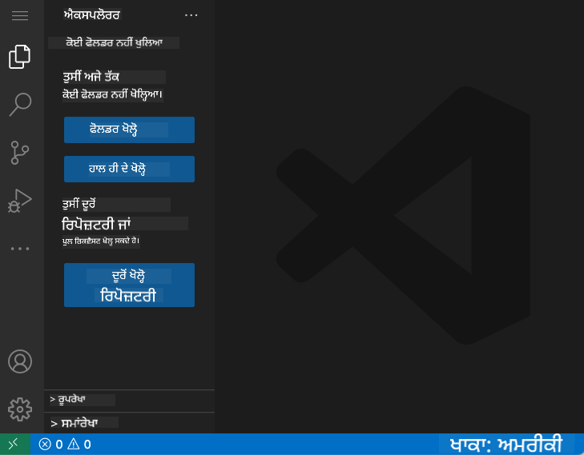
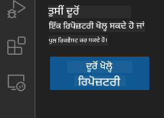
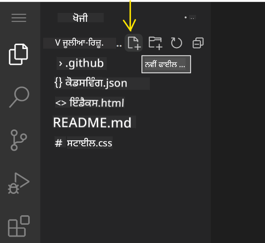
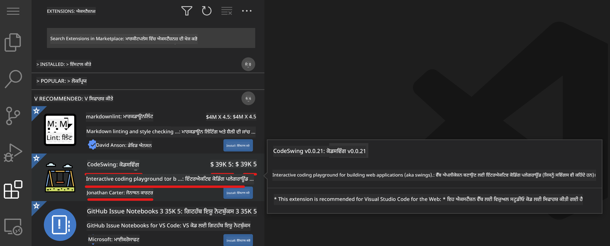
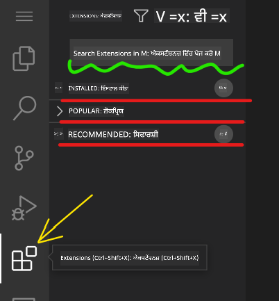
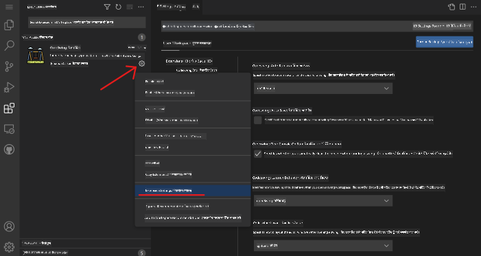

<!--
CO_OP_TRANSLATOR_METADATA:
{
  "original_hash": "1ba61d96a11309a2a6ea507496dcf7e5",
  "translation_date": "2025-08-28T17:11:45+00:00",
  "source_file": "8-code-editor/1-using-a-code-editor/README.md",
  "language_code": "pa"
}
-->
# ਕੋਡ ਐਡੀਟਰ ਦੀ ਵਰਤੋਂ

ਇਹ ਪਾਠ [VSCode.dev](https://vscode.dev) ਦੇ ਬੁਨਿਆਦੀ ਪਹਲੂਆਂ ਨੂੰ ਕਵਰ ਕਰਦਾ ਹੈ, ਜੋ ਕਿ ਇੱਕ ਵੈੱਬ-ਅਧਾਰਿਤ ਕੋਡ ਐਡੀਟਰ ਹੈ। ਇਸ ਦੀ ਵਰਤੋਂ ਕਰਕੇ ਤੁਸੀਂ ਆਪਣੇ ਕੋਡ ਵਿੱਚ ਤਬਦੀਲੀਆਂ ਕਰ ਸਕਦੇ ਹੋ ਅਤੇ ਕਿਸੇ ਪ੍ਰੋਜੈਕਟ ਵਿੱਚ ਯੋਗਦਾਨ ਪਾ ਸਕਦੇ ਹੋ ਬਿਨਾਂ ਆਪਣੇ ਕੰਪਿਊਟਰ 'ਤੇ ਕੁਝ ਇੰਸਟਾਲ ਕੀਤੇ।

## ਸਿੱਖਣ ਦੇ ਉਦੇਸ਼

ਇਸ ਪਾਠ ਵਿੱਚ, ਤੁਸੀਂ ਸਿੱਖੋਗੇ ਕਿ:

- ਕੋਡ ਪ੍ਰੋਜੈਕਟ ਵਿੱਚ ਕੋਡ ਐਡੀਟਰ ਦੀ ਵਰਤੋਂ ਕਿਵੇਂ ਕਰਨੀ ਹੈ
- ਵਰਜਨ ਕੰਟਰੋਲ ਨਾਲ ਤਬਦੀਲੀਆਂ ਦਾ ਟ੍ਰੈਕ ਰੱਖਣਾ
- ਵਿਕਾਸ ਲਈ ਐਡੀਟਰ ਨੂੰ ਕਸਟਮਾਈਜ਼ ਕਰਨਾ

### ਪੂਰਵ-ਸ਼ਰਤਾਂ

ਸ਼ੁਰੂ ਕਰਨ ਤੋਂ ਪਹਿਲਾਂ, ਤੁਹਾਨੂੰ [GitHub](https://github.com) 'ਤੇ ਇੱਕ ਖਾਤਾ ਬਣਾਉਣ ਦੀ ਲੋੜ ਹੋਵੇਗੀ। [GitHub](https://github.com/) 'ਤੇ ਜਾਓ ਅਤੇ ਜੇਕਰ ਤੁਹਾਡੇ ਕੋਲ ਪਹਿਲਾਂ ਤੋਂ ਖਾਤਾ ਨਹੀਂ ਹੈ ਤਾਂ ਇੱਕ ਨਵਾਂ ਖਾਤਾ ਬਣਾਓ।

### ਪਰਿਚਯ

ਕੋਡ ਐਡੀਟਰ ਪ੍ਰੋਗਰਾਮ ਲਿਖਣ ਅਤੇ ਮੌਜੂਦਾ ਕੋਡਿੰਗ ਪ੍ਰੋਜੈਕਟਾਂ ਨਾਲ ਸਹਿਯੋਗ ਕਰਨ ਲਈ ਇੱਕ ਜ਼ਰੂਰੀ ਸਾਧਨ ਹੈ। ਜਦੋਂ ਤੁਸੀਂ ਐਡੀਟਰ ਦੇ ਬੁਨਿਆਦੀ ਪਹਲੂਆਂ ਨੂੰ ਸਮਝ ਲੈਂਦੇ ਹੋ ਅਤੇ ਇਸ ਦੀਆਂ ਵਿਸ਼ੇਸ਼ਤਾਵਾਂ ਦੀ ਵਰਤੋਂ ਕਰਦੇ ਹੋ, ਤਾਂ ਤੁਸੀਂ ਇਹਨਾਂ ਨੂੰ ਕੋਡ ਲਿਖਣ ਸਮੇਂ ਲਾਗੂ ਕਰ ਸਕਦੇ ਹੋ।

## VSCode.dev ਨਾਲ ਸ਼ੁਰੂਆਤ

[VSCode.dev](https://vscode.dev) ਵੈੱਬ 'ਤੇ ਇੱਕ ਕੋਡ ਐਡੀਟਰ ਹੈ। ਇਸ ਦੀ ਵਰਤੋਂ ਕਰਨ ਲਈ ਤੁਹਾਨੂੰ ਕੁਝ ਵੀ ਇੰਸਟਾਲ ਕਰਨ ਦੀ ਲੋੜ ਨਹੀਂ ਹੈ, ਇਹ ਬਿਲਕੁਲ ਕਿਸੇ ਹੋਰ ਵੈੱਬਸਾਈਟ ਨੂੰ ਖੋਲ੍ਹਣ ਵਾਂਗ ਹੈ। ਐਡੀਟਰ ਨਾਲ ਸ਼ੁਰੂ ਕਰਨ ਲਈ, ਹੇਠਾਂ ਦਿੱਤੇ ਲਿੰਕ ਨੂੰ ਖੋਲ੍ਹੋ: [https://vscode.dev](https://vscode.dev)। ਜੇਕਰ ਤੁਸੀਂ [GitHub](https://github.com/) ਵਿੱਚ ਸਾਈਨ-ਇਨ ਨਹੀਂ ਹੋਏ ਹੋ, ਤਾਂ ਸਾਈਨ-ਇਨ ਕਰਨ ਜਾਂ ਨਵਾਂ ਖਾਤਾ ਬਣਾਉਣ ਲਈ ਪ੍ਰੋੰਪਟਾਂ ਦੀ ਪਾਲਣਾ ਕਰੋ ਅਤੇ ਫਿਰ ਸਾਈਨ-ਇਨ ਕਰੋ।

ਜਦੋਂ ਇਹ ਲੋਡ ਹੁੰਦਾ ਹੈ, ਤਾਂ ਇਹ ਹੇਠਾਂ ਦਿੱਤੀ ਤਸਵੀਰ ਵਾਂਗ ਦਿਖਾਈ ਦੇਵੇਗਾ:



ਇਸ ਵਿੱਚ ਤਿੰਨ ਮੁੱਖ ਸੈਕਸ਼ਨ ਹਨ, ਖੱਬੇ ਤੋਂ ਸੱਜੇ ਵੱਲ:

1. _ਐਕਟੀਵਿਟੀ ਬਾਰ_, ਜਿਸ ਵਿੱਚ ਕੁਝ ਆਈਕਨ ਸ਼ਾਮਲ ਹਨ, ਜਿਵੇਂ ਕਿ ਮੈਗਨੀਫਾਇੰਗ ਗਲਾਸ 🔎, ਗੀਅਰ ⚙️, ਅਤੇ ਕੁਝ ਹੋਰ।
1. ਵਧਾਈ ਗਈ ਐਕਟੀਵਿਟੀ ਬਾਰ, ਜੋ ਡਿਫਾਲਟ ਤੌਰ 'ਤੇ _ਐਕਸਪਲੋਰਰ_ ਹੈ, ਜਿਸਨੂੰ _ਸਾਈਡ ਬਾਰ_ ਕਿਹਾ ਜਾਂਦਾ ਹੈ।
1. ਅਤੇ ਆਖਿਰਕਾਰ, ਸੱਜੇ ਵੱਲ ਕੋਡ ਖੇਤਰ।

ਹਰ ਆਈਕਨ 'ਤੇ ਕਲਿਕ ਕਰੋ ਤਾਂ ਜੋ ਵੱਖ-ਵੱਖ ਮੀਨੂ ਦਿਖਾਈ ਦੇਣ। ਜਦੋਂ ਤੁਸੀਂ ਖਤਮ ਕਰ ਲੈਂਦੇ ਹੋ, ਤਾਂ _ਐਕਸਪਲੋਰਰ_ 'ਤੇ ਕਲਿਕ ਕਰੋ ਤਾਂ ਜੋ ਤੁਸੀਂ ਜਿੱਥੇ ਸ਼ੁਰੂ ਕੀਤਾ ਸੀ ਉੱਥੇ ਵਾਪਸ ਜਾ ਸਕੋ।

ਜਦੋਂ ਤੁਸੀਂ ਕੋਡ ਬਣਾਉਣ ਜਾਂ ਮੌਜੂਦਾ ਕੋਡ ਵਿੱਚ ਤਬਦੀਲੀਆਂ ਕਰਨਾ ਸ਼ੁਰੂ ਕਰਦੇ ਹੋ, ਤਾਂ ਇਹ ਸਭ ਤੋਂ ਵੱਡੇ ਖੇਤਰ ਵਿੱਚ ਸੱਜੇ ਵੱਲ ਹੋਵੇਗਾ। ਤੁਸੀਂ ਇਸ ਖੇਤਰ ਦੀ ਵਰਤੋਂ ਮੌਜੂਦਾ ਕੋਡ ਨੂੰ ਦ੍ਰਿਸ਼ਮਾਨ ਕਰਨ ਲਈ ਵੀ ਕਰੋਗੇ, ਜੋ ਤੁਸੀਂ ਅਗਲੇ ਕਦਮ ਵਿੱਚ ਕਰੋਗੇ।

## GitHub ਰਿਪੋਜ਼ਟਰੀ ਖੋਲ੍ਹੋ

ਸਭ ਤੋਂ ਪਹਿਲਾਂ ਤੁਹਾਨੂੰ ਇੱਕ GitHub ਰਿਪੋਜ਼ਟਰੀ ਖੋਲ੍ਹਣ ਦੀ ਲੋੜ ਹੋਵੇਗੀ। ਰਿਪੋਜ਼ਟਰੀ ਖੋਲ੍ਹਣ ਦੇ ਕਈ ਤਰੀਕੇ ਹਨ। ਇਸ ਸੈਕਸ਼ਨ ਵਿੱਚ ਤੁਸੀਂ ਦੋ ਵੱਖ-ਵੱਖ ਤਰੀਕੇ ਦੇਖੋਗੇ ਜਿਨ੍ਹਾਂ ਨਾਲ ਤੁਸੀਂ ਰਿਪੋਜ਼ਟਰੀ ਖੋਲ੍ਹ ਸਕਦੇ ਹੋ ਅਤੇ ਤਬਦੀਲੀਆਂ 'ਤੇ ਕੰਮ ਕਰਨਾ ਸ਼ੁਰੂ ਕਰ ਸਕਦੇ ਹੋ।

### 1. ਐਡੀਟਰ ਨਾਲ

ਦੂਰ-ਦराज਼ ਰਿਪੋਜ਼ਟਰੀ ਖੋਲ੍ਹਣ ਲਈ ਖੁਦ ਐਡੀਟਰ ਦੀ ਵਰਤੋਂ ਕਰੋ। ਜੇਕਰ ਤੁਸੀਂ [VSCode.dev](https://vscode.dev) 'ਤੇ ਜਾਓ, ਤਾਂ ਤੁਹਾਨੂੰ _"Open Remote Repository"_ ਬਟਨ ਦਿਖਾਈ ਦੇਵੇਗਾ:



ਤੁਸੀਂ ਕਮਾਂਡ ਪੈਲੇਟ ਦੀ ਵੀ ਵਰਤੋਂ ਕਰ ਸਕਦੇ ਹੋ। ਕਮਾਂਡ ਪੈਲੇਟ ਇੱਕ ਇਨਪੁਟ ਬਾਕਸ ਹੈ ਜਿੱਥੇ ਤੁਸੀਂ ਕਿਸੇ ਵੀ ਕਮਾਂਡ ਜਾਂ ਕਾਰਵਾਈ ਦਾ ਹਿੱਸਾ ਹੋਣ ਵਾਲਾ ਸ਼ਬਦ ਟਾਈਪ ਕਰ ਸਕਦੇ ਹੋ ਤਾਂ ਜੋ ਸਹੀ ਕਮਾਂਡ ਨੂੰ ਚਲਾਇਆ ਜਾ ਸਕੇ। ਮੀਨੂ ਨੂੰ ਖੱਬੇ-ਉੱਪਰ ਜਾਓ, ਫਿਰ _View_ ਚੁਣੋ, ਅਤੇ ਫਿਰ _Command Palette_ ਚੁਣੋ, ਜਾਂ ਹੇਠਾਂ ਦਿੱਤੇ ਕੀਬੋਰਡ ਸ਼ਾਰਟਕਟ ਦੀ ਵਰਤੋਂ ਕਰੋ: Ctrl-Shift-P (MacOS 'ਤੇ ਇਹ Command-Shift-P ਹੋਵੇਗਾ)।


ਜਦੋਂ ਮੀਨੂ ਖੁਲ੍ਹਦਾ ਹੈ, _open remote repository_ ਟਾਈਪ ਕਰੋ, ਅਤੇ ਫਿਰ ਪਹਿਲਾ ਵਿਕਲਪ ਚੁਣੋ। ਕਈ ਰਿਪੋਜ਼ਟਰੀ ਜਿਨ੍ਹਾਂ ਦਾ ਤੁਸੀਂ ਹਿੱਸਾ ਹੋ ਜਾਂ ਜੋ ਤੁਸੀਂ ਹਾਲ ਹੀ ਵਿੱਚ ਖੋਲ੍ਹੇ ਹਨ, ਦਿਖਾਈ ਦੇਣਗੇ। ਤੁਸੀਂ ਪੂਰਾ GitHub URL ਵੀ ਵਰਤ ਸਕਦੇ ਹੋ। ਹੇਠਾਂ ਦਿੱਤੇ URL ਦੀ ਵਰਤੋਂ ਕਰੋ ਅਤੇ ਬਾਕਸ ਵਿੱਚ ਪੇਸਟ ਕਰੋ:

```
https://github.com/microsoft/Web-Dev-For-Beginners
```

✅ ਜੇਕਰ ਸਫਲ ਹੋਵੇ, ਤਾਂ ਤੁਸੀਂ ਇਸ ਰਿਪੋਜ਼ਟਰੀ ਦੇ ਸਾਰੇ ਫਾਈਲਾਂ ਨੂੰ ਟੈਕਸਟ ਐਡੀਟਰ ਵਿੱਚ ਲੋਡ ਕੀਤਾ ਹੋਇਆ ਦੇਖੋਗੇ।

### 2. URL ਦੀ ਵਰਤੋਂ ਕਰਕੇ

ਤੁਸੀਂ ਰਿਪੋਜ਼ਟਰੀ ਨੂੰ ਲੋਡ ਕਰਨ ਲਈ ਸਿੱਧੇ URL ਦੀ ਵਰਤੋਂ ਕਰ ਸਕਦੇ ਹੋ। ਉਦਾਹਰਣ ਲਈ, ਮੌਜੂਦਾ ਰਿਪੋ ਦਾ ਪੂਰਾ URL [https://github.com/microsoft/Web-Dev-For-Beginners](https://github.com/microsoft/Web-Dev-For-Beginners) ਹੈ, ਪਰ ਤੁਸੀਂ GitHub ਡੋਮੇਨ ਨੂੰ `VSCode.dev/github` ਨਾਲ ਬਦਲ ਸਕਦੇ ਹੋ ਅਤੇ ਰਿਪੋਜ਼ਟਰੀ ਨੂੰ ਸਿੱਧੇ ਲੋਡ ਕਰ ਸਕਦੇ ਹੋ। resulting URL ਇਹ ਹੋਵੇਗਾ: [https://vscode.dev/github/microsoft/Web-Dev-For-Beginners](https://vscode.dev/github/microsoft/Web-Dev-For-Beginners)।

## ਫਾਈਲਾਂ ਨੂੰ ਸੰਪਾਦਿਤ ਕਰੋ

ਜਦੋਂ ਤੁਸੀਂ ਰਿਪੋਜ਼ਟਰੀ ਨੂੰ ਬ੍ਰਾਊਜ਼ਰ/ vscode.dev 'ਤੇ ਖੋਲ੍ਹ ਲੈਂਦੇ ਹੋ, ਤਾਂ ਅਗਲਾ ਕਦਮ ਪ੍ਰੋਜੈਕਟ ਵਿੱਚ ਅਪਡੇਟ ਜਾਂ ਤਬਦੀਲੀਆਂ ਕਰਨਾ ਹੋਵੇਗਾ।

### 1. ਨਵੀਂ ਫਾਈਲ ਬਣਾਓ

ਤੁਸੀਂ ਮੌਜੂਦਾ ਫੋਲਡਰ ਵਿੱਚ ਫਾਈਲ ਬਣਾਉਣ ਜਾਂ ਰੂਟ ਡਾਇਰੈਕਟਰੀ/ਫੋਲਡਰ ਵਿੱਚ ਬਣਾਉਣ ਦੀ ਚੋਣ ਕਰ ਸਕਦੇ ਹੋ। ਨਵੀਂ ਫਾਈਲ ਬਣਾਉਣ ਲਈ, ਉਸ ਸਥਾਨ/ਡਾਇਰੈਕਟਰੀ ਨੂੰ ਖੋਲ੍ਹੋ ਜਿੱਥੇ ਤੁਸੀਂ ਫਾਈਲ ਨੂੰ ਸੇਵ ਕਰਨਾ ਚਾਹੁੰਦੇ ਹੋ ਅਤੇ ਐਕਟੀਵਿਟੀ ਬਾਰ _(ਖੱਬੇ)_ 'ਤੇ _'New file ...'_ ਆਈਕਨ ਚੁਣੋ, ਇਸਨੂੰ ਇੱਕ ਨਾਮ ਦਿਓ ਅਤੇ ਐਂਟਰ ਦਬਾਓ।



### 2. ਰਿਪੋਜ਼ਟਰੀ 'ਤੇ ਫਾਈਲ ਨੂੰ ਸੰਪਾਦਿਤ ਕਰੋ ਅਤੇ ਸੇਵ ਕਰੋ

vscode.dev ਦੀ ਵਰਤੋਂ ਤੁਹਾਡੇ ਪ੍ਰੋਜੈਕਟ ਵਿੱਚ ਤੇਜ਼ ਅਪਡੇਟ ਕਰਨ ਲਈ ਮਦਦਗਾਰ ਹੈ ਬਿਨਾਂ ਕਿਸੇ ਸਾਫਟਵੇਅਰ ਨੂੰ ਲੋਕਲ ਲੋਡ ਕੀਤੇ।  
ਤੁਹਾਡੇ ਕੋਡ ਨੂੰ ਅਪਡੇਟ ਕਰਨ ਲਈ, ਐਕਟੀਵਿਟੀ ਬਾਰ 'ਤੇ 'Explorer' ਆਈਕਨ 'ਤੇ ਕਲਿਕ ਕਰੋ ਤਾਂ ਜੋ ਰਿਪੋਜ਼ਟਰੀ ਵਿੱਚ ਫਾਈਲਾਂ ਅਤੇ ਫੋਲਡਰ ਨੂੰ ਵੇਖਿਆ ਜਾ ਸਕੇ।  
ਕੋਈ ਫਾਈਲ ਚੁਣੋ ਤਾਂ ਜੋ ਇਹ ਕੋਡ ਖੇਤਰ ਵਿੱਚ ਖੁਲ੍ਹੇ, ਤਬਦੀਲੀਆਂ ਕਰੋ ਅਤੇ ਸੇਵ ਕਰੋ।


ਜਦੋਂ ਤੁਸੀਂ ਆਪਣੇ ਪ੍ਰੋਜੈਕਟ ਨੂੰ ਅਪਡੇਟ ਕਰਨਾ ਖਤਮ ਕਰ ਲੈਂਦੇ ਹੋ, ਤਾਂ _`source control`_ ਆਈਕਨ ਚੁਣੋ ਜਿਸ ਵਿੱਚ ਤੁਹਾਡੇ ਰਿਪੋਜ਼ਟਰੀ ਵਿੱਚ ਕੀਤੀਆਂ ਸਾਰੀਆਂ ਨਵੀਆਂ ਤਬਦੀਲੀਆਂ ਸ਼ਾਮਲ ਹਨ।

ਤੁਹਾਡੇ ਪ੍ਰੋਜੈਕਟ ਵਿੱਚ ਕੀਤੀਆਂ ਤਬਦੀਲੀਆਂ ਨੂੰ ਵੇਖਣ ਲਈ, ਵਧਾਈ ਗਈ ਐਕਟੀਵਿਟੀ ਬਾਰ ਵਿੱਚ `Changes` ਫੋਲਡਰ ਵਿੱਚ ਫਾਈਲ(ਆਂ) ਚੁਣੋ। ਇਹ ਤੁਹਾਡੇ ਲਈ 'Working Tree' ਖੋਲ੍ਹੇਗਾ ਤਾਂ ਜੋ ਤੁਸੀਂ ਦ੍ਰਿਸ਼ਮਾਨ ਤੌਰ 'ਤੇ ਫਾਈਲ ਵਿੱਚ ਕੀਤੀਆਂ ਤਬਦੀਲੀਆਂ ਨੂੰ ਵੇਖ ਸਕੋ। ਲਾਲ ਰੰਗ ਪ੍ਰੋਜੈਕਟ ਵਿੱਚ ਇੱਕ ਹਟਾਉਣ ਨੂੰ ਦਰਸਾਉਂਦਾ ਹੈ, ਜਦੋਂ ਕਿ ਹਰਾ ਰੰਗ ਇੱਕ ਸ਼ਾਮਲ ਕਰਨ ਨੂੰ ਦਰਸਾਉਂਦਾ ਹੈ।


ਜੇਕਰ ਤੁਸੀਂ ਕੀਤੀਆਂ ਤਬਦੀਲੀਆਂ ਨਾਲ ਸੰਤੁਸ਼ਟ ਹੋ, ਤਾਂ `Changes` ਫੋਲਡਰ 'ਤੇ ਹਵਰ ਕਰੋ ਅਤੇ ਤਬਦੀਲੀਆਂ ਨੂੰ ਸਟੇਜ ਕਰਨ ਲਈ `+` ਬਟਨ 'ਤੇ ਕਲਿਕ ਕਰੋ। ਸਟੇਜਿੰਗ ਦਾ ਮਤਲਬ ਹੈ ਤੁਹਾਡੇ ਤਬਦੀਲੀਆਂ ਨੂੰ GitHub 'ਤੇ ਕਮਿਟ ਕਰਨ ਲਈ ਤਿਆਰ ਕਰਨਾ।

ਜੇਕਰ ਤੁਸੀਂ ਕੁਝ ਤਬਦੀਲੀਆਂ ਨਾਲ ਸਹਿਮਤ ਨਹੀਂ ਹੋ ਅਤੇ ਤੁਸੀਂ ਉਹਨਾਂ ਨੂੰ ਰੱਦ ਕਰਨਾ ਚਾਹੁੰਦੇ ਹੋ, ਤਾਂ `Changes` ਫੋਲਡਰ 'ਤੇ ਹਵਰ ਕਰੋ ਅਤੇ `undo` ਆਈਕਨ ਚੁਣੋ।

ਫਿਰ, ਇੱਕ `commit message` _(ਤਬਦੀਲੀ ਦਾ ਵੇਰਵਾ ਜੋ ਤੁਸੀਂ ਪ੍ਰੋਜੈਕਟ ਵਿੱਚ ਕੀਤੀ ਹੈ)_ ਟਾਈਪ ਕਰੋ, `check icon` 'ਤੇ ਕਲਿਕ ਕਰੋ ਤਾਂ ਜੋ ਤੁਸੀਂ ਤਬਦੀਲੀਆਂ ਨੂੰ ਕਮਿਟ ਅਤੇ ਪੁਸ਼ ਕਰ ਸਕੋ।

ਜਦੋਂ ਤੁਸੀਂ ਆਪਣੇ ਪ੍ਰੋਜੈਕਟ 'ਤੇ ਕੰਮ ਕਰਨਾ ਖਤਮ ਕਰ ਲੈਂਦੇ ਹੋ, ਤਾਂ ਖੱਬੇ-ਉੱਪਰ `hamburger menu icon` ਚੁਣੋ ਤਾਂ ਜੋ ਤੁਸੀਂ github.com 'ਤੇ ਰਿਪੋਜ਼ਟਰੀ 'ਤੇ ਵਾਪਸ ਜਾ ਸਕੋ।


## ਐਕਸਟੈਂਸ਼ਨ ਦੀ ਵਰਤੋਂ

VSCode 'ਤੇ ਐਕਸਟੈਂਸ਼ਨ ਇੰਸਟਾਲ ਕਰਨਾ ਤੁਹਾਨੂੰ ਆਪਣੇ ਐਡੀਟਰ 'ਤੇ ਨਵੀਆਂ ਵਿਸ਼ੇਸ਼ਤਾਵਾਂ ਅਤੇ ਕਸਟਮਾਈਜ਼ਡ ਵਿਕਾਸ ਵਾਤਾਵਰਣ ਵਿਕਲਪਾਂ ਨੂੰ ਸ਼ਾਮਲ ਕਰਨ ਦੀ ਆਗਿਆ ਦਿੰਦਾ ਹੈ। ਇਹ ਐਕਸਟੈਂਸ਼ਨ ਤੁਹਾਡੇ ਵਿਕਾਸ ਵਰਕਫਲੋ ਨੂੰ ਸੁਧਾਰਨ ਲਈ ਮਦਦ ਕਰਦੇ ਹਨ ਅਤੇ ਕਈ ਪ੍ਰੋਗਰਾਮਿੰਗ ਭਾਸ਼ਾਵਾਂ ਲਈ ਸਹਾਇਤਾ ਸ਼ਾਮਲ ਕਰਦੇ ਹਨ। ਇਹ ਅਕਸਰ ਜਨਰਲ ਐਕਸਟੈਂਸ਼ਨ ਜਾਂ ਭਾਸ਼ਾ-ਅਧਾਰਿਤ ਐਕਸਟੈਂਸ਼ਨ ਹੁੰਦੇ ਹਨ।

ਸਭ ਉਪਲਬਧ ਐਕਸਟੈਂਸ਼ਨ ਦੀ ਸੂਚੀ ਨੂੰ ਬ੍ਰਾਊਜ਼ ਕਰਨ ਲਈ, ਐਕਟੀਵਿਟੀ ਬਾਰ 'ਤੇ _`Extensions icon`_ 'ਤੇ ਕਲਿਕ ਕਰੋ ਅਤੇ _'Search Extensions in Marketplace'_ ਲੇਬਲ ਵਾਲੇ ਟੈਕਸਟ ਫੀਲਡ ਵਿੱਚ ਐਕਸਟੈਂਸ਼ਨ ਦਾ ਨਾਮ ਟਾਈਪ ਕਰਨਾ ਸ਼ੁਰੂ ਕਰੋ।  
ਤੁਹਾਨੂੰ ਐਕਸਟੈਂਸ਼ਨ ਦੀ ਸੂਚੀ ਦਿਖਾਈ ਦੇਵੇਗੀ, ਜਿਸ ਵਿੱਚ **ਐਕਸਟੈਂਸ਼ਨ ਦਾ ਨਾਮ, ਪ੍ਰਕਾਸ਼ਕ ਦਾ ਨਾਮ, ਇੱਕ ਵਾਕ ਦਾ ਵੇਰਵਾ, ਡਾਊਨਲੋਡ ਦੀ ਗਿਣਤੀ** ਅਤੇ **ਸਟਾਰ ਰੇਟਿੰਗ** ਸ਼ਾਮਲ ਹੈ।



ਤੁਸੀਂ ਪਹਿਲਾਂ ਇੰਸਟਾਲ ਕੀਤੇ ਗਏ ਸਾਰੇ ਐਕਸਟੈਂਸ਼ਨ ਨੂੰ _`Installed folder`_ ਵਿੱਚ, ਜ਼ਿਆਦਾਤਰ ਡਿਵੈਲਪਰਾਂ ਦੁਆਰਾ ਵਰਤੇ ਜਾਣ ਵਾਲੇ ਪ੍ਰਸਿੱਧ ਐਕਸਟੈਂਸ਼ਨ ਨੂੰ _`Popular folder`_ ਵਿੱਚ ਅਤੇ ਤੁਹਾਡੇ ਲਈ ਸਿਫਾਰਸ਼ੀ ਐਕਸਟੈਂਸ਼ਨ ਨੂੰ _`recommended folder`_ ਵਿੱਚ ਵੇਖ ਸਕਦੇ ਹੋ। ਇਹ ਸਿਫਾਰਸ਼ਾਂ ਜਾਂ ਤਾਂ ਇੱਕੋ ਵਰਕਸਪੇਸ ਵਿੱਚ ਵਰਤੋਂਕਾਰਾਂ ਦੁਆਰਾ ਜਾਂ ਹਾਲ ਹੀ ਵਿੱਚ ਖੋਲ੍ਹੀਆਂ ਫਾਈਲਾਂ ਦੇ ਅਧਾਰ 'ਤੇ ਕੀਤੀਆਂ ਜਾਂਦੀਆਂ ਹਨ।



### 1. ਐਕਸਟੈਂਸ਼ਨ ਇੰਸਟਾਲ ਕਰੋ

ਐਕਸਟੈਂਸ਼ਨ ਨੂੰ ਇੰਸਟਾਲ ਕਰਨ ਲਈ, ਖੋਜ ਫੀਲਡ ਵਿੱਚ ਐਕਸਟੈਂਸ਼ਨ ਦਾ ਨਾਮ ਟਾਈਪ ਕਰੋ ਅਤੇ ਇਸਨੂੰ ਚੁਣੋ ਤਾਂ ਜੋ ਵਧੇਰੇ ਜਾਣਕਾਰੀ ਐਕਸਟੈਂਸ਼ਨ ਦੇ ਬਾਰੇ ਕੋਡ ਖੇਤਰ ਵਿੱਚ ਦਿਖਾਈ ਜਾਵੇ।  
ਜਦੋਂ ਇਹ ਵਧਾਈ ਗਈ ਐਕਟੀਵਿਟੀ ਬਾਰ ਵਿੱਚ ਦਿਖਾਈ ਦੇਵੇ, ਤਾਂ ਤੁਸੀਂ _blue install button_ 'ਤੇ ਕਲਿਕ ਕਰਕੇ ਇੰਸਟਾਲ ਕਰ ਸਕਦੇ ਹੋ ਜਾਂ ਜਦੋਂ ਤੁਸੀਂ ਐਕਸਟੈਂਸ਼ਨ ਨੂੰ ਚੁਣਦੇ ਹੋ ਤਾਂ ਕੋਡ ਖੇਤਰ ਵਿੱਚ ਦਿਖਾਈ ਦੇਣ ਵਾਲੇ ਇੰਸਟਾਲ ਬਟਨ ਦੀ ਵਰਤੋਂ ਕਰ ਸਕਦੇ ਹੋ।


### 2. ਐਕਸਟੈਂਸ਼ਨ ਨੂੰ ਕਸਟਮਾਈਜ਼ ਕਰੋ

ਐਕਸਟੈਂਸ਼ਨ ਨੂੰ ਇੰਸਟਾਲ ਕਰਨ ਤੋਂ ਬਾਅਦ, ਤੁਹਾਨੂੰ ਇਸਦੇ ਵਿਹਾਰ ਨੂੰ ਸੋਧਣ ਅਤੇ ਇਸਨੂੰ ਆਪਣੇ ਪਸੰਦਾਂ ਦੇ ਅਨੁਸਾਰ ਕਸਟਮਾਈਜ਼ ਕਰਨ ਦੀ ਲੋੜ ਹੋ ਸਕਦੀ ਹੈ।  
ਇਹ ਕਰਨ ਲਈ, ਐਕਸਟੈਂਸ਼ਨ ਆਈਕਨ ਚੁਣੋ, ਅਤੇ ਇਸ ਵਾਰ, ਤੁਹਾਡਾ ਐਕਸਟੈਂਸ਼ਨ _Installed folder_ ਵਿੱਚ ਦਿਖਾਈ ਦੇਵੇਗਾ। _**Gear icon**_ 'ਤੇ ਕਲਿਕ ਕਰੋ ਅਤੇ _Extensions Setting_ 'ਤੇ ਜਾਓ।



### 3. ਐਕਸਟੈਂਸ਼ਨ ਨੂੰ ਮੈਨੇਜ ਕਰੋ

ਐਕਸਟੈਂਸ਼ਨ ਨੂੰ ਇੰਸਟਾਲ ਅਤੇ ਵਰਤਣ ਤੋਂ ਬਾਅਦ, vscode.dev ਵੱਖ-ਵੱਖ ਜ਼ਰੂਰਤਾਂ ਦੇ ਅਧਾਰ 'ਤੇ ਤੁਹਾਡੇ ਐਕਸਟੈਂਸ਼ਨ ਨੂੰ ਮੈਨੇਜ ਕਰਨ ਦੇ ਵਿਕਲਪ ਪ੍ਰਦਾਨ ਕਰਦਾ ਹੈ। ਉਦਾਹਰਣ ਲਈ, ਤੁਸੀਂ ਚੁਣ ਸਕਦੇ ਹੋ:

- **Disable:** _(ਤੁਸੀਂ ਇੱਕ ਐਕਸਟੈਂਸ਼ਨ ਨੂੰ ਅਸਥਾਈ ਤੌਰ 'ਤੇ ਅਯੋਗ ਕਰ ਸਕਦੇ ਹੋ ਜਦੋਂ ਤੁਹਾਨੂੰ ਇਸਦੀ ਲੋੜ ਨਹੀਂ ਹੁੰਦੀ ਪਰ ਇਸਨੂੰ ਪੂਰੀ ਤਰ੍ਹਾਂ ਅਨਇੰਸਟਾਲ ਨਹੀਂ ਕਰਨਾ ਚਾਹੁੰਦੇ)_

    ਵਧਾਈ ਗਈ ਐਕਟੀਵਿਟੀ ਬਾਰ 'ਤੇ ਇੰਸਟਾਲ ਕੀਤੇ ਗਏ ਐਕਸਟੈਂਸ਼ਨ ਨੂੰ ਚੁਣੋ > Gear icon 'ਤੇ ਕਲਿਕ ਕਰੋ > 'Disable' ਜਾਂ 'Disable (Workspace)' ਚੁਣੋ **ਜਾਂ** ਐਕਸਟੈਂਸ਼ਨ ਨੂੰ ਕੋਡ ਖੇਤਰ ਵਿੱਚ ਖੋਲ੍ਹੋ ਅਤੇ blue Disable button 'ਤੇ ਕਲਿਕ ਕਰੋ।

- **Uninstall:** ਵਧਾਈ ਗਈ ਐਕਟੀਵਿਟੀ ਬਾਰ 'ਤੇ ਇੰਸਟਾਲ ਕੀਤੇ ਗਏ ਐਕਸਟੈਂਸ਼ਨ ਨੂੰ ਚੁਣੋ > Gear icon 'ਤੇ ਕਲਿਕ ਕਰੋ > 'Uninstall' ਚੁਣੋ **ਜਾਂ** ਐਕਸਟੈਂਸ਼ਨ ਨੂੰ ਕੋਡ ਖੇਤਰ ਵਿੱਚ ਖੋਲ੍ਹੋ ਅਤੇ blue Uninstall button 'ਤੇ ਕਲਿਕ ਕਰੋ।

---

## ਅਸਾਈਨਮੈਂਟ

[ਵਿਜ਼ੂਅਲ ਸਟੂਡੀਓ ਕੋਡ ਦੀ ਵਰਤੋਂ ਕਰਕੇ ਇੱਕ ਰਿਜ਼ੂਮ ਵੈੱਬਸਾਈਟ ਬਣਾਓ](https://github.com/microsoft/Web-Dev-For-Beginners/blob/main/8-code-editor/1-using-a-code-editor/assignment.md)

## ਸਮੀਖਿਆ ਅਤੇ ਸਵੈ-ਅਧਿਐਨ

[VSCode.dev](https://code.visualstudio.com/docs/editor/vscode-web?WT.mc_id=academic-0000-alfredodeza) ਅਤੇ ਇਸ ਦੀਆਂ ਹੋਰ ਵਿਸ

---

**ਅਸਵੀਕਤੀ**:  
ਇਹ ਦਸਤਾਵੇਜ਼ AI ਅਨੁਵਾਦ ਸੇਵਾ [Co-op Translator](https://github.com/Azure/co-op-translator) ਦੀ ਵਰਤੋਂ ਕਰਕੇ ਅਨੁਵਾਦ ਕੀਤਾ ਗਿਆ ਹੈ। ਜਦੋਂ ਕਿ ਅਸੀਂ ਸਹੀ ਹੋਣ ਦੀ ਪੂਰੀ ਕੋਸ਼ਿਸ਼ ਕਰਦੇ ਹਾਂ, ਕਿਰਪਾ ਕਰਕੇ ਧਿਆਨ ਦਿਓ ਕਿ ਸਵੈਚਾਲਿਤ ਅਨੁਵਾਦਾਂ ਵਿੱਚ ਗਲਤੀਆਂ ਜਾਂ ਅਸੁੱਤੀਆਂ ਹੋ ਸਕਦੀਆਂ ਹਨ। ਇਸ ਦਸਤਾਵੇਜ਼ ਦਾ ਮੂਲ ਰੂਪ ਇਸਦੀ ਮੂਲ ਭਾਸ਼ਾ ਵਿੱਚ ਅਧਿਕਾਰਤ ਸਰੋਤ ਮੰਨਿਆ ਜਾਣਾ ਚਾਹੀਦਾ ਹੈ। ਮਹੱਤਵਪੂਰਨ ਜਾਣਕਾਰੀ ਲਈ, ਪੇਸ਼ੇਵਰ ਮਨੁੱਖੀ ਅਨੁਵਾਦ ਦੀ ਸਿਫਾਰਸ਼ ਕੀਤੀ ਜਾਂਦੀ ਹੈ। ਇਸ ਅਨੁਵਾਦ ਦੀ ਵਰਤੋਂ ਤੋਂ ਪੈਦਾ ਹੋਣ ਵਾਲੇ ਕਿਸੇ ਵੀ ਗਲਤਫਹਿਮੀ ਜਾਂ ਗਲਤ ਵਿਆਖਿਆ ਲਈ ਅਸੀਂ ਜ਼ਿੰਮੇਵਾਰ ਨਹੀਂ ਹਾਂ।