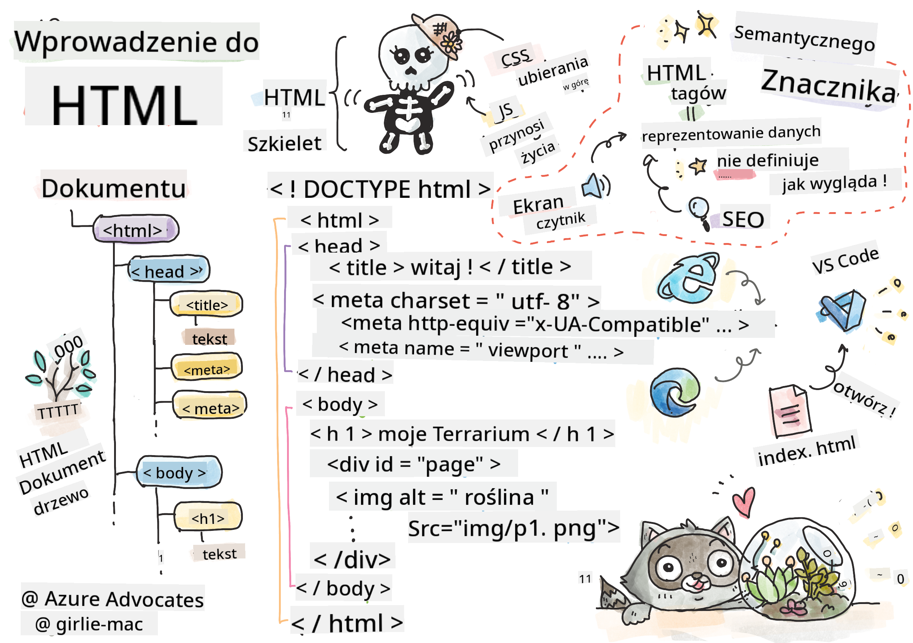
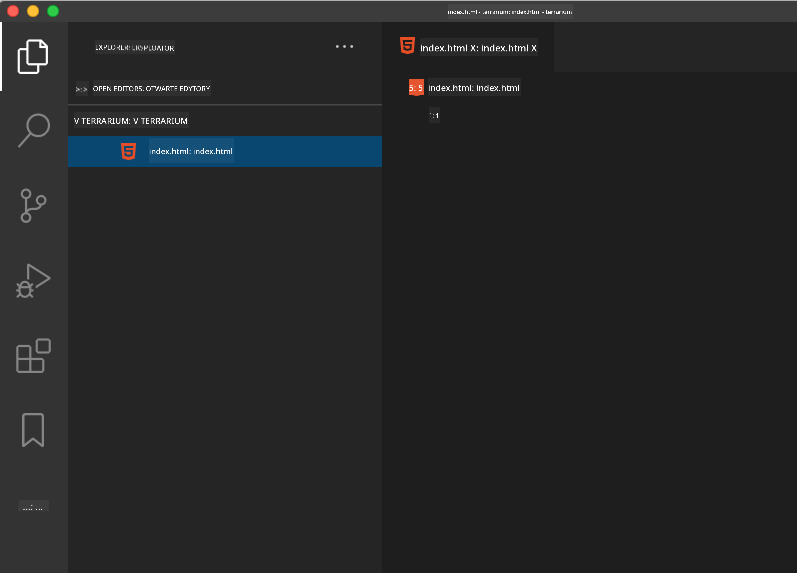

<!--
CO_OP_TRANSLATOR_METADATA:
{
  "original_hash": "89f7f9f800ce7c9f149e98baaae8491a",
  "translation_date": "2025-08-29T16:34:43+00:00",
  "source_file": "3-terrarium/1-intro-to-html/README.md",
  "language_code": "pl"
}
-->
# Projekt Terrarium Część 1: Wprowadzenie do HTML


> Sketchnote autorstwa [Tomomi Imura](https://twitter.com/girlie_mac)

## Quiz przed wykładem

[Quiz przed wykładem](https://ff-quizzes.netlify.app/web/quiz/15)

> Obejrzyj wideo

> 
> [](https://www.youtube.com/watch?v=1TvxJKBzhyQ)

### Wprowadzenie

HTML, czyli HyperText Markup Language, to 'szkielet' internetu. Jeśli CSS 'ubiera' Twój HTML, a JavaScript ożywia go, to HTML jest ciałem Twojej aplikacji internetowej. Składnia HTML odzwierciedla tę ideę, zawierając tagi takie jak "head", "body" i "footer".

W tej lekcji użyjemy HTML do stworzenia 'szkieletu' interfejsu naszego wirtualnego terrarium. Będzie on zawierał tytuł i trzy kolumny: prawą i lewą, gdzie znajdą się przeciągane rośliny, oraz środkowy obszar, który będzie wyglądał jak szklane terrarium. Na końcu tej lekcji zobaczysz rośliny w kolumnach, ale interfejs będzie wyglądał trochę dziwnie; nie martw się, w następnej sekcji dodasz style CSS, aby poprawić wygląd interfejsu.

### Zadanie

Na swoim komputerze utwórz folder o nazwie 'terrarium', a w nim plik o nazwie 'index.html'. Możesz to zrobić w Visual Studio Code, otwierając nowe okno VS Code, klikając 'open folder' i przechodząc do nowo utworzonego folderu. Kliknij mały przycisk 'file' w panelu Explorer i utwórz nowy plik:



Lub

Użyj tych poleceń w git bash:
* `mkdir terrarium`
* `cd terrarium`
* `touch index.html`
* `code index.html` lub `nano index.html`

> Pliki index.html wskazują przeglądarce, że jest to domyślny plik w folderze; adresy URL takie jak `https://anysite.com/test` mogą być zbudowane na podstawie struktury folderów, w tym folderu o nazwie `test` z plikiem `index.html` w środku; `index.html` nie musi być widoczny w adresie URL.

---

## DocType i tagi html

Pierwsza linia pliku HTML to jego doctype. Może to być zaskakujące, że ta linia musi znajdować się na samym początku pliku, ale informuje starsze przeglądarki, że strona powinna być renderowana w trybie standardowym, zgodnie z aktualną specyfikacją HTML.

> Wskazówka: w VS Code możesz najechać kursorem na tag, aby uzyskać informacje o jego zastosowaniu z przewodników referencyjnych MDN.

Druga linia powinna zawierać otwierający tag `<html>`, a zaraz po nim zamykający tag `</html>`. Te tagi są elementami głównymi Twojego interfejsu.

### Zadanie

Dodaj te linie na początku swojego pliku `index.html`:

```HTML
<!DOCTYPE html>
<html></html>
```

✅ Istnieje kilka różnych trybów, które można określić, ustawiając DocType za pomocą ciągu zapytania: [Tryb Quirks i Tryb Standardowy](https://developer.mozilla.org/docs/Web/HTML/Quirks_Mode_and_Standards_Mode). Te tryby były używane do obsługi bardzo starych przeglądarek, które obecnie nie są już powszechnie używane (Netscape Navigator 4 i Internet Explorer 5). Możesz trzymać się standardowej deklaracji doctype.

---

## 'Head' dokumentu

Obszar 'head' dokumentu HTML zawiera kluczowe informacje o Twojej stronie internetowej, znane również jako [metadane](https://developer.mozilla.org/docs/Web/HTML/Element/meta). W naszym przypadku informujemy serwer internetowy, na który ta strona zostanie wysłana do renderowania, o następujących czterech rzeczach:

-   tytule strony
-   metadanych strony, w tym:
    -   'character set', informującym o używanym kodowaniu znaków
    -   informacji o przeglądarce, w tym `x-ua-compatible`, co wskazuje, że obsługiwana jest przeglądarka IE=edge
    -   informacji o tym, jak viewport powinien się zachowywać po załadowaniu. Ustawienie viewportu na początkową skalę 1 kontroluje poziom powiększenia po załadowaniu strony.

### Zadanie

Dodaj blok 'head' do swojego dokumentu pomiędzy otwierającymi i zamykającymi tagami `<html>`.

```html
<head>
	<title>Welcome to my Virtual Terrarium</title>
	<meta charset="utf-8" />
	<meta http-equiv="X-UA-Compatible" content="IE=edge" />
	<meta name="viewport" content="width=device-width, initial-scale=1" />
</head>
```

✅ Co by się stało, gdybyś ustawił tag meta viewport w ten sposób: `<meta name="viewport" content="width=600">`? Przeczytaj więcej o [viewport](https://developer.mozilla.org/docs/Web/HTML/Viewport_meta_tag).

---

## 'Body' dokumentu

### Tagi HTML

W HTML dodajesz tagi do swojego pliku .html, aby tworzyć elementy strony internetowej. Każdy tag zazwyczaj ma otwierający i zamykający tag, na przykład: `<p>hello</p>`, aby wskazać akapit. Stwórz ciało swojego interfejsu, dodając zestaw tagów `<body>` wewnątrz pary tagów `<html>`; Twój kod teraz wygląda tak:

### Zadanie

```html
<!DOCTYPE html>
<html>
	<head>
		<title>Welcome to my Virtual Terrarium</title>
		<meta charset="utf-8" />
		<meta http-equiv="X-UA-Compatible" content="IE=edge" />
		<meta name="viewport" content="width=device-width, initial-scale=1" />
	</head>
	<body></body>
</html>
```

Teraz możesz zacząć budować swoją stronę. Zazwyczaj używasz tagów `<div>`, aby tworzyć oddzielne elementy na stronie. Stworzymy serię elementów `<div>`, które będą zawierały obrazy.

### Obrazy

Jednym z tagów HTML, który nie wymaga zamykającego tagu, jest ``, ponieważ ma element `src`, który zawiera wszystkie informacje potrzebne do renderowania elementu na stronie.

Utwórz folder w swojej aplikacji o nazwie `images` i dodaj do niego wszystkie obrazy z [folderu kodu źródłowego](../../../../3-terrarium/solution/images); (jest tam 14 obrazów roślin).

### Zadanie

Dodaj te obrazy roślin do dwóch kolumn pomiędzy tagami `<body></body>`:

```html
<div id="page">
	<div id="left-container" class="container">
		<div class="plant-holder">
			
		</div>
		<div class="plant-holder">
			
		</div>
		<div class="plant-holder">
			
		</div>
		<div class="plant-holder">
			
		</div>
		<div class="plant-holder">
			
		</div>
		<div class="plant-holder">
			
		</div>
		<div class="plant-holder">
			
		</div>
	</div>
	<div id="right-container" class="container">
		<div class="plant-holder">
			
		</div>
		<div class="plant-holder">
			
		</div>
		<div class="plant-holder">
			
		</div>
		<div class="plant-holder">
			
		</div>
		<div class="plant-holder">
			
		</div>
		<div class="plant-holder">
			
		</div>
		<div class="plant-holder">
			
		</div>
	</div>
</div>
```

> Uwaga: Spany vs. Divy. Divy są uważane za elementy 'blokowe', a Spany za 'liniowe'. Co by się stało, gdybyś zamienił te divy na spany?

Dzięki temu kodowi rośliny pojawią się na ekranie. Wygląda to dość źle, ponieważ nie są jeszcze wystylizowane za pomocą CSS, co zrobimy w następnej lekcji.

Każdy obraz ma tekst alternatywny (alt), który pojawi się, nawet jeśli nie można zobaczyć lub załadować obrazu. Jest to ważny atrybut dla dostępności. Dowiedz się więcej o dostępności w przyszłych lekcjach; na razie pamiętaj, że atrybut alt dostarcza alternatywnych informacji o obrazie, jeśli użytkownik z jakiegoś powodu nie może go zobaczyć (z powodu wolnego połączenia, błędu w atrybucie src lub jeśli użytkownik korzysta z czytnika ekranu).

✅ Zauważyłeś, że każdy obraz ma ten sam tag alt? Czy to dobra praktyka? Dlaczego tak/nie? Czy możesz poprawić ten kod?

---

## Semantyczne znaczniki

Ogólnie rzecz biorąc, lepiej jest używać znaczących 'semantyk' podczas pisania HTML. Co to oznacza? Oznacza to, że używasz tagów HTML, aby reprezentować typ danych lub interakcji, do których zostały zaprojektowane. Na przykład główny tytuł tekstowy na stronie powinien używać tagu `<h1>`.

Dodaj następującą linię tuż poniżej otwierającego tagu `<body>`:

```html
<h1>My Terrarium</h1>
```

Używanie semantycznych znaczników, takich jak nagłówki `<h1>` i listy nieuporządkowane `<ul>`, pomaga czytnikom ekranu nawigować po stronie. Ogólnie rzecz biorąc, przyciski powinny być pisane jako `<button>`, a listy jako `<li>`. Chociaż _można_ używać specjalnie stylizowanych elementów `<span>` z obsługą kliknięć, aby imitować przyciski, lepiej jest, aby technologie wspomagające mogły określić, gdzie na stronie znajduje się przycisk i jak z nim wchodzić w interakcję, jeśli element pojawia się jako przycisk. Z tego powodu staraj się używać semantycznych znaczników tak często, jak to możliwe.

✅ Spójrz na czytnik ekranu i [jak wchodzi w interakcję ze stroną internetową](https://www.youtube.com/watch?v=OUDV1gqs9GA). Czy widzisz, dlaczego brak semantycznych znaczników może frustrować użytkownika?

## Terrarium

Ostatnia część tego interfejsu polega na stworzeniu znaczników, które zostaną wystylizowane, aby stworzyć terrarium.

### Zadanie:

Dodaj ten kod powyżej ostatniego tagu `</div>`:

```html
<div id="terrarium">
	<div class="jar-top"></div>
	<div class="jar-walls">
		<div class="jar-glossy-long"></div>
		<div class="jar-glossy-short"></div>
	</div>
	<div class="dirt"></div>
	<div class="jar-bottom"></div>
</div>
```

✅ Mimo że dodałeś ten kod do ekranu, nic się nie wyświetla. Dlaczego?

---

## 🚀Wyzwanie

Istnieją pewne 'starsze' znaczniki w HTML, które wciąż są zabawne do użycia, choć nie powinno się używać przestarzałych znaczników, takich jak [te znaczniki](https://developer.mozilla.org/docs/Web/HTML/Element#Obsolete_and_deprecated_elements) w swoim kodzie. Mimo to, czy możesz użyć starego tagu `<marquee>`, aby sprawić, że tytuł h1 będzie przewijał się poziomo? (jeśli to zrobisz, nie zapomnij go później usunąć)

## Quiz po wykładzie

[Quiz po wykładzie](https://ff-quizzes.netlify.app/web/quiz/16)

## Przegląd i samodzielna nauka

HTML to 'sprawdzony i niezawodny' system budowania, który pomógł stworzyć internet takim, jakim jest dzisiaj. Dowiedz się trochę o jego historii, studiując stare i nowe znaczniki. Czy potrafisz zrozumieć, dlaczego niektóre znaczniki zostały wycofane, a inne dodane? Jakie znaczniki mogą zostać wprowadzone w przyszłości?

Dowiedz się więcej o budowaniu stron internetowych i aplikacji mobilnych na [Microsoft Learn](https://docs.microsoft.com/learn/modules/build-simple-website/?WT.mc_id=academic-77807-sagibbon).

## Zadanie

[Ćwicz HTML: Stwórz makietę bloga](assignment.md)

---

**Zastrzeżenie**:  
Ten dokument został przetłumaczony za pomocą usługi tłumaczenia AI [Co-op Translator](https://github.com/Azure/co-op-translator). Chociaż dokładamy wszelkich starań, aby tłumaczenie było precyzyjne, prosimy pamiętać, że automatyczne tłumaczenia mogą zawierać błędy lub nieścisłości. Oryginalny dokument w jego języku źródłowym powinien być uznawany za autorytatywne źródło. W przypadku informacji o kluczowym znaczeniu zaleca się skorzystanie z profesjonalnego tłumaczenia przez człowieka. Nie ponosimy odpowiedzialności za jakiekolwiek nieporozumienia lub błędne interpretacje wynikające z użycia tego tłumaczenia.