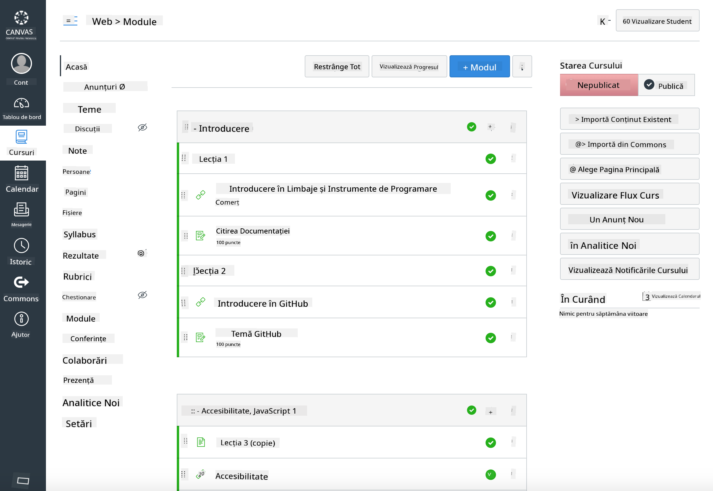

<!--
CO_OP_TRANSLATOR_METADATA:
{
  "original_hash": "75cb51f7ca9ea0b097ef4a1287e9290c",
  "translation_date": "2025-08-28T07:29:50+00:00",
  "source_file": "for-teachers.md",
  "language_code": "ro"
}
-->
## Pentru educatori

Doriți să folosiți acest curriculum în sala de clasă? Vă rugăm să o faceți!

De fapt, îl puteți utiliza direct pe GitHub, folosind GitHub Classroom.

Pentru a face acest lucru, creați un fork al acestui repo. Va trebui să creați un repo pentru fiecare lecție, așa că va trebui să extrageți fiecare folder într-un repo separat. Astfel, [GitHub Classroom](https://classroom.github.com/classrooms) poate prelua fiecare lecție separat.

Aceste [instrucțiuni complete](https://github.blog/2020-03-18-set-up-your-digital-classroom-with-github-classroom/) vă vor oferi o idee despre cum să vă configurați sala de clasă.

## Utilizarea în Moodle, Canvas sau Blackboard

Acest curriculum funcționează bine în aceste sisteme de management al învățării! Utilizați [fișierul de upload pentru Moodle](../../../../../../../teaching-files/webdev-moodle.mbz) pentru conținutul complet sau încercați [fișierul Common Cartridge](../../../../../../../teaching-files/webdev-common-cartridge.imscc), care conține o parte din conținut. Moodle Cloud nu suportă exporturi complete Common Cartridge, așa că este preferabil să utilizați fișierul de descărcare pentru Moodle, care poate fi încărcat în Canvas. Vă rugăm să ne spuneți cum putem îmbunătăți această experiență.

> Curriculumul într-o sală de clasă Moodle

> Curriculumul în Canvas

## Utilizarea repo-ului așa cum este

Dacă doriți să utilizați acest repo în forma sa actuală, fără să folosiți GitHub Classroom, acest lucru este posibil. Va trebui să comunicați cu studenții despre lecția pe care să o parcurgeți împreună.

În format online (Zoom, Teams sau altul), puteți forma grupuri de lucru pentru quiz-uri și să mentorizați studenții pentru a-i pregăti să învețe. Apoi, invitați studenții să participe la quiz-uri și să își trimită răspunsurile ca 'issues' la un anumit moment. Puteți face același lucru cu temele, dacă doriți ca studenții să lucreze colaborativ, în mod deschis.

Dacă preferați un format mai privat, cereți studenților să facă fork curriculumului, lecție cu lecție, în propriile lor repo-uri GitHub private și să vă ofere acces. Astfel, ei pot completa quiz-uri și teme în mod privat și să vi le trimită prin issues pe repo-ul clasei.

Există multe modalități de a face acest lucru să funcționeze într-un format de clasă online. Vă rugăm să ne spuneți ce funcționează cel mai bine pentru dumneavoastră!

## Vă rugăm să ne împărtășiți gândurile!

Dorim să facem acest curriculum să funcționeze pentru dumneavoastră și studenții dumneavoastră. Conectați-vă cu noi la [Colțul profesorilor](https://github.com/microsoft/Web-Dev-For-Beginners/discussions/categories/teacher-corner) și deschideți un [**issue nou**](https://github.com/microsoft/Web-Dev-For-Beginners/issues/new/choose) pentru orice cereri, erori sau feedback.

---

**Declinare de responsabilitate**:  
Acest document a fost tradus folosind serviciul de traducere AI [Co-op Translator](https://github.com/Azure/co-op-translator). Deși ne străduim să asigurăm acuratețea, vă rugăm să rețineți că traducerile automate pot conține erori sau inexactități. Documentul original în limba sa maternă ar trebui considerat sursa autoritară. Pentru informații critice, se recomandă traducerea profesională realizată de un specialist uman. Nu ne asumăm responsabilitatea pentru eventualele neînțelegeri sau interpretări greșite care pot apărea din utilizarea acestei traduceri.