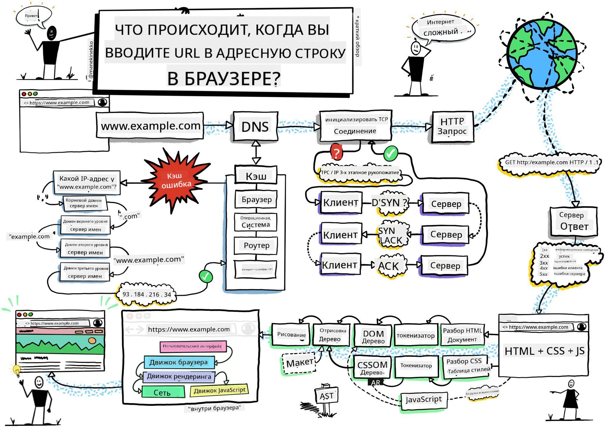
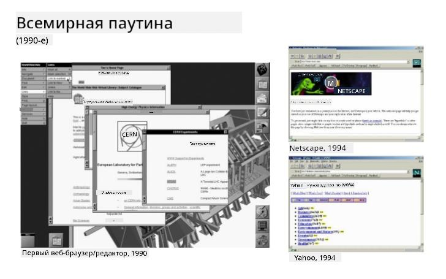
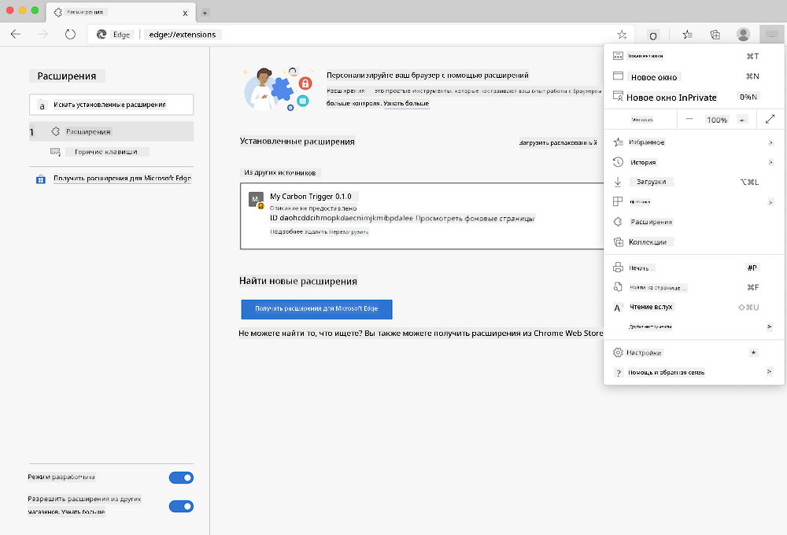
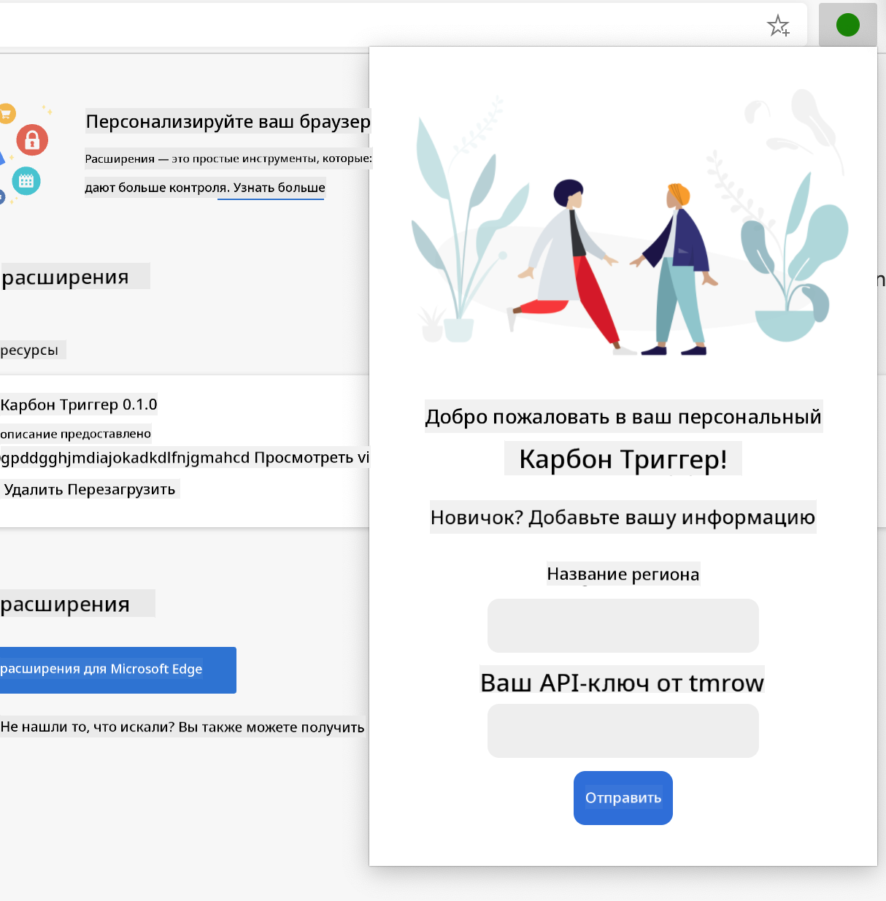

<!--
CO_OP_TRANSLATOR_METADATA:
{
  "original_hash": "2326d04e194a10aa760b51f5e5a1f61d",
  "translation_date": "2025-08-28T23:14:46+00:00",
  "source_file": "5-browser-extension/1-about-browsers/README.md",
  "language_code": "ru"
}
-->
# Проект расширения для браузера, часть 1: Всё о браузерах


> Скетч от [Wassim Chegham](https://dev.to/wassimchegham/ever-wondered-what-happens-when-you-type-in-a-url-in-an-address-bar-in-a-browser-3dob)

## Викторина перед лекцией

[Викторина перед лекцией](https://ff-quizzes.netlify.app/web/quiz/23)

### Введение

Расширения для браузеров добавляют дополнительный функционал в браузер. Но прежде чем создавать одно из них, стоит немного узнать о том, как работают браузеры.

### О браузере

В этом цикле уроков вы научитесь создавать расширение для браузера, которое будет работать в Chrome, Firefox и Edge. В этой части вы узнаете, как работают браузеры, и создадите структуру элементов расширения для браузера.

Но что такое браузер? Это программное приложение, которое позволяет пользователю получать контент с сервера и отображать его на веб-страницах.

✅ Немного истории: первый браузер назывался 'WorldWideWeb' и был создан сэром Тимоти Бернерс-Ли в 1990 году.


> Некоторые ранние браузеры, источник: [Karen McGrane](https://www.slideshare.net/KMcGrane/week-4-ixd-history-personal-computing)

Когда пользователь подключается к интернету, используя адрес URL (Uniform Resource Locator), обычно через протокол передачи гипертекста `http` или `https`, браузер связывается с веб-сервером и получает веб-страницу.

На этом этапе движок рендеринга браузера отображает её на устройстве пользователя, будь то мобильный телефон, настольный компьютер или ноутбук.

Браузеры также могут кэшировать контент, чтобы не загружать его с сервера каждый раз. Они могут записывать историю активности пользователя, сохранять "куки" — небольшие фрагменты данных, содержащие информацию о действиях пользователя, и многое другое.

Важно помнить, что браузеры не одинаковы! У каждого есть свои сильные и слабые стороны, и профессиональный веб-разработчик должен понимать, как сделать веб-страницы удобными для работы в разных браузерах. Это включает в себя адаптацию для небольших экранов, таких как мобильные телефоны, а также для пользователей, находящихся в оффлайн-режиме.

Очень полезный сайт, который стоит добавить в закладки в вашем любимом браузере — [caniuse.com](https://www.caniuse.com). Когда вы создаёте веб-страницы, списки поддерживаемых технологий на этом сайте помогут вам лучше поддерживать ваших пользователей.

✅ Как узнать, какие браузеры наиболее популярны среди пользователей вашего сайта? Проверьте аналитику — вы можете установить различные пакеты аналитики в рамках процесса веб-разработки, и они покажут, какие браузеры чаще всего используются.

## Расширения для браузеров

Почему стоит создавать расширение для браузера? Это удобный инструмент, который можно прикрепить к браузеру для быстрого доступа к задачам, которые вы часто повторяете. Например, если вам нужно проверять цвета на различных веб-страницах, вы можете установить расширение для выбора цвета. Если вам сложно запоминать пароли, вы можете использовать расширение для управления паролями.

Создавать расширения для браузеров тоже весело. Они обычно выполняют ограниченное количество задач, но делают это эффективно.

✅ Какие ваши любимые расширения для браузеров? Какие задачи они выполняют?

### Установка расширений

Прежде чем начать разработку, ознакомьтесь с процессом создания и развертывания расширения для браузера. Хотя каждый браузер немного отличается в управлении этим процессом, в Chrome и Firefox он похож на пример для Edge:



> Примечание: Убедитесь, что включен режим разработчика и разрешена установка расширений из других магазинов.

В общем, процесс будет следующим:

- создайте расширение, используя `npm run build` 
- откройте в браузере панель расширений через кнопку "Настройки и другое" (значок `...`) в правом верхнем углу
- если это новая установка, выберите `load unpacked`, чтобы загрузить свежее расширение из папки сборки (в нашем случае это `/dist`) 
- или нажмите `reload`, если вы обновляете уже установленное расширение

✅ Эти инструкции относятся к расширениям, которые вы создаёте сами; чтобы установить расширения, опубликованные в магазине расширений браузера, перейдите в соответствующие [магазины](https://microsoftedge.microsoft.com/addons/Microsoft-Edge-Extensions-Home) и установите нужное расширение.

### Начнём

Вы создадите расширение для браузера, которое будет отображать углеродный след вашего региона, показывая энергопотребление и источник энергии. Расширение будет содержать форму для ввода ключа API, чтобы вы могли получить доступ к API CO2 Signal.

**Вам потребуется:**

- [ключ API](https://www.co2signal.com/); введите ваш email в поле на этой странице, и ключ будет отправлен вам
- [код вашего региона](http://api.electricitymap.org/v3/zones), соответствующий [Electricity Map](https://www.electricitymap.org/map) (например, для Бостона используется 'US-NEISO')
- [стартовый код](../../../../5-browser-extension/start). Скачайте папку `start`; вы будете дополнять код в этой папке.
- [NPM](https://www.npmjs.com) — NPM — это инструмент управления пакетами; установите его локально, и пакеты, указанные в вашем файле `package.json`, будут установлены для использования в вашем веб-активе

✅ Узнайте больше о управлении пакетами в этом [отличном модуле Learn](https://docs.microsoft.com/learn/modules/create-nodejs-project-dependencies/?WT.mc_id=academic-77807-sagibbon)

Посмотрите на структуру кода:

dist
    -|manifest.json (здесь задаются настройки по умолчанию)
    -|index.html (HTML-разметка фронтенда)
    -|background.js (фоновые JS-скрипты)
    -|main.js (собранный JS)
src
    -|index.js (ваш JS-код)

✅ Как только у вас будут ключ API и код региона, сохраните их где-нибудь для дальнейшего использования.

### Создание HTML для расширения

У этого расширения есть два представления. Одно для ввода ключа API и кода региона:



И второе для отображения углеродного следа региона:


Начнём с создания HTML для формы и её стилизации с помощью CSS.

В папке `/dist` вы создадите форму и область для результатов. В файле `index.html` заполните область формы:

```HTML
<form class="form-data" autocomplete="on">
	<div>
		<h2>New? Add your Information</h2>
	</div>
	<div>
		<label for="region">Region Name</label>
		<input type="text" id="region" required class="region-name" />
	</div>
	<div>
		<label for="api">Your API Key from tmrow</label>
		<input type="text" id="api" required class="api-key" />
	</div>
	<button class="search-btn">Submit</button>
</form>	
```
Это форма, где сохранённая информация будет вводиться и сохраняться в локальном хранилище.

Затем создайте область для результатов; под последним тегом формы добавьте несколько div:

```HTML
<div class="result">
	<div class="loading">loading...</div>
	<div class="errors"></div>
	<div class="data"></div>
	<div class="result-container">
		<p><strong>Region: </strong><span class="my-region"></span></p>
		<p><strong>Carbon Usage: </strong><span class="carbon-usage"></span></p>
		<p><strong>Fossil Fuel Percentage: </strong><span class="fossil-fuel"></span></p>
	</div>
	<button class="clear-btn">Change region</button>
</div>
```
На этом этапе вы можете попробовать сборку. Убедитесь, что установили зависимости пакетов для этого расширения:

```
npm install
```

Эта команда использует npm, менеджер пакетов Node, для установки webpack для процесса сборки вашего расширения. Вы можете увидеть результат этого процесса, заглянув в `/dist/main.js` — вы увидите, что код был собран.

На данный момент расширение должно собраться, и если вы развернёте его в Edge как расширение, вы увидите аккуратно отображённую форму.

Поздравляем, вы сделали первые шаги к созданию расширения для браузера. В следующих уроках вы сделаете его более функциональным и полезным.

---

## 🚀 Задание

Посмотрите магазин расширений для браузеров и установите одно из них в ваш браузер. Вы можете изучить его файлы интересными способами. Что вы обнаружили?

## Викторина после лекции

[Викторина после лекции](https://ff-quizzes.netlify.app/web/quiz/24)

## Обзор и самостоятельное изучение

На этом уроке вы узнали немного о истории веб-браузеров; воспользуйтесь этой возможностью, чтобы узнать, как создатели Всемирной паутины представляли её использование, прочитав больше о её истории. Полезные сайты:

[История веб-браузеров](https://www.mozilla.org/firefox/browsers/browser-history/)

[История веба](https://webfoundation.org/about/vision/history-of-the-web/)

[Интервью с Тимом Бернерсом-Ли](https://www.theguardian.com/technology/2019/mar/12/tim-berners-lee-on-30-years-of-the-web-if-we-dream-a-little-we-can-get-the-web-we-want)

## Задание 

[Измените стиль вашего расширения](assignment.md)

---

**Отказ от ответственности**:  
Этот документ был переведен с помощью сервиса автоматического перевода [Co-op Translator](https://github.com/Azure/co-op-translator). Несмотря на наши усилия обеспечить точность, автоматические переводы могут содержать ошибки или неточности. Оригинальный документ на его родном языке следует считать авторитетным источником. Для получения критически важной информации рекомендуется профессиональный перевод человеком. Мы не несем ответственности за любые недоразумения или неправильные интерпретации, возникшие в результате использования данного перевода.