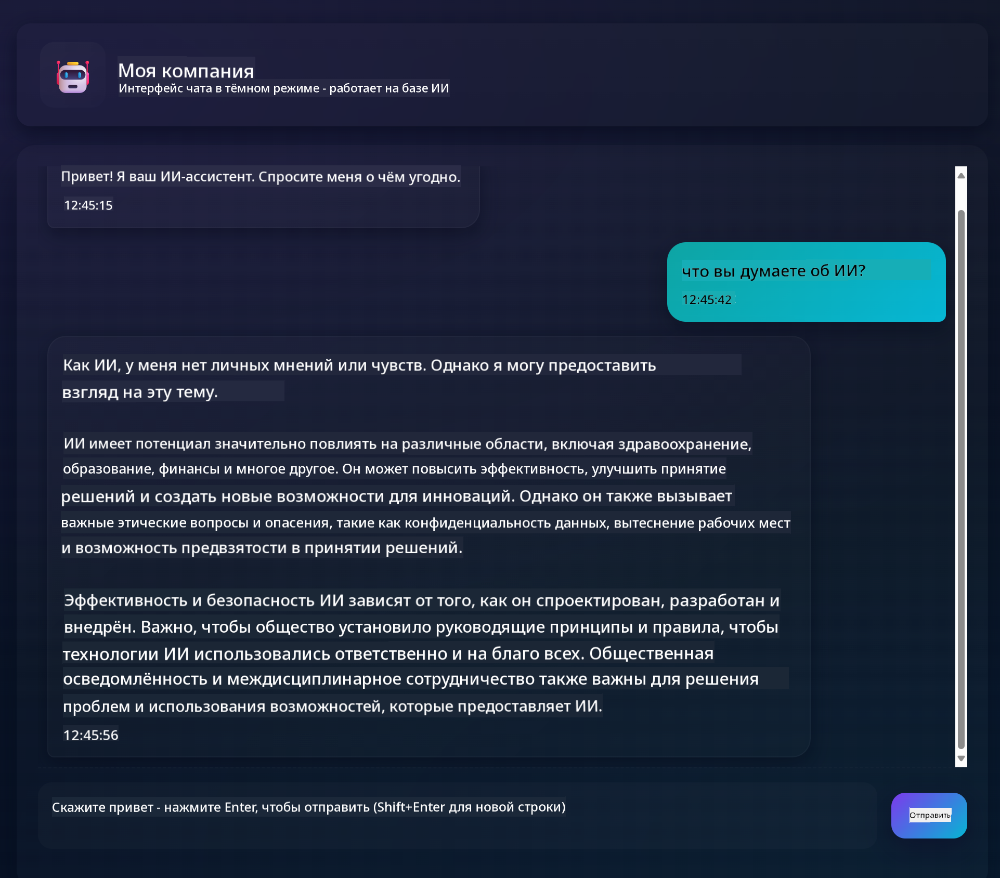
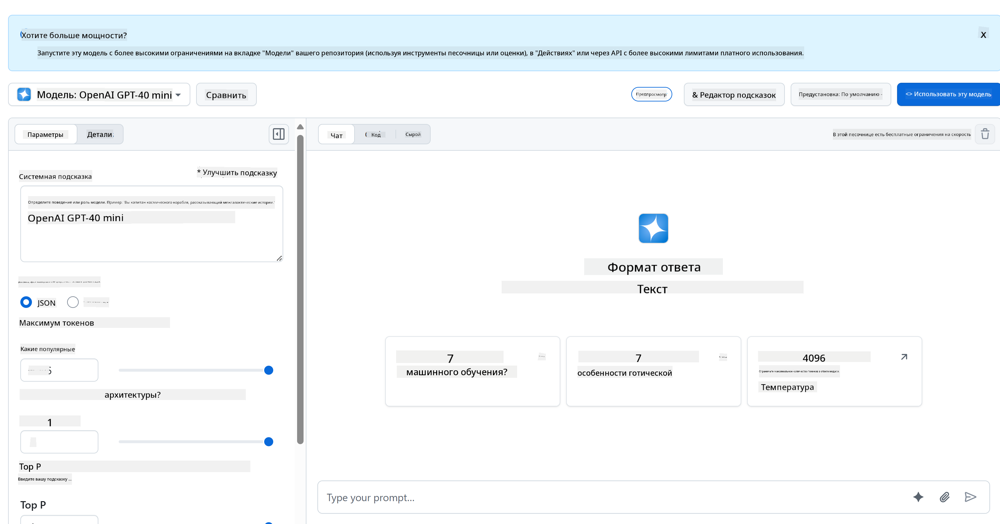
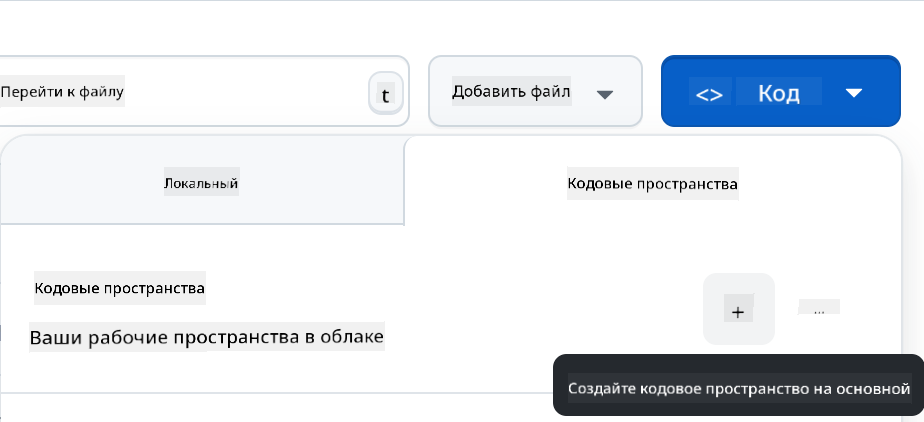

<!--
CO_OP_TRANSLATOR_METADATA:
{
  "original_hash": "11cf36165c243947b6cd85b88cf6faa6",
  "translation_date": "2025-09-01T16:47:49+00:00",
  "source_file": "9-chat-project/README.md",
  "language_code": "ru"
}
-->
# Проект чата

Этот проект демонстрирует, как создать чат-ассистента с использованием GitHub Models.

Вот как выглядит готовый проект:



Немного контекста: создание чат-ассистентов с использованием генеративного ИИ — отличный способ начать изучение ИИ. В этом уроке вы научитесь интегрировать генеративный ИИ в веб-приложение. Давайте начнем.

## Подключение к генеративному ИИ

Для бэкенда мы используем GitHub Models. Это отличный сервис, который позволяет использовать ИИ бесплатно. Перейдите в его playground и возьмите код, соответствующий выбранному вами языку бэкенда. Вот как это выглядит: [GitHub Models Playground](https://github.com/marketplace/models/azure-openai/gpt-4o-mini/playground)



Как мы уже сказали, выберите вкладку "Code" и ваш предпочитаемый runtime.


### Использование Python

В данном случае мы выбираем Python, что означает, что мы берем следующий код:

```python
"""Run this model in Python

> pip install openai
"""
import os
from openai import OpenAI

# To authenticate with the model you will need to generate a personal access token (PAT) in your GitHub settings. 
# Create your PAT token by following instructions here: https://docs.github.com/en/authentication/keeping-your-account-and-data-secure/managing-your-personal-access-tokens
client = OpenAI(
    base_url="https://models.github.ai/inference",
    api_key=os.environ["GITHUB_TOKEN"],
)

response = client.chat.completions.create(
    messages=[
        {
            "role": "system",
            "content": "",
        },
        {
            "role": "user",
            "content": "What is the capital of France?",
        }
    ],
    model="openai/gpt-4o-mini",
    temperature=1,
    max_tokens=4096,
    top_p=1
)

print(response.choices[0].message.content)
```

Давайте немного очистим этот код, чтобы он был более универсальным:

```python
def call_llm(prompt: str, system_message: str):
    response = client.chat.completions.create(
        messages=[
            {
                "role": "system",
                "content": system_message,
            },
            {
                "role": "user",
                "content": prompt,
            }
        ],
        model="openai/gpt-4o-mini",
        temperature=1,
        max_tokens=4096,
        top_p=1
    )

    return response.choices[0].message.content
```

С помощью этой функции `call_llm` мы можем передать подсказку и системную подсказку, а функция вернет результат.

### Настройка AI-ассистента

Если вы хотите настроить AI-ассистента, вы можете указать, как он должен себя вести, заполнив системную подсказку следующим образом:

```python
call_llm("Tell me about you", "You're Albert Einstein, you only know of things in the time you were alive")
```

## Экспонирование через Web API

Отлично, мы завершили часть с ИИ, теперь посмотрим, как интегрировать это в Web API. Для Web API мы выбрали Flask, но подойдет любой веб-фреймворк. Вот код:

### Использование Python

```python
# api.py
from flask import Flask, request, jsonify
from llm import call_llm
from flask_cors import CORS

app = Flask(__name__)
CORS(app)   # *   example.com

@app.route("/", methods=["GET"])
def index():
    return "Welcome to this API. Call POST /hello with 'message': 'my message' as JSON payload"


@app.route("/hello", methods=["POST"])
def hello():
    # get message from request body  { "message": "do this taks for me" }
    data = request.get_json()
    message = data.get("message", "")

    response = call_llm(message, "You are a helpful assistant.")
    return jsonify({
        "response": response
    })

if __name__ == "__main__":
    app.run(host="0.0.0.0", port=5000)
```

Здесь мы создаем API на Flask и определяем маршруты "/" и "/chat". Последний предназначен для использования нашим фронтендом для передачи вопросов.

Чтобы интегрировать *llm.py*, нужно сделать следующее:

- Импортировать функцию `call_llm`:

   ```python
   from llm import call_llm
   from flask import Flask, request
   ```

- Вызвать ее из маршрута "/chat":

   ```python
   @app.route("/hello", methods=["POST"])
   def hello():
      # get message from request body  { "message": "do this taks for me" }
      data = request.get_json()
      message = data.get("message", "")

      response = call_llm(message, "You are a helpful assistant.")
      return jsonify({
         "response": response
      })
   ```

   Здесь мы разбираем входящий запрос, чтобы получить свойство `message` из JSON-тела. Затем мы вызываем LLM следующим образом:

   ```python
   response = call_llm(message, "You are a helpful assistant")

   # return the response as JSON
   return jsonify({
      "response": response 
   })
   ```

Отлично, теперь у нас все готово.

## Настройка Cors

Стоит отметить, что мы настроили CORS (разделение ресурсов между источниками). Это необходимо, так как наш бэкенд и фронтенд будут работать на разных портах, и нужно разрешить фронтенду обращаться к бэкенду.

### Использование Python

В файле *api.py* есть код, который это настраивает:

```python
from flask_cors import CORS

app = Flask(__name__)
CORS(app)   # *   example.com
```

Сейчас он настроен на разрешение для всех источников ("*"), что небезопасно. Это нужно ограничить перед переходом в продакшн.

## Запуск проекта

Чтобы запустить проект, сначала нужно запустить бэкенд, а затем фронтенд.

### Использование Python

Итак, у нас есть *llm.py* и *api.py*. Как это запустить? Нужно сделать две вещи:

- Установить зависимости:

   ```sh
   cd backend
   python -m venv venv
   source ./venv/bin/activate

   pip install openai flask flask-cors openai
   ```

- Запустить API:

   ```sh
   python api.py
   ```

   Если вы используете Codespaces, перейдите в раздел Ports в нижней части редактора, щелкните правой кнопкой мыши и выберите "Port Visibility", затем "Public".

### Работа над фронтендом

Теперь, когда у нас есть работающий API, создадим фронтенд. Это будет минимальный фронтенд, который мы будем улучшать поэтапно. В папке *frontend* создайте следующее:

```text
backend/
frontend/
index.html
app.js
styles.css
```

Начнем с **index.html**:

```html
<html>
    <head>
        <link rel="stylesheet" href="styles.css">
    </head>
    <body>
      <form>
        <textarea id="messages"></textarea>
        <input id="input" type="text" />
        <button type="submit" id="sendBtn">Send</button>  
      </form>  
      <script src="app.js" />
    </body>
</html>    
```

Это минимально необходимое для поддержки окна чата: текстовая область для отображения сообщений, поле ввода для ввода сообщения и кнопка для отправки сообщения на бэкенд. Теперь посмотрим на JavaScript в *app.js*.

**app.js**

```js
// app.js

(function(){
  // 1. set up elements  
  const messages = document.getElementById("messages");
  const form = document.getElementById("form");
  const input = document.getElementById("input");

  const BASE_URL = "change this";
  const API_ENDPOINT = `${BASE_URL}/hello`;

  // 2. create a function that talks to our backend
  async function callApi(text) {
    const response = await fetch(API_ENDPOINT, {
      method: "POST",
      headers: { "Content-Type": "application/json" },
      body: JSON.stringify({ message: text })
    });
    let json = await response.json();
    return json.response;
  }

  // 3. add response to our textarea
  function appendMessage(text, role) {
    const el = document.createElement("div");
    el.className = `message ${role}`;
    el.innerHTML = text;
    messages.appendChild(el);
  }

  // 4. listen to submit events
  form.addEventListener("submit", async(e) => {
    e.preventDefault();
   // someone clicked the button in the form
   
   // get input
   const text = input.value.trim();

   appendMessage(text, "user")

   // reset it
   input.value = '';

   const reply = await callApi(text);

   // add to messages
   appendMessage(reply, "assistant");

  })
})();
```

Разберем код по секциям:

- 1) Здесь мы получаем ссылки на все элементы, которые будем использовать в коде.
- 2) В этом разделе мы создаем функцию, которая использует встроенный метод `fetch` для вызова нашего бэкенда.
- 3) `appendMessage` помогает добавлять ответы, а также сообщения, которые вы вводите как пользователь.
- 4) Здесь мы слушаем событие отправки, читаем поле ввода, добавляем сообщение пользователя в текстовую область, вызываем API и отображаем ответ в текстовой области.

Теперь перейдем к стилям. Здесь вы можете проявить фантазию, но вот несколько предложений:

**styles.css**

```
.message {
    background: #222;
    box-shadow: 0 0 0 10px orange;
    padding: 10px:
    margin: 5px;
}

.message.user {
    background: blue;
}

.message.assistant {
    background: grey;
} 
```

С помощью этих трех классов вы сможете стилизовать сообщения в зависимости от того, откуда они поступают: от ассистента или от пользователя. Если хотите вдохновиться, посмотрите папку `solution/frontend/styles.css`.

### Изменение Base Url

Есть одна вещь, которую мы еще не настроили, — это `BASE_URL`. Она становится известной только после запуска бэкенда. Чтобы ее настроить:

- Если вы запускаете API локально, установите что-то вроде `http://localhost:5000`.
- Если запускаете в Codespaces, это будет что-то вроде "[name]app.github.dev".

## Задание

Создайте свою папку *project* с таким содержимым:

```text
project/
  frontend/
    index.html
    app.js
    styles.css
  backend/
    ...
```

Скопируйте содержимое из инструкций выше, но при желании настройте под себя.

## Решение

[Решение](./solution/README.md)

## Бонус

Попробуйте изменить личность AI-ассистента.

### Для Python

Когда вы вызываете `call_llm` в *api.py*, вы можете изменить второй аргумент на любой, например:

```python
call_llm(message, "You are Captain Picard")
```

### Фронтенд

Также измените CSS и текст по своему вкусу, внесите изменения в *index.html* и *styles.css*.

## Итог

Отлично, вы с нуля научились создавать персонального ассистента с использованием ИИ. Мы сделали это с помощью GitHub Models, бэкенда на Python и фронтенда на HTML, CSS и JavaScript.

## Настройка с Codespaces

- Перейдите в: [Репозиторий Web Dev For Beginners](https://github.com/microsoft/Web-Dev-For-Beginners)
- Создайте из шаблона (убедитесь, что вы вошли в GitHub) в правом верхнем углу:

    

- После перехода в ваш репозиторий создайте Codespace:

    

    Это запустит среду, с которой вы сможете работать.

---

**Отказ от ответственности**:  
Этот документ был переведен с помощью сервиса автоматического перевода [Co-op Translator](https://github.com/Azure/co-op-translator). Несмотря на наши усилия по обеспечению точности, автоматические переводы могут содержать ошибки или неточности. Оригинальный документ на его родном языке следует считать авторитетным источником. Для получения критически важной информации рекомендуется профессиональный перевод человеком. Мы не несем ответственности за любые недоразумения или неправильные интерпретации, возникшие в результате использования данного перевода.