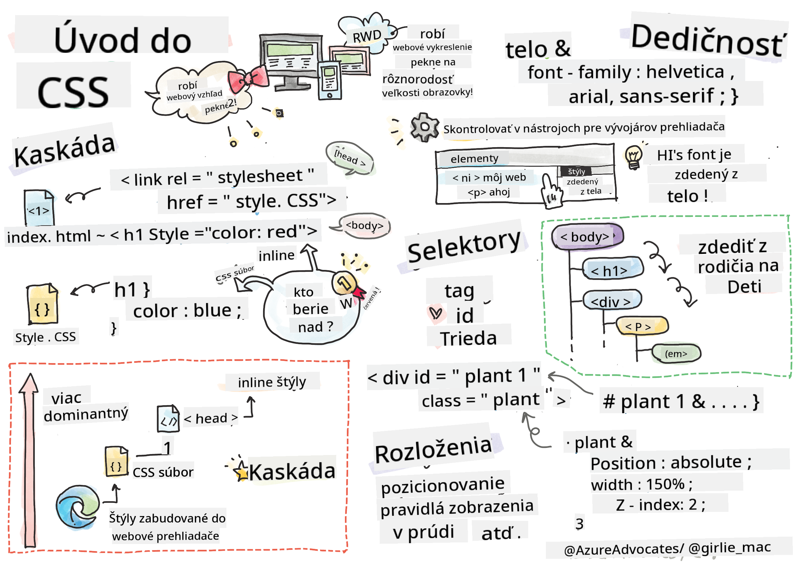
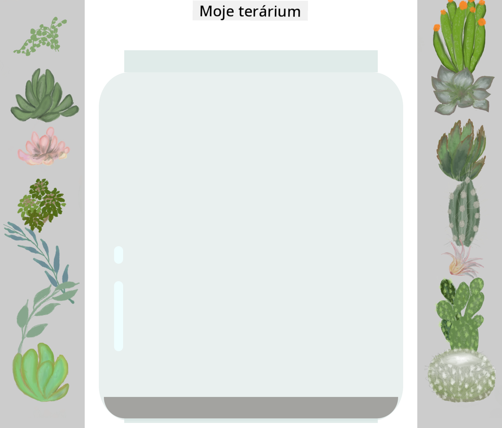

<!--
CO_OP_TRANSLATOR_METADATA:
{
  "original_hash": "acb5ae00cde004304296bb97da8ff4c3",
  "translation_date": "2025-08-29T11:15:34+00:00",
  "source_file": "3-terrarium/2-intro-to-css/README.md",
  "language_code": "sk"
}
-->
# Projekt Terrárium, časť 2: Úvod do CSS


> Sketchnote od [Tomomi Imura](https://twitter.com/girlie_mac)

## Kvíz pred prednáškou

[Kvíz pred prednáškou](https://ff-quizzes.netlify.app/web/quiz/17)

### Úvod

CSS, alebo Kaskádové štýly (Cascading Style Sheets), rieši dôležitý problém webového vývoja: ako spraviť váš web pekným. Štylizovanie vašich aplikácií ich robí použiteľnejšími a vizuálne príťažlivejšími; CSS môžete tiež použiť na vytvorenie responzívneho webového dizajnu (RWD) – umožňujúceho, aby vaše aplikácie vyzerali dobre bez ohľadu na veľkosť obrazovky, na ktorej sú zobrazené. CSS nie je len o tom, aby vaša aplikácia vyzerala pekne; jeho špecifikácia zahŕňa animácie a transformácie, ktoré umožňujú sofistikované interakcie pre vaše aplikácie. CSS pracovná skupina pomáha udržiavať aktuálne špecifikácie CSS; ich prácu môžete sledovať na [stránke World Wide Web Consortium](https://www.w3.org/Style/CSS/members).

> Poznámka: CSS je jazyk, ktorý sa vyvíja, rovnako ako všetko na webe, a nie všetky prehliadače podporujú novšie časti špecifikácie. Vždy si overte svoje implementácie konzultáciou na [CanIUse.com](https://caniuse.com).

V tejto lekcii pridáme štýly do nášho online terrária a naučíme sa viac o niekoľkých konceptoch CSS: kaskáde, dedičnosti, použití selektorov, pozicionovaní a využití CSS na tvorbu rozložení. Počas tohto procesu rozložíme terrárium a vytvoríme samotné terrárium.

### Predpoklady

Mali by ste mať HTML pre vaše terrárium pripravené na štylizovanie.

> Pozrite si video

> 
> [](https://www.youtube.com/watch?v=6yIdOIV9p1I)

### Úloha

V priečinku vášho terrária vytvorte nový súbor s názvom `style.css`. Importujte tento súbor do sekcie `<head>`:

```html
<link rel="stylesheet" href="./style.css" />
```

---

## Kaskáda

Kaskádové štýly zahŕňajú myšlienku, že štýly „kaskádujú“, takže aplikácia štýlu je riadená jeho prioritou. Štýly nastavené autorom webovej stránky majú prednosť pred tými, ktoré nastaví prehliadač. Štýly nastavené „inline“ majú prednosť pred tými, ktoré sú nastavené v externom štýlovom súbore.

### Úloha

Pridajte inline štýl "color: red" do vášho `<h1>` tagu:

```HTML
<h1 style="color: red">My Terrarium</h1>
```

Potom pridajte nasledujúci kód do vášho súboru `style.css`:

```CSS
h1 {
 color: blue;
}
```

✅ Ktorá farba sa zobrazí vo vašej webovej aplikácii? Prečo? Dokážete nájsť spôsob, ako prepísať štýly? Kedy by ste to chceli urobiť, alebo prečo nie?

---

## Dedičnosť

Štýly sa dedia od nadradeného štýlu k podriadenému, takže vnorené prvky dedia štýly svojich rodičov.

### Úloha

Nastavte font tela na daný font a skontrolujte, či font vnoreného prvku:

```CSS
body {
	font-family: helvetica, arial, sans-serif;
}
```

Otvorte konzolu prehliadača na karte 'Elements' a pozorujte font H1. Dedia svoj font z tela, ako je uvedené v prehliadači:


✅ Dokážete spraviť, aby vnorený štýl zdedil inú vlastnosť?

---

## CSS Selektory

### Tagy

Doteraz váš súbor `style.css` obsahuje iba niekoľko štýlov pre tagy a aplikácia vyzerá dosť zvláštne:

```CSS
body {
	font-family: helvetica, arial, sans-serif;
}

h1 {
	color: #3a241d;
	text-align: center;
}
```

Tento spôsob štylizovania tagu vám dáva kontrolu nad unikátnymi prvkami, ale potrebujete kontrolovať štýly mnohých rastlín vo vašom terráriu. Na to potrebujete využiť CSS selektory.

### Ids

Pridajte štýl na rozloženie ľavých a pravých kontajnerov. Keďže existuje iba jeden ľavý kontajner a jeden pravý kontajner, v označení im boli priradené id. Na ich štylizovanie použite `#`:

```CSS
#left-container {
	background-color: #eee;
	width: 15%;
	left: 0px;
	top: 0px;
	position: absolute;
	height: 100%;
	padding: 10px;
}

#right-container {
	background-color: #eee;
	width: 15%;
	right: 0px;
	top: 0px;
	position: absolute;
	height: 100%;
	padding: 10px;
}
```

Tu ste umiestnili tieto kontajnery s absolútnym pozicionovaním na úplne ľavú a pravú stranu obrazovky a použili ste percentá pre ich šírku, aby sa mohli prispôsobiť malým mobilným obrazovkám.

✅ Tento kód je dosť opakovaný, teda nie je „DRY“ (Don't Repeat Yourself); dokážete nájsť lepší spôsob, ako štylizovať tieto id, možno s použitím id a triedy? Bude potrebné zmeniť označenie a refaktorovať CSS:

```html
<div id="left-container" class="container"></div>
```

### Triedy

V predchádzajúcom príklade ste štylizovali dva unikátne prvky na obrazovke. Ak chcete, aby sa štýly aplikovali na mnoho prvkov na obrazovke, môžete použiť CSS triedy. Urobte to pre rozloženie rastlín v ľavých a pravých kontajneroch.

Všimnite si, že každá rastlina v HTML označení má kombináciu id a tried. Id sú tu použité JavaScriptom, ktorý pridáte neskôr na manipuláciu s umiestnením rastlín v terráriu. Triedy však dávajú všetkým rastlinám daný štýl.

```html
<div class="plant-holder">
	
</div>
```

Pridajte nasledujúce do vášho súboru `style.css`:

```CSS
.plant-holder {
	position: relative;
	height: 13%;
	left: -10px;
}

.plant {
	position: absolute;
	max-width: 150%;
	max-height: 150%;
	z-index: 2;
}
```

Pozoruhodné v tomto úryvku je miešanie relatívneho a absolútneho pozicionovania, ktoré si preberieme v ďalšej sekcii. Pozrite sa na spôsob, akým sú výšky spracované pomocou percent:

Nastavili ste výšku držiaka rastlín na 13 %, čo je dobré číslo na zabezpečenie, že všetky rastliny budú zobrazené v každom vertikálnom kontajneri bez potreby posúvania.

Držiak rastlín ste posunuli doľava, aby boli rastliny viac centrované v ich kontajneri. Obrázky majú veľké množstvo priehľadného pozadia, aby boli ľahšie presúvateľné, takže je potrebné ich posunúť doľava, aby lepšie zapadli na obrazovku.

Potom je samotnej rastline daná maximálna šírka 150 %. To jej umožňuje zmenšiť sa, keď sa prehliadač zmenšuje. Skúste zmeniť veľkosť prehliadača; rastliny zostanú vo svojich kontajneroch, ale zmenšia sa, aby sa zmestili.

Pozoruhodné je aj použitie z-indexu, ktorý kontroluje relatívnu výšku prvku (takže rastliny sedia na vrchu kontajnera a zdajú sa byť vo vnútri terrária).

✅ Prečo potrebujete selektor CSS pre držiak rastlín aj pre samotnú rastlinu?

## CSS Pozicionovanie

Miešanie vlastností pozicionovania (existujú statické, relatívne, fixné, absolútne a lepkavé pozície) môže byť trochu zložité, ale ak sa to urobí správne, poskytuje vám dobrú kontrolu nad prvkami na vašich stránkach.

Absolútne pozicionované prvky sú pozicionované vzhľadom na ich najbližších pozicionovaných predkov, a ak žiadni nie sú, sú pozicionované podľa tela dokumentu.

Relatívne pozicionované prvky sú pozicionované na základe pokynov CSS na úpravu ich umiestnenia od ich pôvodnej pozície.

V našom príklade je `plant-holder` relatívne pozicionovaný prvok, ktorý je pozicionovaný v absolútne pozicionovanom kontajneri. Výsledné správanie je, že bočné kontajnery sú pripnuté vľavo a vpravo, a `plant-holder` je vnorený, upravuje sa v rámci bočných kontajnerov, čím vytvára priestor pre rastliny, aby boli umiestnené vo vertikálnom rade.

> Samotná `plant` má tiež absolútne pozicionovanie, čo je nevyhnutné na to, aby bola presúvateľná, ako zistíte v ďalšej lekcii.

✅ Experimentujte s prepínaním typov pozicionovania bočných kontajnerov a `plant-holder`. Čo sa stane?

## CSS Rozloženia

Teraz použijete to, čo ste sa naučili, na vytvorenie samotného terrária, a to všetko pomocou CSS!

Najprv štylizujte deti divu `.terrarium` ako zaoblený obdĺžnik pomocou CSS:

```CSS
.jar-walls {
	height: 80%;
	width: 60%;
	background: #d1e1df;
	border-radius: 1rem;
	position: absolute;
	bottom: 0.5%;
	left: 20%;
	opacity: 0.5;
	z-index: 1;
}

.jar-top {
	width: 50%;
	height: 5%;
	background: #d1e1df;
	position: absolute;
	bottom: 80.5%;
	left: 25%;
	opacity: 0.7;
	z-index: 1;
}

.jar-bottom {
	width: 50%;
	height: 1%;
	background: #d1e1df;
	position: absolute;
	bottom: 0%;
	left: 25%;
	opacity: 0.7;
}

.dirt {
	width: 60%;
	height: 5%;
	background: #3a241d;
	position: absolute;
	border-radius: 0 0 1rem 1rem;
	bottom: 1%;
	left: 20%;
	opacity: 0.7;
	z-index: -1;
}
```

Všimnite si použitie percent tu. Ak zmenšíte svoj prehliadač, môžete vidieť, ako sa nádoba tiež prispôsobuje. Tiež si všimnite šírky a výškové percentá pre prvky nádoby a ako je každý prvok absolútne pozicionovaný v strede, pripnutý na spodok výrezu.

Používame tiež `rem` pre border-radius, čo je dĺžka relatívna k fontu. Prečítajte si viac o tomto type relatívneho merania v [CSS špecifikácii](https://www.w3.org/TR/css-values-3/#font-relative-lengths).

✅ Skúste zmeniť farby nádoby a priehľadnosť oproti tým pre hlinu. Čo sa stane? Prečo?

---

## 🚀Výzva

Pridajte „bublinkový“ lesk do ľavej dolnej časti nádoby, aby vyzerala viac ako sklo. Budete štylizovať `.jar-glossy-long` a `.jar-glossy-short`, aby vyzerali ako odrazený lesk. Takto by to malo vyzerať:



Na dokončenie kvízu po prednáške prejdite tento modul Learn: [Štylizujte svoju HTML aplikáciu pomocou CSS](https://docs.microsoft.com/learn/modules/build-simple-website/4-css-basics/?WT.mc_id=academic-77807-sagibbon)

## Kvíz po prednáške

[Kvíz po prednáške](https://ff-quizzes.netlify.app/web/quiz/18)

## Recenzia a samostatné štúdium

CSS sa môže zdať klamlivo jednoduché, ale existuje mnoho výziev pri snahe dokonale štylizovať aplikáciu pre všetky prehliadače a všetky veľkosti obrazoviek. CSS-Grid a Flexbox sú nástroje, ktoré boli vyvinuté na to, aby bola práca trochu štruktúrovanejšia a spoľahlivejšia. Naučte sa o týchto nástrojoch hraním [Flexbox Froggy](https://flexboxfroggy.com/) a [Grid Garden](https://codepip.com/games/grid-garden/).

## Zadanie

[CSS Refaktoring](assignment.md)

---

**Upozornenie**:  
Tento dokument bol preložený pomocou služby na automatický preklad [Co-op Translator](https://github.com/Azure/co-op-translator). Aj keď sa snažíme o presnosť, upozorňujeme, že automatické preklady môžu obsahovať chyby alebo nepresnosti. Pôvodný dokument v jeho pôvodnom jazyku by mal byť považovaný za autoritatívny zdroj. Pre dôležité informácie sa odporúča profesionálny ľudský preklad. Nezodpovedáme za akékoľvek nedorozumenia alebo nesprávne interpretácie vyplývajúce z použitia tohto prekladu.