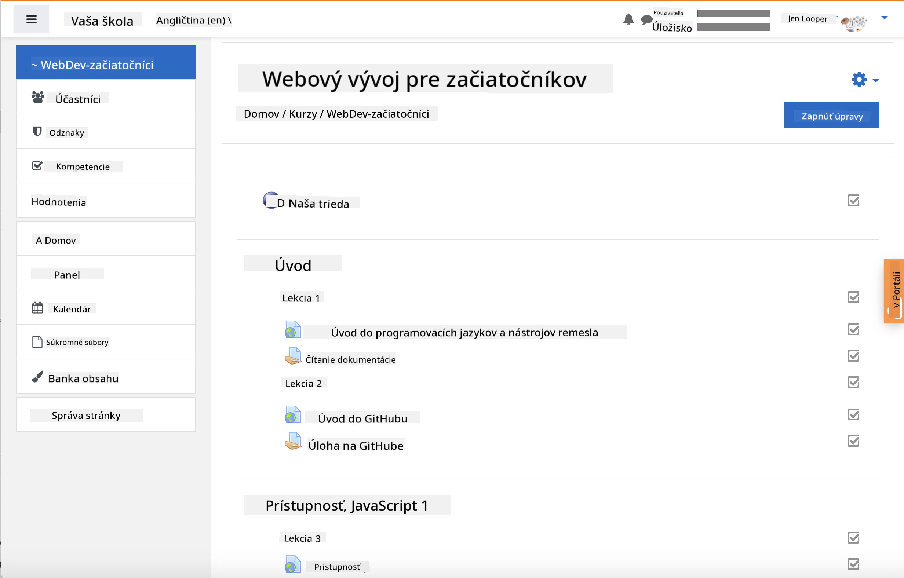

<!--
CO_OP_TRANSLATOR_METADATA:
{
  "original_hash": "75cb51f7ca9ea0b097ef4a1287e9290c",
  "translation_date": "2025-08-27T21:59:12+00:00",
  "source_file": "for-teachers.md",
  "language_code": "sk"
}
-->
## Pre pedagógov

Chceli by ste použiť tento učebný plán vo svojej triede? Neváhajte a využite ho!

V skutočnosti ho môžete použiť priamo na GitHube pomocou GitHub Classroom.

Na to si forknite toto repozitórium. Budete potrebovať vytvoriť samostatné repozitórium pre každú lekciu, takže budete musieť extrahovať každý priečinok do samostatného repozitória. Takto môže [GitHub Classroom](https://classroom.github.com/classrooms) spracovať každú lekciu samostatne.

Tieto [podrobné pokyny](https://github.blog/2020-03-18-set-up-your-digital-classroom-with-github-classroom/) vám poskytnú predstavu o tom, ako nastaviť svoju triedu.

## Použitie v Moodle, Canvas alebo Blackboard

Tento učebný plán funguje výborne aj v týchto systémoch na správu výučby! Použite [Moodle súbor na nahranie](../../../../../../../teaching-files/webdev-moodle.mbz) pre kompletný obsah, alebo vyskúšajte [Common Cartridge súbor](../../../../../../../teaching-files/webdev-common-cartridge.imscc), ktorý obsahuje časť obsahu. Moodle Cloud nepodporuje úplné exporty Common Cartridge, preto je vhodnejšie použiť Moodle súbor na stiahnutie, ktorý je možné nahrať do Canvas. Dajte nám vedieť, ako môžeme tento zážitok zlepšiť.

  
> Učebný plán v Moodle triede

  
> Učebný plán v Canvas

## Použitie repozitória v aktuálnom stave

Ak by ste chceli použiť toto repozitórium tak, ako je, bez použitia GitHub Classroom, aj to je možné. Budete musieť komunikovať so svojimi študentmi, ktorou lekciou sa majú spoločne zaoberať.

V online formáte (Zoom, Teams alebo iné) môžete vytvoriť skupinové miestnosti pre kvízy a mentorovať študentov, aby boli pripravení na učenie. Potom pozvite študentov na kvízy a nechajte ich odoslať svoje odpovede ako 'issues' v určitom čase. To isté môžete urobiť s úlohami, ak chcete, aby študenti pracovali spolu verejne.

Ak preferujete súkromnejší formát, požiadajte svojich študentov, aby si forkovali učebný plán, lekciu po lekcii, do svojich vlastných súkromných GitHub repozitórií a dali vám prístup. Potom môžu dokončiť kvízy a úlohy súkromne a odoslať ich vám prostredníctvom issues vo vašom triednom repozitóriu.

Existuje mnoho spôsobov, ako to môže fungovať v online triede. Dajte nám vedieť, čo vám najviac vyhovuje!

## Podeľte sa s nami o svoje názory!

Chceme, aby tento učebný plán fungoval pre vás a vašich študentov. Spojte sa s nami v [Teacher corner](https://github.com/microsoft/Web-Dev-For-Beginners/discussions/categories/teacher-corner) a otvorte [**nový issue**](https://github.com/microsoft/Web-Dev-For-Beginners/issues/new/choose) pre akékoľvek požiadavky, chyby a spätnú väzbu.

---

**Upozornenie**:  
Tento dokument bol preložený pomocou služby na automatický preklad [Co-op Translator](https://github.com/Azure/co-op-translator). Aj keď sa snažíme o presnosť, upozorňujeme, že automatické preklady môžu obsahovať chyby alebo nepresnosti. Pôvodný dokument v jeho pôvodnom jazyku by mal byť považovaný za autoritatívny zdroj. Pre dôležité informácie sa odporúča profesionálny ľudský preklad. Nezodpovedáme za akékoľvek nedorozumenia alebo nesprávne interpretácie vyplývajúce z použitia tohto prekladu.