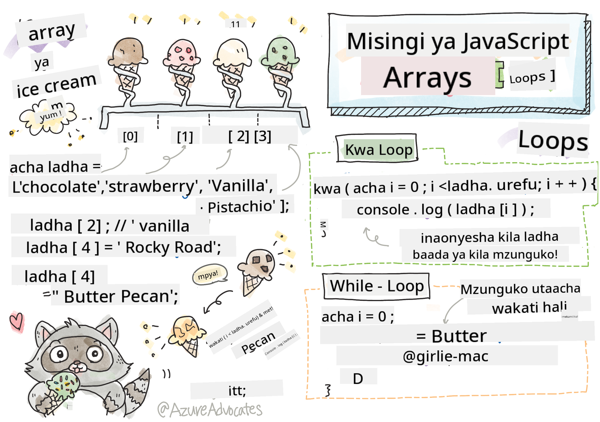

<!--
CO_OP_TRANSLATOR_METADATA:
{
  "original_hash": "9029f96b0e034839c1799f4595e4bb66",
  "translation_date": "2025-08-29T10:09:11+00:00",
  "source_file": "2-js-basics/4-arrays-loops/README.md",
  "language_code": "sw"
}
-->
# Msingi wa JavaScript: Arrays na Loops


> Sketchnote na [Tomomi Imura](https://twitter.com/girlie_mac)

## Maswali ya Awali ya Somo
[Maswali ya awali ya somo](https://ff-quizzes.netlify.app/web/quiz/13)

Somo hili linashughulikia misingi ya JavaScript, lugha inayowezesha mwingiliano kwenye wavuti. Katika somo hili, utajifunza kuhusu arrays na loops, ambazo hutumika kudhibiti data.

[](https://youtube.com/watch?v=1U4qTyq02Xw "Arrays")

[](https://www.youtube.com/watch?v=Eeh7pxtTZ3k "Loops")

> 🎥 Bonyeza picha zilizo juu kwa video kuhusu arrays na loops.

> Unaweza kuchukua somo hili kwenye [Microsoft Learn](https://docs.microsoft.com/learn/modules/web-development-101-arrays/?WT.mc_id=academic-77807-sagibbon)!

## Arrays

Kufanya kazi na data ni kazi ya kawaida kwa lugha yoyote ya programu, na ni rahisi zaidi wakati data imepangwa katika muundo wa kimuundo, kama arrays. Kwa kutumia arrays, data huhifadhiwa katika muundo unaofanana na orodha. Faida moja kubwa ya arrays ni kwamba unaweza kuhifadhi aina tofauti za data katika array moja.

✅ Arrays zipo kila mahali! Je, unaweza kufikiria mfano wa maisha halisi wa array, kama vile safu ya paneli za jua?

Sintaksia ya array ni jozi ya mabano ya mraba.

```javascript
let myArray = [];
```

Hii ni array tupu, lakini arrays zinaweza kutangazwa tayari zikiwa na data. Thamani nyingi katika array hutenganishwa kwa koma.

```javascript
let iceCreamFlavors = ["Chocolate", "Strawberry", "Vanilla", "Pistachio", "Rocky Road"];
```

Thamani za array hupewa thamani ya kipekee inayoitwa **index**, ambayo ni nambari kamili inayotolewa kulingana na umbali wake kutoka mwanzo wa array. Katika mfano hapo juu, thamani ya kamba "Chocolate" ina index ya 0, na index ya "Rocky Road" ni 4. Tumia index na mabano ya mraba ili kupata, kubadilisha, au kuingiza thamani za array.

✅ Je, inakushangaza kwamba arrays huanza na index ya sifuri? Katika baadhi ya lugha za programu, indexes huanza na 1. Kuna historia ya kuvutia kuhusu hili, ambayo unaweza [kusoma kwenye Wikipedia](https://en.wikipedia.org/wiki/Zero-based_numbering).

```javascript
let iceCreamFlavors = ["Chocolate", "Strawberry", "Vanilla", "Pistachio", "Rocky Road"];
iceCreamFlavors[2]; //"Vanilla"
```

Unaweza kutumia index kubadilisha thamani, kama hivi:

```javascript
iceCreamFlavors[4] = "Butter Pecan"; //Changed "Rocky Road" to "Butter Pecan"
```

Na unaweza kuingiza thamani mpya kwenye index fulani kama hivi:

```javascript
iceCreamFlavors[5] = "Cookie Dough"; //Added "Cookie Dough"
```

✅ Njia ya kawaida zaidi ya kuongeza thamani kwenye array ni kwa kutumia waendeshaji wa array kama array.push()

Ili kujua ni vitu vingapi viko kwenye array, tumia sifa ya `length`.

```javascript
let iceCreamFlavors = ["Chocolate", "Strawberry", "Vanilla", "Pistachio", "Rocky Road"];
iceCreamFlavors.length; //5
```

✅ Jaribu mwenyewe! Tumia console ya kivinjari chako kuunda na kudhibiti array ya ubunifu wako mwenyewe.

## Loops

Loops hutuwezesha kufanya kazi za kurudia au **iterative**, na zinaweza kuokoa muda mwingi na msimbo. Kila mzunguko unaweza kutofautiana katika vigezo, thamani, na hali. Kuna aina tofauti za loops katika JavaScript, na zote zina tofauti ndogo, lakini kimsingi hufanya jambo lile lile: kurudia data.

### For Loop

`for` loop inahitaji sehemu 3 ili kurudia:
- `counter` Kigezo ambacho kawaida huanzishwa na nambari inayohesabu idadi ya mizunguko
- `condition` Usemi unaotumia waendeshaji wa kulinganisha kusababisha loop kusimama wakati ni `false`
- `iteration-expression` Huendeshwa mwishoni mwa kila mzunguko, kawaida hutumika kubadilisha thamani ya counter
  
```javascript
// Counting up to 10
for (let i = 0; i < 10; i++) {
  console.log(i);
}
```

✅ Endesha msimbo huu kwenye console ya kivinjari. Nini hutokea unapofanya mabadiliko madogo kwenye counter, condition, au iteration expression? Je, unaweza kuifanya iende kinyume, ikitengeneza hesabu ya kurudi nyuma?

### While loop

Tofauti na sintaksia ya `for` loop, `while` loops zinahitaji tu hali ambayo itasimamisha loop wakati hali inakuwa `false`. Hali katika loops kawaida hutegemea thamani nyingine kama counters, na lazima zisimamiwe wakati wa loop. Thamani za kuanzia za counters lazima ziundwe nje ya loop, na usemi wowote wa kukidhi hali, ikiwa ni pamoja na kubadilisha counter lazima udumishwe ndani ya loop.

```javascript
//Counting up to 10
let i = 0;
while (i < 10) {
 console.log(i);
 i++;
}
```

✅ Kwa nini ungechagua for loop badala ya while loop? Watazamaji 17,000 walikuwa na swali sawa kwenye StackOverflow, na baadhi ya maoni [yanaweza kukuvutia](https://stackoverflow.com/questions/39969145/while-loops-vs-for-loops-in-javascript).

## Loops na Arrays

Arrays mara nyingi hutumika na loops kwa sababu hali nyingi zinahitaji urefu wa array kusimamisha loop, na index inaweza pia kuwa thamani ya counter.

```javascript
let iceCreamFlavors = ["Chocolate", "Strawberry", "Vanilla", "Pistachio", "Rocky Road"];

for (let i = 0; i < iceCreamFlavors.length; i++) {
  console.log(iceCreamFlavors[i]);
} //Ends when all flavors are printed
```

✅ Jaribu kurudia array ya ubunifu wako mwenyewe kwenye console ya kivinjari chako. 

---

## 🚀 Changamoto

Kuna njia nyingine za kurudia arrays mbali na for na while loops. Kuna [forEach](https://developer.mozilla.org/docs/Web/JavaScript/Reference/Global_Objects/Array/forEach), [for-of](https://developer.mozilla.org/docs/Web/JavaScript/Reference/Statements/for...of), na [map](https://developer.mozilla.org/docs/Web/JavaScript/Reference/Global_Objects/Array/map). Andika upya loop yako ya array ukitumia mojawapo ya mbinu hizi.

## Maswali ya Baada ya Somo
[Maswali ya baada ya somo](https://ff-quizzes.netlify.app/web/quiz/14)

## Mapitio na Kujisomea

Arrays katika JavaScript zina mbinu nyingi zilizoambatanishwa nazo, ambazo ni muhimu sana kwa udhibiti wa data. [Soma kuhusu mbinu hizi](https://developer.mozilla.org/docs/Web/JavaScript/Reference/Global_Objects/Array) na ujaribu baadhi yao (kama push, pop, slice na splice) kwenye array ya ubunifu wako.

## Kazi

[Loop an Array](assignment.md)

---

**Kanusho**:  
Hati hii imetafsiriwa kwa kutumia huduma ya tafsiri ya AI [Co-op Translator](https://github.com/Azure/co-op-translator). Ingawa tunajitahidi kwa usahihi, tafadhali fahamu kuwa tafsiri za kiotomatiki zinaweza kuwa na makosa au kutokuwa sahihi. Hati ya asili katika lugha yake ya awali inapaswa kuchukuliwa kama chanzo cha mamlaka. Kwa taarifa muhimu, inashauriwa kutumia huduma ya tafsiri ya kitaalamu ya binadamu. Hatutawajibika kwa maelewano mabaya au tafsiri zisizo sahihi zinazotokana na matumizi ya tafsiri hii.