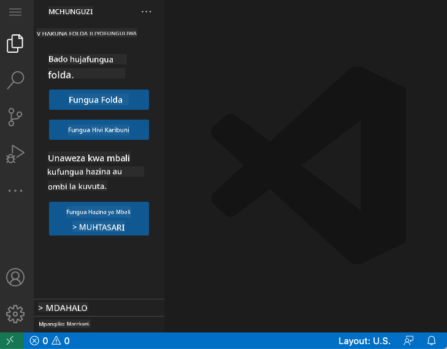
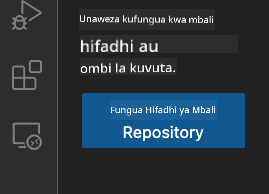
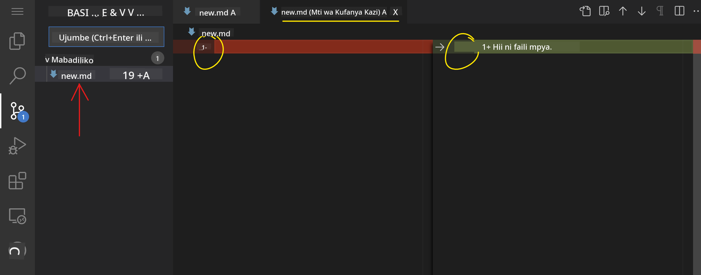
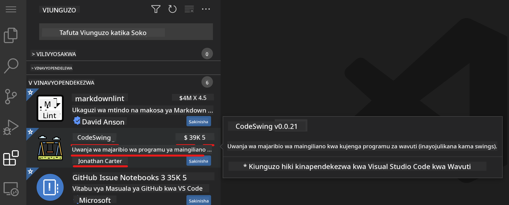

<!--
CO_OP_TRANSLATOR_METADATA:
{
  "original_hash": "1ba61d96a11309a2a6ea507496dcf7e5",
  "translation_date": "2025-08-29T10:11:42+00:00",
  "source_file": "8-code-editor/1-using-a-code-editor/README.md",
  "language_code": "sw"
}
-->
# Kutumia mhariri wa msimbo

Somo hili linashughulikia misingi ya kutumia [VSCode.dev](https://vscode.dev), mhariri wa msimbo unaotumia wavuti, ili uweze kufanya mabadiliko kwenye msimbo wako na kuchangia mradi bila kufunga chochote kwenye kompyuta yako.

## Malengo ya kujifunza

Katika somo hili, utajifunza jinsi ya:

- Kutumia mhariri wa msimbo katika mradi wa msimbo
- Kufuatilia mabadiliko kwa kutumia udhibiti wa toleo
- Kubinafsisha mhariri kwa ajili ya maendeleo

### Mahitaji ya awali

Kabla ya kuanza, utahitaji kuunda akaunti na [GitHub](https://github.com). Tembelea [GitHub](https://github.com/) na uunde akaunti ikiwa bado huna.

### Utangulizi

Mhariri wa msimbo ni zana muhimu kwa kuandika programu na kushirikiana katika miradi ya msimbo iliyopo. Mara tu unapofahamu misingi ya mhariri na jinsi ya kutumia vipengele vyake, utaweza kuzitumia unapokuwa unaandika msimbo.

## Kuanza na VSCode.dev

[VSCode.dev](https://vscode.dev) ni mhariri wa msimbo unaopatikana mtandaoni. Huna haja ya kufunga chochote ili kuitumia, ni kama kufungua tovuti nyingine yoyote. Ili kuanza na mhariri huu, fungua kiungo kifuatacho: [https://vscode.dev](https://vscode.dev). Ikiwa hujaingia kwenye [GitHub](https://github.com/), fuata maagizo ya kuingia au kuunda akaunti mpya kisha uingie.

Mara inaposheheni, inapaswa kuonekana kama picha hii:



Kuna sehemu kuu tatu, kuanzia kushoto kabisa na kuelekea kulia:

1. _Activity bar_ ambayo ina ikoni kadhaa, kama kioo cha kukuza 🔎, gia ⚙️, na nyingine chache.
2. _Side bar_ ambayo kwa kawaida huonesha _Explorer_.
3. Mwisho, eneo la msimbo upande wa kulia.

Bonyeza kila ikoni ili kuonesha menyu tofauti. Ukimaliza, bonyeza _Explorer_ ili urudi pale ulipoanzia.

Unapoanza kuunda msimbo au kubadilisha msimbo uliopo, itafanyika katika eneo kubwa zaidi upande wa kulia. Utatumia eneo hili pia kuona msimbo uliopo, jambo ambalo utafanya baadaye.

## Kufungua hifadhi ya GitHub

Jambo la kwanza unalohitaji ni kufungua hifadhi ya GitHub. Kuna njia nyingi za kufungua hifadhi. Katika sehemu hii utaona njia mbili tofauti za kufungua hifadhi ili uanze kufanya mabadiliko.

### 1. Kupitia mhariri

Tumia mhariri kufungua hifadhi ya mbali. Ukienda [VSCode.dev](https://vscode.dev) utaona kitufe cha _"Open Remote Repository"_:



Unaweza pia kutumia _command palette_. _Command palette_ ni kisanduku cha kuingiza ambapo unaweza kuandika neno lolote linalohusiana na amri au hatua ili kupata amri sahihi ya kutekeleza. Tumia menyu ya juu-kushoto, kisha uchague _View_, na kisha uchague _Command Palette_, au tumia njia ya mkato ya kibodi: Ctrl-Shift-P (kwa MacOS itakuwa Command-Shift-P).


Mara menyu inapofunguka, andika _open remote repository_, kisha uchague chaguo la kwanza. Hifadhi nyingi ambazo ni sehemu yako au ulizofungua hivi karibuni zitaonekana. Unaweza pia kutumia URL kamili ya GitHub kuchagua moja. Tumia URL ifuatayo na ubandike kwenye kisanduku:

```
https://github.com/microsoft/Web-Dev-For-Beginners
```

✅ Ikiwa imefanikiwa, utaona faili zote za hifadhi hii zimepakiwa kwenye mhariri wa maandishi.

### 2. Kutumia URL

Unaweza pia kutumia URL moja kwa moja kupakia hifadhi. Kwa mfano, URL kamili ya hifadhi ya sasa ni [https://github.com/microsoft/Web-Dev-For-Beginners](https://github.com/microsoft/Web-Dev-For-Beginners), lakini unaweza kubadilisha kikoa cha GitHub na `VSCode.dev/github` na kupakia hifadhi moja kwa moja. URL inayotokana itakuwa [https://vscode.dev/github/microsoft/Web-Dev-For-Beginners](https://vscode.dev/github/microsoft/Web-Dev-For-Beginners).

## Kuhariri faili

Mara unapofungua hifadhi kwenye kivinjari/vscode.dev, hatua inayofuata itakuwa kufanya masasisho au mabadiliko kwenye mradi.

### 1. Kuunda faili mpya

Unaweza kuunda faili ndani ya folda iliyopo, au kuiunda kwenye folda kuu. Ili kuunda faili mpya, fungua eneo/folda unayotaka faili ihifadhiwe na uchague ikoni ya _'New file ...'_ kwenye _activity bar_ (kushoto), ipe jina na bonyeza enter.


### 2. Kuhariri na kuhifadhi faili kwenye hifadhi

Kutumia vscode.dev ni muhimu kila unapohitaji kufanya masasisho ya haraka kwenye mradi wako bila kupakia programu yoyote ndani ya kompyuta.

Ili kusasisha msimbo wako, bonyeza ikoni ya 'Explorer', pia iliyoko kwenye _activity bar_ ili kuona faili na folda kwenye hifadhi. Chagua faili ili kufungua kwenye eneo la msimbo, fanya mabadiliko yako na uhifadhi.


Mara unapomaliza kusasisha mradi wako, chagua ikoni ya _`source control`_ ambayo ina mabadiliko yote mapya uliyoyafanya kwenye hifadhi yako.

Ili kuona mabadiliko uliyoyafanya kwenye mradi wako, chagua faili kwenye folda ya `Changes` kwenye _side bar_ iliyopanuliwa. Hii itafungua 'Working Tree' ili kuona mabadiliko uliyoyafanya kwenye faili. Rangi nyekundu inaonesha kilichofutwa, wakati kijani kinaonesha kilichoongezwa.



Ikiwa unaridhika na mabadiliko uliyoyafanya, weka kipanya juu ya folda ya `Changes` na bonyeza kitufe cha `+` ili kuweka mabadiliko. Kuweka mabadiliko kunamaanisha kuandaa mabadiliko yako ili kuyachapisha kwenye GitHub.

Ikiwa hujaridhika na baadhi ya mabadiliko na unataka kuyafuta, weka kipanya juu ya folda ya `Changes` na uchague ikoni ya `undo`.

Kisha, andika `commit message` _(Maelezo ya mabadiliko uliyoyafanya kwenye mradi)_, bonyeza ikoni ya tiki ili kuyachapisha.

Mara unapomaliza kufanya kazi kwenye mradi wako, chagua ikoni ya menyu ya hamburger upande wa juu kushoto ili kurudi kwenye hifadhi kwenye github.com.


## Kutumia viendelezi

Kufunga viendelezi kwenye VSCode hukuruhusu kuongeza vipengele vipya na chaguo za mazingira ya maendeleo yaliyobinafsishwa kwenye mhariri wako ili kuboresha mtiririko wa kazi wa maendeleo. Viendelezi hivi pia husaidia kuongeza msaada kwa lugha mbalimbali za programu na mara nyingi huwa ni viendelezi vya jumla au vya lugha maalum.

Ili kuvinjari orodha ya viendelezi vyote vinavyopatikana, bonyeza ikoni ya _`Extensions`_ kwenye _activity bar_ na uanze kuandika jina la kiendelezi kwenye kisanduku cha maandishi kilichoandikwa _'Search Extensions in Marketplace'_.

Utaona orodha ya viendelezi, kila kimoja kikiwa na **jina la kiendelezi, jina la mchapishaji, maelezo mafupi, idadi ya upakuaji** na **alama za nyota**.



Unaweza pia kuona viendelezi vyote vilivyofungwa hapo awali kwa kupanua _`Installed folder`_, viendelezi maarufu vinavyotumiwa na watengenezaji wengi kwenye _`Popular folder`_ na viendelezi vilivyopendekezwa kwa ajili yako ama na watumiaji walioko kwenye mazingira sawa au kulingana na faili ulizofungua hivi karibuni kwenye _`recommended folder`_.


### 1. Kufunga viendelezi

Ili kufunga kiendelezi, andika jina la kiendelezi kwenye kisanduku cha utafutaji na bonyeza juu yake ili kuona maelezo ya ziada kuhusu kiendelezi kwenye eneo la msimbo mara kinapoonekana kwenye _side bar_ iliyopanuliwa.

Unaweza kubonyeza kitufe cha _blue install_ kwenye _side bar_ iliyopanuliwa ili kufunga au kutumia kitufe cha kufunga kinachoonekana kwenye eneo la msimbo mara unapochagua kiendelezi ili kupakia maelezo ya ziada.


### 2. Kubinafsisha viendelezi

Baada ya kufunga kiendelezi, huenda ukahitaji kurekebisha tabia yake na kuibinafsisha kulingana na mapendeleo yako. Ili kufanya hivyo, chagua ikoni ya Viendelezi, na wakati huu, kiendelezi chako kitaonekana kwenye _Installed folder_, bonyeza _**Gear icon**_ na uende kwenye _Extensions Setting_.


### 3. Kusimamia viendelezi

Baada ya kufunga na kutumia kiendelezi chako, vscode.dev inatoa chaguo za kusimamia kiendelezi chako kulingana na mahitaji tofauti. Kwa mfano, unaweza kuchagua:

- **Kuzima:** _(Unazima kiendelezi kwa muda ikiwa hukihitaji kwa sasa lakini hutaki kukiondoa kabisa)_

    Chagua kiendelezi kilichofungwa kwenye _side bar_ iliyopanuliwa > bonyeza Gear icon > chagua 'Disable' au 'Disable (Workspace)' **AU** Fungua kiendelezi kwenye eneo la msimbo na bonyeza kitufe cha bluu cha Disable.

- **Kuondoa:** Chagua kiendelezi kilichofungwa kwenye _side bar_ iliyopanuliwa > bonyeza Gear icon > chagua 'Uninstall' **AU** Fungua kiendelezi kwenye eneo la msimbo na bonyeza kitufe cha bluu cha Uninstall.

---

## Kazi ya nyumbani

[Unda tovuti ya wasifu ukitumia vscode.dev](https://github.com/microsoft/Web-Dev-For-Beginners/blob/main/8-code-editor/1-using-a-code-editor/assignment.md)

## Mapitio na Kujisomea

Soma zaidi kuhusu [VSCode.dev](https://code.visualstudio.com/docs/editor/vscode-web?WT.mc_id=academic-0000-alfredodeza) na baadhi ya vipengele vyake vingine.

---

**Kanusho**:  
Hati hii imetafsiriwa kwa kutumia huduma ya kutafsiri ya AI [Co-op Translator](https://github.com/Azure/co-op-translator). Ingawa tunajitahidi kuhakikisha usahihi, tafadhali fahamu kuwa tafsiri za kiotomatiki zinaweza kuwa na makosa au kutokuwa sahihi. Hati ya asili katika lugha yake ya awali inapaswa kuzingatiwa kama chanzo cha mamlaka. Kwa taarifa muhimu, tafsiri ya kitaalamu ya binadamu inapendekezwa. Hatutawajibika kwa kutoelewana au tafsiri zisizo sahihi zinazotokana na matumizi ya tafsiri hii.