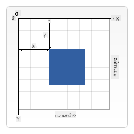

<!--
CO_OP_TRANSLATOR_METADATA:
{
  "original_hash": "056641280211e52fd0adb81b6058ec55",
  "translation_date": "2025-08-29T07:33:48+00:00",
  "source_file": "6-space-game/2-drawing-to-canvas/README.md",
  "language_code": "th"
}
-->
# สร้างเกมอวกาศ ตอนที่ 2: วาดฮีโร่และมอนสเตอร์ลงบน Canvas

## แบบทดสอบก่อนเรียน

[แบบทดสอบก่อนเรียน](https://ff-quizzes.netlify.app/web/quiz/31)

## Canvas

Canvas เป็นองค์ประกอบ HTML ที่ไม่มีเนื้อหาโดยค่าเริ่มต้น มันเป็นเหมือนกระดาษเปล่า คุณต้องเพิ่มเนื้อหาโดยการวาดลงไป

✅ อ่าน [เพิ่มเติมเกี่ยวกับ Canvas API](https://developer.mozilla.org/docs/Web/API/Canvas_API) บน MDN

นี่คือตัวอย่างการประกาศ Canvas ซึ่งมักจะอยู่ในส่วน body ของหน้าเว็บ:

```html
<canvas id="myCanvas" width="200" height="100"></canvas>
```

ในตัวอย่างด้านบน เราได้ตั้งค่า `id`, `width` และ `height`

- `id`: ตั้งค่านี้เพื่อให้คุณสามารถอ้างอิงได้เมื่อคุณต้องการโต้ตอบกับมัน
- `width`: ความกว้างขององค์ประกอบ
- `height`: ความสูงขององค์ประกอบ

## การวาดรูปทรงเรขาคณิตง่ายๆ

Canvas ใช้ระบบพิกัด Cartesian ในการวาด ดังนั้นมันจึงใช้แกน x และแกน y เพื่อแสดงตำแหน่งของสิ่งต่างๆ ตำแหน่ง `0,0` คือมุมบนซ้าย และมุมล่างขวาคือค่าที่คุณกำหนดให้เป็น WIDTH และ HEIGHT ของ Canvas


> รูปภาพจาก [MDN](https://developer.mozilla.org/docs/Web/API/Canvas_API/Tutorial/Drawing_shapes)

ขั้นตอนในการวาดบน Canvas มีดังนี้:

1. **อ้างอิง** องค์ประกอบ Canvas
2. **อ้างอิง** Context ที่อยู่บน Canvas
3. **ดำเนินการวาด** โดยใช้ Context

โค้ดสำหรับขั้นตอนด้านบนมักจะมีลักษณะดังนี้:

```javascript
// draws a red rectangle
//1. get the canvas reference
canvas = document.getElementById("myCanvas");

//2. set the context to 2D to draw basic shapes
ctx = canvas.getContext("2d");

//3. fill it with the color red
ctx.fillStyle = 'red';

//4. and draw a rectangle with these parameters, setting location and size
ctx.fillRect(0,0, 200, 200) // x,y,width, height
```

✅ Canvas API ส่วนใหญ่เน้นการวาดรูปทรง 2D แต่คุณสามารถวาดองค์ประกอบ 3D บนเว็บไซต์ได้เช่นกัน โดยใช้ [WebGL API](https://developer.mozilla.org/docs/Web/API/WebGL_API)

คุณสามารถวาดสิ่งต่างๆ ได้หลากหลายด้วย Canvas API เช่น:

- **รูปทรงเรขาคณิต** เราได้แสดงวิธีการวาดสี่เหลี่ยมไปแล้ว แต่ยังมีอีกมากที่คุณสามารถวาดได้
- **ข้อความ** คุณสามารถวาดข้อความด้วยฟอนต์และสีใดก็ได้ตามที่คุณต้องการ
- **รูปภาพ** คุณสามารถวาดรูปภาพจากไฟล์ภาพ เช่น .jpg หรือ .png

✅ ลองทำดู! คุณรู้วิธีวาดสี่เหลี่ยมแล้ว คุณสามารถวาดวงกลมลงบนหน้าเว็บได้หรือไม่? ลองดูตัวอย่าง Canvas ที่น่าสนใจบน CodePen นี่คือตัวอย่างที่ [น่าประทับใจ](https://codepen.io/dissimulate/pen/KrAwx)

## โหลดและวาดไฟล์ภาพ

คุณสามารถโหลดไฟล์ภาพโดยการสร้างวัตถุ `Image` และตั้งค่า `src` ของมัน จากนั้นฟังเหตุการณ์ `load` เพื่อทราบว่าไฟล์พร้อมใช้งานแล้ว โค้ดมีลักษณะดังนี้:

### โหลดไฟล์ภาพ

```javascript
const img = new Image();
img.src = 'path/to/my/image.png';
img.onload = () => {
  // image loaded and ready to be used
}
```

### รูปแบบการโหลดไฟล์ภาพ

แนะนำให้ห่อโค้ดด้านบนในโครงสร้างแบบนี้ เพื่อให้ง่ายต่อการใช้งานและคุณจะได้จัดการกับมันเมื่อโหลดเสร็จสมบูรณ์:

```javascript
function loadAsset(path) {
  return new Promise((resolve) => {
    const img = new Image();
    img.src = path;
    img.onload = () => {
      // image loaded and ready to be used
      resolve(img);
    }
  })
}

// use like so

async function run() {
  const heroImg = await loadAsset('hero.png')
  const monsterImg = await loadAsset('monster.png')
}

```

ในการวาดไฟล์ภาพเกมลงบนหน้าจอ โค้ดของคุณจะมีลักษณะดังนี้:

```javascript
async function run() {
  const heroImg = await loadAsset('hero.png')
  const monsterImg = await loadAsset('monster.png')

  canvas = document.getElementById("myCanvas");
  ctx = canvas.getContext("2d");
  ctx.drawImage(heroImg, canvas.width/2,canvas.height/2);
  ctx.drawImage(monsterImg, 0,0);
}
```

## ถึงเวลาสร้างเกมของคุณแล้ว

### สิ่งที่ต้องสร้าง

คุณจะสร้างหน้าเว็บที่มีองค์ประกอบ Canvas ซึ่งจะแสดงหน้าจอสีดำขนาด `1024*768` เราได้เตรียมภาพสองภาพให้คุณ:

- ยานฮีโร่

   

- มอนสเตอร์ 5*5

   

### ขั้นตอนแนะนำในการเริ่มพัฒนา

ค้นหาไฟล์ที่ถูกสร้างไว้ให้คุณในโฟลเดอร์ `your-work` ซึ่งควรมีไฟล์ดังนี้:

```bash
-| assets
  -| enemyShip.png
  -| player.png
-| index.html
-| app.js
-| package.json
```

เปิดโฟลเดอร์นี้ใน Visual Studio Code คุณต้องมีสภาพแวดล้อมการพัฒนาท้องถิ่นที่ตั้งค่าไว้แล้ว โดยแนะนำให้ใช้ Visual Studio Code พร้อม NPM และ Node หากคุณยังไม่มี `npm` ตั้งค่าในคอมพิวเตอร์ [นี่คือวิธีการตั้งค่า](https://www.npmjs.com/get-npm)

เริ่มโปรเจกต์ของคุณโดยไปที่โฟลเดอร์ `your_work`:

```bash
cd your-work
npm start
```

คำสั่งด้านบนจะเริ่ม HTTP Server ที่อยู่ `http://localhost:5000` เปิดเบราว์เซอร์และใส่ที่อยู่นั้น ตอนนี้หน้าจอจะยังว่างเปล่า แต่จะเปลี่ยนไปในไม่ช้า

> หมายเหตุ: เพื่อดูการเปลี่ยนแปลงบนหน้าจอ ให้รีเฟรชเบราว์เซอร์ของคุณ

### เพิ่มโค้ด

เพิ่มโค้ดที่จำเป็นลงใน `your-work/app.js` เพื่อแก้ปัญหาด้านล่าง

1. **วาด** Canvas พร้อมพื้นหลังสีดำ
   > เคล็ดลับ: เพิ่มสองบรรทัดใต้ TODO ที่เหมาะสมใน `/app.js` โดยตั้งค่า `ctx` ให้เป็นสีดำ และตั้งค่าพิกัดบน/ซ้ายที่ 0,0 และความสูงและความกว้างให้เท่ากับ Canvas
2. **โหลด** เท็กซ์เจอร์
   > เคล็ดลับ: เพิ่มภาพผู้เล่นและศัตรูโดยใช้ `await loadTexture` และส่งเส้นทางของภาพ คุณยังไม่เห็นภาพบนหน้าจอ!
3. **วาด** ฮีโร่ตรงกลางหน้าจอในครึ่งล่าง
   > เคล็ดลับ: ใช้ API `drawImage` เพื่อวาด heroImg ลงบนหน้าจอ โดยตั้งค่า `canvas.width / 2 - 45` และ `canvas.height - canvas.height / 4)`
4. **วาด** มอนสเตอร์ 5*5
   > เคล็ดลับ: ตอนนี้คุณสามารถยกเลิกการคอมเมนต์โค้ดเพื่อวาดศัตรูลงบนหน้าจอ จากนั้นไปที่ฟังก์ชัน `createEnemies` และสร้างมันขึ้นมา

   เริ่มต้นด้วยการตั้งค่าค่าคงที่บางอย่าง:

    ```javascript
    const MONSTER_TOTAL = 5;
    const MONSTER_WIDTH = MONSTER_TOTAL * 98;
    const START_X = (canvas.width - MONSTER_WIDTH) / 2;
    const STOP_X = START_X + MONSTER_WIDTH;
    ```

    จากนั้นสร้างลูปเพื่อวาดอาร์เรย์ของมอนสเตอร์ลงบนหน้าจอ:

    ```javascript
    for (let x = START_X; x < STOP_X; x += 98) {
        for (let y = 0; y < 50 * 5; y += 50) {
          ctx.drawImage(enemyImg, x, y);
        }
      }
    ```

## ผลลัพธ์

ผลลัพธ์ที่เสร็จสมบูรณ์ควรมีลักษณะดังนี้:


## วิธีแก้ปัญหา

ลองแก้ปัญหาด้วยตัวเองก่อน แต่ถ้าคุณติดขัด ลองดู [วิธีแก้ปัญหา](../../../../6-space-game/2-drawing-to-canvas/solution/app.js)

---

## 🚀 ความท้าทาย

คุณได้เรียนรู้เกี่ยวกับการวาดด้วย Canvas API ที่เน้น 2D ลองดู [WebGL API](https://developer.mozilla.org/docs/Web/API/WebGL_API) และลองวาดวัตถุ 3D

## แบบทดสอบหลังเรียน

[แบบทดสอบหลังเรียน](https://ff-quizzes.netlify.app/web/quiz/32)

## ทบทวนและศึกษาด้วยตัวเอง

เรียนรู้เพิ่มเติมเกี่ยวกับ Canvas API โดย [อ่านเพิ่มเติม](https://developer.mozilla.org/docs/Web/API/Canvas_API)

## งานที่ได้รับมอบหมาย

[ลองเล่นกับ Canvas API](assignment.md)

---

**ข้อจำกัดความรับผิดชอบ**:  
เอกสารนี้ได้รับการแปลโดยใช้บริการแปลภาษา AI [Co-op Translator](https://github.com/Azure/co-op-translator) แม้ว่าเราจะพยายามอย่างเต็มที่เพื่อให้การแปลมีความถูกต้อง โปรดทราบว่าการแปลอัตโนมัติอาจมีข้อผิดพลาดหรือความไม่แม่นยำ เอกสารต้นฉบับในภาษาต้นทางควรถือเป็นแหล่งข้อมูลที่เชื่อถือได้ สำหรับข้อมูลที่สำคัญ ขอแนะนำให้ใช้บริการแปลภาษามนุษย์มืออาชีพ เราจะไม่รับผิดชอบต่อความเข้าใจผิดหรือการตีความที่ผิดพลาดซึ่งเกิดจากการใช้การแปลนี้