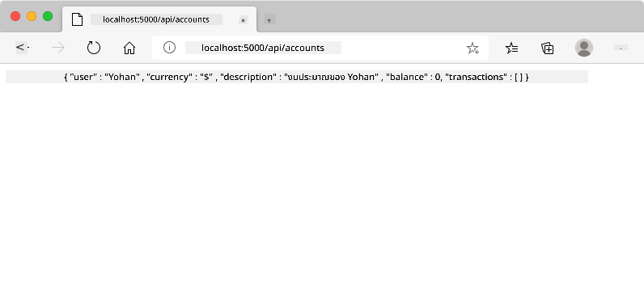
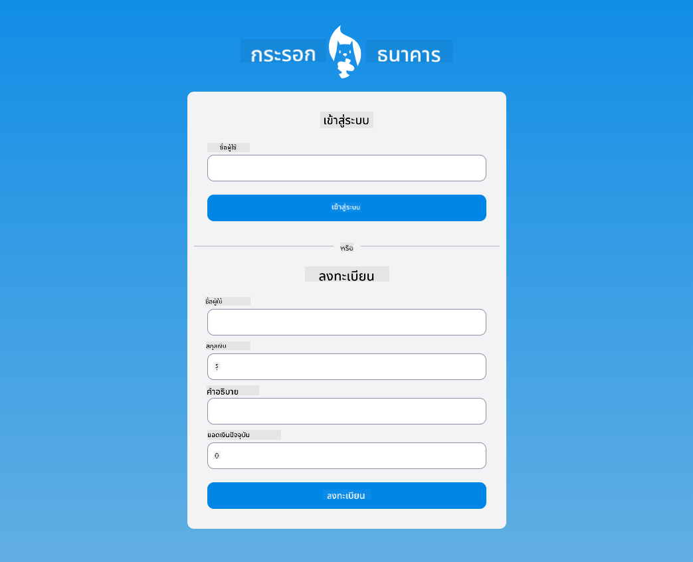

<!--
CO_OP_TRANSLATOR_METADATA:
{
  "original_hash": "8baca047d77a5f43fa4099c0578afa42",
  "translation_date": "2025-08-29T07:26:54+00:00",
  "source_file": "7-bank-project/2-forms/README.md",
  "language_code": "th"
}
-->
# สร้างแอปธนาคาร ตอนที่ 2: สร้างฟอร์มเข้าสู่ระบบและลงทะเบียน

## แบบทดสอบก่อนเรียน

[แบบทดสอบก่อนเรียน](https://ff-quizzes.netlify.app/web/quiz/43)

### บทนำ

ในแอปเว็บสมัยใหม่เกือบทุกแอป คุณสามารถสร้างบัญชีเพื่อมีพื้นที่ส่วนตัวของคุณเองได้ เนื่องจากมีผู้ใช้หลายคนที่สามารถเข้าถึงแอปเว็บได้พร้อมกัน คุณจึงต้องมีวิธีการจัดเก็บข้อมูลส่วนตัวของแต่ละผู้ใช้แยกกัน และเลือกแสดงข้อมูลที่เหมาะสม เราจะไม่ครอบคลุมถึงวิธีการจัดการ [ตัวตนของผู้ใช้อย่างปลอดภัย](https://en.wikipedia.org/wiki/Authentication) เนื่องจากเป็นหัวข้อที่กว้างขวางในตัวเอง แต่เราจะทำให้แน่ใจว่าผู้ใช้แต่ละคนสามารถสร้างบัญชีธนาคารหนึ่งบัญชี (หรือมากกว่า) ในแอปของเราได้

ในส่วนนี้ เราจะใช้ฟอร์ม HTML เพื่อเพิ่มฟังก์ชันการเข้าสู่ระบบและการลงทะเบียนในแอปเว็บของเรา เราจะเรียนรู้วิธีการส่งข้อมูลไปยัง API ของเซิร์ฟเวอร์แบบโปรแกรม และสุดท้ายคือการกำหนดกฎการตรวจสอบความถูกต้องพื้นฐานสำหรับข้อมูลที่ผู้ใช้ป้อน

### ความต้องการเบื้องต้น

คุณจำเป็นต้องทำส่วน [HTML templates และ routing](../1-template-route/README.md) ของแอปเว็บให้เสร็จสิ้นก่อนสำหรับบทเรียนนี้ นอกจากนี้ คุณยังต้องติดตั้ง [Node.js](https://nodejs.org) และ [รัน API ของเซิร์ฟเวอร์](../api/README.md) บนเครื่องของคุณเพื่อให้สามารถส่งข้อมูลเพื่อสร้างบัญชีได้

**โปรดทราบ**
คุณจะต้องเปิดเทอร์มินัลสองหน้าต่างพร้อมกันดังนี้:
1. สำหรับแอปธนาคารหลักที่เราสร้างในบทเรียน [HTML templates และ routing](../1-template-route/README.md)
2. สำหรับ [API เซิร์ฟเวอร์ของแอปธนาคาร](../api/README.md) ที่เราเพิ่งตั้งค่าไว้ข้างต้น

คุณต้องเปิดใช้งานเซิร์ฟเวอร์ทั้งสองเพื่อทำตามบทเรียนที่เหลือ เซิร์ฟเวอร์เหล่านี้จะฟังที่พอร์ตต่างกัน (พอร์ต `3000` และพอร์ต `5000`) ดังนั้นทุกอย่างควรทำงานได้อย่างราบรื่น

คุณสามารถทดสอบว่าเซิร์ฟเวอร์ทำงานได้อย่างถูกต้องโดยรันคำสั่งนี้ในเทอร์มินัล:

```sh
curl http://localhost:5000/api
# -> should return "Bank API v1.0.0" as a result
```

---

## ฟอร์มและคอนโทรล

องค์ประกอบ `<form>` ใช้สำหรับครอบคลุมส่วนหนึ่งของเอกสาร HTML ที่ผู้ใช้สามารถป้อนและส่งข้อมูลผ่านคอนโทรลแบบโต้ตอบได้ มีคอนโทรลอินเทอร์เฟซผู้ใช้ (UI) หลายประเภทที่สามารถใช้ในฟอร์มได้ โดยทั่วไปคือองค์ประกอบ `<input>` และ `<button>`

มี `<input>` [ประเภทต่างๆ](https://developer.mozilla.org/docs/Web/HTML/Element/input) มากมาย ตัวอย่างเช่น หากคุณต้องการสร้างช่องให้ผู้ใช้ป้อนชื่อผู้ใช้ คุณสามารถใช้:

```html
<input id="username" name="username" type="text">
```

แอตทริบิวต์ `name` จะถูกใช้เป็นชื่อพร็อพเพอร์ตี้เมื่อส่งข้อมูลฟอร์ม ส่วนแอตทริบิวต์ `id` ใช้เพื่อเชื่อมโยง `<label>` กับคอนโทรลของฟอร์ม

> ลองดูรายการ [`<input>` types](https://developer.mozilla.org/docs/Web/HTML/Element/input) และ [คอนโทรลฟอร์มอื่นๆ](https://developer.mozilla.org/docs/Learn/Forms/Other_form_controls) เพื่อทำความเข้าใจเกี่ยวกับองค์ประกอบ UI ดั้งเดิมที่คุณสามารถใช้ในการสร้าง UI ของคุณ

✅ โปรดทราบว่า `<input>` เป็น [องค์ประกอบว่างเปล่า](https://developer.mozilla.org/docs/Glossary/Empty_element) ซึ่งคุณไม่ควรเพิ่มแท็กปิดที่ตรงกัน อย่างไรก็ตาม คุณสามารถใช้รูปแบบ `<input/>` แบบปิดตัวเองได้ แต่ไม่จำเป็น

องค์ประกอบ `<button>` ภายในฟอร์มมีความพิเศษเล็กน้อย หากคุณไม่ได้ระบุแอตทริบิวต์ `type` ของมัน มันจะส่งข้อมูลฟอร์มไปยังเซิร์ฟเวอร์โดยอัตโนมัติเมื่อกดปุ่ม นี่คือค่าที่เป็นไปได้ของ `type`:

- `submit`: ค่าเริ่มต้นใน `<form>` ปุ่มจะทำการส่งฟอร์ม
- `reset`: ปุ่มจะรีเซ็ตคอนโทรลฟอร์มทั้งหมดกลับไปยังค่าตั้งต้น
- `button`: ไม่กำหนดพฤติกรรมเริ่มต้นเมื่อกดปุ่ม คุณสามารถกำหนดการกระทำที่กำหนดเองโดยใช้ JavaScript

### งาน

เริ่มต้นด้วยการเพิ่มฟอร์มในเทมเพลต `login` เราจะต้องมีช่อง *username* และปุ่ม *Login*

```html
<template id="login">
  <h1>Bank App</h1>
  <section>
    <h2>Login</h2>
    <form id="loginForm">
      <label for="username">Username</label>
      <input id="username" name="user" type="text">
      <button>Login</button>
    </form>
  </section>
</template>
```

หากคุณสังเกตดีๆ คุณจะเห็นว่าเราเพิ่มองค์ประกอบ `<label>` ด้วย `<label>` ใช้เพื่อเพิ่มชื่อให้กับคอนโทรล UI เช่น ช่องชื่อผู้ใช้ของเรา การใช้ป้ายกำกับมีความสำคัญต่อการอ่านฟอร์มของคุณ และยังมีประโยชน์เพิ่มเติมดังนี้:

- การเชื่อมโยงป้ายกำกับกับคอนโทรลฟอร์มช่วยให้ผู้ใช้ที่ใช้เทคโนโลยีช่วยเหลือ (เช่น โปรแกรมอ่านหน้าจอ) เข้าใจว่าข้อมูลใดที่พวกเขาควรให้
- คุณสามารถคลิกที่ป้ายกำกับเพื่อโฟกัสไปยังอินพุตที่เชื่อมโยงได้โดยตรง ทำให้ง่ายต่อการเข้าถึงบนอุปกรณ์ที่ใช้หน้าจอสัมผัส

> [การเข้าถึง](https://developer.mozilla.org/docs/Learn/Accessibility/What_is_accessibility) บนเว็บเป็นหัวข้อที่สำคัญมากซึ่งมักถูกมองข้าม ขอบคุณ [องค์ประกอบ HTML เชิงความหมาย](https://developer.mozilla.org/docs/Learn/Accessibility/HTML) ที่ทำให้การสร้างเนื้อหาที่เข้าถึงได้ไม่ใช่เรื่องยากหากคุณใช้อย่างถูกต้อง คุณสามารถ [อ่านเพิ่มเติมเกี่ยวกับการเข้าถึง](https://developer.mozilla.org/docs/Web/Accessibility) เพื่อหลีกเลี่ยงข้อผิดพลาดทั่วไปและเป็นนักพัฒนาที่มีความรับผิดชอบ

ตอนนี้เราจะเพิ่มฟอร์มที่สองสำหรับการลงทะเบียนไว้ด้านล่างฟอร์มก่อนหน้า:

```html
<hr/>
<h2>Register</h2>
<form id="registerForm">
  <label for="user">Username</label>
  <input id="user" name="user" type="text">
  <label for="currency">Currency</label>
  <input id="currency" name="currency" type="text" value="$">
  <label for="description">Description</label>
  <input id="description" name="description" type="text">
  <label for="balance">Current balance</label>
  <input id="balance" name="balance" type="number" value="0">
  <button>Register</button>
</form>
```

โดยการใช้แอตทริบิวต์ `value` เราสามารถกำหนดค่าเริ่มต้นสำหรับอินพุตที่กำหนดได้ นอกจากนี้ยังสังเกตได้ว่าช่องอินพุตสำหรับ `balance` มีประเภท `number` ลองดูว่ามันแตกต่างจากอินพุตอื่นๆ อย่างไร และลองโต้ตอบกับมัน

✅ คุณสามารถนำทางและโต้ตอบกับฟอร์มโดยใช้แป้นพิมพ์เพียงอย่างเดียวได้หรือไม่? คุณจะทำอย่างไร?

## การส่งข้อมูลไปยังเซิร์ฟเวอร์

ตอนนี้เรามี UI ที่ใช้งานได้ ขั้นตอนต่อไปคือการส่งข้อมูลไปยังเซิร์ฟเวอร์ ลองทดสอบโค้ดปัจจุบันของเรา: จะเกิดอะไรขึ้นถ้าคุณคลิกปุ่ม *Login* หรือ *Register*?

คุณสังเกตเห็นการเปลี่ยนแปลงในส่วน URL ของเบราว์เซอร์หรือไม่?


การกระทำเริ่มต้นของ `<form>` คือการส่งฟอร์มไปยัง URL ของเซิร์ฟเวอร์ปัจจุบันโดยใช้ [วิธี GET](https://www.w3.org/Protocols/rfc2616/rfc2616-sec9.html#sec9.3) โดยเพิ่มข้อมูลฟอร์มลงใน URL โดยตรง วิธีนี้มีข้อจำกัดบางประการ:

- ข้อมูลที่ส่งมีขนาดจำกัด (ประมาณ 2000 ตัวอักษร)
- ข้อมูลจะมองเห็นได้โดยตรงใน URL (ไม่เหมาะสำหรับรหัสผ่าน)
- ไม่สามารถใช้งานกับการอัปโหลดไฟล์ได้

ดังนั้นคุณสามารถเปลี่ยนไปใช้ [วิธี POST](https://www.w3.org/Protocols/rfc2616/rfc2616-sec9.html#sec9.5) ซึ่งส่งข้อมูลฟอร์มไปยังเซิร์ฟเวอร์ในส่วน body ของคำขอ HTTP โดยไม่มีข้อจำกัดดังกล่าว

> แม้ว่า POST จะเป็นวิธีที่ใช้บ่อยที่สุดในการส่งข้อมูล ในบางกรณี [เฉพาะเจาะจง](https://www.w3.org/2001/tag/doc/whenToUseGet.html) การใช้วิธี GET อาจเหมาะสมกว่า เช่น เมื่อสร้างช่องค้นหา

### งาน

เพิ่มพร็อพเพอร์ตี้ `action` และ `method` ให้กับฟอร์มการลงทะเบียน:

```html
<form id="registerForm" action="//localhost:5000/api/accounts" method="POST">
```

ลองลงทะเบียนบัญชีใหม่ด้วยชื่อของคุณ หลังจากคลิกปุ่ม *Register* คุณควรเห็นบางอย่างเช่นนี้:



หากทุกอย่างทำงานได้ดี เซิร์ฟเวอร์ควรตอบกลับคำขอของคุณด้วย [JSON](https://www.json.org/json-en.html) ที่มีข้อมูลบัญชีที่ถูกสร้างขึ้น

✅ ลองลงทะเบียนอีกครั้งด้วยชื่อเดียวกัน จะเกิดอะไรขึ้น?

## การส่งข้อมูลโดยไม่ต้องโหลดหน้าใหม่

คุณอาจสังเกตเห็นปัญหาเล็กน้อยกับวิธีที่เราใช้: เมื่อส่งฟอร์ม เราจะออกจากแอปของเราและเบราว์เซอร์จะเปลี่ยนเส้นทางไปยัง URL ของเซิร์ฟเวอร์ เรากำลังพยายามหลีกเลี่ยงการโหลดหน้าใหม่ทั้งหมดในแอปเว็บของเรา เนื่องจากเรากำลังสร้าง [Single-page application (SPA)](https://en.wikipedia.org/wiki/Single-page_application)

ในการส่งข้อมูลฟอร์มไปยังเซิร์ฟเวอร์โดยไม่บังคับให้โหลดหน้าใหม่ เราต้องใช้โค้ด JavaScript แทนที่จะใส่ URL ในพร็อพเพอร์ตี้ `action` ของ `<form>` คุณสามารถใช้โค้ด JavaScript ใดๆ ที่นำหน้าด้วยสตริง `javascript:` เพื่อดำเนินการที่กำหนดเอง การใช้วิธีนี้หมายความว่าคุณจะต้องดำเนินการบางอย่างที่เบราว์เซอร์เคยทำโดยอัตโนมัติ:

- ดึงข้อมูลฟอร์ม
- แปลงและเข้ารหัสข้อมูลฟอร์มให้อยู่ในรูปแบบที่เหมาะสม
- สร้างคำขอ HTTP และส่งไปยังเซิร์ฟเวอร์

### งาน

แทนที่ `action` ของฟอร์มการลงทะเบียนด้วย:

```html
<form id="registerForm" action="javascript:register()">
```

เปิด `app.js` และเพิ่มฟังก์ชันใหม่ชื่อ `register`:

```js
function register() {
  const registerForm = document.getElementById('registerForm');
  const formData = new FormData(registerForm);
  const data = Object.fromEntries(formData);
  const jsonData = JSON.stringify(data);
}
```

ในที่นี้ เราดึงองค์ประกอบฟอร์มโดยใช้ `getElementById()` และใช้ตัวช่วย [`FormData`](https://developer.mozilla.org/docs/Web/API/FormData) เพื่อดึงค่าจากคอนโทรลฟอร์มเป็นชุดของคู่คีย์/ค่า จากนั้นเราแปลงข้อมูลเป็นออบเจ็กต์ปกติโดยใช้ [`Object.fromEntries()`](https://developer.mozilla.org/docs/Web/JavaScript/Reference/Global_Objects/Object/fromEntries) และสุดท้ายแปลงข้อมูลเป็น [JSON](https://www.json.org/json-en.html) ซึ่งเป็นรูปแบบที่ใช้กันทั่วไปในการแลกเปลี่ยนข้อมูลบนเว็บ

ข้อมูลพร้อมที่จะส่งไปยังเซิร์ฟเวอร์แล้ว สร้างฟังก์ชันใหม่ชื่อ `createAccount`:

```js
async function createAccount(account) {
  try {
    const response = await fetch('//localhost:5000/api/accounts', {
      method: 'POST',
      headers: { 'Content-Type': 'application/json' },
      body: account
    });
    return await response.json();
  } catch (error) {
    return { error: error.message || 'Unknown error' };
  }
}
```

ฟังก์ชันนี้ทำอะไร? สังเกตคำว่า `async` ที่นี่ ซึ่งหมายความว่าฟังก์ชันนี้มีโค้ดที่ทำงานแบบ [**asynchronous**](https://developer.mozilla.org/docs/Web/JavaScript/Reference/Statements/async_function) เมื่อใช้ร่วมกับคำว่า `await` จะช่วยให้รอการทำงานของโค้ดแบบอะซิงโครนัส - เช่น การรอการตอบกลับจากเซิร์ฟเวอร์ - ก่อนดำเนินการต่อ

นี่คือวิดีโอสั้นๆ เกี่ยวกับการใช้ `async/await`:

[](https://youtube.com/watch?v=YwmlRkrxvkk "Async และ Await สำหรับการจัดการ promises")

> 🎥 คลิกที่ภาพด้านบนเพื่อดูวิดีโอเกี่ยวกับ async/await

เราใช้ API `fetch()` เพื่อส่งข้อมูล JSON ไปยังเซิร์ฟเวอร์ วิธีนี้รับพารามิเตอร์ 2 ตัว:

- URL ของเซิร์ฟเวอร์ ดังนั้นเราจึงใส่ `//localhost:5000/api/accounts` ที่นี่
- การตั้งค่าของคำขอ ซึ่งเรากำหนดวิธีเป็น `POST` และให้ `body` สำหรับคำขอ เนื่องจากเรากำลังส่งข้อมูล JSON ไปยังเซิร์ฟเวอร์ เราจึงต้องตั้งค่าเฮดเดอร์ `Content-Type` เป็น `application/json` เพื่อให้เซิร์ฟเวอร์ทราบวิธีการตีความเนื้อหา

เนื่องจากเซิร์ฟเวอร์จะตอบกลับคำขอด้วย JSON เราสามารถใช้ `await response.json()` เพื่อแปลงเนื้อหา JSON และส่งคืนออบเจ็กต์ที่ได้ โปรดทราบว่าวิธีนี้เป็นแบบอะซิงโครนัส ดังนั้นเราจึงใช้คำว่า `await` ที่นี่ก่อนส่งคืนเพื่อให้แน่ใจว่าข้อผิดพลาดใดๆ ระหว่างการแปลงจะถูกจับด้วย

ตอนนี้เพิ่มโค้ดบางส่วนในฟังก์ชัน `register` เพื่อเรียก `createAccount()`:

```js
const result = await createAccount(jsonData);
```

เนื่องจากเราใช้คำว่า `await` ที่นี่ เราจึงต้องเพิ่มคำว่า `async` ก่อนฟังก์ชัน register:

```js
async function register() {
```

สุดท้าย เพิ่ม log บางส่วนเพื่อตรวจสอบผลลัพธ์ ฟังก์ชันสุดท้ายควรมีลักษณะดังนี้:

```js
async function register() {
  const registerForm = document.getElementById('registerForm');
  const formData = new FormData(registerForm);
  const jsonData = JSON.stringify(Object.fromEntries(formData));
  const result = await createAccount(jsonData);

  if (result.error) {
    return console.log('An error occurred:', result.error);
  }

  console.log('Account created!', result);
}
```

แม้ว่าจะใช้เวลานานเล็กน้อย แต่เราก็ทำสำเร็จ! หากคุณเปิด [เครื่องมือสำหรับนักพัฒนาในเบราว์เซอร์](https://developer.mozilla.org/docs/Learn/Common_questions/What_are_browser_developer_tools) และลองลงทะเบียนบัญชีใหม่ คุณจะไม่เห็นการเปลี่ยนแปลงใดๆ บนหน้าเว็บ แต่ข้อความจะปรากฏในคอนโซลเพื่อยืนยันว่าทุกอย่างทำงานได้


✅ คุณคิดว่าข้อมูลถูกส่งไปยังเซิร์ฟเวอร์อย่างปลอดภัยหรือไม่? จะเกิดอะไรขึ้นหากมีคนสามารถดักจับคำขอได้? คุณสามารถอ่านเกี่ยวกับ [HTTPS](https://en.wikipedia.org/wiki/HTTPS) เพื่อเรียนรู้เพิ่มเติมเกี่ยวกับการสื่อสารข้อมูลที่ปลอดภัย

## การตรวจสอบความถูกต้องของข้อมูล

หากคุณพยายามลงทะเบียนบัญชีใหม่โดยไม่ตั้งค่าชื่อผู้ใช้ก่อน คุณจะเห็นว่าเซิร์ฟเวอร์ส่งคืนข้อผิดพลาดพร้อมรหัสสถานะ [400 (Bad Request)](https://developer.mozilla.org/docs/Web/HTTP/Status/400#:~:text=The%20HyperText%20Transfer%20Protocol%20(HTTP,%2C%20or%20deceptive%20request%20routing).)

ก่อนส่งข้อมูลไปยังเซิร์ฟเวอร์ เป็นแนวปฏิบัติที่ดีที่จะ [ตรวจสอบความถูกต้องของข้อมูลฟอร์ม](https://developer.mozilla.org/docs/Learn/Forms/Form_validation) ล่วงหน้าเมื่อเป็นไปได้ เพื่อให้แน่ใจว่าคุณส่งคำขอที่ถูกต้อง คอนโทรลฟอร์ม HTML5 มีการตรวจสอบความถูกต้องในตัวโดยใช้แอตทริบิวต์ต่างๆ:

- `required`: ฟิลด์จำเป็นต้องกรอก มิฉะนั้นฟอร์มจะไม่สามารถส่งได้
- `minlength` และ `maxlength`: กำหนดจำนวนตัวอักษรขั้นต่ำและสูงสุดในฟิลด์ข้อความ
- `min` และ `max`: กำหนดค่าขั้นต่ำและสูงสุดของฟิลด์ตัวเลข
- `type`: กำหนดประเภทของข้อมูลที่คาดหวัง เช่น `number`, `email`, `file` หรือ [ประเภทในตัวอื่นๆ](https://developer.mozilla.org/docs/Web/HTML/Element/input) แอตทริบิวต์นี้อาจเปลี่ยนการแสดงผลของคอนโทรลฟอร์มด้วย
- `pattern`: อนุญาตให้กำหนด [รูปแบบ regular expression](https://developer.mozilla.org/docs/Web/JavaScript/Guide/Regular_Expressions) เพื่อตรวจสอบว่าข้อมูลที่ป้อนถูกต้องหรือไม่
> เคล็ดลับ: คุณสามารถปรับแต่งรูปลักษณ์ของตัวควบคุมฟอร์มของคุณได้ตามสถานะว่าถูกต้องหรือไม่ โดยใช้ `:valid` และ `:invalid` ซึ่งเป็น CSS pseudo-classes
### งาน

มี 2 ช่องที่จำเป็นต้องกรอกเพื่อสร้างบัญชีใหม่ให้สมบูรณ์ ได้แก่ ชื่อผู้ใช้และสกุลเงิน ส่วนช่องอื่นๆ เป็นตัวเลือกเพิ่มเติม ปรับปรุง HTML ของฟอร์มโดยใช้ทั้งแอตทริบิวต์ `required` และข้อความในป้ายกำกับของช่องเพื่อให้เป็นไปตามนี้:

```html
<label for="user">Username (required)</label>
<input id="user" name="user" type="text" required>
...
<label for="currency">Currency (required)</label>
<input id="currency" name="currency" type="text" value="$" required>
```

แม้ว่าการตั้งค่าของเซิร์ฟเวอร์นี้จะไม่ได้บังคับใช้ข้อจำกัดเฉพาะเกี่ยวกับความยาวสูงสุดของช่องข้อมูล แต่ก็ควรเป็นแนวปฏิบัติที่ดีเสมอในการกำหนดขีดจำกัดที่เหมาะสมสำหรับการป้อนข้อความของผู้ใช้

เพิ่มแอตทริบิวต์ `maxlength` ลงในช่องข้อความ:

```html
<input id="user" name="user" type="text" maxlength="20" required>
...
<input id="currency" name="currency" type="text" value="$" maxlength="5" required>
...
<input id="description" name="description" type="text" maxlength="100">
```

ตอนนี้ หากคุณกดปุ่ม *Register* และมีช่องใดที่ไม่เป็นไปตามกฎการตรวจสอบที่เรากำหนดไว้ คุณจะเห็นข้อความแสดงข้อผิดพลาดดังนี้:


การตรวจสอบความถูกต้องแบบนี้ที่ดำเนินการ *ก่อน* การส่งข้อมูลไปยังเซิร์ฟเวอร์เรียกว่า **การตรวจสอบฝั่งไคลเอนต์ (client-side validation)** แต่โปรดทราบว่าไม่ใช่ทุกกรณีที่สามารถตรวจสอบได้โดยไม่ต้องส่งข้อมูล ตัวอย่างเช่น เราไม่สามารถตรวจสอบได้ว่ามีบัญชีที่ใช้ชื่อผู้ใช้นี้อยู่แล้วหรือไม่ โดยไม่ต้องส่งคำขอไปยังเซิร์ฟเวอร์ การตรวจสอบเพิ่มเติมที่ดำเนินการบนเซิร์ฟเวอร์เรียกว่า **การตรวจสอบฝั่งเซิร์ฟเวอร์ (server-side validation)**

โดยปกติแล้ว ทั้งสองวิธีจำเป็นต้องถูกนำมาใช้ และในขณะที่การตรวจสอบฝั่งไคลเอนต์ช่วยปรับปรุงประสบการณ์ของผู้ใช้โดยให้ข้อเสนอแนะทันที การตรวจสอบฝั่งเซิร์ฟเวอร์มีความสำคัญเพื่อให้แน่ใจว่าข้อมูลของผู้ใช้ที่คุณจัดการนั้นถูกต้องและปลอดภัย

---

## 🚀 ความท้าทาย

แสดงข้อความแสดงข้อผิดพลาดใน HTML หากผู้ใช้งานมีอยู่แล้วในระบบ

นี่คือตัวอย่างของหน้าล็อกอินสุดท้ายที่อาจดูเป็นอย่างไรหลังจากเพิ่มการตกแต่งสไตล์:



## แบบทดสอบหลังการบรรยาย

[แบบทดสอบหลังการบรรยาย](https://ff-quizzes.netlify.app/web/quiz/44)

## การทบทวนและการศึกษาด้วยตนเอง

นักพัฒนาหลายคนได้สร้างสรรค์วิธีการสร้างฟอร์มที่น่าสนใจ โดยเฉพาะในเรื่องของกลยุทธ์การตรวจสอบความถูกต้อง ลองเรียนรู้เกี่ยวกับกระบวนการฟอร์มที่แตกต่างกันโดยดูผ่าน [CodePen](https://codepen.com); คุณสามารถหาฟอร์มที่น่าสนใจและสร้างแรงบันดาลใจได้หรือไม่?

## งานที่ได้รับมอบหมาย

[ตกแต่งแอปธนาคารของคุณ](assignment.md)

---

**ข้อจำกัดความรับผิดชอบ**:  
เอกสารนี้ได้รับการแปลโดยใช้บริการแปลภาษา AI [Co-op Translator](https://github.com/Azure/co-op-translator) แม้ว่าเราจะพยายามให้การแปลมีความถูกต้อง แต่โปรดทราบว่าการแปลอัตโนมัติอาจมีข้อผิดพลาดหรือความไม่แม่นยำ เอกสารต้นฉบับในภาษาดั้งเดิมควรถือเป็นแหล่งข้อมูลที่เชื่อถือได้ สำหรับข้อมูลที่สำคัญ ขอแนะนำให้ใช้บริการแปลภาษามนุษย์ที่เป็นมืออาชีพ เราจะไม่รับผิดชอบต่อความเข้าใจผิดหรือการตีความที่ผิดพลาดซึ่งเกิดจากการใช้การแปลนี้