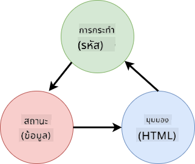

<!--
CO_OP_TRANSLATOR_METADATA:
{
  "original_hash": "5d2efabbc8f94d89f4317ee8646c3ce9",
  "translation_date": "2025-08-29T07:27:59+00:00",
  "source_file": "7-bank-project/4-state-management/README.md",
  "language_code": "th"
}
-->
# สร้างแอปธนาคาร ตอนที่ 4: แนวคิดการจัดการสถานะ

## แบบทดสอบก่อนเรียน

[แบบทดสอบก่อนเรียน](https://ff-quizzes.netlify.app/web/quiz/47)

### บทนำ

เมื่อแอปพลิเคชันเว็บเติบโตขึ้น การติดตามการไหลของข้อมูลทั้งหมดกลายเป็นเรื่องท้าทาย โค้ดใดที่ได้รับข้อมูล หน้าต่างๆ ใช้ข้อมูลอย่างไร ที่ไหนและเมื่อไหร่ที่ต้องอัปเดต...ง่ายมากที่จะทำให้โค้ดรกและยากต่อการดูแลรักษา โดยเฉพาะอย่างยิ่งเมื่อคุณต้องแชร์ข้อมูลระหว่างหน้าต่างๆ ของแอป เช่น ข้อมูลผู้ใช้ แนวคิดของ *การจัดการสถานะ* มีอยู่ในโปรแกรมทุกประเภทมาโดยตลอด แต่เนื่องจากแอปเว็บมีความซับซ้อนมากขึ้นเรื่อยๆ การจัดการสถานะจึงกลายเป็นจุดสำคัญที่ต้องพิจารณาในระหว่างการพัฒนา

ในส่วนสุดท้ายนี้ เราจะมาทบทวนแอปที่เราสร้างขึ้นเพื่อพิจารณาใหม่เกี่ยวกับการจัดการสถานะ โดยรองรับการรีเฟรชเบราว์เซอร์ได้ทุกเมื่อ และสามารถเก็บข้อมูลข้ามเซสชันของผู้ใช้ได้

### สิ่งที่ต้องมีมาก่อน

คุณต้องทำส่วน [การดึงข้อมูล](../3-data/README.md) ของแอปเว็บให้เสร็จสมบูรณ์ก่อนบทเรียนนี้ นอกจากนี้ คุณยังต้องติดตั้ง [Node.js](https://nodejs.org) และ [รันเซิร์ฟเวอร์ API](../api/README.md) ในเครื่องของคุณเพื่อจัดการข้อมูลบัญชี

คุณสามารถทดสอบว่าเซิร์ฟเวอร์ทำงานได้อย่างถูกต้องโดยรันคำสั่งนี้ในเทอร์มินัล:

```sh
curl http://localhost:5000/api
# -> should return "Bank API v1.0.0" as a result
```

---

## ทบทวนการจัดการสถานะ

ใน [บทเรียนก่อนหน้า](../3-data/README.md) เราได้แนะนำแนวคิดพื้นฐานของสถานะในแอปของเราด้วยตัวแปร `account` แบบโกลบอลที่เก็บข้อมูลธนาคารของผู้ใช้ที่ล็อกอินอยู่ในปัจจุบัน อย่างไรก็ตาม การใช้งานปัจจุบันของเรามีข้อบกพร่อง ลองรีเฟรชหน้าเมื่อคุณอยู่ในแดชบอร์ด เกิดอะไรขึ้น?

มีปัญหา 3 ข้อในโค้ดปัจจุบัน:

- สถานะไม่ได้ถูกเก็บไว้ เนื่องจากการรีเฟรชเบราว์เซอร์จะพาคุณกลับไปที่หน้าเข้าสู่ระบบ
- มีฟังก์ชันหลายตัวที่แก้ไขสถานะ เมื่อแอปเติบโตขึ้น อาจทำให้ยากต่อการติดตามการเปลี่ยนแปลง และง่ายที่จะลืมอัปเดตบางส่วน
- สถานะไม่ได้ถูกล้าง ดังนั้นเมื่อคุณคลิก *ออกจากระบบ* ข้อมูลบัญชียังคงอยู่แม้ว่าคุณจะอยู่ในหน้าเข้าสู่ระบบ

เราสามารถอัปเดตโค้ดของเราเพื่อแก้ไขปัญหาเหล่านี้ทีละข้อ แต่จะทำให้เกิดการซ้ำซ้อนของโค้ดมากขึ้น และทำให้แอปซับซ้อนและยากต่อการดูแลรักษา หรือเราสามารถหยุดคิดสักครู่และพิจารณากลยุทธ์ของเราใหม่

> ปัญหาที่เราพยายามแก้ไขจริงๆ คืออะไร?

[การจัดการสถานะ](https://en.wikipedia.org/wiki/State_management) คือการหาวิธีที่ดีในการแก้ปัญหาเฉพาะสองข้อ:

- จะทำให้การไหลของข้อมูลในแอปเข้าใจง่ายได้อย่างไร?
- จะทำให้ข้อมูลสถานะสอดคล้องกับส่วนติดต่อผู้ใช้เสมอ (และในทางกลับกัน) ได้อย่างไร?

เมื่อคุณจัดการกับปัญหาเหล่านี้แล้ว ปัญหาอื่นๆ ที่คุณอาจมีอาจได้รับการแก้ไขไปแล้วหรือแก้ไขได้ง่ายขึ้น มีวิธีการมากมายในการแก้ปัญหาเหล่านี้ แต่เราจะเลือกวิธีแก้ปัญหาทั่วไปที่ประกอบด้วย **การรวมศูนย์ข้อมูลและวิธีการเปลี่ยนแปลงข้อมูล** การไหลของข้อมูลจะเป็นดังนี้:



> เราจะไม่ครอบคลุมส่วนที่ข้อมูลกระตุ้นการอัปเดตมุมมองโดยอัตโนมัติ เนื่องจากเกี่ยวข้องกับแนวคิดขั้นสูงของ [การเขียนโปรแกรมเชิงปฏิกิริยา](https://en.wikipedia.org/wiki/Reactive_programming) ซึ่งเป็นหัวข้อที่ดีสำหรับการศึกษาต่อหากคุณต้องการเจาะลึก

✅ มีไลบรารีมากมายที่มีแนวทางต่างๆ ในการจัดการสถานะ [Redux](https://redux.js.org) เป็นตัวเลือกยอดนิยม ลองดูแนวคิดและรูปแบบที่ใช้ เนื่องจากมักเป็นวิธีที่ดีในการเรียนรู้ปัญหาที่อาจเกิดขึ้นในแอปเว็บขนาดใหญ่และวิธีแก้ไข

### งาน

เราจะเริ่มต้นด้วยการปรับโครงสร้างโค้ดเล็กน้อย แทนที่การประกาศ `account`:

```js
let account = null;
```

ด้วย:

```js
let state = {
  account: null
};
```

แนวคิดคือการ *รวมศูนย์* ข้อมูลแอปทั้งหมดของเราในออบเจ็กต์สถานะเดียว ตอนนี้เรามีเพียง `account` ในสถานะ ดังนั้นจึงไม่ได้เปลี่ยนแปลงมากนัก แต่สร้างเส้นทางสำหรับการพัฒนาในอนาคต

เรายังต้องอัปเดตฟังก์ชันที่ใช้งานมัน ในฟังก์ชัน `register()` และ `login()` ให้แทนที่ `account = ...` ด้วย `state.account = ...`;

ที่ด้านบนของฟังก์ชัน `updateDashboard()` ให้เพิ่มบรรทัดนี้:

```js
const account = state.account;
```

การปรับโครงสร้างนี้เองไม่ได้ทำให้เกิดการปรับปรุงมากนัก แต่แนวคิดคือการวางรากฐานสำหรับการเปลี่ยนแปลงถัดไป

## ติดตามการเปลี่ยนแปลงข้อมูล

ตอนนี้เราได้ตั้งค่าออบเจ็กต์ `state` เพื่อเก็บข้อมูลของเราแล้ว ขั้นตอนต่อไปคือการรวมศูนย์การอัปเดต เป้าหมายคือทำให้ง่ายต่อการติดตามการเปลี่ยนแปลงใดๆ และเมื่อเกิดขึ้น

เพื่อหลีกเลี่ยงการเปลี่ยนแปลงที่เกิดขึ้นกับออบเจ็กต์ `state` การพิจารณาให้มันเป็น [*immutable*](https://en.wikipedia.org/wiki/Immutable_object) หรือไม่สามารถแก้ไขได้เลยก็เป็นแนวปฏิบัติที่ดี นั่นหมายความว่าคุณต้องสร้างออบเจ็กต์สถานะใหม่หากคุณต้องการเปลี่ยนแปลงอะไรในนั้น การทำเช่นนี้ช่วยป้องกัน [ผลข้างเคียง](https://en.wikipedia.org/wiki/Side_effect_(computer_science)) ที่อาจไม่พึงประสงค์ และเปิดโอกาสสำหรับฟีเจอร์ใหม่ๆ ในแอปของคุณ เช่น การทำ undo/redo ในขณะเดียวกันก็ทำให้การดีบักง่ายขึ้น ตัวอย่างเช่น คุณสามารถบันทึกการเปลี่ยนแปลงทุกครั้งที่เกิดขึ้นกับสถานะและเก็บประวัติการเปลี่ยนแปลงเพื่อทำความเข้าใจแหล่งที่มาของบั๊ก

ใน JavaScript คุณสามารถใช้ [`Object.freeze()`](https://developer.mozilla.org/docs/Web/JavaScript/Reference/Global_Objects/Object/freeze) เพื่อสร้างเวอร์ชันที่ไม่สามารถแก้ไขได้ของออบเจ็กต์ หากคุณพยายามเปลี่ยนแปลงออบเจ็กต์ที่ไม่สามารถแก้ไขได้ จะเกิดข้อยกเว้นขึ้น

✅ คุณรู้ความแตกต่างระหว่างออบเจ็กต์ที่ไม่สามารถแก้ไขได้แบบ *ตื้น* และ *ลึก* หรือไม่? คุณสามารถอ่านเพิ่มเติมได้ [ที่นี่](https://developer.mozilla.org/docs/Web/JavaScript/Reference/Global_Objects/Object/freeze#What_is_shallow_freeze)

### งาน

มาสร้างฟังก์ชันใหม่ `updateState()`:

```js
function updateState(property, newData) {
  state = Object.freeze({
    ...state,
    [property]: newData
  });
}
```

ในฟังก์ชันนี้ เรากำลังสร้างออบเจ็กต์สถานะใหม่และคัดลอกข้อมูลจากสถานะก่อนหน้าโดยใช้ [*spread (`...`) operator*](https://developer.mozilla.org/docs/Web/JavaScript/Reference/Operators/Spread_syntax#Spread_in_object_literals) จากนั้นเราจะเขียนทับคุณสมบัติเฉพาะของออบเจ็กต์สถานะด้วยข้อมูลใหม่โดยใช้ [bracket notation](https://developer.mozilla.org/docs/Web/JavaScript/Guide/Working_with_Objects#Objects_and_properties) `[property]` สำหรับการกำหนดค่า สุดท้าย เราล็อกออบเจ็กต์เพื่อป้องกันการแก้ไขโดยใช้ `Object.freeze()` ตอนนี้เรามีเพียงคุณสมบัติ `account` ที่เก็บไว้ในสถานะ แต่ด้วยวิธีนี้คุณสามารถเพิ่มคุณสมบัติได้มากเท่าที่คุณต้องการในสถานะ

เราจะอัปเดตการเริ่มต้น `state` เพื่อให้แน่ใจว่าสถานะเริ่มต้นถูกล็อกด้วย:

```js
let state = Object.freeze({
  account: null
});
```

หลังจากนั้น อัปเดตฟังก์ชัน `register` โดยแทนที่ `state.account = result;` ด้วย:

```js
updateState('account', result);
```

ทำเช่นเดียวกันกับฟังก์ชัน `login` โดยแทนที่ `state.account = data;` ด้วย:

```js
updateState('account', data);
```

เราจะใช้โอกาสนี้แก้ไขปัญหาข้อมูลบัญชีที่ไม่ได้ถูกล้างเมื่อผู้ใช้คลิก *ออกจากระบบ*

สร้างฟังก์ชันใหม่ `logout()`:

```js
function logout() {
  updateState('account', null);
  navigate('/login');
}
```

ใน `updateDashboard()` แทนที่การเปลี่ยนเส้นทาง `return navigate('/login');` ด้วย `return logout();`

ลองลงทะเบียนบัญชีใหม่ ออกจากระบบ และเข้าสู่ระบบอีกครั้งเพื่อตรวจสอบว่าทุกอย่างยังทำงานได้อย่างถูกต้อง

> เคล็ดลับ: คุณสามารถดูการเปลี่ยนแปลงสถานะทั้งหมดได้โดยเพิ่ม `console.log(state)` ที่ด้านล่างของ `updateState()` และเปิดคอนโซลในเครื่องมือพัฒนาของเบราว์เซอร์ของคุณ

## เก็บสถานะ

แอปเว็บส่วนใหญ่จำเป็นต้องเก็บข้อมูลเพื่อให้ทำงานได้อย่างถูกต้อง ข้อมูลสำคัญทั้งหมดมักจะถูกเก็บไว้ในฐานข้อมูลและเข้าถึงผ่านเซิร์ฟเวอร์ API เช่น ข้อมูลบัญชีผู้ใช้ในกรณีของเรา แต่บางครั้ง การเก็บข้อมูลบางอย่างในแอปฝั่งไคลเอนต์ที่ทำงานในเบราว์เซอร์ก็เป็นสิ่งที่น่าสนใจ เพื่อประสบการณ์ผู้ใช้ที่ดีขึ้นหรือเพื่อปรับปรุงประสิทธิภาพการโหลด

เมื่อคุณต้องการเก็บข้อมูลในเบราว์เซอร์ มีคำถามสำคัญบางข้อที่คุณควรถามตัวเอง:

- *ข้อมูลนี้เป็นข้อมูลที่อ่อนไหวหรือไม่?* คุณควรหลีกเลี่ยงการเก็บข้อมูลที่อ่อนไหวในฝั่งไคลเอนต์ เช่น รหัสผ่านของผู้ใช้
- *คุณต้องการเก็บข้อมูลนี้ไว้นานแค่ไหน?* คุณวางแผนที่จะเข้าถึงข้อมูลนี้เฉพาะในเซสชันปัจจุบันหรือคุณต้องการให้มันถูกเก็บไว้ตลอดไป?

มีหลายวิธีในการเก็บข้อมูลในแอปเว็บ ขึ้นอยู่กับสิ่งที่คุณต้องการ ตัวอย่างเช่น คุณสามารถใช้ URL เพื่อเก็บคำค้นหา และทำให้สามารถแชร์ระหว่างผู้ใช้ได้ คุณยังสามารถใช้ [HTTP cookies](https://developer.mozilla.org/docs/Web/HTTP/Cookies) หากข้อมูลจำเป็นต้องแชร์กับเซิร์ฟเวอร์ เช่น ข้อมูล [การยืนยันตัวตน](https://en.wikipedia.org/wiki/Authentication)

อีกตัวเลือกหนึ่งคือการใช้หนึ่งใน API ของเบราว์เซอร์สำหรับการเก็บข้อมูล สองตัวเลือกที่น่าสนใจคือ:

- [`localStorage`](https://developer.mozilla.org/docs/Web/API/Window/localStorage): เป็น [Key/Value store](https://en.wikipedia.org/wiki/Key%E2%80%93value_database) ที่ช่วยให้เก็บข้อมูลเฉพาะสำหรับเว็บไซต์ปัจจุบันข้ามเซสชันต่างๆ ข้อมูลที่บันทึกไว้ในนี้จะไม่มีวันหมดอายุ
- [`sessionStorage`](https://developer.mozilla.org/docs/Web/API/Window/sessionStorage): ทำงานเหมือนกับ `localStorage` ยกเว้นว่าข้อมูลที่เก็บไว้ในนี้จะถูกลบเมื่อเซสชันสิ้นสุดลง (เมื่อปิดเบราว์เซอร์)

โปรดทราบว่า API ทั้งสองนี้อนุญาตให้เก็บเฉพาะ [strings](https://developer.mozilla.org/docs/Web/JavaScript/Reference/Global_Objects/String) หากคุณต้องการเก็บออบเจ็กต์ที่ซับซ้อน คุณจะต้องแปลงเป็นรูปแบบ [JSON](https://developer.mozilla.org/docs/Web/JavaScript/Reference/Global_Objects/JSON) โดยใช้ [`JSON.stringify()`](https://developer.mozilla.org/docs/Web/JavaScript/Reference/Global_Objects/JSON/stringify)

✅ หากคุณต้องการสร้างแอปเว็บที่ไม่ทำงานร่วมกับเซิร์ฟเวอร์ ก็สามารถสร้างฐานข้อมูลในฝั่งไคลเอนต์โดยใช้ [`IndexedDB` API](https://developer.mozilla.org/docs/Web/API/IndexedDB_API) ได้เช่นกัน API นี้เหมาะสำหรับกรณีการใช้งานขั้นสูงหรือหากคุณต้องการเก็บข้อมูลจำนวนมาก เนื่องจากมันซับซ้อนกว่าในการใช้งาน

### งาน

เราต้องการให้ผู้ใช้ของเรายังคงล็อกอินอยู่จนกว่าพวกเขาจะคลิกปุ่ม *ออกจากระบบ* อย่างชัดเจน ดังนั้นเราจะใช้ `localStorage` เพื่อเก็บข้อมูลบัญชี ก่อนอื่น ให้กำหนดคีย์ที่เราจะใช้เก็บข้อมูลของเรา

```js
const storageKey = 'savedAccount';
```

จากนั้นเพิ่มบรรทัดนี้ที่ท้ายฟังก์ชัน `updateState()`:

```js
localStorage.setItem(storageKey, JSON.stringify(state.account));
```

ด้วยวิธีนี้ ข้อมูลบัญชีผู้ใช้จะถูกเก็บไว้และอัปเดตอยู่เสมอ เนื่องจากเรารวมศูนย์การอัปเดตสถานะทั้งหมดไว้ก่อนหน้านี้ นี่คือจุดที่เราเริ่มได้รับประโยชน์จากการปรับโครงสร้างก่อนหน้านี้ทั้งหมด 🙂

เนื่องจากข้อมูลถูกบันทึกไว้ เราจึงต้องดูแลการกู้คืนข้อมูลเมื่อแอปโหลดขึ้นมาอีกครั้ง เนื่องจากเราจะเริ่มมีโค้ดเริ่มต้นมากขึ้น อาจเป็นความคิดที่ดีที่จะสร้างฟังก์ชันใหม่ `init` ซึ่งรวมถึงโค้ดก่อนหน้านี้ที่ด้านล่างของ `app.js`:

```js
function init() {
  const savedAccount = localStorage.getItem(storageKey);
  if (savedAccount) {
    updateState('account', JSON.parse(savedAccount));
  }

  // Our previous initialization code
  window.onpopstate = () => updateRoute();
  updateRoute();
}

init();
```

ที่นี่เรากู้คืนข้อมูลที่บันทึกไว้ และหากมีข้อมูล เราจะอัปเดตสถานะตามนั้น สิ่งสำคัญคือต้องทำสิ่งนี้ *ก่อน* อัปเดตเส้นทาง เนื่องจากอาจมีโค้ดที่พึ่งพาสถานะระหว่างการอัปเดตหน้า

เรายังสามารถทำให้หน้า *Dashboard* เป็นหน้าเริ่มต้นของแอปพลิเคชันของเราได้ เนื่องจากตอนนี้เรากำลังเก็บข้อมูลบัญชีไว้แล้ว หากไม่พบข้อมูล แดชบอร์ดจะดูแลการเปลี่ยนเส้นทางไปยังหน้า *Login* อยู่แล้ว ใน `updateRoute()` แทนที่ fallback `return navigate('/login');` ด้วย `return navigate('/dashboard');`

ตอนนี้เข้าสู่ระบบในแอปและลองรีเฟรชหน้า คุณควรอยู่ในแดชบอร์ด ด้วยการอัปเดตนี้ เราได้จัดการกับปัญหาเริ่มต้นทั้งหมดของเรา...

## รีเฟรชข้อมูล

...แต่เราอาจสร้างปัญหาใหม่ขึ้นมา โอ๊ะ!

ไปที่แดชบอร์ดโดยใช้บัญชี `test` จากนั้นรันคำสั่งนี้ในเทอร์มินัลเพื่อสร้างธุรกรรมใหม่:

```sh
curl --request POST \
     --header "Content-Type: application/json" \
     --data "{ \"date\": \"2020-07-24\", \"object\": \"Bought book\", \"amount\": -20 }" \
     http://localhost:5000/api/accounts/test/transactions
```

ลองรีเฟรชหน้าแดชบอร์ดในเบราว์เซอร์ของคุณตอนนี้ เกิดอะไรขึ้น? คุณเห็นธุรกรรมใหม่หรือไม่?

สถานะถูกเก็บไว้อย่างไม่มีกำหนดด้วย `localStorage` แต่ก็หมายความว่ามันไม่เคยอัปเดตจนกว่าคุณจะออกจากระบบและเข้าสู่ระบบอีกครั้ง!

กลยุทธ์หนึ่งที่เป็นไปได้ในการแก้ไขปัญหานี้คือการโหลดข้อมูลบัญชีใหม่ทุกครั้งที่โหลดหน้าแดชบอร์ด เพื่อหลีกเลี่ยงข้อมูลที่ล้าสมัย

### งาน

สร้างฟังก์ชันใหม่ `updateAccountData`:

```js
async function updateAccountData() {
  const account = state.account;
  if (!account) {
    return logout();
  }

  const data = await getAccount(account.user);
  if (data.error) {
    return logout();
  }

  updateState('account', data);
}
```

เมธอดนี้ตรวจสอบว่าเรากำลังล็อกอินอยู่ในปัจจุบัน จากนั้นโหลดข้อมูลบัญชีใหม่จากเซิร์ฟเวอร์

สร้างฟังก์ชันอีกตัวชื่อ `refresh`:

```js
async function refresh() {
  await updateAccountData();
  updateDashboard();
}
```

ฟังก์ชันนี้อัปเดตข้อมูลบัญชี จากนั้นดูแลการอัปเดต HTML ของหน้าแดชบอร์ด นี่คือสิ่งที่เราต้องเรียกใช้เมื่อโหลดเส้นทางแดชบอร์ด อัปเดตการกำหนดเส้นทางด้วย:

```js
const routes = {
  '/login': { templateId: 'login' },
  '/dashboard': { templateId: 'dashboard', init: refresh }
};
```

ลองรีเฟรชแดชบอร์ดตอนนี้ ควรแสดงข้อมูลบัญชีที่อัปเดตแล้ว

---

## 🚀 ความท้าทาย

ตอนนี้เราโหลดข้อมูลบัญชีใหม่ทุกครั้งที่โหลดแดชบอร์ด คุณคิดว่าเรายังจำเป็นต้องเก็บ *ข้อมูลบัญชีทั้งหมด* ไว้อยู่หรือไม่?

ลองทำงานร่วมกันเพื่อเปลี่ยนสิ่งที่ถูกบันทึกและโหลดจาก `localStorage` ให้รวมเฉพาะสิ่งที่จำเป็นอย่างยิ่งสำหรับการทำงานของแอป

## แบบ
[ดำเนินการ "เพิ่มธุรกรรม" ในหน้าต่างการสนทนา](assignment.md)

นี่คือตัวอย่างผลลัพธ์หลังจากทำงานเสร็จสิ้น:


---

**ข้อจำกัดความรับผิดชอบ**:  
เอกสารนี้ได้รับการแปลโดยใช้บริการแปลภาษา AI [Co-op Translator](https://github.com/Azure/co-op-translator) แม้ว่าเราจะพยายามให้การแปลมีความถูกต้อง แต่โปรดทราบว่าการแปลอัตโนมัติอาจมีข้อผิดพลาดหรือความไม่แม่นยำ เอกสารต้นฉบับในภาษาต้นทางควรถือเป็นแหล่งข้อมูลที่เชื่อถือได้ สำหรับข้อมูลที่สำคัญ ขอแนะนำให้ใช้บริการแปลภาษามนุษย์ที่เป็นมืออาชีพ เราจะไม่รับผิดชอบต่อความเข้าใจผิดหรือการตีความที่ผิดพลาดซึ่งเกิดจากการใช้การแปลนี้