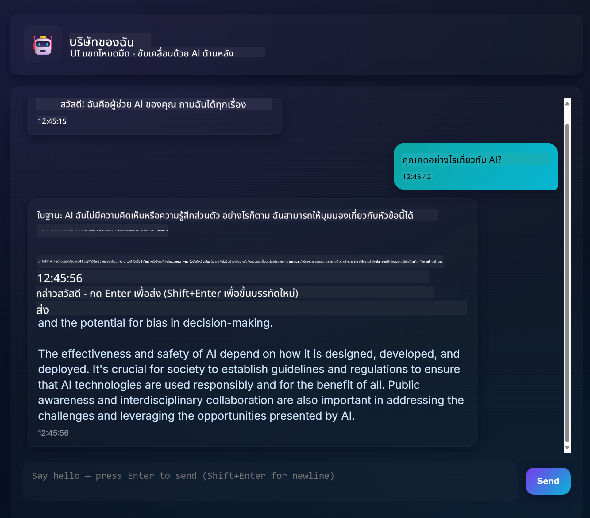
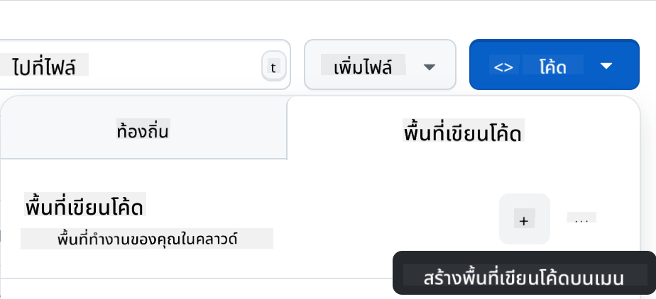

<!--
CO_OP_TRANSLATOR_METADATA:
{
  "original_hash": "11cf36165c243947b6cd85b88cf6faa6",
  "translation_date": "2025-09-01T16:55:47+00:00",
  "source_file": "9-chat-project/README.md",
  "language_code": "th"
}
-->
# โปรเจคแชท

โปรเจคแชทนี้แสดงวิธีการสร้างผู้ช่วยแชทโดยใช้ GitHub Models

นี่คือลักษณะของโปรเจคที่เสร็จสมบูรณ์:



ข้อมูลเบื้องต้น การสร้างผู้ช่วยแชทโดยใช้ Generative AI เป็นวิธีที่ดีในการเริ่มเรียนรู้เกี่ยวกับ AI สิ่งที่คุณจะได้เรียนรู้คือการผสาน Generative AI เข้ากับเว็บแอปตลอดบทเรียนนี้ มาเริ่มกันเลย

## การเชื่อมต่อกับ Generative AI

สำหรับ Backend เราใช้ GitHub Models ซึ่งเป็นบริการที่ยอดเยี่ยมที่ช่วยให้คุณใช้ AI ได้ฟรี ไปที่ Playground ของมันและดึงโค้ดที่ตรงกับภาษาของ Backend ที่คุณเลือก นี่คือลักษณะของมันที่ [GitHub Models Playground](https://github.com/marketplace/models/azure-openai/gpt-4o-mini/playground)


ดังที่กล่าวไว้ เลือกแท็บ "Code" และ Runtime ที่คุณเลือก


### การใช้ Python

ในกรณีนี้เราเลือก Python ซึ่งหมายความว่าเราจะเลือกโค้ดนี้:

```python
"""Run this model in Python

> pip install openai
"""
import os
from openai import OpenAI

# To authenticate with the model you will need to generate a personal access token (PAT) in your GitHub settings. 
# Create your PAT token by following instructions here: https://docs.github.com/en/authentication/keeping-your-account-and-data-secure/managing-your-personal-access-tokens
client = OpenAI(
    base_url="https://models.github.ai/inference",
    api_key=os.environ["GITHUB_TOKEN"],
)

response = client.chat.completions.create(
    messages=[
        {
            "role": "system",
            "content": "",
        },
        {
            "role": "user",
            "content": "What is the capital of France?",
        }
    ],
    model="openai/gpt-4o-mini",
    temperature=1,
    max_tokens=4096,
    top_p=1
)

print(response.choices[0].message.content)
```

มาทำความสะอาดโค้ดนี้เล็กน้อยเพื่อให้สามารถนำกลับมาใช้ใหม่ได้:

```python
def call_llm(prompt: str, system_message: str):
    response = client.chat.completions.create(
        messages=[
            {
                "role": "system",
                "content": system_message,
            },
            {
                "role": "user",
                "content": prompt,
            }
        ],
        model="openai/gpt-4o-mini",
        temperature=1,
        max_tokens=4096,
        top_p=1
    )

    return response.choices[0].message.content
```

ด้วยฟังก์ชัน `call_llm` นี้ เราสามารถนำ Prompt และ System Prompt มาใช้ และฟังก์ชันจะคืนค่าผลลัพธ์

### ปรับแต่งผู้ช่วย AI

หากคุณต้องการปรับแต่งผู้ช่วย AI คุณสามารถระบุวิธีที่คุณต้องการให้มันทำงานโดยการเติม System Prompt เช่นนี้:

```python
call_llm("Tell me about you", "You're Albert Einstein, you only know of things in the time you were alive")
```

## เปิดใช้งานผ่าน Web API

เยี่ยม เราได้ทำส่วน AI เสร็จแล้ว มาดูกันว่าเราจะผสานมันเข้ากับ Web API ได้อย่างไร สำหรับ Web API เราเลือกใช้ Flask แต่ Framework เว็บใด ๆ ก็สามารถใช้ได้ มาดูโค้ดกัน:

### การใช้ Python

```python
# api.py
from flask import Flask, request, jsonify
from llm import call_llm
from flask_cors import CORS

app = Flask(__name__)
CORS(app)   # *   example.com

@app.route("/", methods=["GET"])
def index():
    return "Welcome to this API. Call POST /hello with 'message': 'my message' as JSON payload"


@app.route("/hello", methods=["POST"])
def hello():
    # get message from request body  { "message": "do this taks for me" }
    data = request.get_json()
    message = data.get("message", "")

    response = call_llm(message, "You are a helpful assistant.")
    return jsonify({
        "response": response
    })

if __name__ == "__main__":
    app.run(host="0.0.0.0", port=5000)
```

ที่นี่ เราสร้าง Flask API และกำหนด Route เริ่มต้น "/" และ "/chat" โดย Route หลังนี้ถูกออกแบบมาให้ Frontend ของเราส่งคำถามเข้ามา

เพื่อผสาน *llm.py* นี่คือสิ่งที่เราต้องทำ:

- นำเข้า `call_llm` ฟังก์ชัน:

   ```python
   from llm import call_llm
   from flask import Flask, request
   ```

- เรียกใช้จาก Route "/chat":

   ```python
   @app.route("/hello", methods=["POST"])
   def hello():
      # get message from request body  { "message": "do this taks for me" }
      data = request.get_json()
      message = data.get("message", "")

      response = call_llm(message, "You are a helpful assistant.")
      return jsonify({
         "response": response
      })
   ```

   ที่นี่เราวิเคราะห์คำขอที่เข้ามาเพื่อดึงคุณสมบัติ `message` จาก JSON body หลังจากนั้นเราเรียก LLM ด้วยการเรียกนี้:

   ```python
   response = call_llm(message, "You are a helpful assistant")

   # return the response as JSON
   return jsonify({
      "response": response 
   })
   ```

เยี่ยม ตอนนี้เราทำสิ่งที่จำเป็นเสร็จแล้ว

## ตั้งค่า Cors

เราควรกล่าวถึงว่าเราได้ตั้งค่า Cors หรือ Cross-Origin Resource Sharing ซึ่งหมายความว่าเนื่องจาก Backend และ Frontend ของเราจะทำงานบนพอร์ตที่ต่างกัน เราจำเป็นต้องอนุญาตให้ Frontend เรียก Backend ได้

### การใช้ Python

มีโค้ดใน *api.py* ที่ตั้งค่านี้:

```python
from flask_cors import CORS

app = Flask(__name__)
CORS(app)   # *   example.com
```

ตอนนี้มันถูกตั้งค่าให้อนุญาต "*" ซึ่งหมายถึงทุก Origin และนั่นไม่ปลอดภัยนัก เราควรจำกัดมันเมื่อเราไปสู่ Production

## รันโปรเจคของคุณ

ในการรันโปรเจคของคุณ คุณต้องเริ่ม Backend ก่อนแล้วจึง Frontend

### การใช้ Python

โอเค เรามี *llm.py* และ *api.py* แล้ว เราจะทำให้มันทำงานกับ Backend ได้อย่างไร? มีสองสิ่งที่เราต้องทำ:

- ติดตั้ง Dependencies:

   ```sh
   cd backend
   python -m venv venv
   source ./venv/bin/activate

   pip install openai flask flask-cors openai
   ```

- เริ่ม API

   ```sh
   python api.py
   ```

   หากคุณอยู่ใน Codespaces คุณต้องไปที่ Ports ในส่วนล่างของ Editor คลิกขวาและเลือก "Port Visibility" และเลือก "Public"

### ทำงานกับ Frontend

ตอนนี้เรามี API ที่ทำงานแล้ว มาสร้าง Frontend สำหรับมันกัน Frontend ขั้นต่ำที่เราจะปรับปรุงทีละขั้นตอน ในโฟลเดอร์ *frontend* สร้างสิ่งต่อไปนี้:

```text
backend/
frontend/
index.html
app.js
styles.css
```

เริ่มต้นด้วย **index.html**:

```html
<html>
    <head>
        <link rel="stylesheet" href="styles.css">
    </head>
    <body>
      <form>
        <textarea id="messages"></textarea>
        <input id="input" type="text" />
        <button type="submit" id="sendBtn">Send</button>  
      </form>  
      <script src="app.js" />
    </body>
</html>    
```

ข้างต้นคือสิ่งที่จำเป็นขั้นต่ำที่คุณต้องมีเพื่อรองรับหน้าต่างแชท ซึ่งประกอบด้วย Textarea ที่จะแสดงข้อความ Input สำหรับพิมพ์ข้อความ และปุ่มสำหรับส่งข้อความไปยัง Backend มาดู JavaScript ต่อใน *app.js*

**app.js**

```js
// app.js

(function(){
  // 1. set up elements  
  const messages = document.getElementById("messages");
  const form = document.getElementById("form");
  const input = document.getElementById("input");

  const BASE_URL = "change this";
  const API_ENDPOINT = `${BASE_URL}/hello`;

  // 2. create a function that talks to our backend
  async function callApi(text) {
    const response = await fetch(API_ENDPOINT, {
      method: "POST",
      headers: { "Content-Type": "application/json" },
      body: JSON.stringify({ message: text })
    });
    let json = await response.json();
    return json.response;
  }

  // 3. add response to our textarea
  function appendMessage(text, role) {
    const el = document.createElement("div");
    el.className = `message ${role}`;
    el.innerHTML = text;
    messages.appendChild(el);
  }

  // 4. listen to submit events
  form.addEventListener("submit", async(e) => {
    e.preventDefault();
   // someone clicked the button in the form
   
   // get input
   const text = input.value.trim();

   appendMessage(text, "user")

   // reset it
   input.value = '';

   const reply = await callApi(text);

   // add to messages
   appendMessage(reply, "assistant");

  })
})();
```

มาดูโค้ดทีละส่วน:

- 1) ที่นี่เราอ้างอิงถึงองค์ประกอบทั้งหมดที่เราจะใช้ในโค้ดต่อไป
- 2) ในส่วนนี้ เราสร้างฟังก์ชันที่ใช้ `fetch` ซึ่งเป็นวิธีในตัวที่เรียก Backend ของเรา
- 3) `appendMessage` ช่วยเพิ่มการตอบกลับรวมถึงข้อความที่คุณพิมพ์ในฐานะผู้ใช้
- 4) ที่นี่เราฟัง Event การส่งข้อมูล และเราจะอ่าน Input Field วางข้อความของผู้ใช้ใน Textarea เรียก API และแสดงการตอบกลับใน Textarea

มาดูการจัดแต่งต่อไป นี่คือที่ที่คุณสามารถสร้างสรรค์ได้เต็มที่และทำให้มันดูเหมือนที่คุณต้องการ แต่มีคำแนะนำบางอย่าง:

**styles.css**

```
.message {
    background: #222;
    box-shadow: 0 0 0 10px orange;
    padding: 10px:
    margin: 5px;
}

.message.user {
    background: blue;
}

.message.assistant {
    background: grey;
} 
```

ด้วยสามคลาสนี้ คุณจะจัดแต่งข้อความต่างกันขึ้นอยู่กับว่ามาจากผู้ช่วยหรือคุณในฐานะผู้ใช้ หากคุณต้องการแรงบันดาลใจ ลองดูที่โฟลเดอร์ `solution/frontend/styles.css`

### เปลี่ยน Base Url

มีสิ่งหนึ่งที่เรายังไม่ได้ตั้งค่า นั่นคือ `BASE_URL` ซึ่งจะไม่ทราบจนกว่า Backend ของคุณจะเริ่มต้นขึ้น ในการตั้งค่า:

- หากคุณรัน API ในเครื่อง ควรตั้งค่าเป็น `http://localhost:5000`
- หากรันใน Codespaces ควรมีลักษณะคล้าย "[name]app.github.dev"

## งานที่ได้รับมอบหมาย

สร้างโฟลเดอร์ของคุณเอง *project* พร้อมเนื้อหาเช่นนี้:

```text
project/
  frontend/
    index.html
    app.js
    styles.css
  backend/
    ...
```

คัดลอกเนื้อหาจากที่ได้รับคำแนะนำข้างต้น แต่สามารถปรับแต่งตามความชอบของคุณได้

## โซลูชัน

[โซลูชัน](./solution/README.md)

## โบนัส

ลองเปลี่ยนบุคลิกของผู้ช่วย AI

### สำหรับ Python

เมื่อคุณเรียก `call_llm` ใน *api.py* คุณสามารถเปลี่ยน Argument ที่สองเป็นสิ่งที่คุณต้องการ เช่น:

```python
call_llm(message, "You are Captain Picard")
```

### Frontend

เปลี่ยน CSS และข้อความตามความชอบของคุณ ดังนั้นให้เปลี่ยนใน *index.html* และ *styles.css*

## สรุป

เยี่ยม คุณได้เรียนรู้ตั้งแต่เริ่มต้นวิธีการสร้างผู้ช่วยส่วนตัวโดยใช้ AI เราได้ทำสิ่งนี้โดยใช้ GitHub Models, Backend ใน Python และ Frontend ใน HTML, CSS และ JavaScript

## ตั้งค่าด้วย Codespaces

- ไปที่: [Web Dev For Beginners repo](https://github.com/microsoft/Web-Dev-For-Beginners)
- สร้างจาก Template (ตรวจสอบให้แน่ใจว่าคุณเข้าสู่ระบบ GitHub) ที่มุมขวาบน:

    

- เมื่ออยู่ใน Repo ของคุณ สร้าง Codespace:

    

    สิ่งนี้จะเริ่มต้น Environment ที่คุณสามารถทำงานได้

---

**ข้อจำกัดความรับผิดชอบ**:  
เอกสารนี้ได้รับการแปลโดยใช้บริการแปลภาษา AI [Co-op Translator](https://github.com/Azure/co-op-translator) แม้ว่าเราจะพยายามให้การแปลมีความถูกต้องมากที่สุด แต่โปรดทราบว่าการแปลโดยอัตโนมัติอาจมีข้อผิดพลาดหรือความไม่ถูกต้อง เอกสารต้นฉบับในภาษาดั้งเดิมควรถือเป็นแหล่งข้อมูลที่เชื่อถือได้ สำหรับข้อมูลที่สำคัญ ขอแนะนำให้ใช้บริการแปลภาษามืออาชีพ เราไม่รับผิดชอบต่อความเข้าใจผิดหรือการตีความผิดที่เกิดจากการใช้การแปลนี้