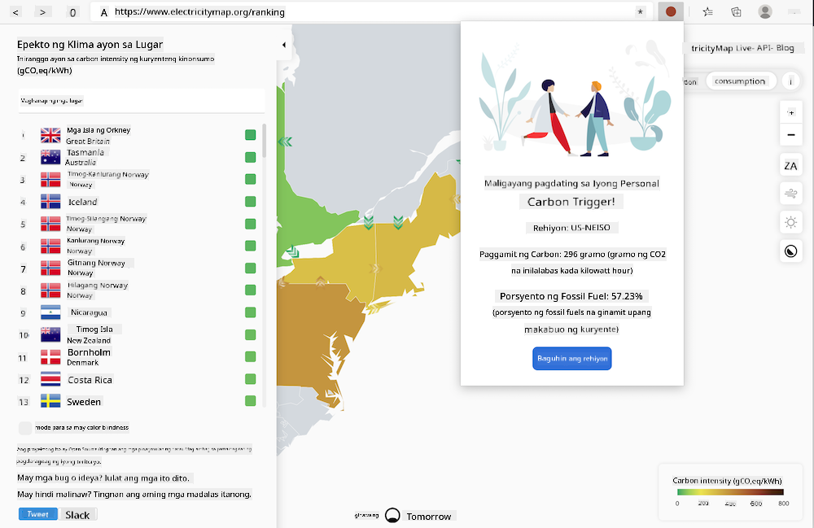

<!--
CO_OP_TRANSLATOR_METADATA:
{
  "original_hash": "3f5e6821e0febccfc5d05e7c944d9e3d",
  "translation_date": "2025-08-27T22:25:55+00:00",
  "source_file": "5-browser-extension/solution/translation/README.ja.md",
  "language_code": "tl"
}
-->
# Carbon Trigger Browser Extension: Kumpletong Code

Gagamitin natin ang CO2 Signal API ng tmrow upang subaybayan ang paggamit ng kuryente sa iyong lugar at ipapakita ito bilang paalala sa iyong browser. Sa pamamagitan ng browser extension na ito, maaari mong gamitin ang impormasyong ito upang magdesisyon sa iyong mga aktibidad.



## Panimula

Siguraduhing naka-install ang [npm](https://npmjs.com) sa iyong computer. I-download ang kopya ng code na ito sa isang folder sa iyong computer.

I-install ang lahat ng kinakailangang package.

```
npm install
```

I-build ang extension gamit ang webpack.

```
npm run build
```

Upang mai-install sa Edge, hanapin ang "Extensions" panel mula sa menu na "tatlong tuldok" sa kanang itaas ng browser. Piliin ang "Load Unpacked" at i-load ang bagong extension. Sa prompt, buksan ang "dist" folder upang ma-load ang extension. Upang magamit ito, kakailanganin mo ng API key mula sa CO2 Signal API ([kumuha dito sa pamamagitan ng email](https://www.co2signal.com/) - ilagay ang iyong email sa kahon sa pahinang iyon) at ang [code para sa iyong rehiyon](http://api.electricitymap.org/v3/zones) na tugma sa [Electricity Map](https://www.electricitymap.org/map) (halimbawa, sa Boston, ginagamit ang 'US-NEISO').


Kapag nailagay mo na ang API key at rehiyon sa interface ng extension, magbabago ang kulay ng dot na makikita sa extension bar ng iyong browser. Ang kulay ng dot ay sumasalamin sa paggamit ng enerhiya sa iyong lugar at nagbibigay ng ideya kung anong mga aktibidad ang angkop batay sa pangangailangan ng enerhiya. Ang konsepto ng "dot" system na ito ay inspirasyon ng [Energy Lollipop extension](https://energylollipop.com/) para sa emissions sa California.

---

**Paunawa**:  
Ang dokumentong ito ay isinalin gamit ang AI translation service na [Co-op Translator](https://github.com/Azure/co-op-translator). Bagama't sinisikap naming maging tumpak, tandaan na ang mga awtomatikong pagsasalin ay maaaring maglaman ng mga pagkakamali o hindi pagkakatugma. Ang orihinal na dokumento sa kanyang katutubong wika ang dapat ituring na opisyal na pinagmulan. Para sa mahalagang impormasyon, inirerekomenda ang propesyonal na pagsasalin ng tao. Hindi kami mananagot sa anumang hindi pagkakaunawaan o maling interpretasyon na dulot ng paggamit ng pagsasaling ito.