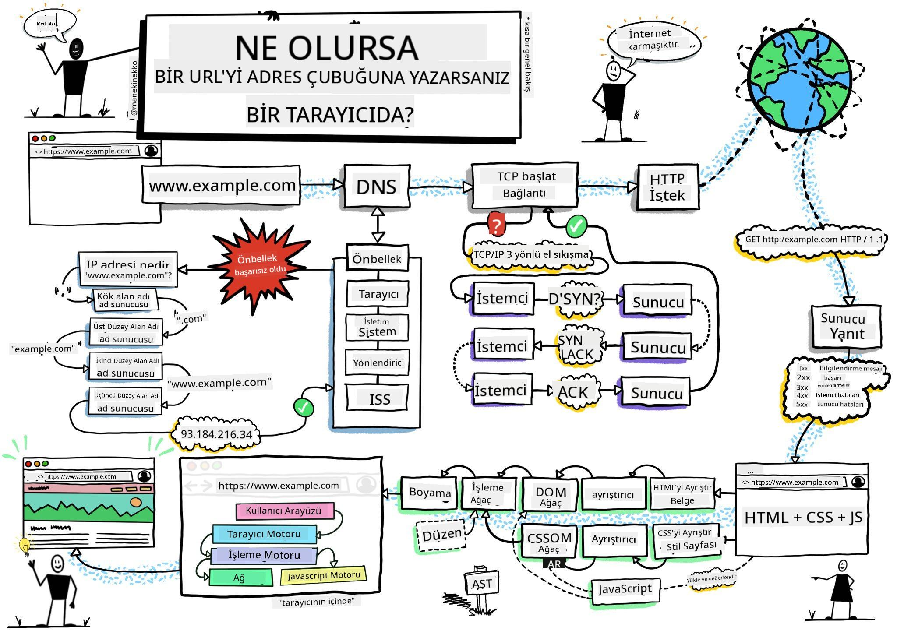
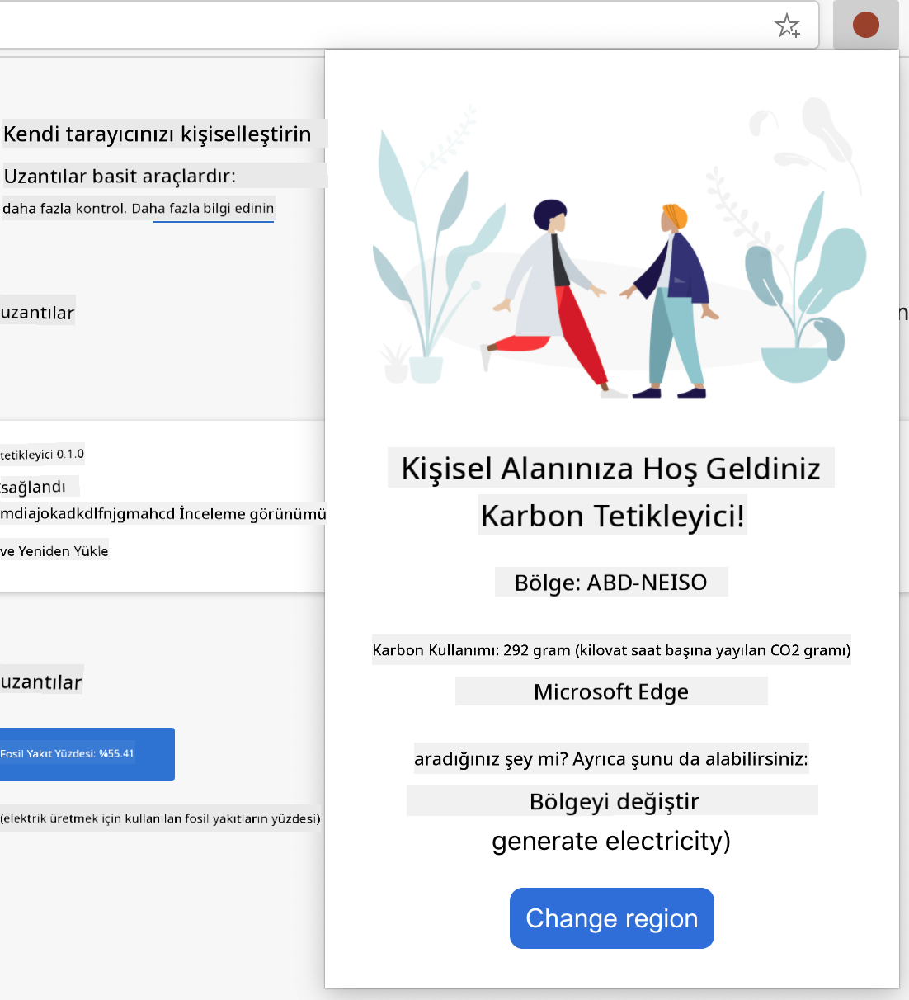

<!--
CO_OP_TRANSLATOR_METADATA:
{
  "original_hash": "2326d04e194a10aa760b51f5e5a1f61d",
  "translation_date": "2025-08-29T00:21:29+00:00",
  "source_file": "5-browser-extension/1-about-browsers/README.md",
  "language_code": "tr"
}
-->
# Tarayıcı Uzantısı Projesi Bölüm 1: Tarayıcılar Hakkında Her Şey


> Sketchnote: [Wassim Chegham](https://dev.to/wassimchegham/ever-wondered-what-happens-when-you-type-in-a-url-in-an-address-bar-in-a-browser-3dob)

## Ders Öncesi Quiz

[Ders öncesi quiz](https://ff-quizzes.netlify.app/web/quiz/23)

### Giriş

Tarayıcı uzantıları, bir tarayıcıya ek işlevsellik kazandırır. Ancak bir uzantı oluşturmadan önce, tarayıcıların nasıl çalıştığını biraz öğrenmelisiniz.

### Tarayıcı Hakkında

Bu ders serisinde, Chrome, Firefox ve Edge tarayıcılarında çalışacak bir tarayıcı uzantısı oluşturmayı öğreneceksiniz. Bu bölümde, tarayıcıların nasıl çalıştığını keşfedecek ve tarayıcı uzantısının öğelerini oluşturacaksınız.

Peki, tarayıcı tam olarak nedir? Tarayıcı, bir son kullanıcının bir sunucudan içerik almasını ve bunu web sayfalarında görüntülemesini sağlayan bir yazılım uygulamasıdır.

✅ Biraz tarih: İlk tarayıcı 'WorldWideWeb' olarak adlandırıldı ve 1990 yılında Sir Timothy Berners-Lee tarafından oluşturuldu.


> Bazı erken dönem tarayıcılar, via [Karen McGrane](https://www.slideshare.net/KMcGrane/week-4-ixd-history-personal-computing)

Bir kullanıcı, genellikle `http` veya `https` adresi üzerinden Hypertext Transfer Protocol kullanarak bir URL (Uniform Resource Locator) adresiyle internete bağlandığında, tarayıcı bir web sunucusuyla iletişim kurar ve bir web sayfası alır.

Bu noktada, tarayıcının işleme motoru, sayfayı kullanıcının cihazında görüntüler. Bu cihaz bir cep telefonu, masaüstü veya dizüstü bilgisayar olabilir.

Tarayıcılar ayrıca içeriği önbelleğe alabilir, böylece her seferinde sunucudan alınması gerekmez. Kullanıcının tarama geçmişini kaydedebilir, 'çerezler' depolayabilir (kullanıcının etkinliğini kaydetmek için kullanılan küçük veri parçaları) ve daha fazlasını yapabilir.

Tarayıcılar hakkında hatırlanması gereken çok önemli bir şey, hepsinin aynı olmadığıdır! Her tarayıcının güçlü ve zayıf yönleri vardır ve profesyonel bir web geliştiricisi, web sayfalarının tarayıcılar arası iyi performans göstermesini sağlamak için nasıl optimize edileceğini anlamalıdır. Bu, bir cep telefonunun küçük ekranı gibi küçük görüntüleme alanlarını ve çevrimdışı bir kullanıcıyı da kapsar.

Web sayfaları oluştururken kullanıcılarınızı en iyi şekilde desteklemek için hangi teknolojilerin desteklendiğini listeleyen [caniuse.com](https://www.caniuse.com) sitesini yer imlerine eklemeniz çok faydalı olacaktır.

✅ Web sitenizin kullanıcı tabanında hangi tarayıcıların en popüler olduğunu nasıl anlayabilirsiniz? Analitiklerinizi kontrol edin - web geliştirme sürecinizin bir parçası olarak çeşitli analitik paketleri yükleyebilirsiniz ve bunlar, popüler tarayıcılar arasında en çok kullanılanları size gösterecektir.

## Tarayıcı Uzantıları

Neden bir tarayıcı uzantısı oluşturmak isteyesiniz? Tarayıcınıza, sık sık tekrarladığınız görevlere hızlı erişim sağlamak için ekleyebileceğiniz kullanışlı bir araçtır. Örneğin, etkileşimde bulunduğunuz çeşitli web sayfalarındaki renkleri kontrol etmeniz gerekiyorsa, bir renk seçici tarayıcı uzantısı yükleyebilirsiniz. Şifreleri hatırlamakta zorlanıyorsanız, bir şifre yönetimi tarayıcı uzantısı kullanabilirsiniz.

Tarayıcı uzantıları geliştirmek de eğlencelidir. Genellikle sınırlı sayıda görevi yönetirler ve bu görevleri iyi bir şekilde yerine getirirler.

✅ En sevdiğiniz tarayıcı uzantıları nelerdir? Hangi görevleri yerine getiriyorlar?

### Uzantıların Yüklenmesi

Bir uzantı oluşturmaya başlamadan önce, bir tarayıcı uzantısını oluşturma ve dağıtma sürecine bir göz atın. Her tarayıcı bu görevi yönetme konusunda biraz farklılık gösterse de, Chrome ve Firefox'taki süreç Edge'deki bu örneğe benzer:


> Not: Geliştirici modunu açmayı ve diğer mağazalardan uzantılara izin vermeyi unutmayın.

Özetle, süreç şu şekilde olacaktır:

- uzantınızı `npm run build` komutuyla oluşturun
- tarayıcıda, sağ üstteki "Ayarlar ve daha fazlası" düğmesini (`...` simgesi) kullanarak uzantılar paneline gidin
- yeni bir yükleme yapıyorsanız, uzantıyı oluşturma klasöründen (bizim durumumuzda `/dist`) yüklemek için `load unpacked` seçeneğini seçin
- veya, zaten yüklenmiş bir uzantıyı yeniden yüklemek için `reload` seçeneğine tıklayın

✅ Bu talimatlar, kendi oluşturduğunuz uzantılar için geçerlidir; her tarayıcıya bağlı tarayıcı uzantı mağazasında yayınlanmış uzantıları yüklemek için, bu [mağazalara](https://microsoftedge.microsoft.com/addons/Microsoft-Edge-Extensions-Home) gidip istediğiniz uzantıyı yüklemelisiniz.

### Başlayın

Bölgenizin karbon ayak izini gösteren, enerji kullanımını ve enerji kaynağını görüntüleyen bir tarayıcı uzantısı oluşturacaksınız. Uzantı, bir API anahtarı toplamak için bir form içerecek, böylece CO2 Signal'in API'sine erişebilirsiniz.

**İhtiyacınız olanlar:**

- [bir API anahtarı](https://www.co2signal.com/); bu sayfadaki kutuya e-posta adresinizi girin, size bir anahtar gönderilecektir
- [bölgeniz için kod](http://api.electricitymap.org/v3/zones) [Electricity Map](https://www.electricitymap.org/map) ile eşleşen (örneğin Boston'da 'US-NEISO' kullanıyorum)
- [başlangıç kodu](../../../../5-browser-extension/start). `start` klasörünü indirin; bu klasördeki kodu tamamlayacaksınız.
- [NPM](https://www.npmjs.com) - NPM bir paket yönetim aracıdır; bunu yerel olarak yükleyin ve `package.json` dosyanızda listelenen paketler web varlıklarınız için kullanılabilir hale gelir

✅ Paket yönetimi hakkında daha fazla bilgi edinmek için bu [harika öğrenme modülüne](https://docs.microsoft.com/learn/modules/create-nodejs-project-dependencies/?WT.mc_id=academic-77807-sagibbon) göz atın.

Kod tabanını incelemek için bir dakikanızı ayırın:

dist
    -|manifest.json (varsayılan ayarlar burada)
    -|index.html (ön uç HTML işaretleme burada)
    -|background.js (arka plan JS burada)
    -|main.js (oluşturulmuş JS)
src
    -|index.js (JS kodunuz buraya gider)

✅ API anahtarınızı ve Bölge kodunuzu hazır bulundurduğunuzda, bunları gelecekte kullanmak üzere bir notta saklayın.

### Uzantı için HTML Oluşturma

Bu uzantının iki görünümü vardır. Biri API anahtarını ve bölge kodunu toplamak için:


Diğeri ise bölgenin karbon kullanımını göstermek için:



HTML'i form için oluşturarak ve CSS ile stil vererek başlayalım.

`/dist` klasöründe, bir form ve bir sonuç alanı oluşturacaksınız. `index.html` dosyasında, belirtilen form alanını doldurun:

```HTML
<form class="form-data" autocomplete="on">
	<div>
		<h2>New? Add your Information</h2>
	</div>
	<div>
		<label for="region">Region Name</label>
		<input type="text" id="region" required class="region-name" />
	</div>
	<div>
		<label for="api">Your API Key from tmrow</label>
		<input type="text" id="api" required class="api-key" />
	</div>
	<button class="search-btn">Submit</button>
</form>	
```
Bu, kaydedilmiş bilgilerin girileceği ve yerel depolamaya kaydedileceği formdur.

Sonra, sonuç alanını oluşturun; son form etiketinin altına birkaç div ekleyin:

```HTML
<div class="result">
	<div class="loading">loading...</div>
	<div class="errors"></div>
	<div class="data"></div>
	<div class="result-container">
		<p><strong>Region: </strong><span class="my-region"></span></p>
		<p><strong>Carbon Usage: </strong><span class="carbon-usage"></span></p>
		<p><strong>Fossil Fuel Percentage: </strong><span class="fossil-fuel"></span></p>
	</div>
	<button class="clear-btn">Change region</button>
</div>
```
Bu noktada bir oluşturma deneyebilirsiniz. Bu uzantının paket bağımlılıklarını yüklediğinizden emin olun:

```
npm install
```

Bu komut, uzantınızın oluşturma süreci için webpack'i yüklemek üzere npm'i, Node Paket Yöneticisi'ni kullanacaktır. Bu işlemin çıktısını `/dist/main.js` dosyasına bakarak görebilirsiniz - kodun paketlendiğini göreceksiniz.

Şimdilik, uzantı oluşturulmalı ve Edge'e bir uzantı olarak dağıtırsanız, düzgün bir şekilde görüntülenen bir form görmelisiniz.

Tebrikler, bir tarayıcı uzantısı oluşturmaya yönelik ilk adımları attınız. Sonraki derslerde, uzantıyı daha işlevsel ve kullanışlı hale getireceksiniz.

---

## 🚀 Zorluk

Bir tarayıcı uzantı mağazasına göz atın ve tarayıcınıza bir uzantı yükleyin. Dosyalarını ilginç şekillerde inceleyebilirsiniz. Neler keşfediyorsunuz?

## Ders Sonrası Quiz

[Ders sonrası quiz](https://ff-quizzes.netlify.app/web/quiz/24)

## Gözden Geçirme ve Kendi Kendine Çalışma

Bu derste web tarayıcısının tarihini biraz öğrendiniz; bu fırsatı değerlendirerek World Wide Web'in mucitlerinin kullanımını nasıl hayal ettiklerini öğrenmek için tarihini daha fazla okuyabilirsiniz. Faydalı bazı siteler şunlardır:

[Web Tarayıcılarının Tarihi](https://www.mozilla.org/firefox/browsers/browser-history/)

[Web'in Tarihi](https://webfoundation.org/about/vision/history-of-the-web/)

[Tim Berners-Lee ile Röportaj](https://www.theguardian.com/technology/2019/mar/12/tim-berners-lee-on-30-years-of-the-web-if-we-dream-a-little-we-can-get-the-web-we-want)

## Ödev 

[Uzantınızı Yeniden Şekillendirin](assignment.md)

---

**Feragatname**:  
Bu belge, AI çeviri hizmeti [Co-op Translator](https://github.com/Azure/co-op-translator) kullanılarak çevrilmiştir. Doğruluk için çaba göstersek de, otomatik çevirilerin hata veya yanlışlık içerebileceğini lütfen unutmayın. Belgenin orijinal dili, yetkili kaynak olarak kabul edilmelidir. Kritik bilgiler için profesyonel insan çevirisi önerilir. Bu çevirinin kullanımından kaynaklanan yanlış anlamalar veya yanlış yorumlamalar için sorumluluk kabul edilmez.