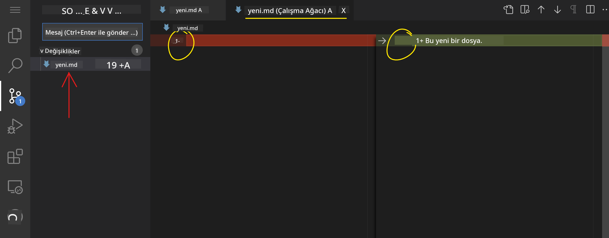
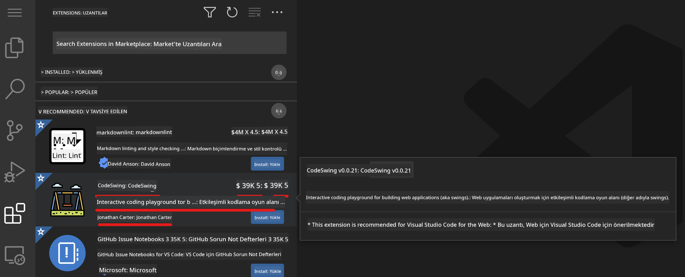
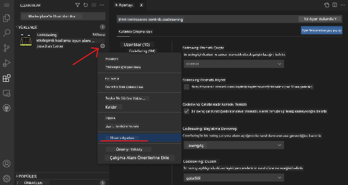

<!--
CO_OP_TRANSLATOR_METADATA:
{
  "original_hash": "1ba61d96a11309a2a6ea507496dcf7e5",
  "translation_date": "2025-08-29T00:29:28+00:00",
  "source_file": "8-code-editor/1-using-a-code-editor/README.md",
  "language_code": "tr"
}
-->
# Bir kod editörü kullanma

Bu ders, web tabanlı bir kod editörü olan [VSCode.dev](https://vscode.dev) kullanmanın temel bilgilerini kapsar. Bu editör sayesinde bilgisayarınıza herhangi bir şey yüklemeden kodunuzu değiştirebilir ve bir projeye katkıda bulunabilirsiniz.

## Öğrenme hedefleri

Bu derste şunları öğreneceksiniz:

- Bir kod projesinde kod editörü kullanmak
- Sürüm kontrolü ile değişiklikleri takip etmek
- Geliştirme için editörü özelleştirmek

### Ön Koşullar

Başlamadan önce [GitHub](https://github.com) ile bir hesap oluşturmanız gerekecek. Eğer henüz bir hesabınız yoksa [GitHub](https://github.com/) adresine giderek bir hesap oluşturun.

### Giriş

Bir kod editörü, program yazmak ve mevcut kod projeleriyle iş birliği yapmak için temel bir araçtır. Bir editörün temel özelliklerini ve nasıl kullanılacağını anladıktan sonra, bu bilgileri kod yazarken uygulayabilirsiniz.

## VSCode.dev ile başlama

[VSCode.dev](https://vscode.dev), web üzerinde bir kod editörüdür. Bunu kullanmak için herhangi bir şey yüklemenize gerek yoktur; tıpkı başka bir web sitesini açar gibi kullanabilirsiniz. Editörü başlatmak için şu bağlantıyı açın: [https://vscode.dev](https://vscode.dev). Eğer [GitHub](https://github.com/) hesabınıza giriş yapmadıysanız, giriş yapmanız veya yeni bir hesap oluşturmanız için yönlendirmeleri takip edin.

Yüklendikten sonra, aşağıdaki görsele benzer bir ekran görmelisiniz:


Soldan sağa doğru üç ana bölüm vardır:

1. _Aktivite çubuğu_, büyüteç 🔎, dişli ⚙️ gibi bazı simgeleri içerir.
2. Varsayılan olarak _Gezgin_ (_Explorer_) olan ve _yan çubuk_ olarak adlandırılan genişletilmiş aktivite çubuğu.
3. Ve son olarak, sağdaki kod alanı.

Her bir simgeye tıklayarak farklı bir menü görüntüleyebilirsiniz. İşiniz bittiğinde, _Gezgin_ simgesine tıklayarak başladığınız yere geri dönün.

Kod oluşturmaya veya mevcut kodu değiştirmeye başladığınızda, bu işlem sağdaki en büyük alanda gerçekleşir. Bu alanı mevcut kodu görüntülemek için de kullanacaksınız, bunu bir sonraki adımda yapacaksınız.

## Bir GitHub deposu açma

İlk olarak, bir GitHub deposu açmanız gerekecek. Bir depo açmanın birden fazla yolu vardır. Bu bölümde, değişiklik yapmaya başlamak için bir depo açmanın iki farklı yolunu göreceksiniz.

### 1. Editör ile

Uzaktan bir depo açmak için editörü kullanın. [VSCode.dev](https://vscode.dev) adresine giderseniz, _"Open Remote Repository"_ düğmesini göreceksiniz:


Komut paletini de kullanabilirsiniz. Komut paleti, bir komut veya eylemin parçası olan herhangi bir kelimeyi yazarak doğru komutu bulabileceğiniz bir giriş kutusudur. Sol üstteki menüyü kullanarak _View_ seçeneğini seçin ve ardından _Command Palette_ seçeneğini seçin veya şu klavye kısayolunu kullanın: Ctrl-Shift-P (MacOS'ta Command-Shift-P).


Menü açıldığında, _open remote repository_ yazın ve ardından ilk seçeneği seçin. Katıldığınız veya yakın zamanda açtığınız birden fazla depo görüntülenecektir. Ayrıca tam bir GitHub URL'si kullanarak bir depo seçebilirsiniz. Aşağıdaki URL'yi kutuya yapıştırın:

```
https://github.com/microsoft/Web-Dev-For-Beginners
```

✅ Başarılı olursa, bu depodaki tüm dosyaları metin editöründe yüklü olarak göreceksiniz.

### 2. URL kullanarak

Bir depo yüklemek için doğrudan bir URL de kullanabilirsiniz. Örneğin, mevcut depo için tam URL [https://github.com/microsoft/Web-Dev-For-Beginners](https://github.com/microsoft/Web-Dev-For-Beginners) şeklindedir, ancak GitHub alan adını `VSCode.dev/github` ile değiştirerek depoyu doğrudan yükleyebilirsiniz. Ortaya çıkan URL şu şekilde olur: [https://vscode.dev/github/microsoft/Web-Dev-For-Beginners](https://vscode.dev/github/microsoft/Web-Dev-For-Beginners).

## Dosyaları düzenleme

Depoyu tarayıcıda veya vscode.dev üzerinde açtıktan sonra, bir sonraki adım projeyi güncellemek veya değişiklikler yapmaktır.

### 1. Yeni bir dosya oluşturma

Yeni bir dosyayı mevcut bir klasör içinde veya kök dizinde/klasörde oluşturabilirsiniz. Yeni bir dosya oluşturmak için dosyanın kaydedileceği konumu/dizini açın ve aktivite çubuğundaki _'Yeni dosya ...'_ simgesini seçin, bir ad verin ve enter tuşuna basın.


### 2. Depodaki bir dosyayı düzenleme ve kaydetme

Vscode.dev, projenizde hızlı güncellemeler yapmak istediğinizde herhangi bir yazılımı yerel olarak yüklemeden kullanışlıdır. Kodunuzu güncellemek için, aktivite çubuğunda bulunan 'Gezgin' simgesine tıklayın ve depodaki dosya ve klasörleri görüntüleyin. Bir dosya seçin, kod alanında açın, değişikliklerinizi yapın ve kaydedin.


Projenizi güncellemeyi bitirdiğinizde, depoya yaptığınız tüm yeni değişiklikleri içeren _`source control`_ simgesini seçin.

Projenize yaptığınız değişiklikleri görüntülemek için genişletilmiş aktivite çubuğundaki `Changes` klasöründeki dosyaları seçin. Bu, dosyada yaptığınız değişiklikleri görsel olarak görebileceğiniz bir 'Çalışma Ağacı' (_Working Tree_) açacaktır. Kırmızı, projeden bir çıkarımı, yeşil ise bir eklemeyi ifade eder.



Yaptığınız değişikliklerden memnunsanız, `Changes` klasörünün üzerine gelin ve değişiklikleri sahnelemek için `+` düğmesine tıklayın. Sahneleme, değişikliklerinizi GitHub'a göndermeye hazırlamak anlamına gelir.

Ancak bazı değişikliklerden memnun değilseniz ve bunları iptal etmek istiyorsanız, `Changes` klasörünün üzerine gelin ve `geri al` simgesini seçin.

Ardından, bir `commit mesajı` yazın _(Projeye yaptığınız değişikliğin açıklaması)_, `onay simgesine` tıklayarak değişikliklerinizi gönderin ve yükleyin.

Projenizde çalışmayı bitirdiğinizde, sol üstteki `hamburger menü simgesini` seçerek github.com'daki depoya geri dönün.


## Uzantıları kullanma

VSCode'a uzantılar yüklemek, editörünüzde yeni özellikler eklemenize ve geliştirme ortamı seçeneklerini özelleştirmenize olanak tanır. Bu uzantılar, birden fazla programlama dili için destek eklemenize yardımcı olur ve genellikle genel uzantılar veya dil tabanlı uzantılar olarak sınıflandırılır.

Mevcut tüm uzantıların listesini görüntülemek için, aktivite çubuğundaki _`Uzantılar simgesine`_ tıklayın ve _'Marketplace'teki Uzantıları Ara'_ etiketli metin alanına uzantının adını yazmaya başlayın. Her bir uzantı için **uzantı adı, yayıncının adı, bir cümlelik açıklama, indirme sayısı** ve **yıldız derecelendirmesi** görüntülenir.



Ayrıca, daha önce yüklenmiş tüm uzantıları _`Yüklü klasöründe`_, çoğu geliştirici tarafından kullanılan popüler uzantıları _`Popüler klasöründe`_ ve aynı çalışma alanındaki kullanıcılar veya yakın zamanda açtığınız dosyalara dayalı olarak sizin için önerilen uzantıları _`Önerilen klasöründe`_ görüntüleyebilirsiniz.


### 1. Uzantıları yükleme

Bir uzantıyı yüklemek için, arama alanına uzantının adını yazın ve genişletilmiş aktivite çubuğunda göründüğünde üzerine tıklayarak kod alanında uzantı hakkında ek bilgi görüntüleyin.

Uzantıyı yüklemek için genişletilmiş aktivite çubuğundaki _mavi yükleme düğmesine_ veya kod alanında uzantıyı seçtiğinizde görünen yükleme düğmesine tıklayın.


### 2. Uzantıları özelleştirme

Uzantıyı yükledikten sonra, davranışını değiştirmek ve tercihleriniz doğrultusunda özelleştirmek isteyebilirsiniz. Bunu yapmak için Uzantılar simgesini seçin ve bu kez uzantınız _Yüklü klasöründe_ görünecektir. _**Dişli simgesine**_ tıklayın ve _Uzantı Ayarları_ seçeneğine gidin.



### 3. Uzantıları yönetme

Uzantıyı yükledikten ve kullandıktan sonra, vscode.dev farklı ihtiyaçlara göre uzantınızı yönetmek için seçenekler sunar. Örneğin, şunları yapabilirsiniz:

- **Devre Dışı Bırak:** _(Bir uzantıyı geçici olarak devre dışı bırakabilirsiniz, ancak tamamen kaldırmak istemiyorsanız)_

    Genişletilmiş aktivite çubuğunda yüklü uzantıyı seçin > Dişli simgesine tıklayın > 'Devre Dışı Bırak' veya 'Devre Dışı Bırak (Çalışma Alanı)' seçeneğini seçin **VEYA** Uzantıyı kod alanında açın ve mavi Devre Dışı Bırak düğmesine tıklayın.

- **Kaldır:** Genişletilmiş aktivite çubuğunda yüklü uzantıyı seçin > Dişli simgesine tıklayın > 'Kaldır' seçeneğini seçin **VEYA** Uzantıyı kod alanında açın ve mavi Kaldır düğmesine tıklayın.

---

## Ödev
[Vscode.dev kullanarak bir özgeçmiş web sitesi oluşturun](https://github.com/microsoft/Web-Dev-For-Beginners/blob/main/8-code-editor/1-using-a-code-editor/assignment.md)

## Gözden Geçirme ve Kendi Kendine Çalışma

[VSCode.dev](https://code.visualstudio.com/docs/editor/vscode-web?WT.mc_id=academic-0000-alfredodeza) ve diğer özellikleri hakkında daha fazla bilgi edinin.

---

**Feragatname**:  
Bu belge, [Co-op Translator](https://github.com/Azure/co-op-translator) adlı yapay zeka çeviri hizmeti kullanılarak çevrilmiştir. Doğruluk için çaba göstersek de, otomatik çevirilerin hata veya yanlışlıklar içerebileceğini lütfen unutmayın. Belgenin orijinal dili, yetkili kaynak olarak kabul edilmelidir. Kritik bilgiler için profesyonel insan çevirisi önerilir. Bu çevirinin kullanımından kaynaklanan yanlış anlama veya yanlış yorumlamalardan sorumlu değiliz.