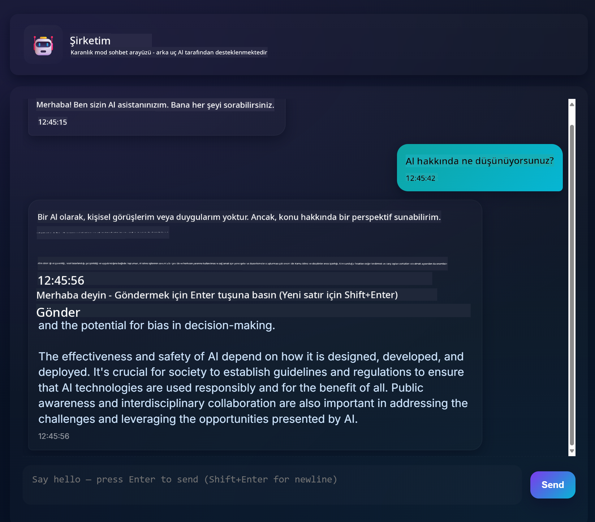
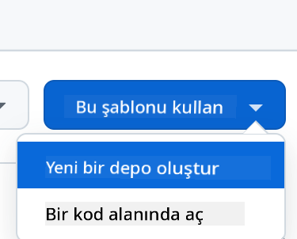
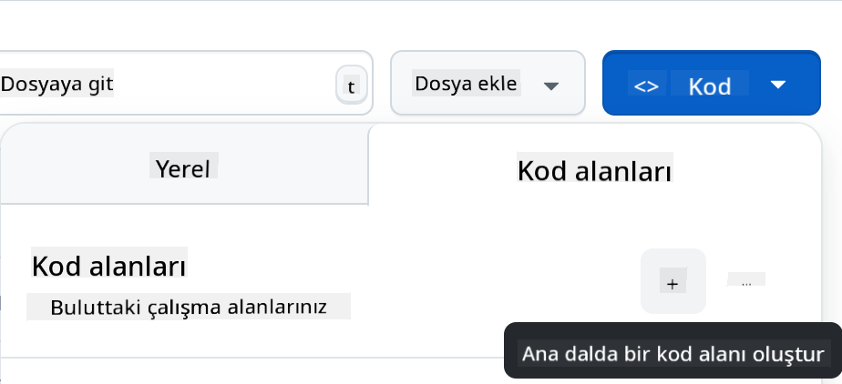

<!--
CO_OP_TRANSLATOR_METADATA:
{
  "original_hash": "11cf36165c243947b6cd85b88cf6faa6",
  "translation_date": "2025-09-01T16:55:01+00:00",
  "source_file": "9-chat-project/README.md",
  "language_code": "tr"
}
-->
# Sohbet Projesi

Bu sohbet projesi, GitHub Modelleri kullanarak bir Sohbet Asistanı oluşturmayı gösterir.

İşte tamamlanmış projenin görünümü:



Biraz bağlam: Üretken yapay zeka kullanarak Sohbet asistanları oluşturmak, yapay zeka hakkında öğrenmeye başlamak için harika bir yoldur. Bu derste, üretken yapay zekayı bir web uygulamasına entegre etmeyi öğreneceksiniz. Haydi başlayalım.

## Üretken Yapay Zekaya Bağlanma

Backend için GitHub Modelleri kullanıyoruz. Bu, yapay zekayı ücretsiz olarak kullanmanıza olanak tanıyan harika bir hizmettir. Playground'a gidin ve seçtiğiniz backend diline karşılık gelen kodu alın. İşte [GitHub Modelleri Playground](https://github.com/marketplace/models/azure-openai/gpt-4o-mini/playground) görünümü:


Dediğimiz gibi, "Code" sekmesini ve seçtiğiniz çalışma zamanını seçin.


### Python Kullanımı

Bu durumda Python'u seçiyoruz, bu da şu kodu seçmemiz anlamına geliyor:

```python
"""Run this model in Python

> pip install openai
"""
import os
from openai import OpenAI

# To authenticate with the model you will need to generate a personal access token (PAT) in your GitHub settings. 
# Create your PAT token by following instructions here: https://docs.github.com/en/authentication/keeping-your-account-and-data-secure/managing-your-personal-access-tokens
client = OpenAI(
    base_url="https://models.github.ai/inference",
    api_key=os.environ["GITHUB_TOKEN"],
)

response = client.chat.completions.create(
    messages=[
        {
            "role": "system",
            "content": "",
        },
        {
            "role": "user",
            "content": "What is the capital of France?",
        }
    ],
    model="openai/gpt-4o-mini",
    temperature=1,
    max_tokens=4096,
    top_p=1
)

print(response.choices[0].message.content)
```

Bu kodu biraz temizleyelim, böylece yeniden kullanılabilir hale gelsin:

```python
def call_llm(prompt: str, system_message: str):
    response = client.chat.completions.create(
        messages=[
            {
                "role": "system",
                "content": system_message,
            },
            {
                "role": "user",
                "content": prompt,
            }
        ],
        model="openai/gpt-4o-mini",
        temperature=1,
        max_tokens=4096,
        top_p=1
    )

    return response.choices[0].message.content
```

Bu `call_llm` fonksiyonu ile artık bir prompt ve bir sistem prompt alabiliriz ve fonksiyon sonuç döndürür.

### Yapay Zeka Asistanını Özelleştirme

Yapay zeka asistanını özelleştirmek istiyorsanız, sistem prompt'u şu şekilde doldurarak nasıl davranmasını istediğinizi belirtebilirsiniz:

```python
call_llm("Tell me about you", "You're Albert Einstein, you only know of things in the time you were alive")
```

## Web API Üzerinden Sunma

Harika, yapay zeka kısmını tamamladık, şimdi bunu bir Web API'ye nasıl entegre edebileceğimize bakalım. Web API için Flask kullanmayı seçiyoruz, ancak herhangi bir web framework uygun olacaktır. Koduna bakalım:

### Python Kullanımı

```python
# api.py
from flask import Flask, request, jsonify
from llm import call_llm
from flask_cors import CORS

app = Flask(__name__)
CORS(app)   # *   example.com

@app.route("/", methods=["GET"])
def index():
    return "Welcome to this API. Call POST /hello with 'message': 'my message' as JSON payload"


@app.route("/hello", methods=["POST"])
def hello():
    # get message from request body  { "message": "do this taks for me" }
    data = request.get_json()
    message = data.get("message", "")

    response = call_llm(message, "You are a helpful assistant.")
    return jsonify({
        "response": response
    })

if __name__ == "__main__":
    app.run(host="0.0.0.0", port=5000)
```

Burada bir Flask API oluşturuyoruz ve "/" ve "/chat" adında iki varsayılan route tanımlıyoruz. İkincisi, frontendimizin soruları backend'e iletmesi için tasarlanmıştır.

*llm.py* dosyasını entegre etmek için yapmamız gerekenler:

- `call_llm` fonksiyonunu içe aktarın:

   ```python
   from llm import call_llm
   from flask import Flask, request
   ```

- "/chat" route'undan çağırın:

   ```python
   @app.route("/hello", methods=["POST"])
   def hello():
      # get message from request body  { "message": "do this taks for me" }
      data = request.get_json()
      message = data.get("message", "")

      response = call_llm(message, "You are a helpful assistant.")
      return jsonify({
         "response": response
      })
   ```

   Burada gelen isteği ayrıştırarak JSON gövdesinden `message` özelliğini alıyoruz. Daha sonra LLM'i şu şekilde çağırıyoruz:

   ```python
   response = call_llm(message, "You are a helpful assistant")

   # return the response as JSON
   return jsonify({
      "response": response 
   })
   ```

Harika, şimdi ihtiyacımız olanı yaptık.

## Cors'u Yapılandırma

Backend ve frontend farklı portlarda çalışacağı için, frontend'in backend'e çağrı yapmasına izin vermek için CORS (cross-origin resource sharing) gibi bir şey ayarlamamız gerektiğini belirtmeliyiz.

### Python Kullanımı

*api.py* dosyasında bunu ayarlayan bir kod parçası var:

```python
from flask_cors import CORS

app = Flask(__name__)
CORS(app)   # *   example.com
```

Şu anda "*" yani tüm kaynaklara izin verecek şekilde ayarlandı ve bu biraz güvensiz. Üretime geçtiğimizde bunu kısıtlamalıyız.

## Projenizi Çalıştırma

Projenizi çalıştırmak için önce backend'i, ardından frontend'i başlatmanız gerekiyor.

### Python Kullanımı

Tamam, elimizde *llm.py* ve *api.py* var, backend ile bunu nasıl çalıştırabiliriz? İki şey yapmamız gerekiyor:

- Bağımlılıkları yükleyin:

   ```sh
   cd backend
   python -m venv venv
   source ./venv/bin/activate

   pip install openai flask flask-cors openai
   ```

- API'yi başlatın:

   ```sh
   python api.py
   ```

   Codespaces kullanıyorsanız, editörün alt kısmındaki Ports bölümüne gidin, üzerine sağ tıklayın ve "Port Visibility" seçeneğini seçerek "Public" yapın.

### Frontend Üzerinde Çalışma

Artık bir API'miz çalışıyor, bunun için bir frontend oluşturalım. Adım adım geliştireceğimiz minimum bir frontend. *frontend* klasöründe şu dosyaları oluşturun:

```text
backend/
frontend/
index.html
app.js
styles.css
```

**index.html** ile başlayalım:

```html
<html>
    <head>
        <link rel="stylesheet" href="styles.css">
    </head>
    <body>
      <form>
        <textarea id="messages"></textarea>
        <input id="input" type="text" />
        <button type="submit" id="sendBtn">Send</button>  
      </form>  
      <script src="app.js" />
    </body>
</html>    
```

Yukarıdaki kod, bir sohbet penceresini desteklemek için gereken minimum kodu içerir. Bir textarea, mesajların görüntüleneceği bir alan, bir input alanı ve mesajınızı backend'e göndermek için bir buton içerir. Şimdi *app.js* dosyasındaki JavaScript'e bakalım.

**app.js**

```js
// app.js

(function(){
  // 1. set up elements  
  const messages = document.getElementById("messages");
  const form = document.getElementById("form");
  const input = document.getElementById("input");

  const BASE_URL = "change this";
  const API_ENDPOINT = `${BASE_URL}/hello`;

  // 2. create a function that talks to our backend
  async function callApi(text) {
    const response = await fetch(API_ENDPOINT, {
      method: "POST",
      headers: { "Content-Type": "application/json" },
      body: JSON.stringify({ message: text })
    });
    let json = await response.json();
    return json.response;
  }

  // 3. add response to our textarea
  function appendMessage(text, role) {
    const el = document.createElement("div");
    el.className = `message ${role}`;
    el.innerHTML = text;
    messages.appendChild(el);
  }

  // 4. listen to submit events
  form.addEventListener("submit", async(e) => {
    e.preventDefault();
   // someone clicked the button in the form
   
   // get input
   const text = input.value.trim();

   appendMessage(text, "user")

   // reset it
   input.value = '';

   const reply = await callApi(text);

   // add to messages
   appendMessage(reply, "assistant");

  })
})();
```

Kodun bölümlerini inceleyelim:

- 1) Burada daha sonra kodda referans alacağımız tüm öğelere bir referans alıyoruz.
- 2) Bu bölümde, yerleşik `fetch` metodunu kullanarak backend'e çağrı yapan bir fonksiyon oluşturuyoruz.
- 3) `appendMessage`, yanıtları ve kullanıcı olarak yazdığınız mesajları eklemeye yardımcı olur.
- 4) Burada submit olayını dinliyoruz ve input alanını okuyarak, kullanıcının mesajını textarea'ya yerleştiriyoruz, API'yi çağırıyoruz ve yanıtı textarea'da görüntülüyoruz.

Şimdi stil kısmına bakalım, burada istediğiniz gibi tasarım yapabilirsiniz, ancak işte bazı öneriler:

**styles.css**

```
.message {
    background: #222;
    box-shadow: 0 0 0 10px orange;
    padding: 10px:
    margin: 5px;
}

.message.user {
    background: blue;
}

.message.assistant {
    background: grey;
} 
```

Bu üç sınıf ile mesajları, bir asistandan mı yoksa kullanıcıdan mı geldiğine bağlı olarak farklı şekilde stilize edebilirsiniz. İlham almak isterseniz, `solution/frontend/styles.css` klasörüne göz atabilirsiniz.

### Base Url'yi Değiştirme

Burada ayarlamadığımız bir şey vardı, o da `BASE_URL`. Backend başlatılana kadar bu bilinmez. Ayarlamak için:

- API'yi yerel olarak çalıştırıyorsanız, `http://localhost:5000` gibi bir şey olmalıdır.
- Codespaces'de çalıştırıyorsanız, "[name]app.github.dev" gibi bir şey olmalıdır.

## Ödev

*project* adında kendi klasörünüzü oluşturun ve içeriği şu şekilde düzenleyin:

```text
project/
  frontend/
    index.html
    app.js
    styles.css
  backend/
    ...
```

Yukarıda anlatılanlardan içeriği kopyalayın, ancak istediğiniz gibi özelleştirmekten çekinmeyin.

## Çözüm

[Çözüm](./solution/README.md)

## Bonus

Yapay zeka asistanının kişiliğini değiştirmeyi deneyin.

### Python İçin

*api.py* dosyasında `call_llm` çağrıldığında, ikinci argümanı istediğiniz şekilde değiştirebilirsiniz, örneğin:

```python
call_llm(message, "You are Captain Picard")
```

### Frontend

CSS ve metni de istediğiniz gibi değiştirin, yani *index.html* ve *styles.css* dosyalarında değişiklik yapın.

## Özet

Harika, sıfırdan bir yapay zeka kullanarak kişisel bir asistan oluşturmayı öğrendiniz. Bunu GitHub Modelleri, Python'da bir backend ve HTML, CSS ve JavaScript'te bir frontend kullanarak yaptık.

## Codespaces ile Kurulum

- Şuraya gidin: [Web Dev For Beginners repo](https://github.com/microsoft/Web-Dev-For-Beginners)
- Şablondan oluşturun (GitHub'da oturum açtığınızdan emin olun) sağ üst köşede:

    

- Kendi repo'nuzdayken bir Codespace oluşturun:

    

    Bu, artık üzerinde çalışabileceğiniz bir ortam başlatmalıdır.

---

**Feragatname**:  
Bu belge, AI çeviri hizmeti [Co-op Translator](https://github.com/Azure/co-op-translator) kullanılarak çevrilmiştir. Doğruluğu sağlamak için çaba göstersek de, otomatik çevirilerin hata veya yanlışlık içerebileceğini lütfen unutmayın. Belgenin orijinal dili, yetkili kaynak olarak kabul edilmelidir. Kritik bilgiler için profesyonel insan çevirisi önerilir. Bu çevirinin kullanımından kaynaklanan yanlış anlamalar veya yanlış yorumlamalar için sorumluluk kabul etmiyoruz.