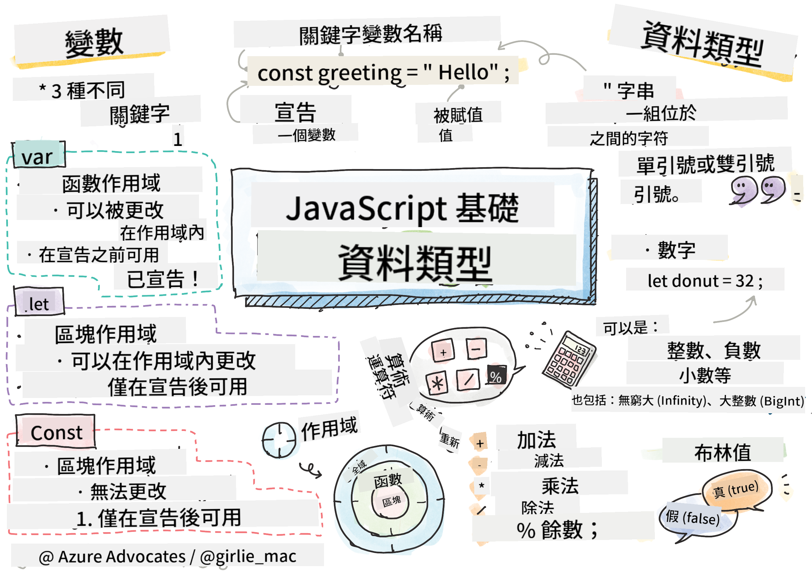

<!--
CO_OP_TRANSLATOR_METADATA:
{
  "original_hash": "b95fdd8310ef467305015ece1b0f9411",
  "translation_date": "2025-08-29T15:24:14+00:00",
  "source_file": "2-js-basics/1-data-types/README.md",
  "language_code": "tw"
}
-->
# JavaScript 基礎：資料型別


> Sketchnote by [Tomomi Imura](https://twitter.com/girlie_mac)

## 課前測驗
[課前測驗](https://ff-quizzes.netlify.app/web/)

本課程涵蓋 JavaScript 的基礎知識，這是一種為網頁提供互動功能的語言。

> 你可以在 [Microsoft Learn](https://docs.microsoft.com/learn/modules/web-development-101-variables/?WT.mc_id=academic-77807-sagibbon) 上學習本課程！

[](https://youtube.com/watch?v=JNIXfGiDWM8 "JavaScript 中的變數")

[](https://youtube.com/watch?v=AWfA95eLdq8 "JavaScript 中的資料型別")

> 🎥 點擊上方圖片觀看有關變數和資料型別的影片

讓我們從變數和填充它們的資料型別開始吧！

## 變數

變數用來儲存值，這些值可以在程式碼中使用並進行更改。

建立和**宣告**變數的語法如下：**[關鍵字] [名稱]**。它由以下兩部分組成：

- **關鍵字**。關鍵字可以是 `let` 或 `var`。

✅ `let` 關鍵字是在 ES6 中引入的，為變數提供了所謂的 _區塊作用域_。建議使用 `let` 而非 `var`。我們會在後續部分更深入地探討區塊作用域。
- **變數名稱**，這是你自己選擇的名稱。

### 任務 - 使用變數

1. **宣告變數**。讓我們使用 `let` 關鍵字宣告一個變數：

    ```javascript
    let myVariable;
    ```

   `myVariable` 現在已使用 `let` 關鍵字宣告，但目前尚未賦值。

1. **賦值**。使用 `=` 運算符將值儲存到變數中，後面跟著期望的值。

    ```javascript
    myVariable = 123;
    ```

   > 注意：在本課程中使用 `=` 表示我們使用的是「賦值運算符」，用於將值設定到變數中。它並不表示相等。

   `myVariable` 現在已被*初始化*為值 123。

1. **重構**。將你的程式碼替換為以下語句。

    ```javascript
    let myVariable = 123;
    ```

    上述語句稱為 _顯式初始化_，即在宣告變數的同時賦值。

1. **更改變數值**。以下方式更改變數值：

   ```javascript
   myVariable = 321;
   ```

   一旦變數被宣告，你可以隨時使用 `=` 運算符和新值更改其值。

   ✅ 試試看！你可以直接在瀏覽器中撰寫 JavaScript。打開瀏覽器窗口並導航到開發者工具。在控制台中，你會看到一個提示；輸入 `let myVariable = 123`，按下回車，然後輸入 `myVariable`。會發生什麼？注意，你會在後續課程中學到更多相關概念。

## 常數

常數的宣告和初始化遵循與變數相同的概念，但使用 `const` 關鍵字。常數通常以全大寫字母宣告。

```javascript
const MY_VARIABLE = 123;
```

常數與變數相似，但有兩個例外：

- **必須有值**。常數必須初始化，否則在執行程式碼時會出現錯誤。
- **引用不可更改**。常數的引用在初始化後不可更改，否則在執行程式碼時會出現錯誤。以下是兩個例子：
   - **簡單值**。以下是不允許的：
   
      ```javascript
      const PI = 3;
      PI = 4; // not allowed
      ```
 
   - **物件引用受保護**。以下是不允許的：
   
      ```javascript
      const obj = { a: 3 };
      obj = { b: 5 } // not allowed
      ```

    - **物件值未受保護**。以下是允許的：
    
      ```javascript
      const obj = { a: 3 };
      obj.a = 5;  // allowed
      ```

      上述範例中，你更改了物件的值，但未更改其引用，因此是允許的。

   > 注意，`const` 表示引用受到保護，不能重新賦值。然而，值並非 _不可變_，尤其是當它是像物件這樣的複雜結構時，值仍然可以更改。

## 資料型別

變數可以儲存許多不同類型的值，例如數字和文字。這些不同類型的值被稱為 **資料型別**。資料型別是軟體開發中的重要部分，因為它幫助開發者決定程式碼的撰寫方式以及軟體的運行方式。此外，某些資料型別具有獨特的功能，可以幫助轉換或提取值中的額外資訊。

✅ 資料型別也被稱為 JavaScript 的資料原始型別，因為它們是語言提供的最低層級資料型別。共有 7 種原始型別：string、number、bigint、boolean、undefined、null 和 symbol。花點時間想像這些原始型別可能代表什麼。什麼是 `zebra`？`0` 呢？`true` 呢？

### 數字

在上一節中，`myVariable` 的值是一個數字型別。

`let myVariable = 123;`

變數可以儲存所有類型的數字，包括小數或負數。數字還可以與算術運算符一起使用，這部分內容會在[下一節](../../../../2-js-basics/1-data-types)中介紹。

### 算術運算符

在執行算術運算時，有幾種運算符可供使用，以下列出了一些：

| 符號 | 描述                                                                      | 範例                          |
| ---- | ------------------------------------------------------------------------ | ----------------------------- |
| `+`  | **加法**：計算兩個數字的總和                                             | `1 + 2 //預期答案是 3`         |
| `-`  | **減法**：計算兩個數字的差                                               | `1 - 2 //預期答案是 -1`        |
| `*`  | **乘法**：計算兩個數字的乘積                                             | `1 * 2 //預期答案是 2`         |
| `/`  | **除法**：計算兩個數字的商                                               | `1 / 2 //預期答案是 0.5`       |
| `%`  | **餘數**：計算兩個數字相除後的餘數                                       | `1 % 2 //預期答案是 1`         |

✅ 試試看！在瀏覽器的控制台中嘗試一個算術運算。結果是否讓你感到驚訝？

### 字串

字串是一組位於單引號或雙引號之間的字符。

- `'這是一個字串'`
- `"這也是一個字串"`
- `let myString = '這是一個儲存在變數中的字串值';`

記得在撰寫字串時使用引號，否則 JavaScript 會假設它是一個變數名稱。

### 格式化字串

字串是文字，有時需要進行格式化。

要**串接**兩個或更多字串（即將它們連接在一起），可以使用 `+` 運算符。

```javascript
let myString1 = "Hello";
let myString2 = "World";

myString1 + myString2 + "!"; //HelloWorld!
myString1 + " " + myString2 + "!"; //Hello World!
myString1 + ", " + myString2 + "!"; //Hello, World!

```

✅ 為什麼在 JavaScript 中 `1 + 1 = 2`，但 `'1' + '1' = 11`？想一想。那麼 `'1' + 1` 呢？

**模板字串**是另一種格式化字串的方式，不同於引號，使用的是反引號。任何非純文字的內容都必須放在 `${ }` 區塊中，包括可能是字串的變數。

```javascript
let myString1 = "Hello";
let myString2 = "World";

`${myString1} ${myString2}!` //Hello World!
`${myString1}, ${myString2}!` //Hello, World!
```

你可以使用任一方法來實現格式化目標，但模板字串會保留所有空格和換行。

✅ 什麼時候你會使用模板字串而不是普通字串？

### 布林值

布林值只有兩個值：`true` 或 `false`。布林值可以幫助決定在滿足某些條件時應執行哪些程式碼行。在許多情況下，[運算符](../../../../2-js-basics/1-data-types)會協助設定布林值，並且你會經常注意到變數被初始化或其值被運算符更新。

- `let myTrueBool = true`
- `let myFalseBool = false`

✅ 如果一個變數的值評估為布林值 `true`，則可以認為它是「真值」。有趣的是，在 JavaScript 中，[所有值都是真值，除非被定義為假值](https://developer.mozilla.org/docs/Glossary/Truthy)。

---

## 🚀 挑戰

JavaScript 因其偶爾令人驚訝的資料型別處理方式而聞名。進行一些研究，了解這些「陷阱」。例如：大小寫敏感可能會讓你吃虧！在控制台中嘗試以下操作：`let age = 1; let Age = 2; age == Age`（結果為 `false` —— 為什麼？）。你還能找到哪些其他陷阱？

## 課後測驗
[課後測驗](https://ff-quizzes.netlify.app)

## 複習與自學

查看[這份 JavaScript 練習題列表](https://css-tricks.com/snippets/javascript/)並嘗試其中一題。你學到了什麼？

## 作業

[資料型別練習](assignment.md)

---

**免責聲明**：  
本文件使用 AI 翻譯服務 [Co-op Translator](https://github.com/Azure/co-op-translator) 進行翻譯。我們致力於提供準確的翻譯，但請注意，自動翻譯可能包含錯誤或不準確之處。應以原始語言的文件作為權威來源。對於關鍵資訊，建議尋求專業人工翻譯。我們對因使用此翻譯而產生的任何誤解或錯誤解讀概不負責。