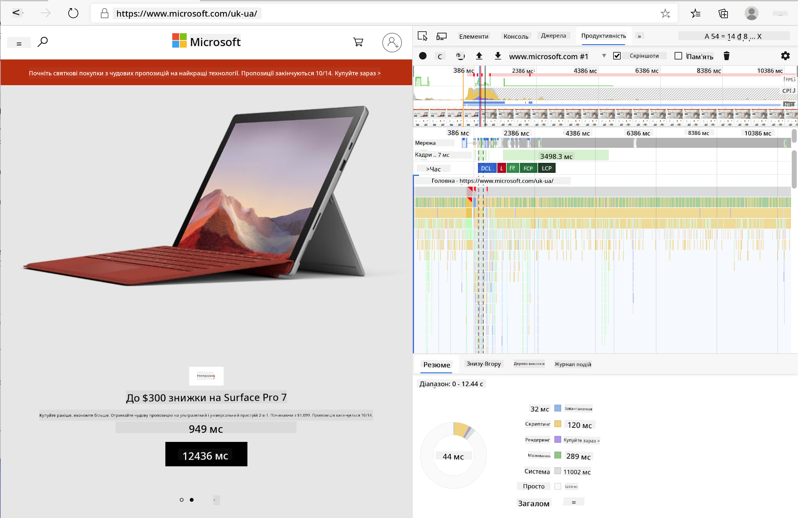
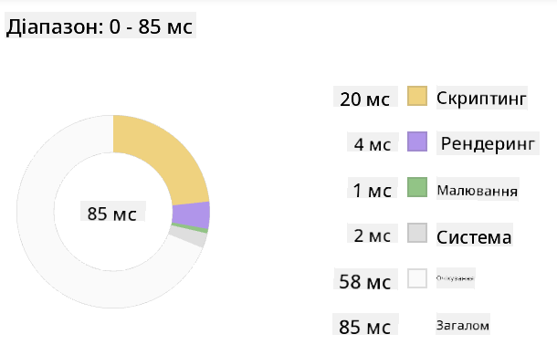

<!--
CO_OP_TRANSLATOR_METADATA:
{
  "original_hash": "49b58721a71cfda824e2f3e1f46908c6",
  "translation_date": "2025-08-28T18:11:15+00:00",
  "source_file": "5-browser-extension/3-background-tasks-and-performance/README.md",
  "language_code": "uk"
}
-->
# Проєкт розширення для браузера, частина 3: Дізнайтеся про фонові завдання та продуктивність

## Тест перед лекцією

[Тест перед лекцією](https://ff-quizzes.netlify.app/web/quiz/27)

### Вступ

У двох попередніх уроках цього модуля ви навчилися створювати форму та область відображення для даних, отриманих з API. Це дуже стандартний спосіб створення веб-присутності в інтернеті. Ви навіть навчилися обробляти асинхронне отримання даних. Ваше розширення для браузера майже готове.

Залишилося впоратися з деякими фоновими завданнями, включаючи оновлення кольору іконки розширення, тому зараз чудовий час поговорити про те, як браузер управляє такими завданнями. Давайте розглянемо ці завдання в контексті продуктивності ваших веб-ресурсів під час їх створення.

## Основи веб-продуктивності

> "Продуктивність вебсайту стосується двох речей: як швидко завантажується сторінка і як швидко виконується код на ній." -- [Зак Гроссбарт](https://www.smashingmagazine.com/2012/06/javascript-profiling-chrome-developer-tools/)

Тема про те, як зробити ваші вебсайти надзвичайно швидкими на всіх типах пристроїв, для всіх типів користувачів і в усіх ситуаціях, є, як не дивно, дуже обширною. Ось кілька моментів, які варто враховувати під час створення стандартного вебпроєкту або розширення для браузера.

Перше, що вам потрібно зробити, щоб переконатися, що ваш сайт працює ефективно, — це зібрати дані про його продуктивність. Першим місцем для цього є інструменти розробника вашого веббраузера. У Edge ви можете вибрати кнопку "Налаштування та інше" (іконка з трьома крапками у верхньому правому куті браузера), потім перейти до "Додаткові інструменти" > "Інструменти розробника" і відкрити вкладку "Продуктивність". Ви також можете використовувати комбінації клавіш `Ctrl` + `Shift` + `I` на Windows або `Option` + `Command` + `I` на Mac, щоб відкрити інструменти розробника.

Вкладка "Продуктивність" містить інструмент профілювання. Відкрийте вебсайт (спробуйте, наприклад, [https://www.microsoft.com](https://www.microsoft.com/?WT.mc_id=academic-77807-sagibbon)) і натисніть кнопку "Запис", потім оновіть сайт. Зупиніть запис у будь-який момент, і ви зможете побачити процедури, які генеруються для "скрипту", "рендерингу" та "малювання" сайту:



✅ Відвідайте [Документацію Microsoft](https://docs.microsoft.com/microsoft-edge/devtools-guide/performance/?WT.mc_id=academic-77807-sagibbon) про панель продуктивності в Edge.

> Порада: щоб отримати точні дані про час запуску вашого сайту, очистіть кеш браузера.

Виберіть елементи на шкалі часу профілю, щоб збільшити події, які відбуваються під час завантаження вашої сторінки.

Отримайте знімок продуктивності вашої сторінки, вибравши частину шкали часу профілю та переглянувши панель зведення:



Перевірте панель журналу подій, щоб побачити, чи будь-яка подія тривала довше ніж 15 мс:


✅ Ознайомтеся з вашим профайлером! Відкрийте інструменти розробника на цьому сайті та перевірте, чи є якісь вузькі місця. Який ресурс завантажується найповільніше? Найшвидше?

## Перевірки профілювання

Загалом, існують деякі "проблемні зони", які кожен веброзробник повинен враховувати під час створення сайту, щоб уникнути неприємних сюрпризів під час розгортання в продакшн.

**Розміри ресурсів**: Веб став "важчим", а отже, повільнішим за останні кілька років. Частина цієї ваги пов'язана з використанням зображень.

✅ Перегляньте [Архів Інтернету](https://httparchive.org/reports/page-weight) для історичного огляду ваги сторінок та іншого.

Хорошою практикою є забезпечення оптимізації ваших зображень і їх доставки у правильному розмірі та роздільній здатності для ваших користувачів.

**Переміщення DOM**: Браузер має побудувати свою модель об'єктів документа (DOM) на основі коду, який ви пишете, тому в інтересах хорошої продуктивності сторінки слід мінімізувати теги, використовуючи та стилізуючи лише те, що потрібно сторінці. Наприклад, надлишковий CSS, пов'язаний зі сторінкою, може бути оптимізований; стилі, які потрібно використовувати лише на одній сторінці, не потрібно включати до основного стилю.

**JavaScript**: Кожен розробник JavaScript повинен стежити за скриптами, які блокують рендеринг і мають бути завантажені перед тим, як решта DOM може бути переміщена та намальована в браузері. Розгляньте можливість використання `defer` з вашими вбудованими скриптами (як це зроблено в модулі Terrarium).

✅ Спробуйте деякі сайти на [вебсайті тестування швидкості сайту](https://www.webpagetest.org/), щоб дізнатися більше про загальні перевірки, які виконуються для визначення продуктивності сайту.

Тепер, коли ви маєте уявлення про те, як браузер рендерить ресурси, які ви йому надсилаєте, давайте розглянемо останні кілька речей, які потрібно зробити, щоб завершити ваше розширення:

### Створіть функцію для обчислення кольору

Працюючи у файлі `/src/index.js`, додайте функцію під назвою `calculateColor()` після серії змінних `const`, які ви встановили для доступу до DOM:

```JavaScript
function calculateColor(value) {
	let co2Scale = [0, 150, 600, 750, 800];
	let colors = ['#2AA364', '#F5EB4D', '#9E4229', '#381D02', '#381D02'];

	let closestNum = co2Scale.sort((a, b) => {
		return Math.abs(a - value) - Math.abs(b - value);
	})[0];
	console.log(value + ' is closest to ' + closestNum);
	let num = (element) => element > closestNum;
	let scaleIndex = co2Scale.findIndex(num);

	let closestColor = colors[scaleIndex];
	console.log(scaleIndex, closestColor);

	chrome.runtime.sendMessage({ action: 'updateIcon', value: { color: closestColor } });
}
```

Що тут відбувається? Ви передаєте значення (інтенсивність вуглецю) з виклику API, який ви завершили в попередньому уроці, а потім обчислюєте, наскільки близьке його значення до індексу, представленого в масиві кольорів. Потім ви надсилаєте це найближче значення кольору через chrome runtime.

Chrome.runtime має [API](https://developer.chrome.com/extensions/runtime), який обробляє всі види фонових завдань, і ваше розширення використовує його:

> "Використовуйте API chrome.runtime, щоб отримати фонову сторінку, повернути деталі про маніфест і слухати та реагувати на події в життєвому циклі програми або розширення. Ви також можете використовувати цей API для перетворення відносного шляху URL-адрес на повністю кваліфіковані URL-адреси."

✅ Якщо ви розробляєте це розширення для Edge, вас може здивувати, що ви використовуєте API Chrome. Новіші версії браузера Edge працюють на браузерному двигуні Chromium, тому ви можете використовувати ці інструменти.

> Зверніть увагу, якщо ви хочете профілювати розширення для браузера, запустіть інструменти розробника з самого розширення, оскільки воно є окремим екземпляром браузера.

### Встановіть колір іконки за замовчуванням

Тепер у функції `init()` встановіть іконку на стандартний зелений колір, викликавши дію `updateIcon` Chrome:

```JavaScript
chrome.runtime.sendMessage({
	action: 'updateIcon',
		value: {
			color: 'green',
		},
});
```

### Викличте функцію, виконайте виклик

Далі викличте функцію, яку ви щойно створили, додавши її до обіцянки, повернутої API C02Signal:

```JavaScript
//let CO2...
calculateColor(CO2);
```

І нарешті, у файлі `/dist/background.js` додайте слухач для цих викликів фонових завдань:

```JavaScript
chrome.runtime.onMessage.addListener(function (msg, sender, sendResponse) {
	if (msg.action === 'updateIcon') {
		chrome.browserAction.setIcon({ imageData: drawIcon(msg.value) });
	}
});
//borrowed from energy lollipop extension, nice feature!
function drawIcon(value) {
	let canvas = document.createElement('canvas');
	let context = canvas.getContext('2d');

	context.beginPath();
	context.fillStyle = value.color;
	context.arc(100, 100, 50, 0, 2 * Math.PI);
	context.fill();

	return context.getImageData(50, 50, 100, 100);
}
```

У цьому коді ви додаєте слухач для будь-яких повідомлень, які надходять до менеджера фонових завдань. Якщо його назва — 'updateIcon', тоді виконується наступний код для малювання іконки відповідного кольору за допомогою Canvas API.

✅ Ви дізнаєтеся більше про Canvas API в [уроках про космічну гру](../../6-space-game/2-drawing-to-canvas/README.md).

Тепер перебудуйте своє розширення (`npm run build`), оновіть і запустіть його, і спостерігайте за зміною кольору. Чи настав час зробити перерву або помити посуд? Тепер ви знаєте!

Вітаємо, ви створили корисне розширення для браузера і дізналися більше про те, як працює браузер і як профілювати його продуктивність.

---

## 🚀 Виклик

Дослідіть деякі вебсайти з відкритим кодом, які існують вже давно, і, ґрунтуючись на їхній історії в GitHub, спробуйте визначити, як вони оптимізувалися протягом років для продуктивності, якщо взагалі оптимізувалися. Яка найпоширеніша проблема?

## Тест після лекції

[Тест після лекції](https://ff-quizzes.netlify.app/web/quiz/28)

## Огляд і самостійне навчання

Розгляньте можливість підписки на [розсилку про продуктивність](https://perf.email/).

Дослідіть деякі способи, якими браузери оцінюють продуктивність вебсайтів, переглянувши вкладки продуктивності в їхніх вебінструментах. Чи знайшли ви якісь суттєві відмінності?

## Завдання

[Проаналізуйте сайт на продуктивність](assignment.md)

---

**Відмова від відповідальності**:  
Цей документ був перекладений за допомогою сервісу автоматичного перекладу [Co-op Translator](https://github.com/Azure/co-op-translator). Хоча ми прагнемо до точності, звертаємо вашу увагу, що автоматичні переклади можуть містити помилки або неточності. Оригінальний документ на його рідній мові слід вважати авторитетним джерелом. Для критичної інформації рекомендується професійний людський переклад. Ми не несемо відповідальності за будь-які непорозуміння або неправильні тлумачення, що виникли внаслідок використання цього перекладу.