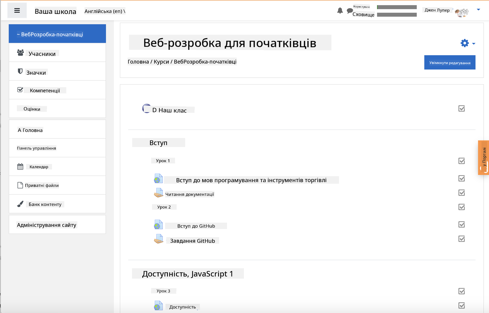

<!--
CO_OP_TRANSLATOR_METADATA:
{
  "original_hash": "75cb51f7ca9ea0b097ef4a1287e9290c",
  "translation_date": "2025-08-27T21:57:44+00:00",
  "source_file": "for-teachers.md",
  "language_code": "uk"
}
-->
## Для викладачів

Хочете використовувати цей навчальний матеріал у своєму класі? Будь ласка, не соромтеся!

Насправді, ви можете використовувати його прямо на GitHub, скориставшись GitHub Classroom.

Для цього зробіть форк цього репозиторію. Вам потрібно буде створити окремий репозиторій для кожного уроку, тому необхідно витягнути кожну папку в окремий репозиторій. Таким чином, [GitHub Classroom](https://classroom.github.com/classrooms) зможе окремо обробляти кожен урок.

Ці [повні інструкції](https://github.blog/2020-03-18-set-up-your-digital-classroom-with-github-classroom/) допоможуть вам налаштувати ваш клас.

## Використання в Moodle, Canvas або Blackboard

Цей навчальний матеріал добре працює в цих системах управління навчанням! Використовуйте [файл для завантаження в Moodle](../../../../../../../teaching-files/webdev-moodle.mbz) для повного контенту або спробуйте [файл Common Cartridge](../../../../../../../teaching-files/webdev-common-cartridge.imscc), який містить частину контенту. Moodle Cloud не підтримує повні експорти Common Cartridge, тому краще використовувати файл для завантаження в Moodle, який можна завантажити в Canvas. Будь ласка, повідомте нам, як ми можемо покращити цей досвід.

> Навчальний матеріал у класі Moodle

> Навчальний матеріал у Canvas

## Використання репозиторію як є

Якщо ви хочете використовувати цей репозиторій у його поточному вигляді, без використання GitHub Classroom, це також можливо. Вам потрібно буде повідомити своїм студентам, над яким уроком працювати разом.

У форматі онлайн (Zoom, Teams або інші) ви можете створити кімнати для групової роботи над вікторинами та наставляти студентів, щоб допомогти їм підготуватися до навчання. Потім запросіть студентів до вікторин і попросіть їх надсилати відповіді як 'issues' у певний час. Ви можете зробити те ж саме з завданнями, якщо хочете, щоб студенти працювали спільно у відкритому форматі.

Якщо ви віддаєте перевагу більш приватному формату, попросіть студентів зробити форк навчального матеріалу, урок за уроком, у свої власні приватні репозиторії на GitHub і надати вам доступ. Тоді вони зможуть виконувати вікторини та завдання приватно і надсилати їх вам через issues у вашому класному репозиторії.

Існує багато способів зробити це ефективним у форматі онлайн-класу. Будь ласка, повідомте нам, що працює найкраще для вас!

## Будь ласка, поділіться своїми думками!

Ми хочемо зробити цей навчальний матеріал корисним для вас і ваших студентів. Зв’яжіться з нами у [Teacher corner](https://github.com/microsoft/Web-Dev-For-Beginners/discussions/categories/teacher-corner) і відкрийте [**новий issue**](https://github.com/microsoft/Web-Dev-For-Beginners/issues/new/choose) для будь-яких запитів, помилок та відгуків.

---

**Відмова від відповідальності**:  
Цей документ був перекладений за допомогою сервісу автоматичного перекладу [Co-op Translator](https://github.com/Azure/co-op-translator). Хоча ми прагнемо до точності, будь ласка, майте на увазі, що автоматизовані переклади можуть містити помилки або неточності. Оригінальний документ на його рідній мові слід вважати авторитетним джерелом. Для критичної інформації рекомендується професійний людський переклад. Ми не несемо відповідальності за будь-які непорозуміння або неправильні тлумачення, що виникають внаслідок використання цього перекладу.