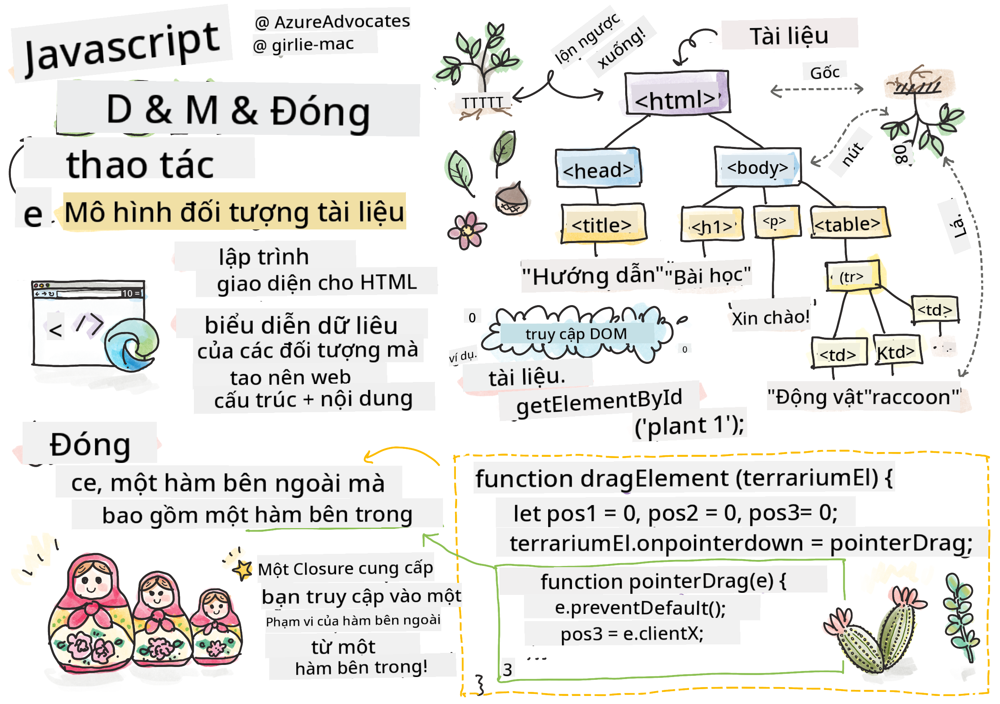
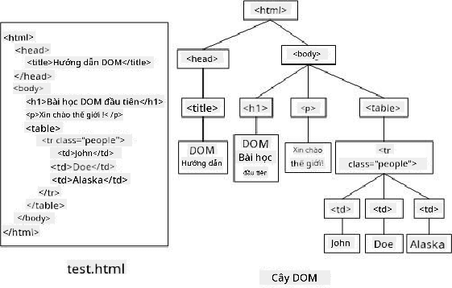
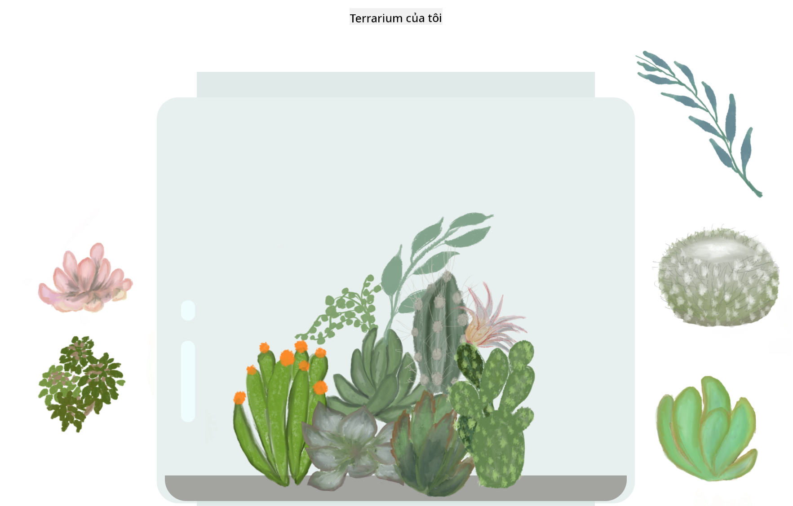

<!--
CO_OP_TRANSLATOR_METADATA:
{
  "original_hash": "61c14b27044861e5e69db35dd52c4403",
  "translation_date": "2025-08-29T08:58:12+00:00",
  "source_file": "3-terrarium/3-intro-to-DOM-and-closures/README.md",
  "language_code": "vi"
}
-->
# Dự án Terrarium Phần 3: Thao tác DOM và Closure


> Sketchnote bởi [Tomomi Imura](https://twitter.com/girlie_mac)

## Câu hỏi trước bài giảng

[Câu hỏi trước bài giảng](https://ff-quizzes.netlify.app/web/quiz/19)

### Giới thiệu

Thao tác DOM, hay "Document Object Model", là một khía cạnh quan trọng của phát triển web. Theo [MDN](https://developer.mozilla.org/docs/Web/API/Document_Object_Model/Introduction), "Document Object Model (DOM) là biểu diễn dữ liệu của các đối tượng tạo nên cấu trúc và nội dung của một tài liệu trên web." Những thách thức xung quanh việc thao tác DOM trên web thường là lý do khiến các nhà phát triển sử dụng các framework JavaScript thay vì JavaScript thuần để quản lý DOM, nhưng chúng ta sẽ tự mình thực hiện!

Ngoài ra, bài học này sẽ giới thiệu ý tưởng về [closure trong JavaScript](https://developer.mozilla.org/docs/Web/JavaScript/Closures), mà bạn có thể hiểu là một hàm được bao bọc bởi một hàm khác để hàm bên trong có quyền truy cập vào phạm vi của hàm bên ngoài.

> Closure trong JavaScript là một chủ đề rộng lớn và phức tạp. Bài học này chỉ đề cập đến ý tưởng cơ bản nhất rằng trong mã của terrarium, bạn sẽ tìm thấy một closure: một hàm bên trong và một hàm bên ngoài được xây dựng theo cách cho phép hàm bên trong truy cập vào phạm vi của hàm bên ngoài. Để biết thêm thông tin chi tiết về cách hoạt động của closure, vui lòng truy cập [tài liệu chi tiết](https://developer.mozilla.org/docs/Web/JavaScript/Closures).

Chúng ta sẽ sử dụng closure để thao tác DOM.

Hãy nghĩ về DOM như một cây, đại diện cho tất cả các cách mà tài liệu trang web có thể được thao tác. Các API (Application Program Interfaces) khác nhau đã được viết để các lập trình viên, sử dụng ngôn ngữ lập trình mà họ chọn, có thể truy cập DOM và chỉnh sửa, thay đổi, sắp xếp lại, và quản lý nó.



> Một biểu diễn của DOM và HTML markup tham chiếu đến nó. Từ [Olfa Nasraoui](https://www.researchgate.net/publication/221417012_Profile-Based_Focused_Crawler_for_Social_Media-Sharing_Websites)

Trong bài học này, chúng ta sẽ hoàn thành dự án terrarium tương tác bằng cách tạo JavaScript cho phép người dùng thao tác các cây trên trang.

### Điều kiện tiên quyết

Bạn nên đã xây dựng HTML và CSS cho terrarium của mình. Đến cuối bài học này, bạn sẽ có thể di chuyển các cây vào và ra khỏi terrarium bằng cách kéo thả chúng.

### Nhiệm vụ

Trong thư mục terrarium của bạn, tạo một tệp mới có tên `script.js`. Nhập tệp đó vào phần `<head>`:

```html
	<script src="./script.js" defer></script>
```

> Lưu ý: sử dụng `defer` khi nhập tệp JavaScript bên ngoài vào tệp HTML để cho phép JavaScript chỉ thực thi sau khi tệp HTML đã được tải đầy đủ. Bạn cũng có thể sử dụng thuộc tính `async`, cho phép script thực thi trong khi tệp HTML đang được phân tích cú pháp, nhưng trong trường hợp của chúng ta, điều quan trọng là các phần tử HTML phải hoàn toàn sẵn sàng để kéo trước khi chúng ta cho phép script kéo được thực thi.
---

## Các phần tử DOM

Điều đầu tiên bạn cần làm là tạo các tham chiếu đến các phần tử mà bạn muốn thao tác trong DOM. Trong trường hợp của chúng ta, đó là 14 cây hiện đang chờ trong các thanh bên.

### Nhiệm vụ

```html
dragElement(document.getElementById('plant1'));
dragElement(document.getElementById('plant2'));
dragElement(document.getElementById('plant3'));
dragElement(document.getElementById('plant4'));
dragElement(document.getElementById('plant5'));
dragElement(document.getElementById('plant6'));
dragElement(document.getElementById('plant7'));
dragElement(document.getElementById('plant8'));
dragElement(document.getElementById('plant9'));
dragElement(document.getElementById('plant10'));
dragElement(document.getElementById('plant11'));
dragElement(document.getElementById('plant12'));
dragElement(document.getElementById('plant13'));
dragElement(document.getElementById('plant14'));
```

Điều gì đang xảy ra ở đây? Bạn đang tham chiếu đến tài liệu và tìm kiếm trong DOM để tìm một phần tử với một Id cụ thể. Hãy nhớ trong bài học đầu tiên về HTML rằng bạn đã gán Id riêng cho từng hình ảnh cây (`id="plant1"`)? Bây giờ bạn sẽ sử dụng nỗ lực đó. Sau khi xác định từng phần tử, bạn chuyển mục đó đến một hàm gọi là `dragElement` mà bạn sẽ xây dựng trong một phút. Do đó, phần tử trong HTML hiện đã được kích hoạt kéo, hoặc sẽ sớm được kích hoạt.

✅ Tại sao chúng ta tham chiếu các phần tử bằng Id? Tại sao không bằng lớp CSS của chúng? Bạn có thể tham khảo bài học trước về CSS để trả lời câu hỏi này.

---

## Closure

Bây giờ bạn đã sẵn sàng tạo closure `dragElement`, là một hàm bên ngoài bao bọc một hoặc nhiều hàm bên trong (trong trường hợp của chúng ta, sẽ có ba hàm).

Closure rất hữu ích khi một hoặc nhiều hàm cần truy cập vào phạm vi của hàm bên ngoài. Đây là một ví dụ:

```javascript
function displayCandy(){
	let candy = ['jellybeans'];
	function addCandy(candyType) {
		candy.push(candyType)
	}
	addCandy('gumdrops');
}
displayCandy();
console.log(candy)
```

Trong ví dụ này, hàm `displayCandy` bao quanh một hàm đẩy một loại kẹo mới vào một mảng đã tồn tại trong hàm. Nếu bạn chạy mã này, mảng `candy` sẽ không được định nghĩa, vì nó là một biến cục bộ (cục bộ đối với closure).

✅ Làm thế nào bạn có thể làm cho mảng `candy` có thể truy cập được? Hãy thử di chuyển nó ra ngoài closure. Bằng cách này, mảng trở thành toàn cục, thay vì chỉ có sẵn trong phạm vi cục bộ của closure.

### Nhiệm vụ

Dưới các khai báo phần tử trong `script.js`, tạo một hàm:

```javascript
function dragElement(terrariumElement) {
	//set 4 positions for positioning on the screen
	let pos1 = 0,
		pos2 = 0,
		pos3 = 0,
		pos4 = 0;
	terrariumElement.onpointerdown = pointerDrag;
}
```

`dragElement` nhận đối tượng `terrariumElement` từ các khai báo ở đầu script. Sau đó, bạn đặt một số vị trí cục bộ tại `0` cho đối tượng được truyền vào hàm. Đây là các biến cục bộ sẽ được thao tác cho từng phần tử khi bạn thêm chức năng kéo thả trong closure vào từng phần tử. Terrarium sẽ được lấp đầy bởi các phần tử được kéo này, vì vậy ứng dụng cần theo dõi vị trí của chúng.

Ngoài ra, phần tử terrarium được truyền vào hàm này được gán một sự kiện `pointerdown`, là một phần của [web APIs](https://developer.mozilla.org/docs/Web/API) được thiết kế để giúp quản lý DOM. `onpointerdown` được kích hoạt khi một nút được nhấn, hoặc trong trường hợp của chúng ta, một phần tử có thể kéo được chạm vào. Trình xử lý sự kiện này hoạt động trên cả [trình duyệt web và di động](https://caniuse.com/?search=onpointerdown), với một vài ngoại lệ.

✅ [Trình xử lý sự kiện `onclick`](https://developer.mozilla.org/docs/Web/API/GlobalEventHandlers/onclick) có hỗ trợ nhiều hơn trên các trình duyệt; tại sao bạn không sử dụng nó ở đây? Hãy nghĩ về loại tương tác màn hình chính xác mà bạn đang cố gắng tạo ở đây.

---

## Hàm Pointerdrag

Phần tử `terrariumElement` đã sẵn sàng để được kéo xung quanh; khi sự kiện `onpointerdown` được kích hoạt, hàm `pointerDrag` được gọi. Thêm hàm đó ngay dưới dòng này: `terrariumElement.onpointerdown = pointerDrag;`:

### Nhiệm vụ 

```javascript
function pointerDrag(e) {
	e.preventDefault();
	console.log(e);
	pos3 = e.clientX;
	pos4 = e.clientY;
}
```

Nhiều điều xảy ra. Đầu tiên, bạn ngăn các sự kiện mặc định thường xảy ra trên pointerdown bằng cách sử dụng `e.preventDefault();`. Bằng cách này, bạn có nhiều quyền kiểm soát hơn đối với hành vi của giao diện.

> Quay lại dòng này khi bạn đã xây dựng tệp script hoàn chỉnh và thử không sử dụng `e.preventDefault()` - điều gì xảy ra?

Thứ hai, mở `index.html` trong cửa sổ trình duyệt và kiểm tra giao diện. Khi bạn nhấp vào một cây, bạn có thể thấy cách sự kiện 'e' được thu thập. Đào sâu vào sự kiện để xem có bao nhiêu thông tin được thu thập bởi một sự kiện pointerdown!

Tiếp theo, lưu ý cách các biến cục bộ `pos3` và `pos4` được đặt thành e.clientX. Bạn có thể tìm thấy các giá trị `e` trong bảng kiểm tra. Các giá trị này thu thập tọa độ x và y của cây tại thời điểm bạn nhấp vào hoặc chạm vào nó. Bạn sẽ cần kiểm soát chi tiết hành vi của các cây khi bạn nhấp và kéo chúng, vì vậy bạn theo dõi tọa độ của chúng.

✅ Có phải bạn đang hiểu rõ hơn tại sao toàn bộ ứng dụng này được xây dựng với một closure lớn? Nếu không, làm thế nào bạn sẽ duy trì phạm vi cho từng cây có thể kéo trong số 14 cây?

Hoàn thành hàm ban đầu bằng cách thêm hai thao tác sự kiện pointer nữa dưới `pos4 = e.clientY`:

```html
document.onpointermove = elementDrag;
document.onpointerup = stopElementDrag;
```
Bây giờ bạn đang chỉ định rằng bạn muốn cây được kéo theo con trỏ khi bạn di chuyển nó, và cử chỉ kéo dừng lại khi bạn bỏ chọn cây. `onpointermove` và `onpointerup` đều là một phần của cùng một API như `onpointerdown`. Giao diện sẽ ném lỗi bây giờ vì bạn chưa định nghĩa các hàm `elementDrag` và `stopElementDrag`, vì vậy hãy xây dựng chúng tiếp theo.

## Các hàm elementDrag và stopElementDrag

Bạn sẽ hoàn thành closure của mình bằng cách thêm hai hàm nội bộ nữa để xử lý những gì xảy ra khi bạn kéo một cây và dừng kéo nó. Hành vi bạn muốn là bạn có thể kéo bất kỳ cây nào bất cứ lúc nào và đặt nó ở bất kỳ đâu trên màn hình. Giao diện này khá không áp đặt (ví dụ, không có vùng thả) để cho phép bạn thiết kế terrarium của mình chính xác như bạn muốn bằng cách thêm, xóa và định vị lại các cây.

### Nhiệm vụ

Thêm hàm `elementDrag` ngay sau dấu ngoặc nhọn đóng của `pointerDrag`:

```javascript
function elementDrag(e) {
	pos1 = pos3 - e.clientX;
	pos2 = pos4 - e.clientY;
	pos3 = e.clientX;
	pos4 = e.clientY;
	console.log(pos1, pos2, pos3, pos4);
	terrariumElement.style.top = terrariumElement.offsetTop - pos2 + 'px';
	terrariumElement.style.left = terrariumElement.offsetLeft - pos1 + 'px';
}
```
Trong hàm này, bạn thực hiện nhiều chỉnh sửa các vị trí ban đầu 1-4 mà bạn đã đặt làm biến cục bộ trong hàm bên ngoài. Điều gì đang xảy ra ở đây?

Khi bạn kéo, bạn gán lại `pos1` bằng cách làm cho nó bằng với `pos3` (mà bạn đã đặt trước đó là `e.clientX`) trừ đi giá trị hiện tại của `e.clientX`. Bạn thực hiện một thao tác tương tự với `pos2`. Sau đó, bạn đặt lại `pos3` và `pos4` thành các tọa độ X và Y mới của phần tử. Bạn có thể xem các thay đổi này trong bảng điều khiển khi bạn kéo. Sau đó, bạn thao tác kiểu css của cây để đặt vị trí mới của nó dựa trên các vị trí mới của `pos1` và `pos2`, tính toán tọa độ X và Y trên cùng và bên trái của cây dựa trên việc so sánh phần bù của nó với các vị trí mới này.

> `offsetTop` và `offsetLeft` là các thuộc tính CSS đặt vị trí của một phần tử dựa trên vị trí của phần tử cha của nó; phần tử cha có thể là bất kỳ phần tử nào không được định vị là `static`. 

Tất cả việc tính toán lại vị trí này cho phép bạn tinh chỉnh hành vi của terrarium và các cây của nó.

### Nhiệm vụ 

Nhiệm vụ cuối cùng để hoàn thành giao diện là thêm hàm `stopElementDrag` sau dấu ngoặc nhọn đóng của `elementDrag`:

```javascript
function stopElementDrag() {
	document.onpointerup = null;
	document.onpointermove = null;
}
```

Hàm nhỏ này đặt lại các sự kiện `onpointerup` và `onpointermove` để bạn có thể bắt đầu lại tiến trình của cây bằng cách bắt đầu kéo nó lại, hoặc bắt đầu kéo một cây mới.

✅ Điều gì xảy ra nếu bạn không đặt các sự kiện này thành null?

Bây giờ bạn đã hoàn thành dự án của mình!

🥇Chúc mừng! Bạn đã hoàn thành terrarium đẹp của mình. 

---

## 🚀Thử thách

Thêm trình xử lý sự kiện mới vào closure của bạn để làm điều gì đó thêm với các cây; ví dụ, nhấp đúp vào một cây để đưa nó lên phía trước. Hãy sáng tạo!

## Câu hỏi sau bài giảng

[Câu hỏi sau bài giảng](https://ff-quizzes.netlify.app/web/quiz/20)

## Ôn tập & Tự học

Mặc dù kéo các phần tử xung quanh màn hình có vẻ đơn giản, nhưng có nhiều cách để làm điều này và nhiều cạm bẫy, tùy thuộc vào hiệu ứng bạn muốn. Thực tế, có một [API kéo và thả](https://developer.mozilla.org/docs/Web/API/HTML_Drag_and_Drop_API) mà bạn có thể thử. Chúng tôi không sử dụng nó trong module này vì hiệu ứng chúng tôi muốn hơi khác, nhưng hãy thử API này trên dự án của riêng bạn và xem bạn có thể đạt được gì.

Tìm thêm thông tin về sự kiện pointer trên [tài liệu W3C](https://www.w3.org/TR/pointerevents1/) và trên [tài liệu web MDN](https://developer.mozilla.org/docs/Web/API/Pointer_events).

Luôn kiểm tra khả năng của trình duyệt bằng [CanIUse.com](https://caniuse.com/).

## Bài tập

[Làm việc thêm với DOM](assignment.md)

---

**Tuyên bố miễn trừ trách nhiệm**:  
Tài liệu này đã được dịch bằng dịch vụ dịch thuật AI [Co-op Translator](https://github.com/Azure/co-op-translator). Mặc dù chúng tôi cố gắng đảm bảo độ chính xác, xin lưu ý rằng các bản dịch tự động có thể chứa lỗi hoặc không chính xác. Tài liệu gốc bằng ngôn ngữ bản địa nên được coi là nguồn tham khảo chính thức. Đối với các thông tin quan trọng, nên sử dụng dịch vụ dịch thuật chuyên nghiệp từ con người. Chúng tôi không chịu trách nhiệm cho bất kỳ sự hiểu lầm hoặc diễn giải sai nào phát sinh từ việc sử dụng bản dịch này.