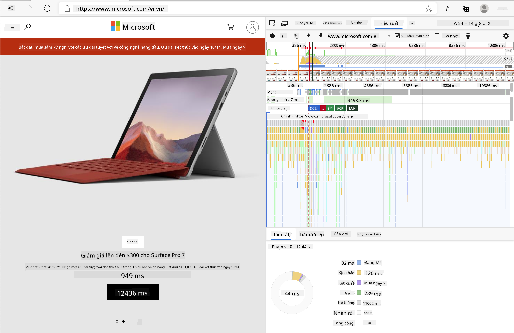
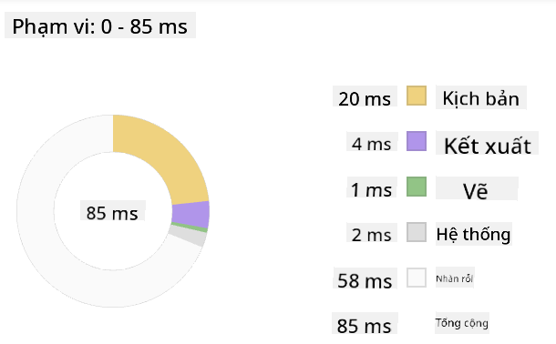

<!--
CO_OP_TRANSLATOR_METADATA:
{
  "original_hash": "49b58721a71cfda824e2f3e1f46908c6",
  "translation_date": "2025-08-29T08:50:15+00:00",
  "source_file": "5-browser-extension/3-background-tasks-and-performance/README.md",
  "language_code": "vi"
}
-->
# Dự án Tiện ích Trình duyệt Phần 3: Tìm hiểu về Nhiệm vụ Nền và Hiệu suất

## Câu hỏi trước bài giảng

[Câu hỏi trước bài giảng](https://ff-quizzes.netlify.app/web/quiz/27)

### Giới thiệu

Trong hai bài học trước của mô-đun này, bạn đã học cách xây dựng một biểu mẫu và khu vực hiển thị dữ liệu được lấy từ API. Đây là một cách rất phổ biến để tạo sự hiện diện trên web. Bạn thậm chí đã học cách xử lý việc lấy dữ liệu một cách bất đồng bộ. Tiện ích trình duyệt của bạn gần như đã hoàn thiện.

Còn lại là quản lý một số nhiệm vụ nền, bao gồm làm mới màu sắc của biểu tượng tiện ích, vì vậy đây là thời điểm tuyệt vời để nói về cách trình duyệt quản lý loại nhiệm vụ này. Hãy suy nghĩ về những nhiệm vụ trình duyệt này trong bối cảnh hiệu suất của các tài sản web của bạn khi bạn xây dựng chúng.

## Kiến thức cơ bản về Hiệu suất Web

> "Hiệu suất trang web liên quan đến hai điều: tốc độ tải trang và tốc độ chạy mã trên đó." -- [Zack Grossbart](https://www.smashingmagazine.com/2012/06/javascript-profiling-chrome-developer-tools/)

Chủ đề về cách làm cho các trang web của bạn nhanh chóng trên mọi loại thiết bị, cho mọi loại người dùng, trong mọi tình huống, không có gì ngạc nhiên là rất rộng lớn. Dưới đây là một số điểm cần ghi nhớ khi bạn xây dựng một dự án web tiêu chuẩn hoặc một tiện ích trình duyệt.

Điều đầu tiên bạn cần làm để đảm bảo rằng trang web của bạn hoạt động hiệu quả là thu thập dữ liệu về hiệu suất của nó. Nơi đầu tiên để làm điều này là trong công cụ dành cho nhà phát triển của trình duyệt web của bạn. Trong Edge, bạn có thể chọn nút "Cài đặt và hơn thế nữa" (biểu tượng ba chấm ở góc trên bên phải của trình duyệt), sau đó điều hướng đến Công cụ khác > Công cụ dành cho nhà phát triển và mở tab Hiệu suất. Bạn cũng có thể sử dụng phím tắt `Ctrl` + `Shift` + `I` trên Windows hoặc `Option` + `Command` + `I` trên Mac để mở công cụ dành cho nhà phát triển.

Tab Hiệu suất chứa một công cụ Hồ sơ. Mở một trang web (ví dụ, [https://www.microsoft.com](https://www.microsoft.com/?WT.mc_id=academic-77807-sagibbon)) và nhấp vào nút 'Ghi', sau đó làm mới trang. Dừng ghi bất kỳ lúc nào, và bạn sẽ có thể xem các quy trình được tạo ra để 'script', 'render', và 'paint' trang web:



✅ Truy cập [Tài liệu Microsoft](https://docs.microsoft.com/microsoft-edge/devtools-guide/performance/?WT.mc_id=academic-77807-sagibbon) về bảng Hiệu suất trong Edge

> Mẹo: để có được số liệu chính xác về thời gian khởi động trang web của bạn, hãy xóa bộ nhớ cache của trình duyệt

Chọn các phần của dòng thời gian hồ sơ để phóng to các sự kiện xảy ra khi trang của bạn tải.

Lấy ảnh chụp nhanh về hiệu suất của trang bằng cách chọn một phần của dòng thời gian hồ sơ và xem bảng tóm tắt:



Kiểm tra bảng Nhật ký Sự kiện để xem có sự kiện nào mất hơn 15 ms không:


✅ Làm quen với công cụ hồ sơ của bạn! Mở công cụ dành cho nhà phát triển trên trang web này và xem có bất kỳ nút thắt cổ chai nào không. Tài sản nào tải chậm nhất? Nhanh nhất?

## Kiểm tra hồ sơ

Nhìn chung, có một số "khu vực vấn đề" mà mọi nhà phát triển web nên chú ý khi xây dựng một trang web để tránh những bất ngờ khó chịu khi triển khai lên môi trường sản xuất.

**Kích thước tài sản**: Web đã trở nên "nặng" hơn, và do đó chậm hơn, trong vài năm qua. Một phần của trọng lượng này liên quan đến việc sử dụng hình ảnh.

✅ Xem qua [Internet Archive](https://httparchive.org/reports/page-weight) để có cái nhìn lịch sử về trọng lượng trang và nhiều hơn nữa.

Một thực hành tốt là đảm bảo rằng hình ảnh của bạn được tối ưu hóa và được cung cấp ở kích thước và độ phân giải phù hợp cho người dùng của bạn.

**Duyệt DOM**: Trình duyệt phải xây dựng Mô hình Đối tượng Tài liệu (DOM) dựa trên mã bạn viết, vì vậy để có hiệu suất trang tốt, hãy giữ các thẻ của bạn ở mức tối thiểu, chỉ sử dụng và định kiểu những gì trang cần. Đến điểm này, CSS dư thừa liên quan đến một trang có thể được tối ưu hóa; các kiểu chỉ cần sử dụng trên một trang không cần phải được bao gồm trong tệp kiểu chính, chẳng hạn.

**JavaScript**: Mọi nhà phát triển JavaScript nên chú ý đến các script "chặn render" phải được tải trước khi phần còn lại của DOM có thể được duyệt và vẽ lên trình duyệt. Hãy cân nhắc sử dụng `defer` với các script nội tuyến của bạn (như đã làm trong mô-đun Terrarium).

✅ Thử một số trang web trên [Trang kiểm tra tốc độ trang web](https://www.webpagetest.org/) để tìm hiểu thêm về các kiểm tra phổ biến được thực hiện để xác định hiệu suất trang web.

Bây giờ bạn đã có ý tưởng về cách trình duyệt render các tài sản bạn gửi đến, hãy xem những điều cuối cùng bạn cần làm để hoàn thành tiện ích của mình:

### Tạo một hàm để tính toán màu sắc

Làm việc trong `/src/index.js`, thêm một hàm gọi là `calculateColor()` sau loạt biến `const` bạn đã thiết lập để truy cập vào DOM:

```JavaScript
function calculateColor(value) {
	let co2Scale = [0, 150, 600, 750, 800];
	let colors = ['#2AA364', '#F5EB4D', '#9E4229', '#381D02', '#381D02'];

	let closestNum = co2Scale.sort((a, b) => {
		return Math.abs(a - value) - Math.abs(b - value);
	})[0];
	console.log(value + ' is closest to ' + closestNum);
	let num = (element) => element > closestNum;
	let scaleIndex = co2Scale.findIndex(num);

	let closestColor = colors[scaleIndex];
	console.log(scaleIndex, closestColor);

	chrome.runtime.sendMessage({ action: 'updateIcon', value: { color: closestColor } });
}
```

Điều gì đang xảy ra ở đây? Bạn truyền vào một giá trị (cường độ carbon) từ cuộc gọi API mà bạn đã hoàn thành trong bài học trước, và sau đó bạn tính toán giá trị của nó gần với chỉ số được trình bày trong mảng màu sắc như thế nào. Sau đó, bạn gửi giá trị màu gần nhất đó đến chrome runtime.

Chrome.runtime có [một API](https://developer.chrome.com/extensions/runtime) xử lý tất cả các loại nhiệm vụ nền, và tiện ích của bạn đang tận dụng điều đó:

> "Sử dụng API chrome.runtime để truy xuất trang nền, trả về chi tiết về manifest, và lắng nghe cũng như phản hồi các sự kiện trong vòng đời của ứng dụng hoặc tiện ích. Bạn cũng có thể sử dụng API này để chuyển đổi đường dẫn tương đối của URL thành URL đầy đủ."

✅ Nếu bạn đang phát triển tiện ích trình duyệt này cho Edge, có thể bạn sẽ ngạc nhiên khi thấy rằng bạn đang sử dụng API chrome. Các phiên bản trình duyệt Edge mới hơn chạy trên công cụ trình duyệt Chromium, vì vậy bạn có thể tận dụng các công cụ này.

> Lưu ý, nếu bạn muốn hồ sơ một tiện ích trình duyệt, hãy khởi chạy công cụ dành cho nhà phát triển từ trong chính tiện ích, vì nó là một phiên bản trình duyệt riêng biệt.

### Đặt màu biểu tượng mặc định

Bây giờ, trong hàm `init()`, đặt biểu tượng thành màu xanh lá cây chung để bắt đầu bằng cách gọi lại hành động `updateIcon` của chrome:

```JavaScript
chrome.runtime.sendMessage({
	action: 'updateIcon',
		value: {
			color: 'green',
		},
});
```

### Gọi hàm, thực thi cuộc gọi

Tiếp theo, gọi hàm bạn vừa tạo bằng cách thêm nó vào promise được trả về bởi API C02Signal:

```JavaScript
//let CO2...
calculateColor(CO2);
```

Và cuối cùng, trong `/dist/background.js`, thêm trình lắng nghe cho các cuộc gọi hành động nền này:

```JavaScript
chrome.runtime.onMessage.addListener(function (msg, sender, sendResponse) {
	if (msg.action === 'updateIcon') {
		chrome.browserAction.setIcon({ imageData: drawIcon(msg.value) });
	}
});
//borrowed from energy lollipop extension, nice feature!
function drawIcon(value) {
	let canvas = document.createElement('canvas');
	let context = canvas.getContext('2d');

	context.beginPath();
	context.fillStyle = value.color;
	context.arc(100, 100, 50, 0, 2 * Math.PI);
	context.fill();

	return context.getImageData(50, 50, 100, 100);
}
```

Trong đoạn mã này, bạn đang thêm một trình lắng nghe cho bất kỳ tin nhắn nào đến trình quản lý nhiệm vụ nền. Nếu nó được gọi là 'updateIcon', thì đoạn mã tiếp theo sẽ được chạy để vẽ một biểu tượng với màu sắc phù hợp bằng cách sử dụng Canvas API.

✅ Bạn sẽ học thêm về Canvas API trong [bài học Trò chơi Không gian](../../6-space-game/2-drawing-to-canvas/README.md).

Bây giờ, xây dựng lại tiện ích của bạn (`npm run build`), làm mới và khởi chạy tiện ích của bạn, và xem màu sắc thay đổi. Có phải là thời điểm tốt để đi làm việc vặt hoặc rửa bát không? Bây giờ bạn đã biết!

Chúc mừng, bạn đã xây dựng một tiện ích trình duyệt hữu ích và học thêm về cách trình duyệt hoạt động cũng như cách hồ sơ hiệu suất của nó.

---

## 🚀 Thử thách

Khám phá một số trang web mã nguồn mở đã tồn tại từ lâu, và, dựa trên lịch sử GitHub của chúng, xem liệu bạn có thể xác định cách chúng được tối ưu hóa qua các năm cho hiệu suất hay không. Điểm đau phổ biến nhất là gì?

## Câu hỏi sau bài giảng

[Câu hỏi sau bài giảng](https://ff-quizzes.netlify.app/web/quiz/28)

## Ôn tập & Tự học

Hãy cân nhắc đăng ký một [bản tin về hiệu suất](https://perf.email/)

Khám phá một số cách mà các trình duyệt đánh giá hiệu suất web bằng cách xem qua các tab hiệu suất trong công cụ web của chúng. Bạn có tìm thấy sự khác biệt lớn nào không?

## Bài tập

[Phân tích một trang web về hiệu suất](assignment.md)

---

**Tuyên bố miễn trừ trách nhiệm**:  
Tài liệu này đã được dịch bằng dịch vụ dịch thuật AI [Co-op Translator](https://github.com/Azure/co-op-translator). Mặc dù chúng tôi cố gắng đảm bảo độ chính xác, xin lưu ý rằng các bản dịch tự động có thể chứa lỗi hoặc không chính xác. Tài liệu gốc bằng ngôn ngữ bản địa nên được coi là nguồn thông tin chính thức. Đối với các thông tin quan trọng, khuyến nghị sử dụng dịch vụ dịch thuật chuyên nghiệp bởi con người. Chúng tôi không chịu trách nhiệm về bất kỳ sự hiểu lầm hoặc diễn giải sai nào phát sinh từ việc sử dụng bản dịch này.