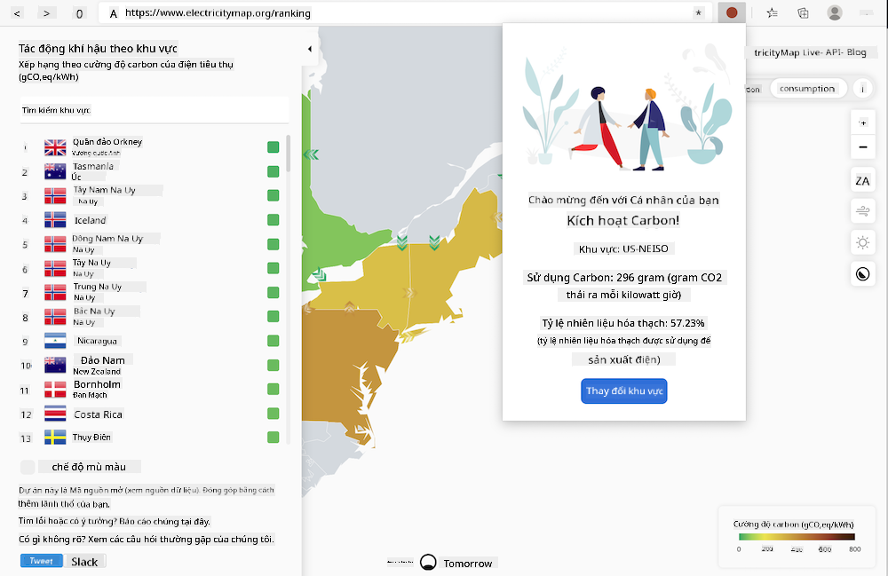

<!--
CO_OP_TRANSLATOR_METADATA:
{
  "original_hash": "9a6b22a2eff0f499b66236be973b24ad",
  "translation_date": "2025-08-27T22:24:52+00:00",
  "source_file": "5-browser-extension/solution/translation/README.it.md",
  "language_code": "vi"
}
-->
# Tiện ích mở rộng trình duyệt Carbon Trigger: mã để bắt đầu

Chúng ta sẽ sử dụng API Signal CO2 của tmrow để theo dõi việc sử dụng điện và tạo một tiện ích mở rộng cho trình duyệt, giúp bạn nhận được thông báo trực tiếp trên trình duyệt về mức độ tiêu thụ điện năng trong khu vực của mình. Việc sử dụng tiện ích mở rộng này sẽ giúp bạn đánh giá các hoạt động của mình dựa trên thông tin này.



## Bắt đầu

Bạn cần cài đặt [npm](https://npmjs.com). Tải xuống một bản sao của mã này vào một thư mục trên máy tính của bạn.

Cài đặt tất cả các gói cần thiết:

```
npm install
```

Tạo tiện ích mở rộng bằng webpack:

```
npm run build
```

Để cài đặt trên Edge, sử dụng menu "ba chấm" ở góc trên bên phải của trình duyệt để tìm bảng điều khiển Tiện ích mở rộng. Nếu chưa được kích hoạt, hãy bật Chế độ nhà phát triển (ở góc dưới bên trái). Chọn "Tải không nén" để tải một tiện ích mở rộng mới. Mở thư mục "dist" khi được nhắc và tiện ích mở rộng sẽ được tải lên. Để sử dụng, bạn sẽ cần một khóa API cho API CO2 Signal (bạn có thể [nhận tại đây qua email](https://www.co2signal.com/) - nhập email của bạn vào ô trên trang này) và [mã khu vực của bạn](http://api.electricitymap.org/v3/zones) tương ứng với [bản đồ điện](https://www.electricitymap.org/map) (ví dụ, ở Boston, mã là "US-NEISO").


Khi bạn đã nhập khóa API và khu vực vào giao diện của tiện ích mở rộng, chấm màu trong thanh tiện ích mở rộng của trình duyệt sẽ thay đổi để phản ánh mức tiêu thụ năng lượng của khu vực và cung cấp gợi ý về những hoạt động tiêu tốn nhiều năng lượng nào phù hợp để thực hiện. Ý tưởng đằng sau hệ thống "chấm" này được lấy cảm hứng từ [tiện ích mở rộng Energy Lollipop](https://energylollipop.com/) dành cho lượng khí thải ở California.

---

**Tuyên bố miễn trừ trách nhiệm**:  
Tài liệu này đã được dịch bằng dịch vụ dịch thuật AI [Co-op Translator](https://github.com/Azure/co-op-translator). Mặc dù chúng tôi cố gắng đảm bảo độ chính xác, xin lưu ý rằng các bản dịch tự động có thể chứa lỗi hoặc không chính xác. Tài liệu gốc bằng ngôn ngữ bản địa nên được coi là nguồn thông tin chính thức. Đối với các thông tin quan trọng, khuyến nghị sử dụng dịch vụ dịch thuật chuyên nghiệp bởi con người. Chúng tôi không chịu trách nhiệm cho bất kỳ sự hiểu lầm hoặc diễn giải sai nào phát sinh từ việc sử dụng bản dịch này.