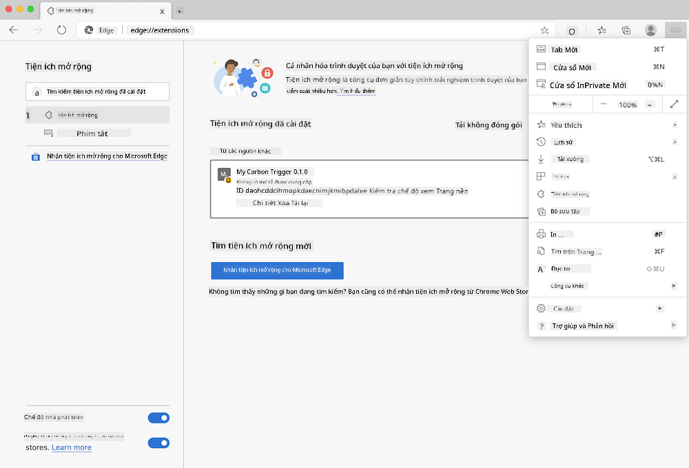

<!--
CO_OP_TRANSLATOR_METADATA:
{
  "original_hash": "3f5e6821e0febccfc5d05e7c944d9e3d",
  "translation_date": "2025-08-27T22:25:29+00:00",
  "source_file": "5-browser-extension/solution/translation/README.ja.md",
  "language_code": "vi"
}
-->
# Tiện ích mở rộng trình duyệt Carbon Trigger: Mã hoàn chỉnh

Xây dựng một tiện ích mở rộng trình duyệt để hiển thị lời nhắc trên trình duyệt về mức độ sử dụng điện trong khu vực của bạn, sử dụng API CO2 Signal của tmrow để theo dõi lượng điện tiêu thụ. Bằng cách sử dụng tiện ích mở rộng này, bạn có thể đưa ra quyết định về các hoạt động của mình dựa trên thông tin này.


## Bắt đầu

Bạn cần cài đặt [npm](https://npmjs.com). Tải xuống bản sao của mã này vào một thư mục trên máy tính của bạn.

Cài đặt tất cả các gói cần thiết.

```
npm install
```

Xây dựng tiện ích mở rộng bằng webpack.

```
npm run build
```

Để cài đặt trên Edge, hãy tìm bảng điều khiển "Tiện ích mở rộng" từ menu "ba chấm" ở góc trên bên phải của trình duyệt. Từ đó, chọn "Load Unpacked" để tải tiện ích mở rộng mới. Khi được nhắc, mở thư mục "dist" và tiện ích mở rộng sẽ được tải. Để sử dụng, bạn cần một API key của CO2 Signal ([lấy tại đây qua email](https://www.co2signal.com/) - nhập email của bạn vào ô trên trang này) và [mã khu vực tương ứng](http://api.electricitymap.org/v3/zones) từ [Electricity Map](https://www.electricitymap.org/map) (ví dụ, ở Boston, sử dụng 'US-NEISO').



Sau khi nhập API key và khu vực vào giao diện tiện ích, một chấm màu sẽ xuất hiện trên thanh tiện ích mở rộng của trình duyệt, thay đổi màu sắc để phản ánh mức độ sử dụng năng lượng trong khu vực của bạn. Điều này giúp bạn biết khi nào là thời điểm thích hợp để thực hiện các hoạt động cần nhiều năng lượng. Ý tưởng về hệ thống "chấm màu" này được lấy cảm hứng từ [Energy Lollipop extension](https://energylollipop.com/) dành cho lượng phát thải ở California.

---

**Tuyên bố miễn trừ trách nhiệm**:  
Tài liệu này đã được dịch bằng dịch vụ dịch thuật AI [Co-op Translator](https://github.com/Azure/co-op-translator). Mặc dù chúng tôi cố gắng đảm bảo độ chính xác, xin lưu ý rằng các bản dịch tự động có thể chứa lỗi hoặc không chính xác. Tài liệu gốc bằng ngôn ngữ bản địa nên được coi là nguồn thông tin chính thức. Đối với các thông tin quan trọng, nên sử dụng dịch vụ dịch thuật chuyên nghiệp từ con người. Chúng tôi không chịu trách nhiệm cho bất kỳ sự hiểu lầm hoặc diễn giải sai nào phát sinh từ việc sử dụng bản dịch này.